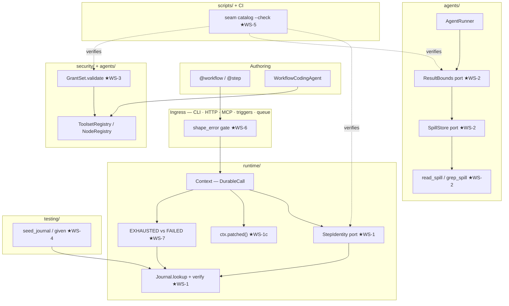
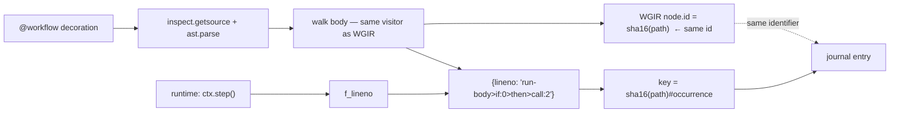
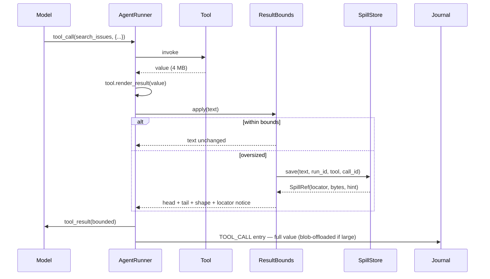

# LOOM improvement plan

<!-- docs-illustrative -->

Seven workstreams to fix things LOOM does in a way that is defensible but not
best. Written after reading the engine, the agent loop, the node catalog, and
the security layer directly

Every claim about current behavior below cites the file and line it came from.

---

## 0. Scope

### 0.1 What "better" means here

LOOM's thesis is in CLAUDE.md: *deterministic re-entry*, *library-first*,
*determinism is a dial*, *the graph is projected from code*. A defect is
anything that makes one of those claims weaker than a user would reasonably
read it as being. That test — not feature parity with others — selects the
seven workstreams. Three of them (WS-2, WS-4, WS-6) were confirmed by finding
the same fix independently implemented in two other systems, which is the
strongest evidence available that they are not speculative.

### 0.2 In scope

| # | Workstream | The claim it repairs |
|---|---|---|
| **WS-1** | Journal identity and replay safety | "Every side effect is journaled and served from the journal on replay" |
| **WS-2** | Bounded tool results | "`ctx.agent()` is for judgement" — an agent that silently loses 90% of a tool result is not exercising judgement |
| **WS-3** | Grant validation and scoped narrowing | "A tool an agent is holding cannot outlive its grant" |
| **WS-4** | Journal seeding as a test seam | "Generated code is verified by running it" |
| **WS-5** | Contract-drift gates | "Nothing is authored twice" (`nodes/spec.py:9`) |
| **WS-6** | One ingress validation gate | "Inputs are validated against the workflow's advertised `input_schema()` before a run starts" — true only at the MCP boundary today |
| **WS-7** | Transient vs terminal failure | "Resume at step 9, not step 1" — a failed step is currently permanent, so resume means *re-raise*, not *retry* |

### 0.3 Out of scope, deliberately

- Multi-tenancy, credential vaults, hosted execution — downstream of a business
  model LOOM does not have.
- A visual canvas. LOOM's WGIR + narration serve review, not operation.
- Rewriting the agent loop on a vendor SDK.

---

## 1. Current state: what the code actually does

### 1.1 Journal identity is positional

`runtime/journal.py:54-87`. Every durable call takes the next ordinal from a
`Scope`; nesting appends a dotted segment.

```python
class Scope:
    def allocate(self) -> str:
        path = f"{self.prefix}{self.cursor}"
        self.cursor += 1
        return path
```

`runtime/context.py:141` — `self.path = ctx._scope.allocate()` at construction,
which is what makes `asyncio.gather` deterministic. Good property, kept.

Replay looks the path up by `(kind, name)` only (`journal.py:199-254`, called
from `context.py:176`):

```python
recorded = journal.lookup(self.path, self.kind, self.name)
```

**Three consequences, in increasing severity.**

**(a) Insertion invalidates the tail.** Add a step at position 2 of a
ten-step workflow and position 2 now holds the old step 2's entry with a
different `name` → `NondeterminismError` in `STRICT`, or `truncate(path)` in
`RESUME_FROM_DIVERGENCE` (`journal.py:253`), which drops *every* later entry.
Eight completed steps are re-executed to add one. For a workflow whose steps
charge cards or send mail, "retry against the fixed code" is therefore much more
expensive than it looks.

**(b) Reordering two same-named calls returns the wrong value — silently.**

```python
a = await ctx.step(fetch, url="https://a")   # path "0"
b = await ctx.step(fetch, url="https://b")   # path "1"
```

Swap the two lines and replay: path `0` still records `kind=step, name=fetch`,
so `lookup` matches and returns **`https://a`'s body for the call that asked for
`https://b`**. No error. The data to catch this is already recorded —
`JournalEntry.fingerprint` is `stable_hash(name + args + kwargs)`
(`core/ids.py:76`, written at `context.py:692`) — and `lookup()` never reads it.

**(c) Two identity schemes that cannot be joined.** The WGIR extractor allocates
its own ids by prefix counter (`graph/extractor.py:193`, `step`, `step_1`, …),
unrelated to journal paths. So a run's journal cannot light up the graph, and
graph/journal drift is undetectable. It could be solved this by making the graph
node id *be* the journal key.

### 1.2 Contract checking is node-only

`JournalEntry` carries `contract_hash` and `closure_hash`
(`journal.py:100-103`) and `lookup()` accepts them — but `DurableCall._resolve`
passes neither. `StepDefinition` computes both (`steps/definition.py:100-101`)
and they are unused on the replay path. The one real check, `_check_contract`
(`context.py:238-261`), fires only for `ctx.node()`, which journals
`"contract": spec.contract_hash` (`context.py:1400`). Plain `@step` replay has
no contract check at all.

`structural_replay.py` classifies steps green/amber/red from a `steps.lock`
diff — and nothing generates or consumes `steps.lock` outside that module.

**And a replayed value that no longer matches its declared type is silently
downgraded.** `core/serde.py:63-68`:

```python
try:
    return TypeAdapter(type_).validate_python(data)
except Exception:
    # A declared type that no longer matches the journal (for example after a
    # refactor) should not destroy an in-flight run; hand back the raw payload.
    return data
```

The intent is right — an in-flight run should survive a refactor. The
consequence is not reported anywhere: the workflow receives a `dict` where it
declared a model, and fails later at an attribute access that reads like a bug
in the workflow rather than a contract drift in the journal. Maybe re-parses
every cached step output against the step's schema (`parseCached`,
`run-durable-step.ts:51`) and treats a mismatch as an error. LOOM should keep
the lenient behavior and **make it loud**: flag the entry, warn once, and let
`VerifyMode.STRICT` (§4.2) raise.

### 1.3 Input is validated at one ingress out of five

`mcp_server/tools.py:174` validates a payload against the workflow's
`input_schema()` before starting a run, for exactly the reason CLAUDE.md gives:
a shape mismatch otherwise surfaces as an `AttributeError` from inside a step,
which reads like a broken workflow.

`Runtime.run()` and `Runtime.submit()` do not (`runtime/engine.py:440-467`) —
they authorize, admit, check idempotency, open the execution, and drive. So the
CLI, the HTTP surface, the trigger dispatcher, and the queue consumer all create
a run record first and discover the shape problem from inside a step body. The
run is then a *failure* in history rather than a *rejection* at the door, which
is the difference between "this workflow is broken" and "you sent the wrong
input."

### 1.4 A failed step is permanent

`context.py:180-190`: a replay that finds `EntryStatus.FAILED` re-raises the
recorded error. The docstring is explicit — *"To re-run the step against fixed
code use `runtime.retry()`, which prunes failed entries."*

That makes every failure terminal at the journal level, so there is no way for
an outer driver (a queue, a scheduler, a supervisor) to say "attempt the whole
run again and let replay skip what succeeded." The only recovery is `retry()`,
which prunes. One of the online implementation splits this: `step_retrying` is non-terminal and re-runs
on the next pass, and the terminal `step_failed` is written **only when the
queue's retry budget is exhausted** (`job-handler.ts:327`). LOOM has the
per-step retry policy but some other lacks, but not the outer loop — so a step that
exhausts its own `Retry` policy poisons the journal permanently even when the
right answer is "try the run again in five minutes."

### 1.5 Tool results are unbounded

`agents/runner.py:289` → `agents/tools.py:119-126`:

```python
result = await _dispatch_tool(tool, call, tool_ctx, context)
result_str = tool.render_result(result)      # json.dumps, no cap
...
messages.append(tool_result(call.id, result_str, name=call.name))   # runner.py:309
```

A search returning 4 MB of JSON enters the next model request whole. There is no
cap, no preview, no locator, and no signal to the model that anything was
dropped — because nothing is dropped; it is all sent, on every subsequent turn
of that agent, until the provider truncates or 400s.

Journal payloads *are* bounded: `Context._store_payload` offloads over
`BlobService.OFFLOAD_THRESHOLD` (256 KiB, `storage/blob.py:172`) to
`{"__blob__": ref}`. That protects the journal, not the context window. The two
problems are unrelated and only one is solved.

### 1.6 Grants validate the ask, not the grant

`agents/tool_registry.py:388-395` raises `RegistryError` listing known toolsets
when you *request* an unknown toolset. But the strings inside the `GrantSet`
itself are never checked against anything:

```python
@workflow(grants=GrantSet(toolsets=["jira.issues:writ"]))   # typo
```

`allows_operation` (`security/grants.py:69-92`) simply matches nothing, forever,
quietly. The workflow gets an empty toolset and the failure surfaces as an agent
that "couldn't find a tool." `GrantSet.merge`/`intersect` already exist and are
well-reasoned (`grants.py:94-127`) — the composition half is done; the
validation half is missing.

### 1.7 Testing a workflow means running its steps

`testing/` has `advance`/`advance_to`/`settled` (clock) and `MockModelProvider`.
To test "what does this workflow do *after* the expensive step," you must supply
a fake step or run it. There is no way to say "assume step 3 returned X" — even
though the journal is exactly that statement, and `Runtime` already loads a
journal it is handed.

---

## 2. External grounding

- **Identity/versioning.** Temporal requires the same API calls in the same
  sequence given the same input, and handles code evolution with explicit
  *patching* (`patched()`/`GetVersion`) plus Worker Versioning — a branch marker
  recorded in history so old runs keep old behavior. DBOS matches checkpoints by
  step order and raises "expected step X, found checkpoint for Y" on drift.
  LOOM currently has DBOS's model without DBOS's error precision (it compares
  name but not arguments) and no patch primitive at all.
  ([Temporal versioning](https://docs.temporal.io/develop/python/workflows/versioning),
  [DBOS FAQ](https://docs.dbos.dev/faq))
- **Agent tool output.** Current practice is to *filter and truncate at
  ingestion, not at compression time*, and to make the truncation explicit with
  a continuation affordance. Claude Code caps tool responses at ~25k tokens by
  default; MCP added `anthropic/maxResultSizeChars` so a server can raise its own
  ceiling; Pi head-truncates at 2,000 lines / 50 KB and appends a continuation
  nudge. Silent truncation is called out as the failure mode "that makes agents
  lie" — the model reports on a prefix as if it were the whole.
  ([MLflow tool-use practices](https://mlflow.org/articles/ai-agent-tool-use-best-practices-for-practitioners/),
  [MCP client best practices](https://modelcontextprotocol.io/docs/2026-07-28/develop/clients/client-best-practices),
  [tool-result truncation](https://dev.to/gabrielanhaia/tool-result-truncation-the-silent-bug-that-makes-agents-lie-3epe))
- **Two independent implementations** of the same fix landed in the systems we
  read: dsh `spill-policy` (preview + locator + retrieval hint) and
  other implementation's session spill (preview + *format and shape summary* + a literal
  `jq` command). Neither invented it; both needed it.

---

## 3. High-level design

Everything below is additive and ports-and-adapters. No workstream changes a
default without a flag, and each lands behind an interface that has at least two
implementations (one of which is "what we do today").



### 3.1 Design rules for every workstream

- **Ports, not branches.** New behavior arrives as a Protocol with a default
  implementation that reproduces today's semantics exactly (Open/Closed).
- **One reason to change.** `StepIdentity` decides keys; `Journal` decides
  storage; `DurableCall` decides orchestration. Today `DurableCall` does all
  three (SRP).
- **Compute once.** Fingerprints, contract hashes, and structural paths already
  exist; the plan *reads* them rather than adding parallel data (DRY, and the
  lesson `nodes/spec.py:9` already records).
- **Composition over configuration.** `ResultBounds` and `SpillStore` compose;
  a user who wants "truncate only, no storage" passes a different `SpillStore`,
  not a boolean.

---

## 4. WS-1 — Journal identity and replay safety

The centerpiece. Delivered in three independently shippable slices.

### 4.1 Interfaces

New file `src/loom/runtime/identity.py`:

```python
from typing import Protocol, runtime_checkable

@runtime_checkable
class StepIdentity(Protocol):
    """Decides the journal key for one durable call.

    Implementations must be pure functions of (scope, kind, name, call site):
    the same workflow body must produce the same keys on every replay, and a
    key must never depend on a value the workflow computed.
    """

    name: str  # recorded on the run so a replay knows how keys were minted

    def key(self, *, scope: Scope, kind: EntryKind, name: str,
            site: CallSite | None) -> str: ...


class CallSite(NamedTuple):
    """Where in the workflow source a durable call was issued."""
    qualname: str      # "order_flow"
    lineno: int        # runtime line number from the caller frame
    path: str | None   # structural AST path, when the body was analysable
```

Two implementations:

| Implementation | Key | Status |
|---|---|---|
| `OrdinalIdentity` | `"3"`, `"3.1"` — today's `Scope.allocate()` | default in v1, kept forever as the fallback |
| `StructuralIdentity` | `"<sha16(ast-path)>#<occurrence>"` | opt-in v1, default v2 |

`StructuralIdentity` needs no build step, because LOOM already parses workflow
bodies. At `@workflow` decoration time:

1. `inspect.getsource(fn)` → `ast.parse`.
2. Walk the body with the **existing** `graph/extractor.py` traversal, extended
   to emit a structural path per `ctx.*` call:
   `["run-body", "if:0", "then", "call:2"]` → `sha256(...)[:16]`.
3. Build `{lineno: structural_path}` and attach it to the `WorkflowDefinition`.

At runtime `Context.step()` reads `sys._getframe(1).f_lineno`, looks up the
structural path, and appends a per-path occurrence counter. Line numbers are
only ever used to *join runtime to the map built from the same source revision* —
the **journal stores the structural path**, which is what survives edits
elsewhere in the file.



**The bonus this unlocks:** the WGIR node id and the journal key become the same
string, so `loom show <run>` can highlight the graph, and graph/journal drift
becomes impossible rather than merely undetected — closing §1.1(c) for free.

**Fallback contract.** No source (REPL, `exec`, C-level), an unparsable body, or
a `ctx.*` call from a helper function outside the workflow body → `path=None` →
`OrdinalIdentity` for that call, recorded in entry metadata as
`{"identity": "ordinal"}`. Mixed runs are legal; the key tells you which scheme
minted each entry.

### 4.2 Slice 1a — verify what we already record (small, ships first)

`Journal.lookup()` gains an optional `fingerprint` and a `VerifyMode`:

```python
class VerifyMode(StrEnum):
    OFF = "off"        # today
    WARN = "warn"      # log + metadata flag, serve the recorded value
    STRICT = "strict"  # NondeterminismError naming both call sites
```

`DurableCall._resolve` passes `self._fingerprint`, which is already computed at
`context.py:692`. This catches §1.1(b) with roughly ten lines of engine change.

**Why not default to STRICT:** a step whose arguments derive from
non-journaled state (`ctx.state`, documented in CLAUDE.md as not journaled)
legitimately replays with a different fingerprint. `WARN` is the v1 default;
`STRICT` becomes the default only after the warning has been quiet in the
cookbook and test suite for a release.

### 4.3 Slice 1c — `ctx.patched()`

Temporal's patch primitive, minus the server. Lets a workflow evolve without
invalidating in-flight runs:

```python
if ctx.patched("use-new-pricing"):
    total = await ctx.step(price_v2, cart)
else:
    total = await ctx.step(price_v1, cart)
```

Journals `EntryKind.SIDE_EFFECT` under the patch id: a run that recorded
*absent* keeps taking the old branch forever; a fresh run records *present* and
takes the new one. `ctx.deprecate_patch(id)` marks it removable once no
suspended run carries the marker — surfaced by `loom runs --patched <id>`.

### 4.4 Files

| File | Change |
|---|---|
| `runtime/identity.py` | **new** — `StepIdentity`, `CallSite`, `OrdinalIdentity`, `StructuralIdentity` |
| `runtime/callsites.py` | **new** — AST walk producing `{lineno: path}`, shared with WGIR |
| `graph/extractor.py` | use `callsites.py` for node ids instead of `_alloc_id` |
| `runtime/journal.py` | `lookup(..., fingerprint=, verify=)`; `VerifyMode`; divergence messages naming both sides |
| `runtime/context.py` | `DurableCall.__init__` takes the key from `ctx._identity`; pass fingerprint + contract/closure hashes; add `patched`/`deprecate_patch` |
| `runtime/workflow.py` | `WorkflowDefinition.callsites` built at decoration, lazily and cached |
| `runtime/engine.py` | record `identity`/`verify` on the run record; honor them on resume |
| `steps/definition.py` | expose `contract_hash`/`closure_hash` to the call path (already computed) |
| `state/base.py` | no schema change — keys are still strings |

**Migration.** Existing journals are ordinal. `ExecutionRecord.metadata["identity"]`
defaults to `"ordinal"` when absent, so an in-flight run resumed after the
upgrade keeps its scheme. New runs use whatever the Runtime is configured with.
No backfill, no dual-write.

---

## 5. WS-2 — Bounded tool results

### 5.1 Interfaces

New file `src/loom/agents/bounds.py`:

```python
@runtime_checkable
class SpillStore(Protocol):
    """Persists an oversized tool result and returns a retrievable locator."""

    async def save(self, text: str, *, run_id: str, tool: str,
                   call_id: str) -> SpillRef: ...
    async def read(self, ref: str, *, offset: int = 0,
                   limit: int = 2000) -> str: ...
    async def grep(self, ref: str, pattern: str, *,
                   max_matches: int = 50) -> list[str]: ...


class SpillRef(BaseModel):
    locator: str          # opaque; "blob:<sha256>" for the default backend
    bytes: int
    retrieval_hint: str   # backend-authored; consumers render, never parse


@dataclass(frozen=True)
class ResultBounds:
    """When to bound a tool result, and what the model sees instead."""
    max_bytes: int = 32_768
    max_lines: int = 2_000
    head_ratio: float = 0.67
    describe_shape: bool = True

    def apply(self, text: str, ref: SpillRef | None) -> str: ...
```

Default `SpillStore` is `BlobSpillStore(BlobService)` — reuses the
content-addressed storage LOOM already has (`storage/blob.py`), so retries and
replays that produce identical bytes resolve to one blob.
`NullSpillStore` (truncate only, no persistence) is the no-blobs default so the
feature degrades rather than requiring configuration.

### 5.2 What the model sees

Composed from the two implementations we read plus the "explicit continuation"
practice:

```text
{head}
…
{tail}

(Omitted 1,884,213 bytes of 1,916,000. Format: JSON object.
 Shape: { issues: array(312) of { key: string, fields: { … +7 keys } }, total: number }.
 Full result at blob:9f3a…c21. Call read_spill(ref, offset, limit) to page it,
 or grep_spill(ref, pattern) to search it. Do not re-call the tool for the full payload.)
```

Non-negotiable properties, each one a lesson from a system that shipped it:

1. **The notice's cost is reserved out of the budget**, so the replacement is
   never larger than `max_bytes` and spilling can never *add* tokens (dsh).
2. **Shape before content** — a depth-bounded structural summary is worth more
   than 2 KB of the first record.
3. **Best-effort** — no blob service, or a failed save, returns the truncated
   text with the notice minus the locator. A spill failure never turns a
   successful tool call into an error (dsh).
4. **The canonical value is untouched.** Bounding applies to the *message*; the
   journal entry keeps the full value (offloaded per §1.5 if large). This is the
   one place the two mechanisms must not be conflated: a replay must reconstruct
   the conversation the run actually had, so the *bounded* string is what gets
   journaled for the message and the *full* value is what the step returns.

### 5.3 Data flow



### 5.4 Files

| File | Change |
|---|---|
| `agents/bounds.py` | **new** — `ResultBounds`, `SpillStore`, `SpillRef`, `BlobSpillStore`, `NullSpillStore` |
| `agents/shape.py` | **new** — `describe_shape()` / `detect_format()`, pure, no deps |
| `agents/spill_tools.py` | **new** — `read_spill`, `grep_spill` as `Tool`s |
| `agents/runner.py` | one `await bounds.apply(...)` between `render_result` (289) and `messages.append` (309) |
| `agents/agent.py` | `bounds: ResultBounds \| None` field; `None` = today's behavior |
| `runtime/engine.py` | `Runtime(spill=...)`; wire into `AgentContext` |
| `runtime/context.py` | `ctx.agent()` passes the runtime's spill store |
| `mcp_server/tools.py` | mirror the bound for MCP tool results (same policy object) |

### 5.5 The agent's tool surface — always-on vs lazily materialized

The user's question, answered explicitly, because this workstream changes it.

**Always mounted** (cheap, no import cost, needed to reason at all):

| Tool | Why it cannot be lazy |
|---|---|
| `search_nodes`, `show_node`, `node_contract` | `NodeSpec` is pure data (`nodes/spec.py:1-13`); the catalog holds a thousand without importing one |
| `search_toolsets`, `show_toolset`, `get_tool_contract` | Layer-1 manifest metadata only; the index cards the prompt already carries |
| `validate_code` | Local AST; the agent's only self-check between turns |
| `ask_user` | Only when a `UserInteraction` is configured — `coding_tools.py:571` already omits it otherwise, which is the right pattern |
| **`read_spill` / `grep_spill`** *(new)* | **Must be mounted the moment a spill can occur.** A locator with no retrieval tool is a more informative truncation |

**Lazily materialized** (import cost, credentials, or side effects):

| Tool | Trigger |
|---|---|
| Toolset operations | `resolve_tools()` at `ctx.agent()` — Layer 3 (`tool_registry.py:355`) |
| `get_tool_docs` | Generated from schemas on first request (`coding_tools.py:138`) |
| `call_read_operation` | Read-only, refuses writes, and deduplicates repeats via `seen_lookups` (`coding_tools.py:519`) |
| Node implementations | `NodeSpec` → class import only when executed |

**The rule this makes explicit, worth writing into CLAUDE.md:** *a tool is
lazily loaded when materializing it costs an import, a credential, or a network
call; it is always-on when it only reads data the process already holds.* By
that rule `read_spill` is always-on and free, and mounting it conditionally on
"has this agent spilled yet" would be a race — the model sees the tool list
before the spill happens.

---

## 6. WS-3 — Grant validation and scoped narrowing

### 6.1 Interface

```python
class GrantSet(BaseModel):
    ...
    def validate_against(
        self, *, toolsets: ToolsetCatalog, nodes: NodeRegistry | None = None
    ) -> list[GrantIssue]:
        """Check every entry names something that exists.

        Returns issues rather than raising, so a caller can decide: the
        decorator raises, the CLI prints, the coding agent repairs.
        """
```

`GrantIssue(entry, reason, suggestions)` — suggestions come from the existing
`near_matches` helper (`nodes/catalog.py:275`), so `"jira.issues:writ"` returns
*did you mean `jira.issues:write`?*

### 6.2 Where it runs

| Site | Behavior |
|---|---|
| `@workflow(grants=...)` at decoration | raise `ConfigurationError` when a registry is already populated; defer otherwise |
| `Runtime.register()` | validate against *that* Runtime's registries — the authoritative moment, since `rt.toolsets` chains to the global one |
| `loom check` | report as a blocking issue, alongside the AST pass |
| `WorkflowCodingAgent` | a `grants` stage in the pipeline (`agents/stages.py`), cost 12, non-blocking, feeding repair |

### 6.3 Narrowing at the call, not just the workflow

`ctx.agent(prompt, grants=...)` narrows via the existing
`GrantSet.intersect` (`grants.py:115`), which already guarantees a subset. The
missing piece is that the narrowed set must **compose down the nesting chain**:
a sub-workflow or a nested `ctx.agent()` inherits the effective grant of its
caller and can only narrow further. Implemented by carrying the effective grant
on `Context` and intersecting on entry — mirroring dsh's
`layers.every(layer => layer.admits(name))` with LOOM's existing algebra.

**Deliberately not copied from dsh:** their own-registrations-exempt rule. LOOM
has no per-scope tool registration, so there is nothing to exempt; adding the
concept would be speculative (YAGNI).

### 6.4 Files

`security/grants.py` (validation + issues), `agents/tool_registry.py` (expose
`operation_ids()` for the check), `runtime/workflow.py` (decorator hook),
`runtime/engine.py` (`register()` validation), `runtime/context.py` (effective
grant on Context, intersect on nesting), `agents/stages.py` (new stage),
`cli/commands.py` (`loom check` output).

---

## 7. WS-4 — Journal seeding as a test seam

the replay engine *is* the mocking framework. LOOM has the
same engine and does not expose it.

```python
from loom.testing import given, run_with

async def test_notifies_after_expensive_research():
    result = await run_with(
        onboard,
        {"email": "a@b.com"},
        given(research_signup, returns={"summary": "canned"}),   # keyed by identity
        given(send_email, raises=TimeoutError("smtp down")),
    )
    assert result.status is ExecutionStatus.FAILED
    assert "smtp" in result.error.message
```

`given()` builds a `JournalEntry` for the call site; `run_with` constructs a
`Runtime(store=MemoryStore())`, seeds the journal, and runs. Under
`StructuralIdentity` the key comes from the step's structural path, so `given()`
is stable against edits elsewhere in the body — this workstream is much weaker
without WS-1 and is sequenced after it for that reason.

Also ships: `assert_replays(workflow, input)` — run twice against one journal
and assert identical outputs and zero `executed` on the second pass. That is the
`replay` stage from the coding-agent pipeline (`agents/stages.py`) promoted to a
public helper so users get the check the generated code already gets.

**Files:** `testing/journal.py` (new), `testing/__init__.py`,
`agents/stages.py` (reuse `assert_replays` instead of its private copy — DRY).

---

## 8. WS-5 — Contract-drift gates

LOOM already does this in three narrow places: `loom check --fail-on-change`,
`tests/test_manifest_imports.py` (which found six drifts on its first run), and
the `docs-examples` CI job. WS-5 points the same instinct at the API surface.

`scripts/gen_seam_catalog.py`, run as `--check` in CI, generating one page per
port from the Protocol's own signatures and docstrings, plus its implementations
(found by `issubclass`/`runtime_checkable`) and its consumers (import graph):

```python
SEAMS = {
    "ExecutionStore": ("state/base.py",        "docs/seams/storage.md"),
    "StateStore":     ("runtime/state.py",     "docs/seams/state.md"),
    "Clock":          ("runtime/clock.py",     "docs/seams/time.md"),
    "BlobBackend":    ("storage/blob.py",      "docs/seams/blobs.md"),
    "ModelProvider":  ("agents/models.py",     "docs/seams/models.md"),
    "AgentBackend":   ("agents/backend.py",    "docs/seams/agents.md"),
    "QueueBackend":   ("triggers/queue.py",    "docs/seams/queue.md"),
    "StepIdentity":   ("runtime/identity.py",  "docs/seams/identity.md"),  # WS-1
    "SpillStore":     ("agents/bounds.py",     "docs/seams/spill.md"),     # WS-2
}
```

Start at nine seams and `--check`. Do **not** build dsh's 24-gate suite — the
value is the drift alarm, not the document.

---

## 9. WS-6 — One ingress validation gate

The fix is deletion, not addition: `mcp_server/tools.py` already has the check
(`_shape_error`, line 174) and the reasoning. It is in the wrong place.

### 9.1 Interface

Move it to `runtime/validation.py` as a pure function over the schema LOOM
already advertises:

```python
def shape_error(schema: dict[str, Any] | None, payload: Any) -> str | None:
    """Return a human-readable mismatch, or None when the payload fits.

    Pure and schema-driven: no workflow import, no execution, no side effects.
    A None schema means the workflow declared no input model — everything fits.
    """
```

Called once, in `Runtime._open_execution`, **before the record is created** —
the same position `_admit()` occupies, and for the same reason CLAUDE.md gives
for admission: *"evaluated before the record is created, so a rejected trigger
leaves no run behind."* A rejected input should leave no run behind either.

Raises `InputMismatch(ValueError)` carrying the offending path and the expected
type, so every caller renders it natively:

| Caller | Behavior |
|---|---|
| `Runtime.run/submit` | raises `InputMismatch` |
| CLI | exit code **2** (usage), not 1 (failed) — the run never existed |
| HTTP | 422, beside the existing 403/404/409/429 mapping |
| MCP | keeps today's payload-not-raise contract by catching it |
| Trigger dispatcher / queue consumer | rejects the delivery, dead-letters with the mismatch as the reason |

### 9.2 Why this is more than tidiness

An invalid payload today produces a `FAILED` run in history. Three downstream
effects, none obvious: run-history metrics count it as a workflow failure and
skew any reliability number; the flow-control policy has already consumed an
admission slot for work that could never run; and `retry()` on it re-runs a
workflow that will fail identically forever. The gate removes all three by
never opening the record.

### 9.3 Files

`runtime/validation.py` (new), `runtime/engine.py` (`_open_execution`),
`core/exceptions.py` (`InputMismatch`), `mcp_server/tools.py` (delete the local
copy, import the shared one — DRY), `cli/commands.py` (exit code 2),
`server/app.py` (422), `triggers/queue.py` (dead-letter reason).

---

## 10. WS-7 — Transient vs terminal failure

### 10.1 The distinction to add

One field, mirroring the split gets from having two event types:

```python
class EntryStatus(StrEnum):
    PENDING = "pending"
    COMPLETED = "completed"
    FAILED = "failed"          # terminal — replay re-raises (today's meaning)
    EXHAUSTED = "exhausted"    # NEW: the step's own Retry policy is spent,
                               # but the RUN may be attempted again; replay
                               # re-executes this entry instead of re-raising
    SUSPENDED = "suspended"
```

`DurableCall._resolve` (`context.py:180`) branches on the two: `FAILED`
re-raises as today; `EXHAUSTED` falls through to execution, exactly as if the
entry were absent, while keeping the attempt history for `loom show`.

Who writes which:

- The **step** writes `EXHAUSTED` when its `Retry` policy is spent and
  `OnError.RAISE` would propagate.
- The **engine** promotes `EXHAUSTED` → `FAILED` when the *run* reaches its own
  terminal state and no outer driver claimed it.
- An outer driver — `QueueConsumer`, `TriggerDispatcher`, or a user's own
  supervisor — calls `runtime.resume(run_id)` and gets a cheap partial re-run
  rather than `retry()`'s prune-and-restart.

### 10.2 Why not just use `retry()`

`retry()` prunes failed entries, which is right when the *code* changed and
wrong when the *world* changed. A 503 from a payment gateway does not need the
journal edited; it needs the same code run again in five minutes with the other
nine steps still cached. Today the only tool for that prunes, and pruning is
irreversible — the attempt history that would tell an operator "this has failed
six times against the same gateway" is gone.

### 10.3 Interaction with WS-1

`EXHAUSTED` entries are re-executed on the next pass, so their journal key must
be stable across that pass — which is exactly what `StructuralIdentity` (§4.1)
guarantees and what ordinal keys guarantee only if nothing before them moved.
The two workstreams are safe independently but reinforce each other, and WS-7's
e2e test should run under both identity strategies.

### 10.4 Files

`runtime/journal.py` (`EXHAUSTED`, `is_settled` semantics — an exhausted entry
is *not* settled), `runtime/context.py` (the branch at 180, and where the
attempt loop gives up), `runtime/engine.py` (promotion on terminal transition,
`resume()` honoring exhausted entries), `state/*` (status is already a string
column — no migration), `cli/commands.py` (`loom show` renders exhausted
distinctly from failed), `facade.py` + `mcp_server/tools.py` (so a model reading
a run sees "retryable" rather than "failed", the same reasoning that produced
the `waiting_for`/`next_action` treatment for suspension).

---

## 11. Phasing

Each phase is independently shippable and independently revertable.

> **Status — complete.** All seven workstreams have landed, across P0–P5:
> WS-1a (`VerifyMode`) and the decode-drift flag, WS-1b's evidence (the
> tail-invalidation measurement below), WS-1c (`ctx.patched` journaling),
> WS-2 (`ResultBounds` + spill + retrieval tools), WS-3 (validation *and*
> per-call narrowing), WS-4 (`given`/`run_with`/`assert_replays`), WS-5 (nine
> seam pages under `--check`, wired into CI), WS-6 (the ingress gate), and
> WS-7 (`EXHAUSTED`). 2,864 tests pass.
>
> **What changed from the plan as written:**
>
> - The gate **never rejects `None`**, and `Runtime(validate_input=False)` was
>   added — a decorative annotation should not strand anyone on upgrade.
> - WS-7 does **not** promote on the way to terminal, as §10.1 proposed. That
>   put a journal write after compensation had unwound and made the
>   distinction unobservable, since every failed run erased it. The status is
>   read per operation instead (`Journal.resume_exhausted`), which needs no
>   mutation and no ordering agreement with the saga.
> - `ctx.patched` already existed as a stub returning False for everything,
>   and one test pinned that. §4.3 should have said "finish it", not "add it".
> - **WS-1b (`StructuralIdentity`) was deliberately not built.** §13 said to
>   measure first. The measurement is now
>   `TestPositionalKeysInvalidateTheTail`: inserting one step into a ten-step
>   workflow re-executes **nine**, eight of which had already completed. The
>   cost is real and the case for WS-1b stands — but it is a migration
>   (committed `.graph.json` files change), so it is the one piece left for a
>   deliberate decision rather than a sweep.
> - Two defaults were **not** flipped, as §9 requires: `verify` stays `WARN`
>   and identity stays ordinal until the warning has been quiet for a release.

Sequencing rationale: P1 is four leaf changes with no shared state, so it can be
four parallel PRs — WS-6 in particular touches only the ingress boundary and
deletes a duplicate. P2 touches the engine and must land alone. P3 depends on P2
only for its e2e matrix, not its implementation, so it can start in parallel and
merge after. P4 depends on P2 for stable keys. P5 depends on the interfaces from
P1–P4 existing.

---

## 12. Test plan

### 12.1 Unit

| Area | Tests |
|---|---|
| `identity` | ordinal parity with today's paths; structural path stable across a comment inserted above; stable across an unrelated sibling call added; *changes* when the call moves into an `if` (asserted, not incidental); fallback to ordinal with no source; nested scope allocation under `gather` |
| `callsites` | one map per body shape: straight line, `if/else`, `for`, `while`, `try/except`, `gather`, nested function, comprehension containing a `ctx.*` call (must be rejected or degraded explicitly) |
| `journal` | `lookup` under each `VerifyMode`; fingerprint mismatch message names both call sites; truncate semantics unchanged |
| `bounds` | under/over threshold; notice cost reserved so output ≤ `max_bytes`; UTF-8 boundary safety on head/tail split; `NullSpillStore` degradation; save failure returns truncation not error; `describe_shape` on dict/list/scalar/deep/empty/non-JSON |
| `spill_tools` | `read_spill` paging; `grep_spill` match caps; unknown ref error text |
| `grants` | validation issues + suggestions; intersect/merge invariants (property-based: `intersect(a,b) ⊆ a` and `⊆ b`); nesting narrows only |
| `patched` | absent-then-present branch stability across replay; deprecate reporting |
| `testing` | `given` keyed by identity; `run_with` seeding; `assert_replays` catches an injected `datetime.now()` |
| `validation` | `shape_error` on: no schema, extra key, missing required, wrong scalar type, nested mismatch, non-dict payload against an object schema; message names the offending path |
| `failure taxonomy` | `EXHAUSTED` is not `is_settled`; replay re-executes it; `FAILED` still re-raises; engine promotion on terminal transition; attempt history survives the promotion |
| `serde` | decode drift sets the entry flag and warns once per (workflow, path); `VerifyMode.STRICT` raises `ContractChanged` instead |

### 12.2 End-to-end

| Scenario | Asserts |
|---|---|
| **Insert a step and replay** (SQLite store) | only the new step executes; the other nine are `CACHED`; `charge_card` prints once |
| **Reorder two same-named steps** | `WARN` logs and flags metadata; `STRICT` raises naming both sites; neither returns the wrong body |
| **Crash mid-run and resume** | existing suite still green under both identity strategies (parametrized) |
| **Agent with a 4 MB tool result** | model message ≤ `max_bytes`; `read_spill` returns the full payload; journal keeps the whole value; conversation replays byte-identically |
| **Typo'd grant** | `Runtime.register()` raises with a suggestion; `loom check` exits non-zero; the coding agent repairs it |
| **`ctx.patched` across a deploy** | a suspended run resumed after the branch is added keeps the old path; a new run takes the new one |
| **Invalid payload at every ingress** | `Runtime.run` raises `InputMismatch`; CLI exits **2**; HTTP returns 422; MCP returns a payload; queue dead-letters — and `store.list_runs()` is empty in all five |
| **Gateway 503 then recovery** | step exhausts its `Retry`, run parks; `resume()` five minutes later re-runs only that step; the nine before it stay `CACHED`; attempt count reads 4, not 1 |
| **Cookbook** | all 19 examples pass unchanged under both identity strategies — the compatibility contract |

Two properties get **Hypothesis** coverage, because they are invariants rather
than cases: grant intersection is a subset of both operands, and
`bounds.apply()` never returns more than `max_bytes` for any input.

---

## 13. Review from multiple angles

**Correctness.** The riskiest change is `StructuralIdentity`, because a wrong
key silently reuses the wrong value — the exact bug it exists to fix. Mitigation:
it is opt-in for a full release; fingerprint verification (P1) ships *first* so
that a mis-keyed lookup is caught by argument mismatch; and the cookbook runs
parametrized over both strategies. The line-number join is the sharp edge — a
`ctx.*` call spanning multiple lines reports the line of the *call expression*,
which the AST walk must key on identically. That is one test, and it is in
§12.1.

**Security.** WS-3 hardens a real weakness: a typo'd grant currently produces an
empty toolset rather than an error, and an operator reading `grants=[...]` would
reasonably believe the workflow is restricted to what it lists. Validation turns
a silent no-op into a startup failure. WS-2 introduces a new persistence path for
tool output, which can contain secrets — spill content inherits the blob
service's storage and must inherit its retention: `RetentionManager.compact`
already deletes orphaned blobs, and spill refs must be reachable from the run so
they are collected rather than leaked. `grep_spill` takes a user-supplied pattern
and must be `re.compile`d with a timeout guard or a literal-only mode; an
unbounded backtracking regex from a model is a plausible DoS on the worker.
WS-6 is a security improvement in a quieter way: an unvalidated payload reaching
a step body is an untrusted value crossing the boundary a schema was declared to
guard, and today the only thing between them is whatever the step body does with
it.

**Performance.** `sys._getframe(1)` is ~100 ns and happens once per durable call
— against a step that awaits I/O, immeasurable. The `{lineno: path}` map is built
once per workflow definition and cached. Fingerprint comparison is a string
equality on a value already computed. `describe_shape` is depth-bounded (≤3) and
key-bounded (≤20) by construction so a pathological 10 MB nested structure cannot
make the summary expensive. The one real cost is that spilling adds a blob write
on the oversized path — which replaces sending megabytes to a model on *every
subsequent turn*, so it is strictly cheaper in the case that triggers it.

**Edge cases.** Enumerated where they bite: `ctx.*` inside a comprehension or a
lambda (no distinct AST statement path — reject at `loom check` with a message,
as some other does); a `ctx.*` call in a helper outside the body (degrade to
ordinal, flag in metadata, warn in `loom check`); decorators that rewrite the
function (source is the decorated source — document); `exec`/REPL definitions
(fallback); two workflows in one file (already handled by `_flow_functions`);
a step whose arguments contain unserializable objects (fingerprint already
handles via `stable_hash` on the encoded form — assert it, don't assume). For
WS-7: an `EXHAUSTED` entry that is re-executed and succeeds must overwrite
cleanly, and one that is re-executed and *suspends* must not lose its attempt
history; for WS-6: a workflow with no declared input model (`input_schema()`
returns `None`) must accept anything, exactly as today, or every untyped
workflow breaks at once.

**Maintainability.** Every workstream adds one Protocol and at least two
implementations, so the second implementation proves the seam is real rather than
notional — the failure mode dsh's docs warn about ("one role alone is not a
seam"). The riskiest maintainability cost is `callsites.py` becoming a second
AST walker beside `graph/extractor.py`; the plan avoids that by having the
extractor *consume* it, which also fixes §1.1(c). If that unification proves
harder than a day's work, the correct fallback is to ship `StructuralIdentity`
reading the extractor's existing walk rather than to duplicate it.

**Testing.** P0 exists specifically so the plan cannot claim success without
evidence: five tests that fail today and pass later. `xfail(strict=True)` means
CI breaks if they start passing accidentally, which is the honest way to hold a
regression.

**User's perspective.** Five visible improvements, in the order a user meets
them: (1) a bad payload is rejected at the door with the offending field named,
instead of becoming a failed run that pollutes history; (2) an agent that hits a
huge tool result now says what it saw and how to see the rest, instead of
quietly reasoning over a prefix; (3) `retry` after fixing one step re-runs one
step instead of the whole tail; (4) a transient outage no longer forces a
choice between pruning the journal and giving up; (5) a typo in `grants=` fails
at startup with a suggestion instead of at 3am as "the agent couldn't find the
tool." One visible cost: a new warning class
(`fingerprint drift`) that some workflows reading `ctx.state` will emit. The
warning text must say what to do — *"put the state read in a step"* — or it will
be noise people learn to ignore, which is worse than not having it.

**What could make this plan wrong.** If most LOOM workflows are short and rarely
edited mid-flight, WS-1's structural identity is expensive insurance and WS-1a's
ten-line fingerprint check captures most of the value. The cheapest way to find
out is P0: instrument how often `RESUME_FROM_DIVERGENCE` truncates more than one
entry in the cookbook and the test suite. If that number is near zero, ship P1
and P4, and hold P2 until a real user hits it. The rest of the plan does not
depend on that answer — WS-2, WS-3, WS-6, and WS-7 stand on their own evidence.

---

## 14. Decision log

| Decision | Alternative rejected | Why |
|---|---|---|
| Structural ids computed at decoration from AST | Build-step transform | LOOM has no build step and `pip install` must stay the whole story |
| Line numbers as the runtime→AST join | Bytecode offsets (`f_lasti`) | Equally unstable to edits, and far harder to read in an error message |
| `WARN` before `STRICT` for fingerprints | Straight to `STRICT` | Non-journaled `ctx.state` reads legitimately change arguments across replays |
| Spill reuses `BlobService` | A separate spill backend | Content addressing already dedupes identical results across retries |
| Bound the message, journal the full value | Bound both | A replay must reconstruct the conversation that happened, not a shorter one |
| Grants validated at `Runtime.register()` | Validated only in `loom check` | The Runtime is the only place that knows the effective registry |
| Nine seams under `--check` | dsh's 24-gate doc-sync suite | The alarm is the value; the document is a side effect |
| Validate input in `_open_execution` | Validate in each caller | Five callers means five places to forget; the engine is the one chokepoint all of them cross |
| Reject before the record exists | Create the record, then fail it | A rejection is not a run: it should not consume an admission slot, appear in reliability metrics, or be retryable |
| `EXHAUSTED` as a fifth status | A boolean `terminal` flag on `FAILED` | A status is already persisted, rendered, and filtered on; a parallel boolean would have to be threaded through all three |
| Keep lenient decode, add a flag | Raise on decode drift | The lenient behavior protects in-flight runs across a refactor, which is a real property worth keeping — the defect is that it is silent, not that it is lenient |

---

## 15. Compatibility audit

Run against the existing feature set before any code is written. Three items are
**defects in this plan** and change its design; the rest are behavior changes
that need a note, a migration, or nothing.

### 15.1 Breakages this plan must fix in itself

**(A) WS-7 would break saga/compensation.** `engine.py:912-921` unwinds the
compensation stack inside `except Exception` *before* `_finish_failed`. If an
`EXHAUSTED` step parks the run for an outer driver, compensations have already
run — so a later `resume()` re-executes a step whose side effects were just
rolled back. **Design change:** `EXHAUSTED` must park through a distinct path
that does **not** unwind; only the promotion `EXHAUSTED → FAILED` (when no
driver claims the run) triggers `run_compensations()`. The e2e test for this is
"exhaust a step in a workflow with a registered `ctx.compensate`, resume, and
assert the compensation ran exactly once, after the final give-up."

**(B) WS-7 crashes `to_record()` on the first entry it writes.**
`journal.py:125-135` maps status through a four-key dict and indexes it
directly: `status_map[self.status]`. A fifth member raises `KeyError` in
`Journal.records()`, which every `loom show`, `facade.steps()`, and MCP
`get_run` call goes through. Three edits ship in the same commit as the enum
member: the map, `is_settled` (an exhausted entry is **not** settled, or
`journal.replayed` over-counts at `journal.py:237`), and
`facade.py:485`'s `unresolved = {RUNNING, PENDING}` set.

**(C) WS-2 can re-create the exact bug pagination exists to prevent.**
`Results.__wire__` (`pagination.py:150-168`) emits `items` first, then
`complete` / `total` / `cursor`. A head/tail truncation of the rendered JSON
drops the coverage fields — so a paged read reaches the model looking like a
complete set, which is the "one page reported as a total" failure the whole
`Results` design exists to prevent. **Design change:** `ResultBounds` is
`SelfEncoding`-aware — it reads coverage off the value *before* truncating and
hoists it into the notice:

```text
(Showing 40 of 312 rows — this read was NOT complete. Omitted 1.8 MB.
 Full result at blob:… · read_spill / grep_spill to page it.)
```

That line must appear even when the truncation is otherwise clean, and it gets
its own unit test with `complete=False`.

### 15.2 Behavior changes that need a migration note

**Graph node ids change (WS-1).** `loom check` writes `<flow>.graph.json` and
`--fail-on-change` compares it (`cli/commands.py:179,209`;
`graph/pipeline.py:102`). Users commit those files, so the first run after the
upgrade fails CI on a diff that is purely an id rename. Mitigation: stamp
`graph_version` into the emitted file and have `graph_changed()` treat a
version bump with an otherwise-identical topology as unchanged, once.
In-repo tests are safe — `test_graph.py` and `test_artifacts_and_tooling.py`
generate graphs at runtime rather than committing fixtures.

**…and the same change repairs something already broken.**
`graph/trace.py:86` matches journal paths to graph nodes by splitting the path
on `"/"` — but journal paths are dotted (`"3.1"`) and node ids are counter-based
(`step`, `step_1`), so `_match_to_node` matches essentially nothing today and
the React-canvas run overlay is dead on arrival. Unifying the two id schemes is
what makes `reactflow.py:68`'s `"status": statuses.get(node.id)` ever resolve.
This is a *repair*, not a regression, and it should be stated as such in the
release note.

**`ctx.child()` inherits the WS-6 gate.** `context.py:1120` calls
`runtime.run()`, so a child workflow's input is now validated too. A mismatched
child raises `InputMismatch` inside the parent's step — subject to the parent's
`retry`/`on_error` — instead of creating a child run that fails. Better
behavior, but a dashboard counting child runs sees one fewer row. Note it.

**Smoke tests move their failure earlier (WS-6).** `agents/smoke.py:72-100`
exists precisely because synthesized inputs fail inside the body
(*"A workflow annotated `input_data: dict` gets `{}` from the schema… then fails
with `KeyError: 'url'`"*). WS-6 turns that into an `InputMismatch` before the
run starts. `SmokeResult.is_harness_fault` keys on `synthetic_input`, so
classification still works — but the message text changes, and any repair prompt
tuned to the old wording drifts. Update both in the same PR.

**Fingerprint drift warns on `ctx.state` reads (WS-1a).** Documented in §13; the
warning must name the fix (*"put the state read in a step"*) or it becomes
noise.

### 15.3 Verified unaffected

| Feature | Why it survives |
|---|---|
| **Toolsets lazy loading** | WS-3 validation reads `manifest.all_operations()` (`manifest.py:156`) — a comprehension over already-loaded metadata. Layer 1 stays Layer 1; nothing is imported to check a grant string. |
| **Pagination round-trip** | `__wire__`/`__retype__` (`pagination.py:150,183`) are untouched by identity changes, and `fingerprint()` hashes the encoded form, so a `Results` argument hashes stably. The decode-drift flag (§1.2) must exempt `SelfEncoding`, which takes the `__retype__` branch at `serde.py:59` and never reaches the lenient `except`. |
| **WorkflowCodingAgent pipeline** | A `grants` stage is registration in `CheckPipeline`, cost-ordered and non-blocking — the property `agents/stages.py` was designed for. |
| **MCP server** | WS-6 makes it *thinner*: delete the local `_shape_error` (`tools.py:174`), import the shared one, keep the payload-not-raise contract by catching `InputMismatch`. |
| **Artifacts, blobs, retention** | Spill reuses `BlobService`, so content addressing dedupes identical results and `RetentionManager.compact(store, blobs=…)` collects them — provided spill refs are reachable from the run, which §13 already requires. |
| **Triggers, poll cursors, queue ingress** | Untouched. `Poll` already carries `cursor_key`/`dedupe_key` (`triggers/specs.py:154-157`). |
| **`continue_as_new`, leases, leader election, flow control** | No shared surface with any workstream. |
| **Structural Replay / `steps.lock`** | Already isolated (`structural_replay.py` has no in-tree producer or consumer); WS-1's contract hashes give it one later, additively. |
