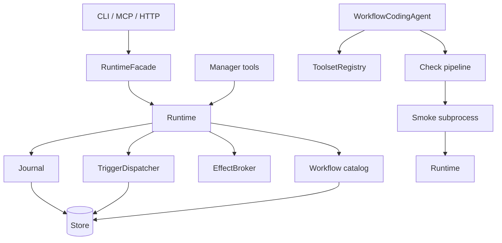
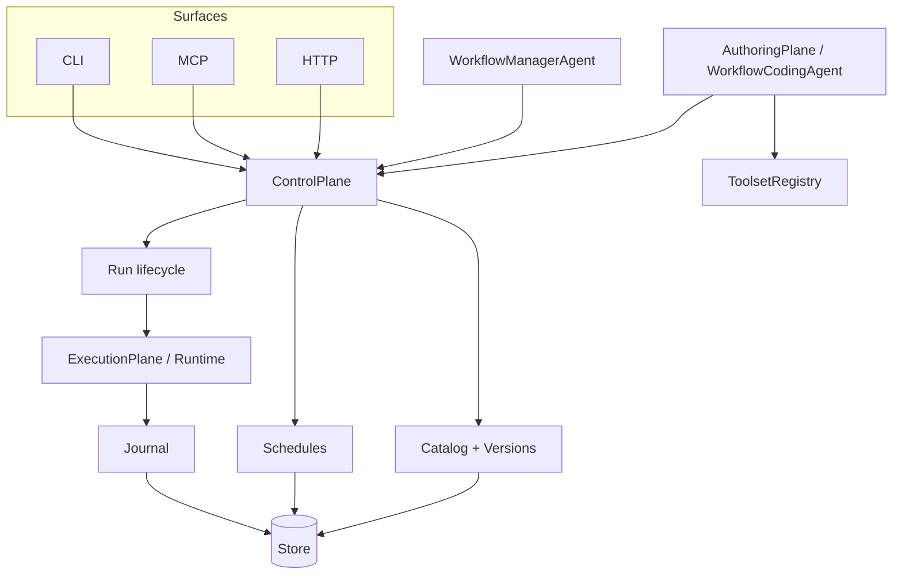
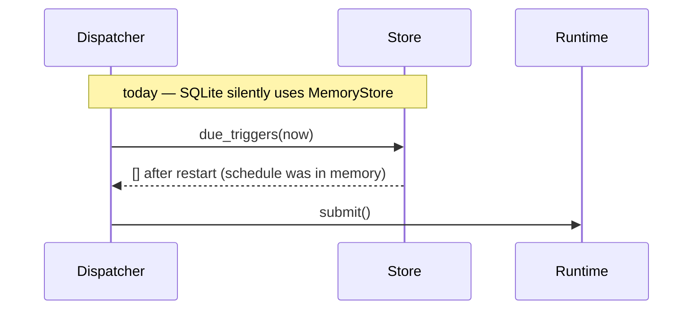
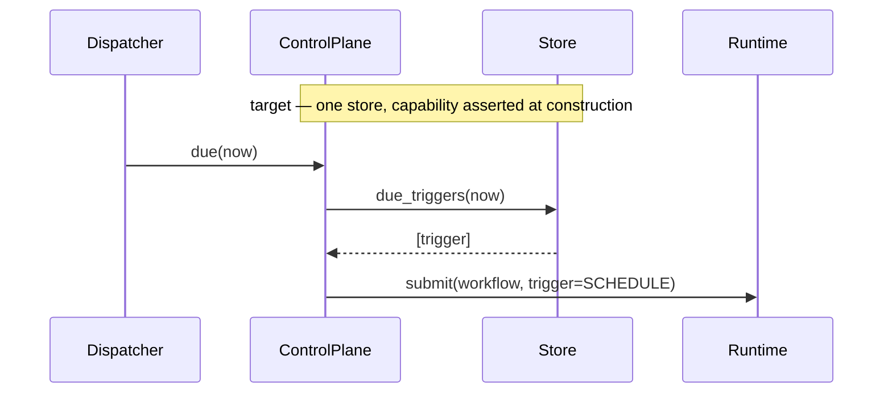

# Three planes: control, authoring, execution

**What this is:** a plan to separate the three things LOOM does — decide *what
should run*, *write* it, and *run* it — which currently share one object, plus
the storage parity work that separation exposes.

**Method:** every finding below was reproduced against the code before it was
written down. Nothing here is inferred from a docstring.

---

## 1. Audit of the current state

### F1 — There is no Workflow Manager Agent

`WorkflowManagerAgent` exists **only in `examples/cookbook/14`**. The library
ships `build_workflow_tools(runtime) -> list[Tool]` — seven tools — and nothing
that assembles them into an agent. So "the workflow manager" is a pattern
users are expected to rebuild, and every one of them will rebuild it slightly
differently.

### F2 — It is undocumented

README mentions "Workflow manager" twice, both in the feature table, with no
section. CLAUDE.md mentions `workflow_tools` once, in a list. Neither explains
how it is used or run.

### F3 — SQLite loses every schedule, silently

`SQLiteStore` implements **none** of the six `TriggerStore` methods, and
`dispatcher._resolve_store` falls back to `MemoryStore()` when the store lacks
`save_trigger`:

```
TriggerStore methods: delete_trigger, due_triggers, get_trigger,
                      list_triggers, save_trigger, update_after_fire
SQLiteStore missing : all six
```

So `LOOM_STORE=sqlite:///runs.db` — the documented laptop default — persists
runs durably and keeps schedules **in memory**. Restart the process and every
cron trigger is gone, with no error and no log line. The durable store is
right there and the schedule is not in it.

This is the same shape as the pagination and entity-resolution defects: a
silent downgrade that looks like success.

### F4 — Store capability is a guess, not a contract

| Store | ExecutionStore | CacheStore | LockProvider | TriggerStore |
|---|---|---|---|---|
| Memory | ✅ | ✅ | ✅ | ✅ |
| SQLite | ✅ | ✅ | ✅ | **❌** |
| Mongo | ✅ | ✅ | ✅ | ✅ |
| Postgres | ✅ | ✅ | ✅ | ✅ |

Nothing asserts this table. `test_store_conformance.py` covers the execution
protocol; no suite runs the *trigger* protocol against every store, which is
why F3 survived.

### F5 — Redis is referenced and does not exist

`redis` appears in `triggers/queue.py` and `flowcontrol.py` as prose examples.
There is no Redis store or lock provider, so the natural choice for a
distributed lease or a rate limiter is not available.

### F6 — The three planes share one object

`Runtime` is the control plane, the execution plane, and the codegen plane's
dependency all at once:



Three consequences, each observed:

- `build_workflow_tools(runtime)` takes a **`Runtime`**, so an agent that only
  needs to *list and schedule* holds something that can also execute.
- The coding agent's smoke stage builds its own `Runtime` in a subprocess, and
  that Runtime needed toolsets registered — the bug fixed this week.
- Catalog, triggers, and runs are reached through the same object, so "which
  workflows exist" and "run this now" cannot be granted separately.

---

## 2. The three planes

| Plane | Answers | Owns |
|---|---|---|
| **Control** | what workflows exist, what should run, and when | catalog, versions, triggers, run lifecycle, RBAC |
| **Authoring** | turn a spec into verified code | discovery, generation, the check pipeline, repair |
| **Execution** | run a body durably | journal, replay, effects, stores, leases |

The test for the split: **authoring must not require an executor, and control
must not require a workflow module.** Today both do.

### Target



`ControlPlane` is what the manager agent, the CLI, and the MCP server all hold.
It can start a run, but it *is not* the thing that runs one — so a deployment
can hand an assistant the control plane without handing it the interpreter.

### Data flow — scheduled run, today vs target





---

## 3. Work

### P1 — Storage parity (fixes F3, F4)

- `SQLiteStore` implements `TriggerStore`: one table, the same shape the other
  three use.
- **Delete the silent fallback.** A store that cannot persist triggers must say
  so at construction, not degrade at runtime. `TriggerDispatcher(runtime)`
  raises `ConfigurationError` naming the store and the fix; an explicit
  `trigger_store=InMemoryTriggerStore()` stays available for tests.
- Extend the conformance suite to run the **trigger** protocol against every
  store, driven by the same parametrisation as the execution one, so a fifth
  store is covered by adding it to a list.

**Exit:** a cron trigger registered against SQLite survives a process restart;
the conformance suite fails if a store drops a protocol method.

### P2 — Control plane (fixes F6)

**Corrected during implementation.** This originally proposed a new
`ControlPlane` protocol. `RuntimeFacade` already *is* one — it carries
workflows, start, runs, get, journal, reports, cancel, retry, replay, publish,
and has two adapters, a signature-parity test, and three surfaces on it. It was
missing only scheduling. A second protocol beside it would have recreated
exactly the CLI/MCP split P0 spent its time removing, so the work is to
**extend the port, not add one**.

- ✅ `schedules`, `schedule`, `unschedule` on `RuntimeFacade` and both
  adapters. `RemoteFacade` refuses with a route ("drop --server") rather than a
  `NotImplementedError`, matching how `publish` already behaves.
- ✅ The dispatcher is cached on the *facade*. The manager tools used to set
  `runtime._dispatcher` themselves — a private attribute on someone else's
  object, which is what a missing boundary looks like.
- ⬜ `build_workflow_tools(runtime)` → `build_workflow_tools(facade)`, removing
  its two reads of `runtime._workflows`.
- ⬜ Cookbook 14 and the README section.

**Exit:** `grep -c "runtime\._" ` in the manager tools is zero; the same
operation through CLI, MCP, and HTTP goes through one port.

### P3 — Ship the manager agent (fixes F1, F2)

- `WorkflowManagerAgent(control_plane, model, executor=None)` in the library,
  built from `build_workflow_tools(control_plane)` — which changes signature
  from `Runtime` to `ControlPlane`.
- Cookbook 14 shrinks to constructing it.
- README section and CLAUDE.md entry.

**Exit:** cookbook 14 contains no agent-assembly code; a manager agent cannot
execute a workflow body in-process because it holds no Runtime.

### P4 — Authoring plane boundary

- `WorkflowCodingAgent` depends on `ToolsetRegistry` and the check pipeline
  only. Its smoke stage already runs out-of-process; make that the *declared*
  boundary rather than an implementation detail.
- The generated file's demo block stays a script, not a plane.

**Exit:** generating a workflow needs no `Runtime`.

✅ **Done — and it already held.** No authoring module imports `Runtime`; the
check pipeline mentions it nowhere. The boundary existed by accident of how the
code grew, which is one convenience import away from not existing. It is now
asserted per module and end to end. The smoke stage is the interesting case: it
*does* need a Runtime and builds one **inside a subprocess**, which is the
boundary working rather than a breach of it.

### P5 — Redis (fixes F5)

`RedisStore` covering `CacheStore` + `LockProvider` — the two a distributed
deployment actually wants Redis for. **Not** `ExecutionStore`: a journal wants
durability and queryability that Redis is the wrong shape for, and offering it
would invite the wrong deployment.

**Exit:** leader election and rate limiting work across processes on Redis;
the conformance suite covers it for the protocols it claims.

✅ **Done.** `RedisStore` implements `CacheStore` + `LockProvider` and
deliberately **not** `ExecutionStore` — a test asserts the absence, because the
absence is the design. Locks take `SET NX PX` in one round trip (check-then-set
lets two workers both see a free lock), re-acquire for the same owner so a
heartbeat is one call, and release only when still held — otherwise a worker
whose lease expired frees the lock a different worker has since taken.

---

## 4. Storage guidance (the answer to "which one")

| Store | Use it for | Not for |
|---|---|---|
| **Memory** | tests, single-process demos | anything that must survive a restart |
| **SQLite** | a laptop, a single node, a CLI | more than one writer process |
| **Postgres** | the default production answer — transactions, indexes, JSONB queries | — |
| **Mongo** | teams already running it; flexible run metadata | transactional multi-row updates |
| **Redis** | cache, locks, leases *alongside* one of the above | the journal |
| **Blobs** (local / S3) | payloads over the journal threshold, artifacts, attachments | queryable state |

The rule that follows: **one durable store for the journal, optionally Redis
for coordination, optionally blobs for weight.** Redis is never the journal.

---

## 5. Testing

| Level | Coverage |
|---|---|
| Conformance | every store × every protocol it claims, including triggers |
| Restart | a schedule registered, process restarted, still fires |
| Plane | the manager agent cannot reach an executor |
| Surface | one operation via CLI, MCP, HTTP returns one answer |
| Regression | README blocks and all 19 cookbooks execute |
| Docs | every example in this document runs |

The restart test is the one that would have caught F3, and it does not exist
today at any level.

---

## 6. Sequencing

```
P1 storage parity ──▶ P2 control plane ──▶ P3 manager agent
                                    │
P4 authoring boundary ── independent │
P5 redis ─────────────── after P1's conformance suite exists
```

P1 first because it is a live data-loss bug, and because its conformance work
is what makes P5 cheap.
