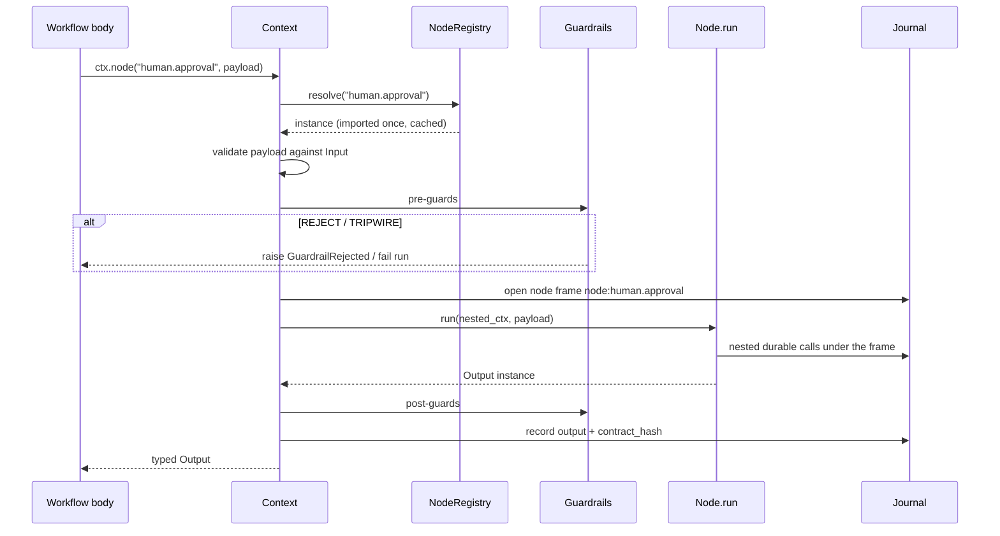

# Typed nodes: HIL, guardrails, standard library, and custom

<!-- docs-illustrative -->

**What this is:** a design and implementation plan for a first-class *node* — a
typed, versioned, catalogued unit of workflow work with a Pydantic input and a
Pydantic output — covering provider-implemented human-in-the-loop nodes,
guardrail nodes, a standard node library, and user-authored custom nodes.

**Method:** every claim about current behaviour below was read out of the code,
not inferred from a docstring. File and line references are to the tree at the
time of writing.

---

## 1. What exists today

LOOM already uses the word "node" for three unrelated things. Nothing joins
them, which is the actual gap.

### E1 — `StepClass.NODE` is a durability class that changes nothing

`steps/definition.py:35`:

```text
class StepClass(StrEnum):
    PURE = "pure"       # recomputed on replay, never journaled
    EFFECT = "effect"   # journaled and memoized. the default
    NODE = "node"       # "Generic code node. Treated as effect for durability.
                        #  Distinct in WGIR."
    AGENT = "agent"     # "Reserved for Phase 2"
```

`NODE` is *behaviourally identical to `EFFECT`*. Its entire contribution is a
different colour in a diagram. There is no node registry, no node contract, no
node catalog, and no way to install someone else's node.

### E2 — WGIR `NodeKind` is a drawing vocabulary, not a runtime one

`graph/wgir.py:25` defines 18 kinds — TRIGGER, PURE, EFFECT, TOOL, AGENT,
AGENT_SESSION, MAP, SWITCH, LOOP, PARALLEL, RACE, WAIT, HUMAN, SUBFLOW, EMIT,
COMPENSATE, ARTIFACT, RETURN. `graph/extractor.py:32` maps `ctx.*` method names
onto them:

```text
"wait_for_approval": NodeKind.HUMAN,
"agent":             NodeKind.AGENT,
"child":             NodeKind.SUBFLOW,
```

So `HUMAN` exists as a *picture* of `ctx.wait_for_approval`. There is no HUMAN
node you can register, parameterise, or reuse.

### E3 — HIL is one boolean, and the asking is not LOOM's problem

`runtime/context.py:823`:

```text
async def wait_for_approval(self, subject, *, timeout=None, on_timeout="reject") -> bool:
    answer = await self.wait_for_event(
        f"approval:{subject}", timeout=timeout,
        default={"approved": on_timeout == "approve"})
    ...
```

and `runtime/engine.py:575`:

```text
async def approve(self, run_id, subject, *, approved=True) -> None:
    await self.send_event(run_id, f"approval:{subject}", {"approved": approved})
```

What this gets right: the run costs nothing while parked, the answer is
journaled, and delivery is decoupled from the engine. What is missing:

- **Only yes/no.** A human cannot pick from options, fill a form, or edit a
  draft before approving. Every workflow that needs those hand-rolls
  `wait_for_event` with an ad-hoc payload shape and no schema.
- **Nobody is told.** Nothing notifies a human that a run is parked. The
  request exists only as a journal entry someone has to go looking for. In
  practice this is discovered late, after a run has been parked for a day.
- **No typed answer.** `wait_for_event` returns `Any`. A malformed approval
  payload becomes an `AttributeError` several lines later.
- **No policy.** No expiry behaviour beyond a boolean default, no
  re-notification, no record of *who* answered.

### E4 — Guardrails run in exactly one place

`agents/guardrails.py` is a complete, well-shaped abstraction: `Guardrail`,
`GuardrailResult`, and four verdicts — ALLOW, REJECT (model adapts), REPLACE
(sanitised substitute), TRIPWIRE (abort the run). It is applied in exactly one
place: `agents/runner.py`, around **agent tool calls**.

So a workflow cannot gate a plain `ctx.step()` on a policy check, cannot
validate data crossing between steps, and cannot apply a budget guard to
anything but an agent. The abstraction is right and its reach is one call site.

### E5 — The toolset catalog is the pattern to copy, and it excludes nodes

`toolsets/catalog.py` has `ToolsetCatalog` with `search` → `IndexCard`, `show`
→ `OpTable`, `stub` → `OpContract`, and `agents/tool_registry.py` extends it
with lazy `resolve_tools`. `agents/coding_tools.py` surfaces `search_toolsets`,
`show_toolset`, `get_tool_contract`, `get_tool_docs`, `call_read_operation` to
the coding agent.

This is precisely the shape the user asked for — "a categorised catalog that is
searchable by agent" — and it already exists, for integrations only. Nodes get
none of it, which means the coding agent cannot discover a node and will
therefore never emit one.

### E6 — Typed contracts are already derived, and thrown away at the boundary

`agents/tools.py:169` `build_parameter_schema(fn, *, skip_first)` derives JSON
Schema plus a `TypeAdapter` from a signature and docstring `Args:` block.
`StepDefinition.__post_init__` resolves `output_type` from annotations and
computes `contract_hash` from the Pydantic schema of input and output.

So the machinery for "Pydantic in, Pydantic out" exists. What is missing is a
unit that *declares* those types as its public contract rather than inferring
them incidentally.

### Summary of the gap

| Capability | Today | Needed |
|---|---|---|
| Typed unit of work | inferred from signature | declared `Input`/`Output` models |
| Reusable + installable | steps in your own module | registry + entry points |
| Discoverable by the agent | toolsets only | node catalog, same shape |
| HIL | `bool` approval, nobody notified | typed request/response + provider channel |
| Guardrails | agent tool calls only | any node, any step, standalone |
| Custom | write a `@step` | author, package, publish, version |

---

## 2. Design

### 2.1 The central constraint

**A node is a packaging and contract layer over the existing engine. It is not
a second durability mechanism.**

Everything durable a node does goes through `Context`. `ctx.node(...)` compiles
to the same journal entries the equivalent hand-written code produces. A node
that parks a run raises `Suspend` exactly as `wait_for_approval` does. If a node
could journal by its own path, LOOM would have two replay semantics and the
weaker one would eventually be load-bearing.

Concretely, the test for the whole design: **deleting the node package must not
change how any existing workflow replays.**

### 2.2 The contract

```text
class Node(Generic[In, Out]):
    """A typed, versioned, catalogued unit of workflow work."""

    spec: ClassVar[NodeSpec]
    Input: ClassVar[type[BaseModel]]
    Output: ClassVar[type[BaseModel]]

    async def run(self, ctx: NodeContext, payload: In) -> Out: ...
```

Pydantic in, Pydantic out — the user's stated preference, and the right one
here for four reasons that are specific to LOOM rather than general taste:

1. **The journal already needs a serializable value.** `core/serde.py` raises
   `SerializationError` rather than substituting a placeholder for a payload it
   cannot round-trip. A declared model makes that failure a *registration-time*
   failure instead of a runtime one.
2. **The coding agent needs a schema to write against.** `OperationSpec` proved
   this for toolsets: an operation with an `output_schema` gets a usable fake
   (`agents/fakes.py`), and one without gets guesswork.
3. **`contract_hash` becomes meaningful.** A node's version plus the hash of its
   two models is a real compatibility statement, which is what makes replay
   across a node upgrade safe rather than hopeful.
4. **It gives HIL a form.** An approval is a `BaseModel`; so is a choice, a
   form, and an edited draft. One mechanism, many shapes.

`NodeContext` is a **narrowed** `Context`, not the whole thing:

```text
class NodeContext(Protocol):
    async def step(self, fn, *args, **kwargs) -> Any: ...
    async def sleep(self, duration) -> None: ...
    async def wait_for_event(self, name, *, timeout=None, default=...) -> Any: ...
    async def report(self, message, *, kind="text") -> None: ...
    def now(self) -> datetime: ...
    def uuid4(self) -> str: ...
    def random(self) -> Random: ...
    @property
    def deps(self) -> Any: ...
```

Narrowed deliberately. A node must not `continue_as_new`, `spawn` children, or
`publish` under the parent's identity — those are the *workflow's* prerogative,
and a third-party node that could invoke them can restructure a run its author
never saw. The narrowing is a `Protocol`, and the implementation is the real
`Context` scoped via the existing `ctx.nested(path)` (`runtime/context.py:514`),
so nested durable calls journal under `node:<id>#<n>/...` and replay
deterministically.

### 2.3 Node metadata — the catalog entry

```text
class NodeSpec(BaseModel):
    id: str                       # "human.approval"
    version: str                  # "1.0.0"
    category: NodeCategory        # the searchable axis
    summary: str                  # one line, shown in search results
    description: str = ""         # the long form, shown on `show`
    effect: EffectClass = READ    # reuses toolsets.manifest.EffectClass
    suspends: bool = False        # can this park the run?
    deterministic: bool = True    # replay-safe without journaling?
    tags: list[str] = []
    node_class: str = ""          # "workflow_builder.nodes.human.approval:ApprovalNode"
    input_schema: dict = {}       # derived from Input at registration
    output_schema: dict = {}      # derived from Output
    requires: list[str] = []      # capability names, e.g. "human_channel"
    guards: list[str] = []        # guardrail node ids applied around this node
    examples: list[NodeExample] = []
```

`node_class` is the node's answer to the lesson `tools_module` taught for
toolsets: **a catalog entry must say how to import itself.** Without it the
agent sees an id like `human.approval`, which exists in no namespace, and
invents an import to match.

`requires` is what makes a missing capability a clear error instead of a
mysterious hang. A node declaring `requires=["human_channel"]` fails at
resolution with "no HumanChannel configured on the Runtime" rather than parking
a run nobody will ever be told about.

### 2.4 Categories — the catalog axis

Answering the mid-turn ask directly: categories are the searchable axis, and
they are chosen so that *the answer to "which node do I want" is a category*.

| Category | Contains | Examples |
|---|---|---|
| `human` | anything that parks on a person | approval, choice, form, review_edit, escalate |
| `guard` | verdict-returning checks | schema, policy, pii, budget, content, rate |
| `control` | flow shaping | branch, switch, filter, dedupe, batch, throttle |
| `transform` | pure data work | map_fields, template, extract, join, redact |
| `io` | typed external effects | http_request, wait_for_webhook, emit_event |
| `agent` | probabilistic judgement | classify, extract_structured, summarize, judge |
| `custom` | user-authored | whatever you register |

The `agent` category is where LOOM's existing "code or judgement" rule lands as
a *choice a catalog makes visible*. `agent.classify` and `control.switch` sit in
different categories precisely so that picking between them is a deliberate act
rather than an accident of what the model remembered.

### 2.5 HIL — provider implements the asking, LOOM owns the parking

The split is the whole design:

```
LOOM owns                          The provider owns
---------                          -----------------
parking the run (Suspend)          delivering the request to a person
journaling the request             rendering it (Slack blocks, email, web form)
validating the response            collecting the answer
resuming, typed                    calling back into LOOM
expiry and escalation policy       identity of the responder
```

```text
class HumanChannel(Protocol):
    """How a request reaches a person. Implemented by the provider."""

    async def deliver(self, request: HumanRequest) -> DeliveryReceipt: ...
    async def withdraw(self, request_id: str, reason: str) -> None: ...
    @property
    def name(self) -> str: ...
```

`HumanRequest` carries `run_id`, `request_id`, `node_id`, `subject`, `prompt`,
`schema` (the JSON Schema of the node's response model), `assignees`,
`expires_at`, and `context` (the payload the human needs to decide). It is a
`BaseModel`, so a provider can render it without knowing anything about LOOM's
internals — a Slack provider builds blocks from `schema`, a web provider builds
a form from it, a CLI provider prompts from it.

Three properties that make this survive real deployments:

**Delivery is a step, so it is journaled and retried.** `deliver()` is invoked
via `ctx.step(...)` with the node's retry policy. It runs **exactly once per
request** across replays — otherwise every engine restart re-pings the channel
and a human gets the same approval request five times. This is the same
reasoning that turned retries off on `gmail_send_message`.

**Withdrawal is best-effort and never masks the answer.** When a request
expires or the run is cancelled, `withdraw()` is called so the Slack message
stops being actionable. A failing `withdraw` is logged and recorded, exactly as
compensation failures are, and does not change the run's outcome.

**A channel is optional and its absence is loud.** `Runtime(human=...)` wires
it. Without it, a `human.*` node raises `ConfigurationError` naming the missing
capability at resolution — *before* the run parks. A run parked with nobody
listening is the worst possible failure here, because it looks like patience.

The built-in `human` nodes:

| Node | Input | Output |
|---|---|---|
| `human.approval` | subject, prompt, context, expiry policy | `approved: bool`, `responder`, `comment`, `decided_at` |
| `human.choice` | prompt, options, allow_multiple | `selected: list[str]`, `responder` |
| `human.form` | prompt, `response_model` | an instance of `response_model` |
| `human.review_edit` | draft (any model) | the same model, possibly edited, plus `edited: bool` |
| `human.escalate` | prompt, tiers, per-tier timeout | answer plus `tier_reached` |

`human.form` is the general case — the other four are it with a fixed response
model and a better name. That is deliberate: one mechanism, and the specific
ones exist because a catalog entry named `approval` is findable and one named
`form(response_model=Approval)` is not.

**`ctx.wait_for_approval` keeps working, unchanged, on the same event name.**
`human.approval` uses `approval:{subject}` as its event and
`runtime.approve(run_id, subject)` resolves either. A workflow written last
month replays identically; a workflow written with the node additionally gets
somebody notified.

### 2.6 Guardrail nodes — one abstraction, three attachment points

Reuse `Guardrail`/`GuardrailResult` verbatim. What changes is *where* they can
attach:

1. **Standalone:** `await ctx.guard("guard.pii", payload)` — a node like any
   other, returning `GuardrailResult`. Drawn as its own WGIR node, which means
   a reviewer reading the graph can see the check.
2. **Around a node:** `NodeSpec.guards = ["guard.budget"]`, or
   `ctx.node("io.http_request", req, guards=[...])`. Runs before the node body
   and, for output guards, after it.
3. **Where they already run:** agent tool calls, unchanged.

Verdict semantics carry over exactly, with one addition forced by the wider
reach:

| Verdict | Standalone / around a node |
|---|---|
| ALLOW | proceed |
| REJECT | raise `GuardrailRejected` — a normal, retryable-policy-respecting failure |
| REPLACE | substitute `replacement` for the node's input (pre) or output (post) |
| TRIPWIRE | fail the run, run compensations, record the guardrail in metadata |

The addition: in an agent loop REJECT hands the model an explanation so it can
adapt, but in a workflow body there is nobody to adapt — so REJECT must raise
rather than return a falsy value that a caller ignores. This is the same class
of decision as `coerce_output` raising instead of passing prose through.

**A guard verdict is journaled.** It is a decision the run's behaviour depends
on; recomputing it on replay against a policy that has since changed would make
replay disagree with history. `deterministic=True` guards (schema validation)
may be recomputed; policy and model-backed guards may not, and the spec field
is what distinguishes them.

Built-ins: `guard.schema`, `guard.policy` (predicate over payload),
`guard.pii`, `guard.budget` (reads `ctx.usage`), `guard.content` (model-backed,
non-deterministic), `guard.rate`.

### 2.7 The catalog — searchable, categorised, lazily materialised

Mirror `ToolsetCatalog` exactly, because the three-layer lazy design has already
been proven here and the coding agent already knows its shape.

```
Layer 1  register   NodeSpec only. Pure data. No node code imported.
Layer 2  discover   search / show / stub over specs. Categories, tags, schemas.
Layer 3  resolve    import node_class, construct, validate contract. On demand.
```

```text
class NodeCatalog:
    def register(self, spec: NodeSpec) -> None: ...
    def register_node(self, node: type[Node]) -> None: ...   # derives the spec
    def unregister(self, node_id: str) -> None: ...
    def get(self, node_id: str) -> NodeSpec | None: ...
    def categories(self) -> dict[NodeCategory, int]: ...
    def search(self, query: str = "", *, category=None, tags=None,
               limit: int = 10) -> list[NodeCard]: ...
    def show(self, node_id: str) -> NodeDetail: ...
    def stub(self, node_id: str) -> NodeContract: ...        # copy-pasteable code
    def resolve(self, node_id: str) -> Node: ...             # layer 3
```

`NodeRegistry(NodeCatalog)` adds resolution and caching, chains to a
process-global registry via `parent=` — the same arrangement
`ToolsetRegistry` uses so `@register_node` and `loom_node` entry points reach
every Runtime while `rt.nodes.register(...)` stays local.

**Why not fold nodes into `ToolsetRegistry`?** Because the two answer different
questions. A toolset answers "what can I call on Jira"; a node answers "what
shape of work is this". A `human.approval` has no provider, no auth, no
scopes, no rate limit group, and no egress host — four of `ToolsetManifest`'s
fields would be permanently empty, and `search("approval")` would return it
ranked against Jira operations. They share the *pattern* and a base class for
scoring; they do not share the store.

**Growth discipline.** The system prompt gets **category headers plus counts**,
never the node list. Detail arrives through `search_nodes`/`show_node`/
`node_contract` on demand. §8 measures why this is the load-bearing choice and
states the test that enforces it. This is the lesson from the toolset index cards: a prompt that grows
with the size of the catalog stops working at exactly the point the catalog
becomes valuable.

### 2.8 Custom nodes — the user-authored path

```python
from pydantic import BaseModel

from workflow_builder import step
from workflow_builder.nodes import Node, NodeCategory, NodeSpec, register_node


class ScoreIn(BaseModel):
    text: str
    threshold: float = 0.5


class ScoreOut(BaseModel):
    score: float
    passed: bool


@step
async def compute_score(text: str) -> float:
    """The node body is made of steps — that is the whole seam."""
    return len(text) / 100


@register_node
class LeadScoreNode(Node[ScoreIn, ScoreOut]):
    spec = NodeSpec(
        id="custom.lead_score",
        version="1.0.0",
        category=NodeCategory.TRANSFORM,
        summary="Score a lead from its description text.",
        deterministic=True,
    )
    Input, Output = ScoreIn, ScoreOut

    async def run(self, ctx, payload: ScoreIn) -> ScoreOut:
        score = await ctx.step(compute_score, payload.text)
        return ScoreOut(score=score, passed=score >= payload.threshold)
```

Distribution by entry point, matching `loom_toolset`:

```toml
[project.entry-points.loom_node]
lead_score = "my_pkg.nodes:LeadScoreNode"
```

`@register_node` derives `input_schema`, `output_schema`, and `node_class` from
the class itself, so a custom node is discoverable by the coding agent with no
further declaration. Registration validates the contract — `Input`/`Output` are
`BaseModel` subclasses, `run` is a coroutine with the right shape, `spec.id` is
namespaced and unique, and `node_class` actually imports. **A node that fails
validation fails at registration**, where the author sees it, rather than at
resolution inside somebody else's run.

### 2.9 Data flow

Calling a node:



A HIL node parking and resuming:

```mermaid
sequenceDiagram
    participant N as human.approval
    participant C as NodeContext
    participant H as HumanChannel (provider)
    participant P as Person
    participant E as Engine

    N->>C: ctx.step(deliver, request)   %% journaled, exactly once
    C->>H: deliver(HumanRequest)
    H->>P: Slack block / email / web form
    N->>C: wait_for_event("approval:<subject>", timeout)
    C-->>E: raise Suspend(awaiting_event=...)
    E->>E: park. run costs nothing.
    P->>H: clicks Approve
    H->>E: runtime.approve(run_id, subject)  (or send_event)
    E->>N: re-enter; journal serves the delivery, event returns
    N->>N: validate payload against Output
    N-->>C: ApprovalOut(approved=True, responder=...)
```

On expiry the same picture ends at `withdraw()` plus the node's declared
timeout policy — reject, approve, escalate to the next tier, or fail.

---

## 3. Directory structure

Existing, unchanged unless listed in §4:

```
src/workflow_builder/
  steps/definition.py        StepClass, StepDefinition
  runtime/context.py         Context, ctx.* durable API
  runtime/engine.py          Runtime, approve(), send_event()
  agents/guardrails.py       Guardrail, GuardrailResult, verdicts
  agents/tool_registry.py    ToolsetRegistry (the pattern to mirror)
  toolsets/catalog.py        ToolsetCatalog, IndexCard, OpContract
  toolsets/manifest.py       EffectClass, OperationSpec, ToolsetManifest
  graph/wgir.py              NodeKind, EdgeKind
  graph/extractor.py         _CTX_CALL_MAP
  agents/coding_tools.py     search_toolsets, show_toolset, ...
```

New:

```
src/workflow_builder/nodes/
  __init__.py            public surface: Node, NodeSpec, NodeCategory,
                         register_node, node_catalog
  base.py                Node, NodeContext protocol, NodeResult
  spec.py                NodeSpec, NodeCategory, NodeExample, contract hashing
  catalog.py             NodeCatalog, NodeCard, NodeDetail, NodeContract
  registry.py            NodeRegistry: resolution, caching, entry points, parent
  errors.py              NodeNotFound, NodeContractError, GuardrailRejected,
                         HumanChannelMissing, HumanRequestExpired
  human/
    __init__.py
    channel.py           HumanChannel protocol, HumanRequest, DeliveryReceipt,
                         DeliveryStatus
    approval.py          human.approval
    choice.py            human.choice
    form.py              human.form
    review.py            human.review_edit
    escalate.py          human.escalate
    channels/
      console.py         ConsoleChannel  (dev; prints, reads stdin under `loom ui`)
      log.py             LogChannel      (records only; the honest default)
      webhook.py         WebhookChannel  (POSTs the request; the generic provider)
  guard/
    __init__.py
    runner.py            guard evaluation + verdict → engine behaviour
    schema.py policy.py pii.py budget.py content.py rate.py
  control/
    branch.py switch.py filter.py dedupe.py batch.py throttle.py
  transform/
    map_fields.py template.py extract.py join.py redact.py
  io/
    http.py webhook_wait.py emit.py
  agentic/
    classify.py extract_structured.py summarize.py judge.py

tests/
  test_node_contract.py        the Node/NodeSpec contract, registration validation
  test_node_catalog.py         search, categories, lazy layers, no eager import
  test_node_registry.py        resolution, caching, parent chaining, entry points
  test_nodes_human.py          each HIL node: park, deliver once, typed resume,
                               expiry, escalation, withdraw-on-cancel
  test_human_channel.py        channel conformance suite (the toolset lesson)
  test_nodes_guard.py          four verdicts × three attachment points
  test_nodes_stdlib.py         every built-in node, driven by its own examples
  test_custom_nodes.py         author → register → discover → resolve → run
  test_node_replay.py          replay determinism, version skew, contract change
  test_node_graph.py           WGIR emits the right NodeKind per category
  test_node_agent_tools.py     search_nodes/show_node/node_contract
  test_nodes_e2e.py            multi-node workflows across all four stores

docs/guides/nodes.md           authoring guide, in the shape of toolsets.md
examples/cookbook/20_*.py      HIL approval with a real channel
examples/cookbook/21_*.py      guardrail nodes gating a destructive step
examples/cookbook/22_*.py      authoring and publishing a custom node
```

---

## 4. Files that change

| File | Change | Why |
|---|---|---|
| `runtime/context.py` | add `ctx.node()`, `ctx.guard()`, `ctx.human()`; keep `wait_for_approval` delegating to the same event name | the only legal path from a workflow to the outside world |
| `runtime/engine.py` | `Runtime(nodes=..., human=...)`; `approve()` accepts a typed payload; `withdraw` on cancel/expiry | wiring and terminal paths |
| `runtime/effects.py` | node dispatch through `EffectBroker` | `GuardedBroker` must see node effects, not only step effects |
| `steps/definition.py` | `StepClass.NODE` documented as *the durability class a node body uses*; no behaviour change | remove the ambiguity in E1 without a breaking change |
| `graph/wgir.py` | add `GUARD` to `NodeKind`; `WGIRNode.node_id`/`category` metadata | a guard must be visible in the graph |
| `graph/extractor.py` | `_CTX_CALL_MAP` gains `node`/`guard`/`human`; category → `NodeKind` resolution | otherwise node calls draw as nothing |
| `graph/narrator.py` | narrate node calls by id and category | the narration-mentions-every-node check must still hold |
| `agents/guardrails.py` | unchanged abstraction; add `GuardrailRejected` raise path | reuse, don't fork |
| `agents/runner.py` | evaluate through the shared guard runner | one evaluation path, not two |
| `agents/coding_tools.py` | `search_nodes`, `show_node`, `node_contract` | E5 — the agent cannot use what it cannot find |
| `agents/coding_agent.py` | prompt: category headers + counts + the node-vs-step rule | growth discipline (§2.7) |
| `agents/validator.py` | validate node ids against the registry; reject unknown ones | same rule as unregistered toolset imports |
| `agents/stages.py` | node contracts checked in `static`; nodes exercised in `smoke` | a node call must be verified like any other |
| `agents/fakes.py` | fakes from `NodeSpec.output_schema`; fake `HumanChannel` auto-approving | otherwise smoke-testing a HIL workflow hangs forever |
| `security/grants.py` | `GrantSet.nodes` | a third-party node is code; grants must cover it |
| `facade.py` | `nodes()`, `node_detail()`, `pending_human()`, `respond()` | one port, all surfaces |
| `cli/` | `loom nodes`, `loom node <id>`, `loom pending`, `loom respond` | `approve` is boolean-only today |
| `mcp_server/tools.py` | node discovery + pending-human tools | model-facing parity |
| `server/app.py` | `GET /nodes`, `GET /human/pending`, `POST /human/{id}/respond` | the provider callback path |
| `state/base.py` + 4 stores | `HumanRequestStore` protocol | "which runs are waiting on a person" is a query, not a scan |
| `__init__.py` | export `Node`, `NodeSpec`, `NodeCategory`, `register_node` | ~10 symbols becomes ~14 |
| `CLAUDE.md`, `README.md` | node sections | the manager-agent lesson: shipped and undocumented is half-shipped |

---

## 5. Phases

Ordered so each phase is independently shippable and the risky parts land on
top of proven ones. SOLID/DRY notes are per phase, not decorative: each phase
names the abstraction it depends on rather than reimplementing.

### P1 — The node kernel

`nodes/base.py`, `spec.py`, `errors.py`, `catalog.py`, `registry.py`,
`ctx.node()`, WGIR + extractor + narrator.

- `Node` is the only abstraction the rest depends on (DIP).
- `NodeCatalog` shares scoring with `ToolsetCatalog` via a small shared base
  rather than a copied `_score` (DRY).
- No built-in nodes yet — proves the kernel does not depend on its own library.

**Exit:** a custom node registers, is found by `search`, resolves lazily,
executes, journals, and replays identically. Registering a node whose `run` has
the wrong shape fails at registration. `NodeCatalog.register` importing the node
module is caught by a subprocess probe, as `test_toolset_guide` does.

### P2 — Guardrail nodes

`nodes/guard/`, the shared guard runner, `ctx.guard()`, `NodeSpec.guards`,
`agents/runner.py` moved onto the shared runner.

- Existing `Guardrail`/`GuardrailResult` reused unchanged (OCP).
- One evaluation path for agent tool calls and node guards.

**Exit:** four verdicts × three attachment points, all asserted. TRIPWIRE runs
compensations and records the guardrail in `record.metadata`. The agent-tool
guardrail tests pass unmodified — proof the abstraction was reused, not forked.

### P3 — HIL nodes and the provider interface

`nodes/human/`, `HumanChannel`, `HumanRequest`, `HumanRequestStore` on all four
stores, `ConsoleChannel`/`LogChannel`/`WebhookChannel`, facade + CLI + HTTP +
MCP surfaces.

- Channel is a `Protocol` with a conformance suite, following
  `integrations/conformance.py` — which exists precisely because a suite that
  only offers helpers let every adapter drop `output_type` silently.
- `wait_for_approval` keeps its event name and its behaviour.

**Exit:** a run parks, a person is notified exactly once across replays and
restarts, a typed answer resumes it, expiry escalates per policy, cancellation
withdraws the request, and `loom pending` lists every waiting run. A `human.*`
node on a Runtime with no channel raises before parking.

### P4 — Standard node library

`control/`, `transform/`, `io/`, `agentic/`.

- Each node is one file, one class, one contract (SRP).
- Each ships `NodeSpec.examples`, and the test suite is *driven by* those
  examples — so a node whose documented example does not run cannot merge.

**Exit:** every built-in node has schemas, examples, fakes, and a test; the
catalog reports non-empty counts for all seven categories.

### P5 — The coding agent learns nodes

`search_nodes`/`show_node`/`node_contract`, prompt changes, validator,
`static` and `smoke` stage coverage, fake `HumanChannel`.

- Prompt carries category headers and counts only; detail is pulled on demand
  (§8.2). `node_contract` returns runnable code, not JSON Schema (§8.3).
- The node-vs-step rule stated the way the code-or-judgement rule is: *a node
  when a catalogued contract exists, a step when the work is yours alone.*

**Exit:** given "get approval before refunding", the agent finds
`human.approval`, emits a valid call, and the workflow smoke-tests to completion
against the auto-approving fake channel. Prompt growth is asserted at **exact
equality** across 500 registered nodes (§8.2), and a wrong node id or payload
field is caught in the `static` stage rather than at runtime (§8.6).

### P6 — Custom node authoring

`loom_node` entry points, `docs/guides/nodes.md`, cookbooks 20–22, README and
CLAUDE.md.

- The guide is tested end to end by writing the files it describes and driving
  them through every path, exactly as `tests/test_toolset_guide.py` does.

**Exit:** following the guide produces a working, discoverable, agent-usable
node; every documented snippet executes in CI.

---

## 6. Testing

| Level | What it covers | The failure it exists to catch |
|---|---|---|
| Contract | `Node`/`NodeSpec` validation at registration | a node whose declared schema and real signature disagree |
| Catalog | layers stay separated | layer 1 importing node code — the eager-seeding defect, again |
| Registry | resolution, caching, parent chaining, entry points | a node registered globally that a Runtime cannot see |
| Replay | same journal, same result; version skew; contract change | a node upgrade silently changing an old run's replay |
| Channel conformance | every `HumanChannel` implementation | an adapter accepting a request and dropping it |
| HIL | park, deliver-once, typed resume, expiry, escalate, withdraw | duplicate notifications on restart; a run parked with nobody told |
| Guard | 4 verdicts × 3 attachment points | REJECT returning falsy and being ignored |
| Graph | WGIR kind per category; narration mentions every node | a node invisible in the graph a reviewer reads |
| Agent | discovery → emission → smoke | the agent never emitting a node because it cannot find one |
| Stores | `HumanRequestStore` × 4 stores | the SQLite-triggers defect, again |
| E2E | multi-node workflows, all stores, restart mid-park | the composite failure none of the above sees |
| Docs | every snippet in the guide and cookbooks executes | a guide that stops being true |

Two structural defences carried over from earlier work in this repo, because
both caught real defects: **mutation-verify every new guard** (change the
condition, confirm a test fails — clearing `__pycache__` first), and **assert on
`" ".join(prompt.split())`** so prompt tests survive reflowing.

---

## 7. Review

### Correctness

- **The replay hazard is version skew.** A node upgraded between a run and its
  replay could decode an old payload into a new model and produce a different
  answer. Mitigation: journal `node_id@version` plus the contract hash; a
  mismatch raises `NodeContractError` naming both versions. Loud beats quiet —
  the same call `SerializationError` already makes.
- **Nested journaling is the second hazard.** A node body making durable calls
  must journal under a stable path or replay drifts. Mitigation: `ctx.nested()`,
  which already exists and is already tested, rather than a new scheme.
- **Guard determinism.** A model-backed guard recomputed on replay can flip.
  `deterministic=False` guards journal their verdict; the field is required, not
  inferred.

### Security

- A third-party node is arbitrary code running inside a workflow. `NodeContext`
  is narrowed so a node cannot spawn, `continue_as_new`, or publish under the
  parent's identity. `GrantSet.nodes` gates which nodes a workflow may resolve.
  Node effects dispatch through `EffectBroker`, so `GuardedBroker` and dry-run
  see them.
- HIL is an authorization surface. `HumanRequest` carries `assignees`;
  verifying *who answered* is the channel's job and the response records the
  claimed responder. LOOM must not imply it authenticated a person it never saw
   — the field is `responder`, populated by the channel, and documented as
  trusted exactly as far as the channel is.
- Node registration is explicit or entry-point based. No filesystem scanning, no
  implicit discovery.

### Performance

- Layer 1 stays pure data, so a thousand nodes cost a thousand small models at
  import, not a thousand module imports. Same property the toolset catalog has.
- Resolution caches per registry; a node resolves once per process.
- Guards add one journal entry each when non-deterministic and zero when
  deterministic. Budget: node dispatch measured in isolation against an absolute
  per-call ceiling — batched before/after timing produced a 57% "regression" and
  a 6% "improvement" from identical code earlier in this project, so it is not
  used again.
- Parked runs cost nothing; that property is inherited, not rebuilt.

### Edge cases

Enumerated because each one is a silent-degradation candidate:

| Case | Behaviour |
|---|---|
| No `HumanChannel` configured | `ConfigurationError` at resolution, before parking |
| Channel `deliver` fails | node retry policy; exhausted → run fails, request withdrawn |
| Response arrives after expiry | rejected, journaled as late; the timeout decision stands |
| Two responses to one request | first wins; the journal makes the second a no-op |
| Run cancelled while parked | `withdraw()` best-effort; failures recorded, not masked |
| Node id unknown | `NodeNotFound` listing near matches from the catalog |
| Payload fails `Input` validation | raises before the body, naming the field |
| Body returns the wrong type | `NodeContractError`, not a silent pass-through |
| Node upgraded mid-run | contract hash mismatch raises on replay |
| Guard raises rather than returning | treated as TRIPWIRE — a broken guard must not open the gate |
| Smoke-testing a HIL workflow | fake channel auto-approves; without it the sandbox hangs forever |

That last row is the one that would otherwise ship broken: every generated
workflow with an approval in it would time out in the check pipeline, and the
repair loop would "fix" it by removing the approval.

### Maintainability

- Adding a node is one file plus a registration — no engine change. Adding a
  category is one enum member.
- The three-layer catalog is one pattern, now used twice; the scoring is shared,
  not copied.
- Risk: two catalogs to keep in step. Accepted, with a shared base and a test
  asserting both satisfy the same discovery contract. Merging them would give
  `human.approval` an auth block and a rate-limit group.

### Users

- **Workflow authors** get typed, discoverable building blocks and stop
  hand-rolling `wait_for_event` payloads.
- **The coding agent** gets a searchable catalog in the shape it already knows,
  and a rule for when to reach for it.
- **Providers** implement one protocol — `deliver`/`withdraw` — with a
  conformance suite that fails rather than degrades.
- **Operators** get `loom pending`, `loom respond`, and an HTTP surface, so a
  parked run is a queue item rather than a mystery.
- **Existing users** get no breakage: `wait_for_approval`, `@step`, and
  `Guardrail` all keep working. Nodes are additive.

### The main risk

Scope. Seven categories × several nodes each is a large surface, and P4 is the
phase where a half-built node library could ship with untested members. The
mitigation is the P4 exit criterion: **the test suite is driven by each node's
own declared examples**, so an undertested node is a missing example, which is
visible in the catalog the agent reads.

---

## 8. Agent visibility and scale

Two requirements, stated as properties rather than intentions, because both are
testable: **adding a node must cost the coding agent nothing**, and **a node the
agent chooses must be writable correctly on the first attempt.**

### 8.1 The measured problem with copying the toolset path

The plan above says "mirror `ToolsetCatalog`". Measured against the four
built-in toolsets, that mirror would not scale, and it is worth being precise
about why before designing on top of it.

`describe(detail="index")` is the tier that is supposed to be cheap. It is not
constant per toolset — it emits every operation *name*:

```
+jira         ops= 16 ->  2170 chars
+confluence   ops= 11 ->  3131 chars  (+961)
+gmail        ops=  9 ->  3854 chars  (+723)
+gcal         ops=  8 ->  4658 chars  (+804)
```

≈830 chars per toolset, and the base `DEFAULT_SYSTEM_PROMPT` is 9007. Projected:

| Toolsets | Prompt chars | ≈ tokens |
|---|---|---|
| 4 (today) | 4,658 | 1,200 |
| 20 | 17,900 | 4,500 |
| 100 | 84,300 | 21,100 |
| 500 | 416,000 | 104,000 |

So the three-tier catalog bounds the *detail per entry* and not the *number of
entries*. It is the right design and it is one tier short of the claim made for
it. For toolsets that is tolerable today — nobody has 100 installed. For nodes
it is not, because **the point of a node library is that there are many of them,
and users add their own.** A design where every custom node a team writes
lengthens every prompt the agent sees is a design that punishes adoption.

### 8.2 The prompt contract: O(categories), not O(nodes)

The prompt carries **category headers and counts only**. Nothing per node.

```
## Node catalog

Reusable typed units: Pydantic in, Pydantic out. Prefer one over hand-written
code when a catalogued contract already covers the work.

  human      5 nodes   park the run on a person — approval, choice, form, review
  guard      6 nodes   verdict checks — schema, policy, pii, budget, content
  control    6 nodes   flow shaping — branch, switch, filter, dedupe, batch
  transform  5 nodes   pure data work — map_fields, template, extract, redact
  io         3 nodes   typed external effects — http, webhook_wait, emit
  agent      4 nodes   judgement — classify, extract_structured, summarize, judge
  custom     N nodes   registered by this project

search_nodes(query, category=...) to find one.
node_contract(id) for the exact code to write.
```

Roughly 700 characters, **constant** — registering the 500th custom node adds
nothing. The category line's node list is a fixed sample, not an enumeration:
it is there so the model knows what a category *means*, and it is capped.

This is the one hard budget in the design, and it gets its own test:

```text
def test_the_prompt_does_not_grow_with_the_catalog():
    registry = NodeRegistry()
    baseline = agent_with(registry).build_system_prompt()
    for i in range(500):
        registry.register(_synthetic_node_spec(f"custom.n{i}"))
    grown = agent_with(registry).build_system_prompt()
    assert len(grown) == len(baseline), (
        f"{len(grown) - len(baseline)} chars leaked per 500 nodes — "
        "something in the prompt is enumerating the catalog"
    )
```

Exact equality, not a tolerance. A tolerance is a budget that erodes; the
counts are the only thing that may change and they are a fixed-width field.

**Note on the existing budget.** `test_the_prompt_stays_lean` asserts
`len(DEFAULT_SYSTEM_PROMPT) < 8500` and the prompt is currently **9007** — the
guard is failing on `main` right now from a parallel edit (§8.7). That guard is
the direct ancestor of the test above, and it is the reason to state the node
budget as a structural property rather than a number: a character ceiling gets
raised, whereas "registering nodes must not change the prompt length" cannot be
satisfied by raising anything.

### 8.3 Full visibility: the contract tier returns code, not schema

This is the substantive difference from the toolset path, and it is what "write
clean code from the SDK" requires.

`ToolsetCatalog.stub()` returns an `OpContract` — `input_schema`,
`output_schema`, `scopes`, `effect`, `pagination`. That is a *description of* a
call. The agent's next action is to *write* a call, so it must still translate
JSON Schema into a Python invocation, and every translation is a chance to
invent a keyword argument or drop a required field.

`node_contract(id)` returns the invocation itself:

```text
>>> node_contract("human.approval")

# human.approval  v1.0.0  [human]   suspends: yes   requires: human_channel

from workflow_builder.nodes.human import ApprovalIn, ApprovalOut

decision: ApprovalOut = await ctx.node(
    "human.approval",
    ApprovalIn(
        subject="refund-4821",             # str       identifies this decision
        prompt="Approve a $420 refund?",   # str       shown to the person
        context={"amount": 420},           # dict      what they need to decide
        assignees=["finance@acme.com"],    # list[str] who is asked
        timeout="24h",                     # Duration | None
        on_timeout="reject",               # reject | approve | escalate | fail
    ),
)
if decision.approved:
    ...

# ApprovalOut: approved: bool, responder: str, comment: str, decided_at: datetime

# Parks the run. Costs nothing while parked. Resumed by
#   loom respond <run> refund-4821 --approve
#   POST /human/{request_id}/respond
# Needs Runtime(human=<HumanChannel>); without one this raises
# ConfigurationError before the run parks, not after.
```

Five things the agent needs and a schema does not carry: the **exact import
line**, the **exact call shape**, the **typed variable annotation** (so the next
line's attribute access is checkable), the **suspension fact**, and the
**runtime requirement**. The import line is the toolset lesson applied before it
can be relearned — `tools_module` existed on manifests and went nowhere near the
model, and the agent invented imports to match operation ids that were never
importable.

The generated stub is **rendered from the node's own `Input` model** — field
names, types, defaults, and the `Field(description=...)` text as the trailing
comment — so it cannot drift from the code. `NodeSpec.examples[0]` supplies the
values when present, and the field default or a type-appropriate placeholder
when not.

### 8.4 The three tools

Deliberately three, matching the tiers, so the agent's cost tracks the
specificity of what it wants:

| Tool | Returns | Cost |
|---|---|---|
| `search_nodes(query, category=None, tags=None, limit=10)` | `NodeCard[]`: id, category, summary, suspends, requires | ~80 chars/hit |
| `show_node(node_id)` | `NodeDetail`: description, both schemas, examples, guards, version | ~600 chars |
| `node_contract(node_id)` | the code block above | ~700 chars |

`search_nodes` takes **`category` as a first-class filter**, which is what makes
the categorised catalog worth having: "I need a human decision" is answered by
`search_nodes(category="human")` without guessing a keyword. An empty query with
a category is legal and lists the category — the toolset `search(query)` has no
such affordance, and a model with no keyword has nowhere to start.

`NodeNotFound` returns near matches from the catalog rather than a bare error,
because a wrong id is the most likely single failure and the fix is one hop away.

### 8.5 Adding a node is one file

The scalability claim on the authoring side, stated as what a contributor does:

```python
from pydantic import BaseModel

from workflow_builder.nodes import Node, NodeCategory, NodeSpec, register_node


class MyIn(BaseModel):
    text: str


class MyOut(BaseModel):
    length: int


@register_node
class MyNode(Node[MyIn, MyOut]):
    spec = NodeSpec(
        id="custom.thing",
        version="1.0.0",
        category=NodeCategory.TRANSFORM,
        summary="Measure a string.",
    )
    Input, Output = MyIn, MyOut

    async def run(self, ctx, payload: MyIn) -> MyOut:
        return MyOut(length=len(payload.text))
```

That is the whole integration. `@register_node` derives `input_schema`,
`output_schema`, and `node_class` from the class, so the node is searchable,
showable, contract-renderable, fake-able, and validator-known **without a second
declaration anywhere**. There is no manifest to keep in step, no docs entry, no
prompt edit, and no registry list to append to.

The property that makes this hold is that every agent-facing artefact is
*derived*, never authored in parallel. `tests/test_manifest_imports.py` exists
because toolsets violated this — the client paged, the tool returned `Results`,
and the manifest said `pagination: False`, three sources of truth for one fact,
and the first run of that check found six drifts. Nodes have one source: the
class.

### 8.6 Closing the loop — the agent finds out when it is wrong

Visibility without feedback still produces plausible wrong code. Four places a
bad node call is caught, in the order the agent hits them:

| Where | Catches | Message |
|---|---|---|
| `validate_code` / `static` stage | unknown node id, unregistered node | "no node `human.aprove` — did you mean `human.approval`? Available in `human`: …" |
| `static` stage | payload fields that do not exist on `Input` | "`ApprovalIn` has no field `approver`; it has `assignees`" |
| `static` stage | `requires` not configured | "`human.approval` needs `Runtime(human=…)`; this environment has none" |
| `smoke` stage | everything else, by running it | traceback, into repair |

The first row is the same rule `CodeValidator(available_toolsets=…)` already
applies to imports: **only registered things exist**, and a call to an
unregistered node is an error at authoring rather than an `ImportError` on the
user's machine.

The `smoke` row carries the design's one genuinely dangerous interaction, worth
restating here because it is where this feature could ship broken: **a HIL node
in the sandbox has nobody to answer it.** Without an auto-responding fake
`HumanChannel`, every generated workflow containing an approval hangs until the
smoke timeout, reports a failure the model is asked to repair, and the cheapest
repair the model can find is to delete the approval. The feature would then
appear to work while quietly removing the exact safety control it exists to
provide. The fake channel is therefore a P5 exit criterion, not a test fixture.

### 8.7 Not from this work — a live failure on `main`

`tests/test_entity_resolution.py::TestMarkdownByDefault::test_the_prompt_stays_lean`
fails: `assert 9007 < 8500`. `git diff` shows `+11` lines added to
`DEFAULT_SYSTEM_PROMPT` in `agents/coding_agent.py` from the parallel work in
this tree — the full suite was green (2430 passed) before those lines landed. I
have not touched that file and am not editing it while it is being changed
elsewhere. Flagging it because it is the guard that protects exactly the
property §8.2 depends on, and because the node prompt block cannot be added on
top of an already-over-budget prompt without deciding what the budget now is.
