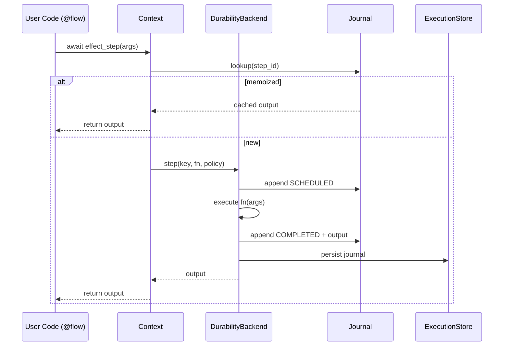
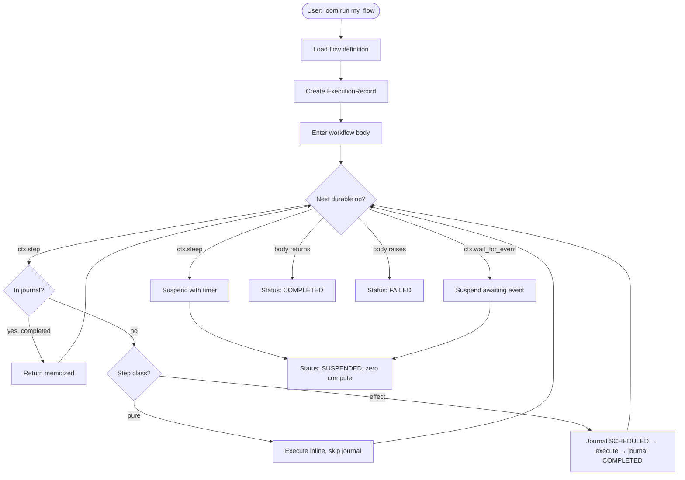
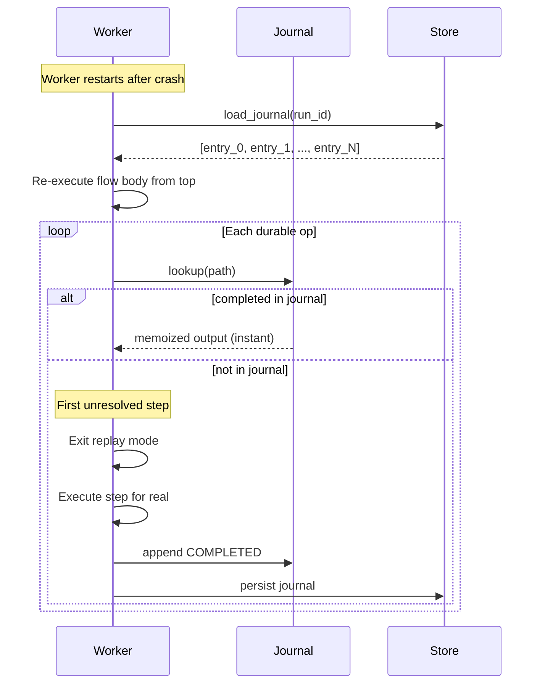
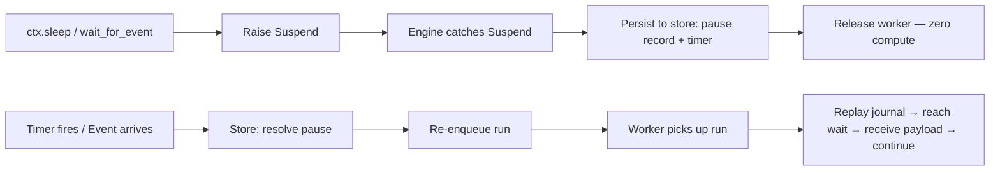

# Phase 1 — Core Library

**Goal:** `pip install workflow-builder` delivers a working durable execution engine with all one-way-door decisions baked in.

**Prerequisites:** None (this is the foundation).

**System Design References:** Chapters 1-4, 8.1-8.2, 9.1, 11.3, 13, 14 (Phase 1 scope), 15.

---

## 1. Exit Criteria & Success Metrics

| Metric | Gate | Target |
|--------|------|--------|
| Duplicate effects / 1M steps | <= 50 | <= 1 |
| Replay divergences / 1M resumes | <= 100 | <= 5 |
| Time to first webhook | <= 10 min | <= 5 min |
| All Phase 1 unit tests pass | 100% | 100% |
| `loom check` catches LOOM-D001 through LOOM-D005 | All | All |

**"Done" means:** A user can `pip install workflow-builder`, write a workflow with `@pure`/`@effect` steps, run it with `SQLiteStore`, crash mid-step, resume with zero duplicate effects, and suspend/resume on timer or event.

---

## 2. HLD — What Gets Built

```
┌─────────────────────── Phase 1 Scope ───────────────────────┐
│                                                              │
│  User Code                                                   │
│  ┌────────────────────────────────────────────────────────┐  │
│  │  @flow / @workflow                                      │  │
│  │    await pure_step(x)                                   │  │
│  │    await effect_step(y)                                 │  │
│  │    await ctx.sleep("5m")                                │  │
│  │    await ctx.wait_for_event("approval")                 │  │
│  └────────────────────────────────────────────────────────┘  │
│              │                                               │
│              ▼                                               │
│  ┌─────────────────┐    ┌───────────────────┐               │
│  │    Context       │───▶│  DurabilityBackend │              │
│  │ (durable API)    │    │    (protocol)      │              │
│  └─────────────────┘    └───────┬───────────┘               │
│              │                  │                             │
│              ▼                  ▼                             │
│  ┌─────────────────┐    ┌───────────────────┐               │
│  │    Runtime       │    │ EmbeddedBackend   │               │
│  │ (engine loop)    │    │ (wraps store)     │               │
│  └─────────────────┘    └───────┬───────────┘               │
│              │                  │                             │
│              ▼                  ▼                             │
│  ┌─────────────────┐    ┌───────────────────┐               │
│  │    Journal       │    │  ExecutionStore    │               │
│  │ (with hashes)    │    │  (protocol)       │               │
│  └─────────────────┘    ├───────────────────┤               │
│                         │  MemoryStore       │               │
│  ┌─────────────────┐    │  SQLiteStore       │               │
│  │  CLI (loom)      │    └───────────────────┘               │
│  │  dev/check       │                                        │
│  └─────────────────┘    ┌───────────────────┐               │
│                         │  Triggers           │               │
│  ┌─────────────────┐    │  Webhook/Schedule/  │              │
│  │  Determinism     │    │  Manual/SubFlow     │              │
│  │  Lint Rules      │    └───────────────────┘               │
│  └─────────────────┘                                         │
└──────────────────────────────────────────────────────────────┘
```

### Component Interactions



---

## 3. LLD — Subsystem Details

### 3.1 Step Class Distinction

**Current state:** Single `@step` decorator in `steps/definition.py`. `StepDefinition` has no `klass` field.

**Target:** Three decorators — `@pure`, `@effect`, `@node` — each setting a `klass` field.

```python
# steps/definition.py — additions

class StepClass(StrEnum):
    PURE = "pure"
    EFFECT = "effect"
    NODE = "node"          # generic (treated as effect for durability)
    AGENT = "agent"        # reserved for Phase 2

@dataclass
class StepDefinition(Generic[P, R]):
    # ... existing fields ...
    klass: StepClass = StepClass.EFFECT   # default safe
    contract_hash: str = ""               # Pydantic schema hash (NEW)
    closure_hash: str = ""                # transitive body hash (NEW)
    idempotency: Callable[..., str] | None = None  # NEW
```

**Decorator implementations:**

```python
def pure(fn=None, *, cache: CachePolicy | None = None, **kw):
    """Deterministic transform. No I/O. Recomputed on replay (free)."""
    def wrap(f):
        return StepDefinition(fn=f, name=f.__name__, klass=StepClass.PURE, cache=cache, **kw)
    return wrap(fn) if fn else wrap

def effect(fn=None, *, retries=DEFAULT_RETRY, idempotency=None, timeout=None, on_error=OnError.RAISE, **kw):
    """Side-effecting I/O. Journaled. Memoized on replay."""
    def wrap(f):
        return StepDefinition(fn=f, name=f.__name__, klass=StepClass.EFFECT,
                              retry=retries, idempotency=idempotency, timeout=timeout,
                              on_error=on_error, **kw)
    return wrap(fn) if fn else wrap

def node(fn=None, **kw):
    """Generic step (custom code node). Treated as effect for durability."""
    def wrap(f):
        return StepDefinition(fn=f, name=f.__name__, klass=StepClass.NODE, **kw)
    return wrap(fn) if fn else wrap
```

**Migration:** Existing `@step` stays as an alias for `@effect` (backward compatible). The `klass` field defaults to `EFFECT`.

### 3.2 DurabilityBackend Protocol

**Current state:** `Runtime` in `engine.py` directly calls `ExecutionStore` methods. No abstraction layer.

**Target:** Extract `DurabilityBackend` protocol. `Runtime` talks to `DurabilityBackend`, not `ExecutionStore`.

```python
# runtime/backend.py (NEW)

from typing import Protocol, Any, runtime_checkable
from datetime import datetime, timedelta
from collections.abc import Callable, Iterable
from dataclasses import dataclass
from enum import StrEnum

class CapabilityTier(StrEnum):
    TIER_1 = "tier_1"     # universal
    TIER_2 = "tier_2"     # capability-gated

@dataclass(frozen=True)
class Capabilities:
    journal_introspection: bool = False
    continue_as_new: bool = False
    searchable_attributes: bool = False
    sub_second_timers: bool = False

@dataclass(frozen=True)
class StepKey:
    step_id: str
    contract_hash: str
    closure_hash: str
    attempt: int

@dataclass(frozen=True)
class StepPolicy:
    retry: Retry
    timeout: Duration | None
    on_error: OnError
    idempotency: Callable[..., str] | None
    klass: StepClass

@dataclass(frozen=True)
class RunRef:
    run_id: str
    tenant_id: str = ""

@dataclass(frozen=True)
class FlowRef:
    flow_id: str
    version: int = 1

@runtime_checkable
class DurabilityBackend(Protocol):
    """The single integration point for any durable backend."""

    def capabilities(self) -> Capabilities: ...

    # Tier 1 — every backend must implement
    async def step(self, key: StepKey, fn: Callable, *, policy: StepPolicy) -> Any: ...
    async def sleep(self, key: StepKey, until: datetime) -> None: ...
    async def wait(self, key: StepKey, name: str, corr: str | None,
                   timeout: timedelta | None) -> Any: ...
    async def signal(self, target: RunRef, name: str, payload: Any) -> None: ...
    async def child(self, key: StepKey, flow: FlowRef, inp: Any, *,
                    detached: bool = False) -> Any: ...
    async def cancel(self, target: RunRef) -> None: ...

    # Tier 2 — optional, declared via capabilities()
    async def history(self, run: RunRef) -> Iterable[Any]: ...
    async def continue_as_new(self, seed: Any) -> None: ...
```

**`EmbeddedBackend` — wraps `ExecutionStore` + `Journal`:**

```python
# runtime/backend.py

class EmbeddedBackend:
    """The built-in durable backend using ExecutionStore + Journal."""

    def __init__(self, store: ExecutionStore, tracer: Tracer = NoopTracer()):
        self._store = store
        self._tracer = tracer

    def capabilities(self) -> Capabilities:
        return Capabilities(
            journal_introspection=True,
            continue_as_new=False,     # Phase 5
            searchable_attributes=False,
            sub_second_timers=True,
        )

    async def step(self, key: StepKey, fn: Callable, *, policy: StepPolicy) -> Any:
        # Journal lookup → memoize or execute → journal write
        # This is the step execution algorithm from Chapter 4.3
        ...
```

**Migration path:** Refactor `Runtime.__init__` to accept `DurabilityBackend` instead of `store`. Create `EmbeddedBackend` wrapping the existing store logic. Keep `store=` param as convenience that auto-wraps in `EmbeddedBackend`.

### 3.3 Journal with Hashes

**Current state:** `JournalEntry` in `runtime/journal.py` has no `contract_hash` or `closure_hash`.

**Target:** Add hash fields; compute at step registration.

```python
# runtime/journal.py — additions to JournalEntry

class JournalEntry(BaseModel):
    # ... existing fields ...
    contract_hash: str = ""      # NEW: Pydantic schema hash
    closure_hash: str = ""       # NEW: transitive body hash
    idem_key: str | None = None  # NEW: idempotency key (D13)
    agent_session_id: str | None = None  # NEW: reserved for Phase 2
    turn_index: int | None = None        # NEW: reserved for Phase 2
```

**Hash computation:**

```python
# core/ids.py — additions

import hashlib, inspect, ast

def contract_hash(fn: Callable) -> str:
    """Hash the Pydantic in/out schemas of a step function."""
    hints = get_type_hints(fn)
    sig = inspect.signature(fn)
    schema_parts = []
    for name, param in sig.parameters.items():
        if param.annotation is not inspect.Parameter.empty:
            schema_parts.append(f"{name}:{param.annotation}")
    if "return" in hints:
        schema_parts.append(f"return:{hints['return']}")
    return hashlib.sha256("|".join(schema_parts).encode()).hexdigest()[:16]

def closure_hash(fn: Callable) -> str:
    """Hash the step body + transitive callables + constants."""
    source = inspect.getsource(fn)
    return hashlib.sha256(source.encode()).hexdigest()[:16]
```

### 3.4 steps.lock Generation

**New file:** `steps/lock.py`

```python
# steps/lock.py (NEW)

@dataclass
class StepIdentity:
    step_id: str
    contract_hash: str
    closure_hash: str
    klass: StepClass
    source_file: str
    source_line: int

def generate_steps_lock(registry: dict[str, StepDefinition]) -> dict[str, StepIdentity]:
    """Generate the step identity map. Called by `loom check`."""
    ...

def load_steps_lock(path: Path) -> dict[str, StepIdentity]:
    """Load steps.lock from disk."""
    ...

def diff_steps_lock(old: dict, new: dict) -> list[StepChange]:
    """Compute changes between two steps.lock files."""
    ...
```

`loom check` generates `steps.lock` (TOML format). The file is committed to Git. It maps step names to their hashes and survives renames (identity is the name, not the file path).

### 3.5 Context API Expansion

**Current state:** `Context` in `runtime/context.py` has `step`, `sleep`, `wait_for_event`, `gather`, `spawn`, `call_agent`.

**New methods to add:**

| Method | Purpose | Implementation |
|--------|---------|----------------|
| `ctx.map(items, node, concurrency=, on_error=)` | Typed fan-out → `Batch[T]` | Bounded semaphore + gather |
| `ctx.race(*awaitables)` | First-wins, cancel others | `asyncio.wait(FIRST_COMPLETED)` + cancel |
| `ctx.state` | Typed run state (Pydantic model) | Journaled deltas |
| `ctx.store.ns("x")` | Cross-run KV | Store protocol method |
| `ctx.now()` | Deterministic time | Journal side-effect entry |
| `ctx.uuid()` | Deterministic UUID | Journal side-effect entry |
| `ctx.random()` | Deterministic random | Journal side-effect entry with seed |
| `ctx.log` | Structured logging | Logger with correlation ids |
| `ctx.progress(pct, msg)` | Progress reporting | Updates run metadata |
| `ctx.run_id` / `ctx.attempt` / `ctx.env` / `ctx.tenant` | Ambient metadata | Properties on Context |

```python
# runtime/context.py — key additions

async def map(self, items: Iterable[T], node: StepDefinition,
              concurrency: int = 10, on_error: OnError = OnError.RAISE) -> Batch[R]:
    """Fan-out items over a step with bounded concurrency."""
    semaphore = asyncio.Semaphore(concurrency)
    results = []
    async def run_one(item, idx):
        async with semaphore:
            return await self.step(node, item, path_suffix=f"map.{idx}")
    tasks = [run_one(item, i) for i, item in enumerate(items)]
    if on_error == OnError.COLLECT:
        outcomes = await asyncio.gather(*tasks, return_exceptions=True)
        return Batch([Result.from_outcome(o) for o in outcomes])
    else:
        return Batch(await asyncio.gather(*tasks))

async def race(self, *awaitables) -> Any:
    """First to complete wins; others are cancelled."""
    done, pending = await asyncio.wait(
        [asyncio.ensure_future(a) for a in awaitables],
        return_when=asyncio.FIRST_COMPLETED
    )
    for p in pending:
        p.cancel()
    return done.pop().result()

def now(self) -> datetime:
    """Deterministic time — journaled on first call, replayed thereafter."""
    return self._side_effect("now", lambda: datetime.now(UTC))

def uuid(self) -> str:
    """Deterministic UUID — journaled on first call, replayed thereafter."""
    return self._side_effect("uuid", lambda: str(uuid4()))

def random(self) -> float:
    """Deterministic random — journaled on first call, replayed thereafter."""
    return self._side_effect("random", lambda: _random.random())
```

### 3.6 State Management

**`ctx.state` — run-scoped typed state:**

```python
# runtime/state.py (NEW)

class RunState(Generic[T]):
    """Typed, journaled run state backed by a Pydantic model."""

    def __init__(self, model: type[T], journal: Journal, initial: T | None = None):
        self._model = model
        self._value = initial or model()
        self._journal = journal

    def __getattr__(self, name: str) -> Any:
        return getattr(self._value, name)

    def __setattr__(self, name: str, value: Any) -> None:
        if name.startswith("_"):
            super().__setattr__(name, value)
            return
        old = getattr(self._value, name)
        if old != value:
            self._value = self._value.model_copy(update={name: value})
            self._journal.append_delta(name, value)
```

**`ctx.store` — cross-run KV:**

```python
# runtime/kv.py (NEW)

class KVNamespace:
    """Namespaced cross-run key-value store."""

    def __init__(self, namespace: str, store: ExecutionStore, tenant_id: str):
        self._ns = namespace
        self._store = store
        self._tenant = tenant_id

    async def get(self, key: str) -> Any | None: ...
    async def set(self, key: str, value: Any, ttl: Duration | None = None) -> None: ...
    async def delete(self, key: str) -> None: ...
    async def increment(self, key: str, delta: int = 1) -> int: ...
```

The `ExecutionStore` protocol needs KV methods added:

```python
# state/base.py — additions
class ExecutionStore(Protocol):
    # ... existing ...
    async def kv_get(self, tenant_id: str, namespace: str, key: str) -> Any | None: ...
    async def kv_set(self, tenant_id: str, namespace: str, key: str, value: Any,
                     ttl: datetime | None = None) -> None: ...
    async def kv_delete(self, tenant_id: str, namespace: str, key: str) -> None: ...
```

### 3.7 Trigger Normalization

**Current state:** `triggers/specs.py` has various trigger specs. `triggers/base.py` has `TriggerSpec`.

**Target:** All triggers normalize to a single `TriggerEvent` envelope. Add `SubFlow` trigger.

```python
# triggers/base.py — ensure TriggerEvent is the universal envelope

class TriggerEvent(BaseModel):
    id: str
    source: str                     # "webhook" | "schedule" | "manual" | ...
    name: str
    key: str | None = None
    payload: Any
    idem_key: str | None = None
    tenant_id: str = ""
    trace_id: str | None = None
    timestamp: datetime = Field(default_factory=lambda: datetime.now(UTC))
```

### 3.8 Error Taxonomy Completion

**Current state:** `core/exceptions.py` has partial hierarchy. Missing: `GrantDenied`, `AuthExpired`, `BudgetExceeded`, `SessionExhausted`, `BackendCapability`, `ResourceUnavailable`.

**Target:** Complete to D12 specification. All new errors are leaves only.

```python
# core/exceptions.py — additions (leaves under StepError and WorkflowError)

class GrantDenied(WorkflowError):
    """Operation outside grant set — gateway rejected."""
    def __init__(self, message: str, *, grant: str, required: str):
        super().__init__(message)
        self.grant = grant
        self.required = required

class AuthExpired(WorkflowError):
    """Connection token expired. Run parks until credential refresh."""

class BudgetExceeded(WorkflowError):
    """Token, cost, or turn budget exhausted."""
    def __init__(self, message: str, *, budget_type: str, limit: Any, actual: Any):
        super().__init__(message)
        self.budget_type = budget_type
        self.limit = limit
        self.actual = actual

class SessionExhausted(WorkflowError):
    """Agent session TTL or max-turn cap reached."""

class BackendCapabilityError(WorkflowError):
    """Feature unsupported by the target durability backend."""
    def __init__(self, message: str, *, capability: str, backend: str):
        super().__init__(message)
        self.capability = capability
        self.backend = backend

class ResourceUnavailable(WorkflowError):
    """Resource pool exhausted or health check failed."""
```

### 3.9 CLI Commands

**Current state:** `cli.py` exists but needs expansion.

**Phase 1 commands:**

| Command | Description | Implementation |
|---------|-------------|----------------|
| `loom dev` | Start dev server with hot reload | `SQLiteStore` + in-process worker + file watcher |
| `loom check` | Static analysis: types + determinism lint + `steps.lock` | AST visitor + hash computation |
| `loom run <flow>` | Execute a flow directly | Create run, execute, print result |
| `loom status <run_id>` | Show run status | Query store |
| `loom resume <run_id>` | Resume a suspended run | Call `runtime.resume()` |
| `loom send-event <name> <payload>` | Send event to waiting runs | Call `runtime.send_event()` |

### 3.10 Determinism Lint Rules

| Rule | Diagnostic | What It Catches |
|------|-----------|-----------------|
| `LOOM-D001` | No I/O in flow body or `@pure` | Imports of `httpx`, `requests`, `aiohttp`, file I/O in flow scope |
| `LOOM-D002` | No `datetime.now()` / `random` / `uuid4` | Direct calls to non-deterministic stdlib |
| `LOOM-D003` | No unbounded `while` in flow body | `while True` without `max_iterations` |
| `LOOM-D004` | No mutable module-level state | Assignment to module globals in flow body |
| `LOOM-D005` | No resource acquisition in flow body | `open()`, connection creation, pool access |

**Implementation:** AST visitor in `runtime/determinism.py` (already exists). Expand with lint rule registry.

### 3.11 Types: Batch and Result

```python
# core/types.py — additions

class Result(Generic[T]):
    """Ok[T] | Err[StepError] for on_error='collect'."""
    def __init__(self, value: T | None = None, error: StepError | None = None):
        self._value = value
        self._error = error

    @property
    def ok(self) -> bool: return self._error is None
    def unwrap(self) -> T: ...
    def unwrap_err(self) -> StepError: ...

    @staticmethod
    def from_outcome(outcome: T | BaseException) -> Result[T]: ...

class Batch(Generic[T]):
    """Typed collection from ctx.map with optional lineage."""
    def __init__(self, items: list[T]):
        self._items = items
    def __iter__(self): return iter(self._items)
    def __len__(self): return len(self._items)
    def __getitem__(self, idx): return self._items[idx]
    @property
    def successes(self) -> list[T]: ...
    @property
    def failures(self) -> list[StepError]: ...
```

---

## 4. Interfaces & Abstractions Summary

| Interface | File | Phase 1 Implementations |
|-----------|------|------------------------|
| `DurabilityBackend` | `runtime/backend.py` | `EmbeddedBackend` |
| `ExecutionStore` | `state/base.py` | `MemoryStore`, `SQLiteStore` |
| `CacheStore` | `state/base.py` | `MemoryCache` (existing) |
| `LockProvider` | `state/base.py` | `MemoryLock` (existing) |
| `Tracer` | `observability/tracing.py` | `NoopTracer` (existing) |
| `StepDefinition` | `steps/definition.py` | `@pure`, `@effect`, `@node`, `@step` |
| `TriggerSpec` | `triggers/base.py` | `Webhook`, `Schedule`, `Manual`, `SubFlow` |

---

## 5. Directory Structure — Changes

### New Files

| File | Purpose |
|------|---------|
| `runtime/backend.py` | `DurabilityBackend` protocol + `EmbeddedBackend` + `StepKey` + `Capabilities` |
| `runtime/state.py` | `RunState` — typed, journaled run state |
| `runtime/kv.py` | `KVNamespace` — cross-run KV via `ctx.store` |
| `steps/lock.py` | `steps.lock` generation, loading, diffing |
| `settings.py` | `LoomSettings` (pydantic-settings) |

### Modified Files

| File | Changes |
|------|---------|
| `steps/definition.py` | Add `klass`, `contract_hash`, `closure_hash`, `idempotency` to `StepDefinition`; add `@pure`, `@effect`, `@node` decorators |
| `runtime/journal.py` | Add `contract_hash`, `closure_hash`, `idem_key`, `agent_session_id`, `turn_index` to `JournalEntry` |
| `runtime/context.py` | Add `map`, `race`, `now`, `uuid`, `random`, `state`, `store`, `log`, `progress` methods |
| `runtime/engine.py` | Refactor to use `DurabilityBackend`; keep `store=` as convenience param |
| `runtime/determinism.py` | Expand lint rules to LOOM-D001 through LOOM-D005 |
| `state/base.py` | Add KV methods (`kv_get`, `kv_set`, `kv_delete`) to `ExecutionStore` protocol |
| `state/memory.py` | Implement KV methods |
| `state/sqlite.py` | Implement KV methods; add KV table |
| `core/exceptions.py` | Add `GrantDenied`, `AuthExpired`, `BudgetExceeded`, `SessionExhausted`, `BackendCapabilityError`, `ResourceUnavailable` |
| `core/ids.py` | Add `contract_hash()`, `closure_hash()` functions |
| `core/types.py` | Add `Result[T]`, `Batch[T]` types |
| `triggers/base.py` | Ensure `TriggerEvent` is complete envelope |
| `triggers/specs.py` | Add `SubFlow` trigger |
| `cli.py` | Add `loom dev`, `loom check`, `loom run`, `loom status`, `loom resume`, `loom send-event` |
| `__init__.py` | Export new symbols: `flow`, `pure`, `effect`, `node`, `ctx`, `Loom`, `Result`, `Batch` |

---

## 6. Existing Code Analysis

| Component | Current State | Action |
|-----------|--------------|--------|
| `StepDefinition` | Works, no `klass` field | **Extend** — add fields, keep backward compat |
| `@step` decorator | Works | **Keep** as alias for `@effect` |
| `Runtime` | Directly calls store | **Refactor** — inject `DurabilityBackend` |
| `Context` | Has core methods | **Extend** — add map/race/state/store/now/uuid/random |
| `Journal` | In-memory list, no hashes | **Extend** — add hash fields to `JournalEntry` |
| `JournalEntry` | Pydantic model | **Extend** — add new fields with defaults (non-breaking) |
| `ExecutionStore` | Protocol with `MemoryStore`/`SQLiteStore` | **Extend** — add KV methods |
| `MemoryStore` | Implements current protocol | **Extend** — add KV implementation |
| `SQLiteStore` | Implements current protocol | **Extend** — add KV table + implementation |
| `Suspend` | Works for sleep/event | **Keep** — already correct design |
| `Tracer` | Protocol + `NoopTracer` | **Keep** — no changes |
| `core/exceptions.py` | Partial hierarchy | **Extend** — add missing leaf types |
| `triggers/` | Basic specs exist | **Extend** — normalize to `TriggerEvent` |
| `cli.py` | Minimal | **Extend** — add commands |
| `runtime/determinism.py` | Exists | **Extend** — add lint rules |

**Key insight:** Phase 1 is primarily additive. No existing public API breaks. New features are added alongside existing ones.

---

## 7. Implementation Steps

Execute in this order. Each step is independently testable.

### Step 1: Error Taxonomy (1-2 hours)

1. Add all missing exception leaves to `core/exceptions.py`
2. Update `__all__` export list
3. Write unit tests for exception hierarchy

**SOLID:** Open/Closed — new leaves, no changes to existing roots.

### Step 2: StepDefinition Enhancement (2-3 hours)

1. Add `StepClass` enum to `steps/definition.py`
2. Add `klass`, `contract_hash`, `closure_hash`, `idempotency` to `StepDefinition`
3. Add `@pure`, `@effect`, `@node` decorator functions
4. Keep `@step` as alias for `@effect`
5. Implement `contract_hash()` and `closure_hash()` in `core/ids.py`
6. Compute hashes at `StepDefinition.__post_init__`
7. Tests: verify decorators create correct `StepDefinition` instances

**SOLID:** Single Responsibility — each decorator is a factory with specific semantics.

### Step 3: Journal Enhancement (1-2 hours)

1. Add `contract_hash`, `closure_hash`, `idem_key`, `agent_session_id`, `turn_index` to `JournalEntry`
2. All new fields have defaults (non-breaking)
3. Update journal append logic to populate hashes from `StepDefinition`
4. Tests: verify journal entries carry hashes

### Step 4: DurabilityBackend Protocol (3-4 hours)

1. Create `runtime/backend.py` with `DurabilityBackend` protocol, `StepKey`, `Capabilities`, `StepPolicy`
2. Create `EmbeddedBackend` class that wraps `ExecutionStore` + `Journal`
3. Extract step execution algorithm from `Runtime` into `EmbeddedBackend.step()`
4. Refactor `Runtime.__init__` to accept `backend: DurabilityBackend`
5. Keep `store=` param as convenience that creates `EmbeddedBackend`
6. Tests: verify `EmbeddedBackend` passes existing runtime tests

**SOLID:** Dependency Inversion — `Runtime` depends on `DurabilityBackend` protocol, not `ExecutionStore` directly.

### Step 5: Context API Expansion (3-4 hours)

1. Add `ctx.now()`, `ctx.uuid()`, `ctx.random()` using journal side-effects
2. Add `ctx.map()` with bounded concurrency
3. Add `ctx.race()` with cancellation
4. Add `ctx.log` (structured logger with correlation ids)
5. Add `ctx.progress(pct, msg)` (updates run metadata)
6. Add ambient metadata properties: `run_id`, `attempt`, `env`, `tenant`
7. Tests: verify each new method works in isolation and in replay

### Step 6: State Management (2-3 hours)

1. Create `runtime/state.py` with `RunState`
2. Create `runtime/kv.py` with `KVNamespace`
3. Add `ctx.state` property to `Context` (lazy-initialized from flow's `state=` param)
4. Add `ctx.store` property to `Context` (returns `KVNamespace`)
5. Add KV methods to `ExecutionStore` protocol
6. Implement KV in `MemoryStore` and `SQLiteStore`
7. Tests: verify state survives crashes, KV works cross-run

### Step 7: Types — Result and Batch (1 hour)

1. Add `Result[T]` and `Batch[T]` to `core/types.py`
2. Wire `Batch` as return type for `ctx.map(on_error="collect")`
3. Tests: verify `Result.ok`, `Result.unwrap`, `Batch.successes`/`.failures`

### Step 8: Trigger Normalization (1-2 hours)

1. Ensure `TriggerEvent` in `triggers/base.py` is the complete envelope
2. Add `SubFlow` trigger to `triggers/specs.py`
3. Verify all existing triggers normalize to `TriggerEvent`
4. Tests: verify trigger → `TriggerEvent` normalization

### Step 9: steps.lock (2-3 hours)

1. Create `steps/lock.py` with `StepIdentity`, `generate_steps_lock`, `load_steps_lock`, `diff_steps_lock`
2. TOML format: `[steps."step-name"]` sections with hashes
3. Wire into `loom check` command
4. Tests: verify lock generation, loading, diff detection

### Step 10: Determinism Lint (2-3 hours)

1. Expand `runtime/determinism.py` with LOOM-D001 through LOOM-D005
2. AST visitor that checks flow bodies and `@pure` bodies
3. Wire into `loom check` command
4. Tests: verify each rule catches its target violation

### Step 11: CLI Commands (2-3 hours)

1. Add `loom dev` — start dev server with SQLiteStore + file watcher
2. Add `loom check` — run determinism lint + generate `steps.lock`
3. Add `loom run <flow> [--input JSON]` — execute a flow directly
4. Add `loom status <run_id>` — show run status from store
5. Add `loom resume <run_id>` — resume a suspended run
6. Add `loom send-event <name> [--payload JSON]` — send event
7. Tests: CLI integration tests

### Step 12: Settings (1 hour)

1. Create `settings.py` with `LoomSettings` (pydantic-settings)
2. Wire into CLI and Runtime
3. Tests: verify env var loading

### Step 13: Integration Tests (2-3 hours)

1. Full workflow lifecycle: create → run → suspend → resume → complete
2. Replay after crash: kill mid-step → resume → no duplicate effects
3. `ctx.map` with errors: verify `on_error="collect"` produces `Batch` with errors
4. `ctx.state` persistence: crash → resume → state intact
5. `ctx.store` cross-run: write in run A → read in run B
6. Determinism: `ctx.now()` replays same time
7. Multi-step with hashes: verify journal carries correct hashes

---

## 8. Data Flow Diagrams

### Workflow Execution Flow



### Replay After Crash



### Suspension & Resume



---

## 9. Multi-Angle Review

### Correctness
- **Replay safety:** Every durable op goes through journal. Pure steps skip journal (correct — they're deterministic). Effect steps always journal (correct — they have side effects).
- **Hash integrity:** `contract_hash` + `closure_hash` computed at registration, not at call time. A code change between registration and call would produce wrong hash. Mitigate: compute at import time (Python module loading is deterministic).
- **Idempotency keys:** D13 requires caller-supplied for writes. Lint rule `LOOM-E002` catches missing keys. System fallback `{run_id}:{step_id}:{seq}` for reads.

### Security
- No credential handling in Phase 1 (deferred to Phase 3).
- `tenant_id` on every record from day one (D6).
- Error messages must not leak internal state (redact in production mode).

### Performance
- **Replay cost:** CPU-only for deterministic glue. No network, no model calls. Benchmark target: 10k journal entries replayed in <100ms.
- **Pure steps:** Not journaled → zero I/O on replay. Cheap recompute.
- **Journal growth:** Unbounded in Phase 1. `continue_as_new` (Phase 5) addresses forever-flows.

### Edge Cases
- **Empty flow body:** Returns immediately → COMPLETED. No journal entries.
- **Step that raises on first attempt but succeeds on retry:** Journal has RETRYING + COMPLETED. Replay returns COMPLETED.
- **Concurrent `ctx.gather` with one failing step:** Depends on `on_error`. RAISE: cancels siblings. COLLECT: all complete, failures wrapped in `Result`.
- **`ctx.sleep(0)`:** Immediate wake. No timer created.
- **`ctx.wait_for_event` with event already arrived:** Event buffer checked first → immediate return.

### Maintainability
- `DurabilityBackend` protocol isolates engine from storage. Adding Temporal (Phase 5) requires only a new implementation.
- `StepClass` enum is exhaustive. Adding `AGENT` in Phase 2 is a single enum member.
- `steps.lock` is TOML — human-readable, diffable, mergeable.

### User Perspective
- **Time to hello-world:** `pip install workflow-builder && loom run my_flow.py` — under 5 minutes.
- **Error messages:** `NondeterminismError` shows expected vs actual step + source line.
- **Debugging:** `loom status <run_id>` shows current state, journal entries, suspension reason.

---

## 10. Test Plan

### Unit Tests (`tests/unit/`)

| Test File | What It Tests |
|-----------|---------------|
| `test_step_classes.py` | `@pure`, `@effect`, `@node` create correct `StepDefinition` |
| `test_hashing.py` | `contract_hash`, `closure_hash` are stable and differ on change |
| `test_journal_entries.py` | `JournalEntry` with hashes serializes/deserializes |
| `test_result_batch.py` | `Result[T]`, `Batch[T]` operations |
| `test_run_state.py` | `RunState` delta tracking |
| `test_kv_namespace.py` | `KVNamespace` CRUD operations |
| `test_trigger_normalization.py` | All triggers → `TriggerEvent` |
| `test_error_taxonomy.py` | All exception types instantiate, inherit correctly |
| `test_determinism_lint.py` | LOOM-D001 through LOOM-D005 catch violations |
| `test_steps_lock.py` | Generate, load, diff `steps.lock` |

### Integration Tests (`tests/integration/`)

| Test File | What It Tests |
|-----------|---------------|
| `test_embedded_backend.py` | `EmbeddedBackend` implements `DurabilityBackend` correctly |
| `test_runtime_with_backend.py` | `Runtime` works with `DurabilityBackend` abstraction |
| `test_memory_store_kv.py` | KV methods on `MemoryStore` |
| `test_sqlite_store_kv.py` | KV methods on `SQLiteStore` |
| `test_replay_hashes.py` | Journal hashes match on replay |

### E2E Tests (`tests/e2e/`)

| Test Case | What It Verifies |
|-----------|-----------------|
| `test_full_lifecycle` | Create → run → complete with `@pure` + `@effect` steps |
| `test_crash_recovery` | Kill mid-effect → resume → effect not re-executed |
| `test_sleep_resume` | `ctx.sleep("1s")` → suspend → timer fires → resume |
| `test_event_wait` | `ctx.wait_for_event("x")` → suspend → send event → resume |
| `test_map_concurrency` | `ctx.map(100 items, node, concurrency=5)` — verify bounded |
| `test_state_crash` | Write `ctx.state.x = 5` → crash → resume → `ctx.state.x == 5` |
| `test_store_cross_run` | Run A writes KV → Run B reads KV → same value |
| `test_determinism_now` | `ctx.now()` returns same time on replay |
| `test_nested_subflow` | `ctx.call(sub_flow, input)` → sub-flow runs → parent gets result |

---

## 11. Logging Strategy

| Logger | Level | What |
|--------|-------|------|
| `workflow.engine` | INFO | Run started/completed/failed/suspended/resumed |
| `workflow.engine` | DEBUG | Step scheduling, replay cache hit/miss |
| `workflow.engine` | WARNING | Retry attempt N of M |
| `workflow.engine` | ERROR | Unhandled exception, replay divergence |
| `workflow.journal` | DEBUG | Entry appended (path, kind, status) |
| `workflow.journal` | WARNING | Hash mismatch on replay |
| `workflow.store` | DEBUG | Store read/write operations |
| `workflow.store` | ERROR | Store connection failure |
| `workflow.lint` | WARNING | LOOM-D* violation detected |

**Structured fields:** All log records carry `run_id`, `flow_id`, `step_id`, `tenant_id` where available.

---

## 12. Known Gaps & Risks

| Gap | Impact | Mitigation |
|-----|--------|------------|
| **`@flow` vs `@workflow` naming** | Design uses `@flow`; code uses `@workflow` | Keep `@workflow`, add `@flow` as alias. Both work. |
| **Closure hash depth** | Transitive hash of all callees is expensive and fragile (lambdas, closures) | Start with source-level hash of the decorated function body only. Deepen in Phase 5 for Structural Replay. |
| **DurabilityBackend extraction** | Existing `Runtime` has deep coupling to `ExecutionStore` | Incremental extraction — move one method at a time. Keep compatibility shim. |
| **KV store in SQLite** | SQLite doesn't support TTL natively | Use `expires_at` column + periodic cleanup in `loom dev` tick |
| **Unbounded journal** | No `continue_as_new` until Phase 5 | Document limitation. Add warning when journal exceeds 5k entries. |
| **CLI framework choice** | `cli.py` exists but may need `click` or `typer` | Use `click` (already in Python ecosystem, no heavy deps). Or keep `argparse`. |
| **`ctx.map` ordering** | Design says fan-out with bounded concurrency but doesn't specify result ordering | Results maintain input order (indexed). Document this. |

---

## 13. Documentation Updates

After Phase 1 completes:

1. **CLAUDE.md:** Update "Public API Surface" section with new symbols (`flow`, `pure`, `effect`, `node`, `Result`, `Batch`). Add `DurabilityBackend` to "Extension Points". Update "Layer Responsibilities" table with `backend.py`.

2. **README.md:** Update quick-start example to use `@effect` instead of `@step`. Add `@pure` example.

3. **Inline docstrings:** All new public functions and protocols get docstrings with `Args:` sections (these become tool schemas for the coding agent in Phase 2).
