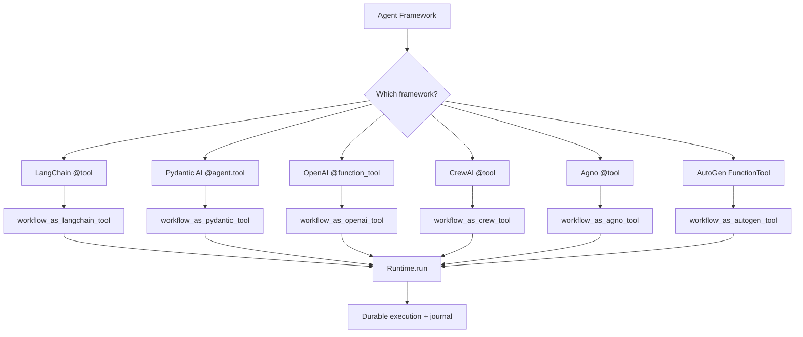

# Phase 10 — Agent Framework Integrations

**Goal:** Working code examples and adapters for integrating LOOM with major agent frameworks: LangGraph, CrewAI, Pydantic AI, OpenAI Agents SDK, Anthropic Claude SDK, Agno, AutoGen, and Mastra. Bi-directional: LOOM workflows as tools inside agents, and agent frameworks as executors inside LOOM.

**Prerequisites:** Phase 1 (core engine), Phase 2 (agent layer — `AgentExecutor` protocol), Phase 3 (toolsets). Phase 9 (MCP server) enables framework-agnostic access.

**System Design References:** Chapters 5 (agent system — `AgentExecutor`, `ModelProvider`), 15 (interface segregation, dependency inversion).

---

## 1. Exit Criteria & Success Metrics

| Metric | Gate | Target |
|--------|------|--------|
| Frameworks with working bi-directional integration | >= 5 | >= 8 |
| Each integration has a runnable example | All | All |
| Each integration has passing tests | All | All |
| AgentExecutor adapters pass conformance suite | All | All |
| Examples work with `pip install workflow-builder[framework]` | >= 5 | All |

**"Done" means:** A user can `pip install workflow-builder[langgraph]` and use a LangGraph agent as an executor inside a LOOM workflow, or expose a LOOM workflow as a tool inside a LangGraph agent. The same pattern works for CrewAI, Pydantic AI, OpenAI Agents SDK, Claude SDK, Agno, and AutoGen. Each has a tested example and an adapter that implements `AgentExecutor`.

---

## 2. HLD — Integration Architecture

```
+------------------------------- Phase 10 Scope --------------------------------+
|                                                                                 |
|  Direction A: Agent Framework as Executor inside LOOM                           |
|  +-----------------------------------------------------------------+           |
|  |  @workflow                                                       |           |
|  |  async def my_flow(ctx):                                         |           |
|  |      result = await ctx.call_agent("research", query)            |           |
|  |                         |                                        |           |
|  |                         v                                        |           |
|  |  AgentExecutor protocol                                          |           |
|  |  +-------------+ +----------+ +----------+ +---------+ +------+ |           |
|  |  | LangGraph   | | CrewAI   | | Pydantic | | OpenAI  | | Agno | |           |
|  |  | Executor    | | Executor | | AI Exec  | | Agents  | | Exec | |           |
|  |  +-------------+ +----------+ +----------+ +---------+ +------+ |           |
|  +-----------------------------------------------------------------+           |
|                                                                                 |
|  Direction B: LOOM Workflows as Tools inside Agent Frameworks                   |
|  +-----------------------------------------------------------------+           |
|  |  LangGraph / CrewAI / Pydantic AI / OpenAI SDK / Claude SDK      |           |
|  |    |                                                              |           |
|  |    v                                                              |           |
|  |  @tool / function_tool / BaseTool                                 |           |
|  |  +-----------------------------------------------------------+   |           |
|  |  | LoomTool adapter                                           |   |           |
|  |  | - Wraps Runtime.run() as a callable tool                   |   |           |
|  |  | - Schema derived from workflow input type                  |   |           |
|  |  | - Async execution with status polling                      |   |           |
|  |  +-----------------------------------------------------------+   |           |
|  +-----------------------------------------------------------------+           |
|                                                                                 |
|  Direction C: Via MCP (framework-agnostic, Phase 9)                             |
|  +-----------------------------------------------------------------+           |
|  |  Any MCP-compatible client                                        |           |
|  |  (Claude, Cursor, Claude Code, custom)                            |           |
|  |    → MCP Server → Runtime                                        |           |
|  +-----------------------------------------------------------------+           |
+---------------------------------------------------------------------------------+
```

---

## 3. LLD — Framework Adapters

### 3.1 LangGraph Integration

LangGraph uses `StateGraph` with nodes and edges. LOOM workflows become tools; LangGraph graphs become `AgentExecutor` implementations.

```python
# integrations/langgraph_adapter.py (NEW)

"""LangGraph <-> LOOM bi-directional integration."""

from __future__ import annotations
from typing import Any
from dataclasses import dataclass

from workflow_builder.agents.models import ModelProvider, ModelRequest, ModelResponse
from workflow_builder.agents.tools import Tool

# --- Direction A: LangGraph as AgentExecutor inside LOOM ---

@dataclass
class LangGraphExecutorConfig:
    """Configuration for running a LangGraph graph as a LOOM agent executor."""
    graph: Any  # langgraph.graph.CompiledGraph
    input_key: str = "messages"
    output_key: str = "messages"

class LangGraphExecutor:
    """Wraps a compiled LangGraph graph as an AgentExecutor.

    Implements the AgentExecutor protocol from Phase 2 so a LangGraph
    agent can be called from ctx.call_agent() inside a LOOM workflow.
    """

    def __init__(self, config: LangGraphExecutorConfig):
        self._graph = config.graph
        self._input_key = config.input_key
        self._output_key = config.output_key

    async def execute(
        self,
        input: str,
        tools: list[Tool],
        output_type: type | None = None,
        settings: dict | None = None,
        context: Any = None,
    ) -> Any:
        """Execute the LangGraph agent with LOOM tools as LangChain tools."""
        from langchain_core.tools import StructuredTool

        # Convert LOOM tools to LangChain tools
        lc_tools = [self._to_langchain_tool(t) for t in tools]

        # Inject tools into the graph if it supports it
        config = {"configurable": {"tools": lc_tools}}
        if settings:
            config["configurable"].update(settings)

        # Run the graph
        result = await self._graph.ainvoke(
            {self._input_key: [("user", input)]},
            config=config,
        )

        # Extract output
        output_messages = result.get(self._output_key, [])
        if output_messages:
            last_msg = output_messages[-1]
            return last_msg.content if hasattr(last_msg, "content") else str(last_msg)
        return result

    def _to_langchain_tool(self, loom_tool: Tool) -> Any:
        """Convert a LOOM Tool to a LangChain StructuredTool."""
        from langchain_core.tools import StructuredTool

        async def wrapper(**kwargs):
            return await loom_tool.fn(**kwargs) if loom_tool.takes_context else await loom_tool.fn(**kwargs)

        return StructuredTool.from_function(
            func=wrapper,
            name=loom_tool.name,
            description=loom_tool.description,
            coroutine=wrapper,
        )


# --- Direction B: LOOM Workflow as a LangGraph/LangChain Tool ---

def workflow_as_langchain_tool(runtime, workflow_id: str, description: str = ""):
    """Expose a LOOM workflow as a LangChain tool for use in LangGraph.

    Usage:
        from workflow_builder.integrations.langgraph_adapter import workflow_as_langchain_tool
        tool = workflow_as_langchain_tool(runtime, "lead_outreach", "Run lead outreach workflow")
        agent = create_react_agent(model, tools=[tool])
    """
    from langchain_core.tools import tool as lc_tool

    @lc_tool
    async def run_loom_workflow(input_data: str) -> str:
        f"""Run the LOOM workflow '{workflow_id}'. {description}

        Args:
            input_data: JSON string of input parameters
        """
        import json
        parsed = json.loads(input_data)
        result = await runtime.run(workflow_id, parsed)
        return json.dumps({"run_id": result.run_id, "status": str(result.status),
                          "output": result.output})

    run_loom_workflow.name = f"loom_{workflow_id}"
    return run_loom_workflow
```

**Example: LangGraph agent inside a LOOM workflow**

```python
# examples/integrations/langgraph_in_loom.py

from langgraph.prebuilt import create_react_agent
from langchain_openai import ChatOpenAI
from workflow_builder import workflow, step, Context
from workflow_builder.integrations.langgraph_adapter import LangGraphExecutor, LangGraphExecutorConfig

# 1. Build a LangGraph agent
model = ChatOpenAI(model="gpt-4o-mini")
langgraph_agent = create_react_agent(model, tools=[])

# 2. Register it as a LOOM agent executor
executor = LangGraphExecutor(LangGraphExecutorConfig(graph=langgraph_agent))

@step
async def prepare_research_query(topic: str) -> str:
    return f"Research the latest developments in {topic} and summarize key findings."

@workflow
async def research_with_langgraph(ctx: Context, topic: str) -> dict:
    query = await ctx.step(prepare_research_query, topic)
    # LangGraph agent runs inside the durable workflow
    result = await ctx.call_agent("research", query, executor=executor)
    return {"topic": topic, "findings": result}
```

---

### 3.2 Pydantic AI Integration

Pydantic AI's dependency injection pattern maps cleanly to LOOM's runtime injection.

```python
# integrations/pydantic_ai_adapter.py (NEW)

"""Pydantic AI <-> LOOM bi-directional integration."""

from __future__ import annotations
from typing import Any, TypeVar
from workflow_builder.agents.tools import Tool

T = TypeVar("T")

# --- Direction A: Pydantic AI Agent as AgentExecutor ---

class PydanticAIExecutor:
    """Wraps a pydantic-ai Agent as a LOOM AgentExecutor.

    The LOOM runtime is injected as the Pydantic AI deps, giving tools
    access to ctx.step(), ctx.sleep(), etc.
    """

    def __init__(self, agent: Any):
        """
        Args:
            agent: A pydantic_ai.Agent instance
        """
        self._agent = agent

    async def execute(
        self,
        input: str,
        tools: list[Tool],
        output_type: type | None = None,
        settings: dict | None = None,
        context: Any = None,
    ) -> Any:
        """Run the Pydantic AI agent, passing LOOM context as deps."""
        # Register LOOM tools as Pydantic AI tools dynamically
        for loom_tool in tools:
            self._register_tool(loom_tool)

        # Run with LOOM context as deps
        result = await self._agent.run(input, deps=context)
        return result.data

    def _register_tool(self, loom_tool: Tool):
        """Register a LOOM tool as a Pydantic AI tool."""
        from pydantic_ai import RunContext

        async def wrapped_tool(ctx: RunContext, **kwargs):
            return await loom_tool.fn(**kwargs)

        # Dynamically register if not already present
        if loom_tool.name not in [t.name for t in self._agent._tools]:
            self._agent.tool(wrapped_tool, name=loom_tool.name)


# --- Direction B: LOOM Workflow as a Pydantic AI Tool ---

def workflow_as_pydantic_tool(runtime, workflow_id: str):
    """Create a Pydantic AI tool that runs a LOOM workflow.

    Usage:
        from pydantic_ai import Agent
        from workflow_builder.integrations.pydantic_ai_adapter import workflow_as_pydantic_tool

        agent = Agent('openai:gpt-4o', deps_type=WorkflowRuntime)

        @agent.tool
        async def run_outreach(ctx: RunContext[WorkflowRuntime], input_data: dict) -> dict:
            result = await ctx.deps.run("lead_outreach", input_data)
            return result.output
    """
    async def run_workflow(input_data: dict) -> dict:
        result = await runtime.run(workflow_id, input_data)
        return {"run_id": result.run_id, "status": str(result.status), "output": result.output}
    run_workflow.__name__ = f"loom_{workflow_id}"
    run_workflow.__doc__ = f"Run the LOOM workflow '{workflow_id}'"
    return run_workflow
```

**Example:**

```python
# examples/integrations/pydantic_ai_in_loom.py

from pydantic_ai import Agent
from pydantic import BaseModel
from workflow_builder import workflow, step, Context
from workflow_builder.integrations.pydantic_ai_adapter import PydanticAIExecutor

class AnalysisResult(BaseModel):
    summary: str
    sentiment: str
    key_points: list[str]

# Pydantic AI agent with typed output
analyzer = Agent(
    "openai:gpt-4o-mini",
    result_type=AnalysisResult,
    system_prompt="Analyze the given text and provide structured output.",
)

executor = PydanticAIExecutor(analyzer)

@step
async def fetch_document(url: str) -> str:
    import httpx
    async with httpx.AsyncClient() as client:
        return (await client.get(url)).text

@workflow
async def analyze_document(ctx: Context, url: str) -> dict:
    text = await ctx.step(fetch_document, url)
    # Pydantic AI agent runs inside durable workflow, returns typed AnalysisResult
    result = await ctx.call_agent("analyzer", text, executor=executor)
    return result.model_dump() if hasattr(result, "model_dump") else result
```

---

### 3.3 OpenAI Agents SDK Integration

```python
# integrations/openai_agents_adapter.py (NEW)

"""OpenAI Agents SDK <-> LOOM bi-directional integration."""

from __future__ import annotations
from typing import Any
from workflow_builder.agents.tools import Tool

class OpenAIAgentsExecutor:
    """Wraps an OpenAI Agent (from openai-agents SDK) as a LOOM AgentExecutor."""

    def __init__(self, agent: Any):
        """
        Args:
            agent: An agents.Agent instance from the openai-agents package
        """
        self._agent = agent

    async def execute(
        self,
        input: str,
        tools: list[Tool],
        output_type: type | None = None,
        settings: dict | None = None,
        context: Any = None,
    ) -> Any:
        from agents import Runner, function_tool

        # Convert LOOM tools to OpenAI function_tools
        oai_tools = [self._to_function_tool(t) for t in tools]

        # Clone agent with additional tools
        agent_with_tools = self._agent.clone(tools=self._agent.tools + oai_tools)

        # Run the agent
        result = await Runner.run(agent_with_tools, input)
        return result.final_output

    def _to_function_tool(self, loom_tool: Tool) -> Any:
        from agents import function_tool

        @function_tool(name=loom_tool.name, description=loom_tool.description)
        async def wrapper(**kwargs):
            return await loom_tool.fn(**kwargs)
        return wrapper


# --- Direction B: LOOM Workflow as an OpenAI Agents tool ---

def workflow_as_openai_tool(runtime, workflow_id: str, description: str = ""):
    """Expose a LOOM workflow as an OpenAI Agents SDK function_tool."""
    from agents import function_tool

    @function_tool(
        name=f"loom_{workflow_id}",
        description=description or f"Run the LOOM workflow '{workflow_id}'",
    )
    async def run_loom_workflow(input_data: str) -> str:
        import json
        parsed = json.loads(input_data)
        result = await runtime.run(workflow_id, parsed)
        return json.dumps({"run_id": result.run_id, "status": str(result.status),
                          "output": result.output})

    return run_loom_workflow
```

---

### 3.4 Anthropic Claude SDK Integration

The Claude SDK uses the Messages API with tool_use. The integration wraps the tool-call loop as an `AgentExecutor`.

```python
# integrations/claude_adapter.py (NEW)

"""Anthropic Claude SDK <-> LOOM integration."""

from __future__ import annotations
from typing import Any
import json
from workflow_builder.agents.tools import Tool

class ClaudeExecutor:
    """Wraps the Anthropic Messages API as a LOOM AgentExecutor.

    Implements the tool-call loop: send message → handle tool_use →
    execute tool → append result → repeat until end_turn.
    """

    def __init__(self, model: str = "claude-sonnet-4-20250514",
                 api_key: str | None = None, max_turns: int = 10):
        self._model = model
        self._api_key = api_key
        self._max_turns = max_turns

    async def execute(
        self,
        input: str,
        tools: list[Tool],
        output_type: type | None = None,
        settings: dict | None = None,
        context: Any = None,
    ) -> Any:
        import anthropic

        client = anthropic.AsyncAnthropic(api_key=self._api_key)

        # Convert LOOM tools to Claude tool schemas
        claude_tools = [self._to_claude_tool(t) for t in tools]
        tool_map = {t.name: t for t in tools}

        messages = [{"role": "user", "content": input}]
        system = settings.get("system_prompt", "") if settings else ""

        for _ in range(self._max_turns):
            response = await client.messages.create(
                model=self._model,
                max_tokens=4096,
                system=system,
                messages=messages,
                tools=claude_tools,
            )

            if response.stop_reason == "end_turn":
                # Extract text from final response
                for block in response.content:
                    if hasattr(block, "text"):
                        return block.text
                return ""

            # Handle tool calls
            messages.append({"role": "assistant", "content": response.content})
            tool_results = []
            for block in response.content:
                if block.type == "tool_use":
                    tool = tool_map.get(block.name)
                    if tool:
                        result = await tool.fn(**block.input)
                        tool_results.append({
                            "type": "tool_result",
                            "tool_use_id": block.id,
                            "content": json.dumps(result) if not isinstance(result, str) else result,
                        })
            messages.append({"role": "user", "content": tool_results})

        return "Max turns reached"

    def _to_claude_tool(self, loom_tool: Tool) -> dict:
        return {
            "name": loom_tool.name,
            "description": loom_tool.description,
            "input_schema": loom_tool.parameters or {"type": "object", "properties": {}},
        }


# --- Direction B: LOOM as Claude tool ---

def workflow_as_claude_tool(runtime, workflow_id: str, description: str = "") -> dict:
    """Return a Claude tool definition that runs a LOOM workflow.

    Usage: Add to the tools list in client.messages.create()
    """
    return {
        "name": f"loom_{workflow_id}",
        "description": description or f"Run the LOOM workflow '{workflow_id}'",
        "input_schema": {
            "type": "object",
            "properties": {
                "input_data": {
                    "type": "object",
                    "description": "Input parameters for the workflow",
                },
            },
            "required": ["input_data"],
        },
    }
```

---

### 3.5 CrewAI Integration

```python
# integrations/crewai_adapter.py (NEW)

"""CrewAI <-> LOOM bi-directional integration."""

from __future__ import annotations
from typing import Any
from workflow_builder.agents.tools import Tool

class CrewAIExecutor:
    """Wraps a CrewAI Crew as a LOOM AgentExecutor.

    The Crew (multiple agents with tasks) runs as a single LOOM agent step.
    """

    def __init__(self, crew: Any):
        self._crew = crew

    async def execute(
        self,
        input: str,
        tools: list[Tool],
        output_type: type | None = None,
        settings: dict | None = None,
        context: Any = None,
    ) -> Any:
        from crewai.tools import BaseTool as CrewTool

        # Convert LOOM tools to CrewAI tools
        crew_tools = [self._to_crew_tool(t) for t in tools]

        # Add tools to crew agents
        for agent in self._crew.agents:
            agent.tools.extend(crew_tools)

        # Kickoff with input
        result = await self._crew.kickoff_async(inputs={"input": input})
        return result.raw

    def _to_crew_tool(self, loom_tool: Tool) -> Any:
        from crewai import tool as crew_tool

        @crew_tool(loom_tool.name)
        async def wrapper(**kwargs) -> str:
            result = await loom_tool.fn(**kwargs)
            return str(result)
        wrapper.__doc__ = loom_tool.description
        return wrapper


# --- Direction B: LOOM as CrewAI tool ---

def workflow_as_crew_tool(runtime, workflow_id: str, description: str = ""):
    """Expose a LOOM workflow as a CrewAI tool."""
    from crewai import tool

    @tool(f"loom_{workflow_id}")
    async def run_loom_workflow(input_data: str) -> str:
        f"""Run the LOOM workflow '{workflow_id}'. {description}"""
        import json
        parsed = json.loads(input_data)
        result = await runtime.run(workflow_id, parsed)
        return json.dumps({"run_id": result.run_id, "output": result.output})

    return run_loom_workflow
```

---

### 3.6 Agno (formerly Phidata) Integration

```python
# integrations/agno_adapter.py (NEW)

"""Agno <-> LOOM bi-directional integration."""

from __future__ import annotations
from typing import Any
from workflow_builder.agents.tools import Tool

class AgnoExecutor:
    """Wraps an Agno Agent as a LOOM AgentExecutor."""

    def __init__(self, agent: Any):
        self._agent = agent

    async def execute(
        self,
        input: str,
        tools: list[Tool],
        output_type: type | None = None,
        settings: dict | None = None,
        context: Any = None,
    ) -> Any:
        # Register LOOM tools with Agno agent
        for loom_tool in tools:
            self._agent.tools.append(self._to_agno_tool(loom_tool))

        response = await self._agent.arun(input)
        return response.content if hasattr(response, "content") else str(response)

    def _to_agno_tool(self, loom_tool: Tool) -> Any:
        from agno.tools import tool

        @tool
        async def wrapper(**kwargs):
            return await loom_tool.fn(**kwargs)
        wrapper.__name__ = loom_tool.name
        wrapper.__doc__ = loom_tool.description
        return wrapper


def workflow_as_agno_tool(runtime, workflow_id: str):
    """Expose a LOOM workflow as an Agno tool."""
    from agno.tools import tool

    @tool
    async def run_workflow(input_data: dict) -> dict:
        f"""Run the LOOM workflow '{workflow_id}'."""
        result = await runtime.run(workflow_id, input_data)
        return {"run_id": result.run_id, "output": result.output}

    run_workflow.__name__ = f"loom_{workflow_id}"
    return run_workflow
```

---

### 3.7 AutoGen Integration

```python
# integrations/autogen_adapter.py (NEW)

"""AutoGen (AG2) <-> LOOM bi-directional integration."""

from __future__ import annotations
from typing import Any
from workflow_builder.agents.tools import Tool

class AutoGenExecutor:
    """Wraps an AutoGen team/agent as a LOOM AgentExecutor."""

    def __init__(self, team: Any):
        """
        Args:
            team: An autogen_agentchat team (RoundRobinGroupChat, SelectorGroupChat)
                  or a single AssistantAgent
        """
        self._team = team

    async def execute(
        self,
        input: str,
        tools: list[Tool],
        output_type: type | None = None,
        settings: dict | None = None,
        context: Any = None,
    ) -> Any:
        from autogen_core.tools import FunctionTool

        # Convert LOOM tools to AutoGen FunctionTools
        ag_tools = [
            FunctionTool(t.fn, description=t.description, name=t.name)
            for t in tools
        ]

        # Run the team/agent
        result = await self._team.run(task=input)

        # Extract final message
        if hasattr(result, "messages") and result.messages:
            return result.messages[-1].content
        return str(result)


def workflow_as_autogen_tool(runtime, workflow_id: str):
    """Expose a LOOM workflow as an AutoGen FunctionTool."""
    from autogen_core.tools import FunctionTool

    async def run_workflow(input_data: str) -> str:
        import json
        parsed = json.loads(input_data)
        result = await runtime.run(workflow_id, parsed)
        return json.dumps({"run_id": result.run_id, "output": result.output})

    return FunctionTool(
        run_workflow,
        description=f"Run the LOOM workflow '{workflow_id}'",
        name=f"loom_{workflow_id}",
    )
```

---

### 3.8 Generic ReAct Loop

A framework-free ReAct agent that uses LOOM tools directly. Useful as a reference implementation and for users who don't want a framework dependency.

```python
# integrations/react_adapter.py (NEW)

"""Generic ReAct agent loop using LOOM tools directly."""

from __future__ import annotations
from typing import Any
import json
from workflow_builder.agents.tools import Tool
from workflow_builder.agents.models import ModelProvider, ModelRequest, ToolSchema

class ReactExecutor:
    """A minimal ReAct agent executor using any ModelProvider.

    Implements: Thought → Action (tool call) → Observation → repeat.
    No framework dependency — uses the LOOM ModelProvider directly.
    """

    def __init__(self, provider: ModelProvider, max_steps: int = 10):
        self._provider = provider
        self._max_steps = max_steps

    async def execute(
        self,
        input: str,
        tools: list[Tool],
        output_type: type | None = None,
        settings: dict | None = None,
        context: Any = None,
    ) -> Any:
        from workflow_builder.agents.messages import Message

        tool_schemas = [
            ToolSchema(name=t.name, description=t.description, parameters=t.parameters)
            for t in tools
        ]
        tool_map = {t.name: t for t in tools}

        messages = [Message(role="user", content=input)]
        system = settings.get("system_prompt", "") if settings else ""

        for _ in range(self._max_steps):
            request = ModelRequest(
                messages=messages,
                tools=tool_schemas,
                system=system,
            )
            response = await self._provider.complete(request)

            if not response.tool_calls:
                return response.content

            # Append assistant message
            messages.append(Message(role="assistant", content=response.content,
                                   tool_calls=response.tool_calls))

            # Execute tool calls
            for tc in response.tool_calls:
                tool = tool_map.get(tc.name)
                if tool:
                    result = await tool.fn(**tc.arguments)
                    messages.append(Message(
                        role="tool",
                        content=json.dumps(result) if not isinstance(result, str) else result,
                        tool_call_id=tc.id,
                    ))

        return "Max steps reached without final answer."
```

---

### 3.9 Mastra Integration (TypeScript reference)

Mastra is TypeScript-only. Provide a reference document showing how to integrate via the MCP server (Phase 9) or HTTP API.

```python
# integrations/mastra_adapter.py (NEW)

"""
Mastra is a TypeScript agent framework (npm package).
Direct Python adapter is not applicable.

Integration paths:
1. MCP Server (Phase 9): Mastra agents connect to LOOM via MCP stdio/SSE
2. HTTP API: Call LOOM's webhook triggers from Mastra workflows
3. SDK wrapping: Use LOOM's REST API (if deployed) from TypeScript

See examples/integrations/mastra_via_mcp.md for setup instructions.
"""

# This file exists as documentation-only — no Python adapter needed.
# The MCP server (Phase 9) provides framework-agnostic access.
```

---

### 3.10 Adapter Conformance Suite

All `AgentExecutor` adapters must pass a conformance suite.

```python
# integrations/conformance.py (NEW)

"""Conformance suite for AgentExecutor adapters."""

from __future__ import annotations
import pytest
from typing import Any
from workflow_builder.agents.tools import Tool

class ExecutorConformanceSuite:
    """Base class for testing AgentExecutor implementations.

    Subclass this and set `executor_factory` to test your adapter.
    """

    executor_factory = None  # Override in subclass

    @pytest.fixture
    def executor(self):
        return self.executor_factory()

    @pytest.fixture
    def sample_tools(self) -> list[Tool]:
        async def add(a: int, b: int) -> int:
            """Add two numbers."""
            return a + b

        async def greet(name: str) -> str:
            """Greet someone."""
            return f"Hello, {name}!"

        return [
            Tool(fn=add, name="add", description="Add two numbers",
                 parameters={"type": "object", "properties": {
                     "a": {"type": "integer"}, "b": {"type": "integer"}
                 }}),
            Tool(fn=greet, name="greet", description="Greet someone",
                 parameters={"type": "object", "properties": {
                     "name": {"type": "string"}
                 }}),
        ]

    async def test_execute_returns_string(self, executor, sample_tools):
        """Executor must return a string or serializable result."""
        result = await executor.execute("Say hello to Alice", sample_tools)
        assert result is not None
        assert isinstance(result, (str, dict, list))

    async def test_execute_with_tools(self, executor, sample_tools):
        """Executor must be able to call provided tools."""
        result = await executor.execute("Add 2 and 3", sample_tools)
        assert result is not None

    async def test_execute_empty_tools(self, executor):
        """Executor must work with no tools (pure conversation)."""
        result = await executor.execute("What is 2+2?", tools=[])
        assert result is not None

    async def test_execute_with_output_type(self, executor, sample_tools):
        """Executor should respect output_type hint if supported."""
        result = await executor.execute(
            "Add 5 and 7", sample_tools, output_type=dict
        )
        assert result is not None

    async def test_execute_respects_settings(self, executor, sample_tools):
        """Executor should forward settings (system_prompt, temperature, etc.)."""
        result = await executor.execute(
            "Hello", sample_tools,
            settings={"system_prompt": "You are a helpful assistant. Be brief."}
        )
        assert result is not None
```

---

## 4. Directory Structure

```
src/workflow_builder/
├── integrations/                    # NEW: Phase 10
│   ├── __init__.py                  # Re-exports adapter factories
│   ├── langgraph_adapter.py         # LangGraph <-> LOOM
│   ├── pydantic_ai_adapter.py       # Pydantic AI <-> LOOM
│   ├── openai_agents_adapter.py     # OpenAI Agents SDK <-> LOOM
│   ├── claude_adapter.py            # Anthropic Claude SDK <-> LOOM
│   ├── crewai_adapter.py            # CrewAI <-> LOOM
│   ├── agno_adapter.py              # Agno <-> LOOM
│   ├── autogen_adapter.py           # AutoGen (AG2) <-> LOOM
│   ├── react_adapter.py             # Generic ReAct loop (no framework)
│   ├── mastra_adapter.py            # Mastra (TypeScript reference)
│   └── conformance.py               # Adapter conformance test suite
examples/
├── integrations/
│   ├── langgraph_in_loom.py         # LangGraph agent inside LOOM workflow
│   ├── loom_in_langgraph.py         # LOOM workflow as LangGraph tool
│   ├── pydantic_ai_in_loom.py       # Pydantic AI agent inside LOOM
│   ├── loom_in_pydantic_ai.py       # LOOM as Pydantic AI tool
│   ├── openai_agents_in_loom.py     # OpenAI agent inside LOOM
│   ├── loom_in_openai_agents.py     # LOOM as OpenAI Agents tool
│   ├── claude_in_loom.py            # Claude agent inside LOOM
│   ├── crewai_in_loom.py            # CrewAI Crew inside LOOM
│   ├── agno_in_loom.py              # Agno agent inside LOOM
│   ├── autogen_in_loom.py           # AutoGen team inside LOOM
│   ├── react_in_loom.py             # Generic ReAct inside LOOM
│   └── mastra_via_mcp.md            # TypeScript MCP integration guide
tests/
├── unit/
│   ├── test_langgraph_adapter.py
│   ├── test_pydantic_ai_adapter.py
│   ├── test_openai_agents_adapter.py
│   ├── test_claude_adapter.py
│   ├── test_crewai_adapter.py
│   ├── test_agno_adapter.py
│   ├── test_autogen_adapter.py
│   └── test_react_adapter.py
├── integration/
│   ├── test_langgraph_conformance.py
│   ├── test_pydantic_ai_conformance.py
│   ├── test_openai_agents_conformance.py
│   ├── test_claude_conformance.py
│   ├── test_crewai_conformance.py
│   ├── test_agno_conformance.py
│   └── test_autogen_conformance.py
├── e2e/
│   └── test_multi_framework_workflow.py  # Workflow using multiple frameworks
```

---

## 5. Files Requiring Changes

| File | Change Type | What Changes |
|------|-------------|--------------|
| `integrations/` (entire directory) | NEW | All adapter and conformance code |
| `examples/integrations/` | NEW | All example files |
| `pyproject.toml` | MODIFY | Add optional deps: `[langgraph]`, `[crewai]`, `[pydantic-ai]`, `[openai-agents]`, `[agno]`, `[autogen]`, `[all-frameworks]` |
| `agents/executor.py` (Phase 2) | VERIFY | Ensure `AgentExecutor` protocol matches all adapters |
| `__init__.py` | NO CHANGE | Integrations are not part of core public API |

---

## 6. Implementation Steps

| Step | Task | Depends On |
|------|------|------------|
| 10.1 | Define `AgentExecutor` conformance suite | Phase 2 protocol |
| 10.2 | Implement `LangGraphExecutor` + `workflow_as_langchain_tool` | 10.1 |
| 10.3 | Implement `PydanticAIExecutor` + `workflow_as_pydantic_tool` | 10.1 |
| 10.4 | Implement `OpenAIAgentsExecutor` + `workflow_as_openai_tool` | 10.1 |
| 10.5 | Implement `ClaudeExecutor` + `workflow_as_claude_tool` | 10.1 |
| 10.6 | Implement `CrewAIExecutor` + `workflow_as_crew_tool` | 10.1 |
| 10.7 | Implement `AgnoExecutor` + `workflow_as_agno_tool` | 10.1 |
| 10.8 | Implement `AutoGenExecutor` + `workflow_as_autogen_tool` | 10.1 |
| 10.9 | Implement `ReactExecutor` (no framework dependency) | 10.1 |
| 10.10 | Write examples for all 8 frameworks (both directions) | 10.2-10.9 |
| 10.11 | Run conformance suite against all adapters | 10.2-10.9 |
| 10.12 | Write E2E test: workflow using multiple frameworks | 10.2-10.9 |
| 10.13 | Create Mastra MCP integration guide | Phase 9 |
| 10.14 | Update pyproject.toml with optional deps groups | 10.2-10.9 |

---

## 7. Data Flow Diagrams

### 7.1 Direction A: Framework as Executor

```mermaid
flowchart TD
    A[@workflow function] --> B[ctx.call_agent]
    B --> C[AgentExecutor protocol]
    C --> D{Which adapter?}
    D --> E[LangGraphExecutor]
    D --> F[PydanticAIExecutor]
    D --> G[CrewAIExecutor]
    D --> H[ClaudeExecutor]
    D --> I[ReactExecutor]
    E --> J[LangGraph compiled graph]
    F --> K[Pydantic AI Agent.run]
    G --> L[CrewAI Crew.kickoff]
    H --> M[Anthropic Messages API]
    I --> N[ModelProvider.complete loop]
    J --> O[Result journaled by LOOM]
    K --> O
    L --> O
    M --> O
    N --> O
```

### 7.2 Direction B: LOOM as Tool



---

## 8. Multi-Angle Review

### Correctness
- All adapters implement the same `AgentExecutor` protocol — conformance suite enforces this.
- LOOM tool wrappers serialize results to JSON — all frameworks expect string or dict returns.
- Tool name collisions: prefixed with `loom_` to avoid conflicts with framework-native tools.

### Security
- API keys for model providers are passed through framework configuration, not through LOOM.
- No credentials stored in adapter code.
- Tool execution goes through LOOM's journal — all calls are auditable.

### Performance
- Adapter overhead is minimal: one function call to translate between interfaces.
- Framework initialization (model loading, graph compilation) happens once per executor instance.
- No serialization overhead beyond what each framework already does.

### Edge Cases
- Framework not installed: Import errors caught at adapter import time with helpful message.
- Framework API changes: Pin minimum versions in optional deps; conformance suite catches breaks.
- Mixed framework workflow: One workflow can use different executors for different agent steps.
- Async/sync mismatch: All adapters are async; sync frameworks wrapped with `asyncio.to_thread`.

### Maintainability
- One file per framework — no coupling between adapters.
- Conformance suite means adding a new framework = one adapter file + one conformance test.
- Factory function pattern: `workflow_as_X_tool(runtime, workflow_id)` is consistent across all.

### Testing
- Unit tests mock the framework's agent — test adapter logic only.
- Conformance tests verify protocol compliance — same tests for all adapters.
- E2E test shows multi-framework workflow working end-to-end.

### User Perspective
- Users install only what they need: `pip install workflow-builder[langgraph]`.
- Each example is self-contained and runnable.
- Bi-directional means users aren't locked in: start with CrewAI, migrate to LangGraph later.

---

## 9. Test Plan

### Unit Tests (8 — one per adapter)
| Test | What |
|------|------|
| `test_langgraph_executor_init` | LangGraphExecutor wraps a compiled graph |
| `test_pydantic_ai_executor_init` | PydanticAIExecutor wraps a pydantic-ai Agent |
| `test_openai_agents_executor_init` | OpenAIAgentsExecutor wraps an openai-agents Agent |
| `test_claude_executor_init` | ClaudeExecutor initializes with model name |
| `test_crewai_executor_init` | CrewAIExecutor wraps a CrewAI Crew |
| `test_agno_executor_init` | AgnoExecutor wraps an Agno Agent |
| `test_autogen_executor_init` | AutoGenExecutor wraps an AutoGen team |
| `test_react_executor_init` | ReactExecutor wraps a ModelProvider |

### Conformance Tests (7 — one per adapter, 5 checks each = 35 test cases)
Each adapter runs the full `ExecutorConformanceSuite`:
- `test_execute_returns_string`
- `test_execute_with_tools`
- `test_execute_empty_tools`
- `test_execute_with_output_type`
- `test_execute_respects_settings`

### E2E Tests (3)
| Test | What |
|------|------|
| `test_langgraph_in_loom_workflow` | LangGraph agent executes inside a durable LOOM workflow |
| `test_loom_as_langchain_tool` | LOOM workflow runs as a tool inside a LangGraph agent |
| `test_multi_framework_workflow` | Workflow uses 3 different agent frameworks for different steps |

---

## 10. Known Gaps & Mitigations

| Gap | Risk | Mitigation |
|-----|------|------------|
| Framework APIs change frequently | Adapters break on updates | Pin version ranges; conformance suite catches breaks in CI |
| Some frameworks are sync-only | Async adapter wrapping adds complexity | Use `asyncio.to_thread()` for sync frameworks |
| Tool schema translation is lossy | Complex schemas may not map 1:1 | Start with simple schemas; add schema negotiation later |
| Mastra is TypeScript-only | No Python adapter possible | Document MCP integration path (Phase 9) |
| "Deep Agents" not a real framework | Placeholder in user's request | Covered by generic ReAct adapter |
| No testing against real LLMs in CI | Can't verify actual agent behavior | Mock model responses; real LLM tests are opt-in with `@pytest.mark.live` |
| Agent framework versions may conflict | `crewai` and `langgraph` may pin incompatible deps | Each framework is a separate optional dep group; user installs only what they need |
