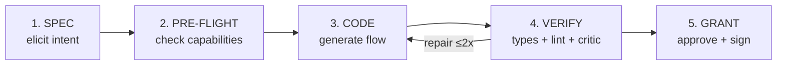
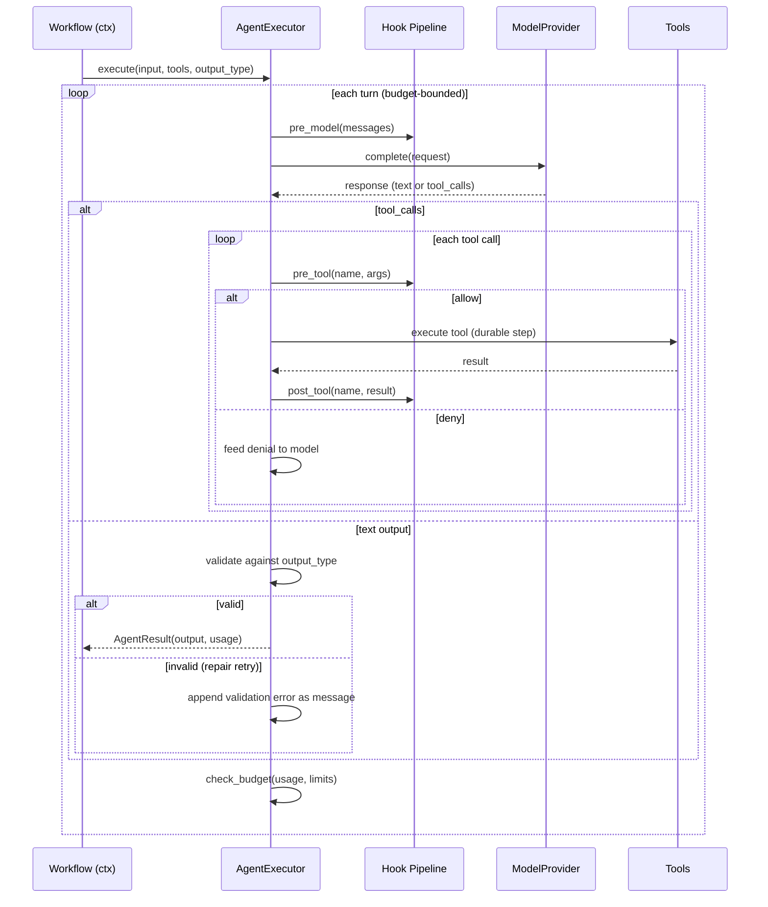
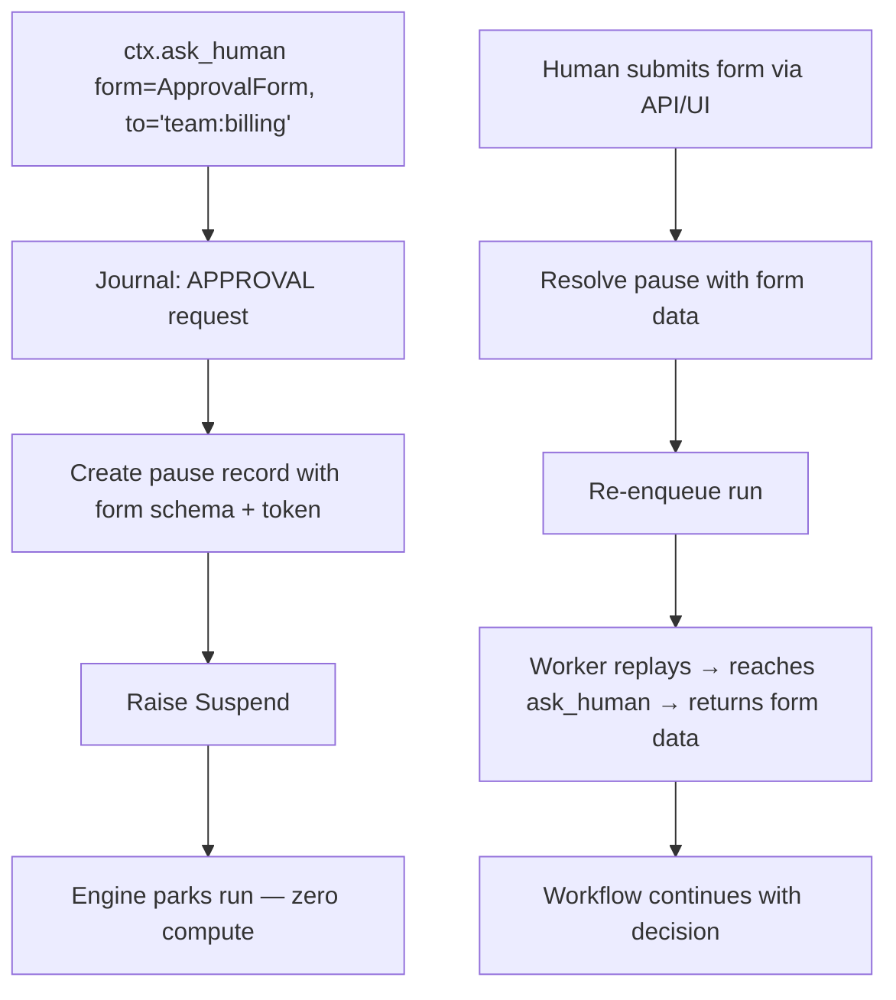

# Phase 2 — Agent Layer

**Goal:** Agents with three persistence classes, tool dispatch, hooks, budgets, structured output, HITL, and a basic Workflow Coding Agent.

**Prerequisites:** Phase 1 complete — `@pure`/`@effect`, `DurabilityBackend`, journal with hashes, replay engine, `ctx.state`/`ctx.store`.

**System Design References:** Chapters 5, 8.6 (mock system), 9 (agent_session/authoring_session tables), 11.3 (agent errors), 12.6 (L2d agent step with hooks).

---

## 1. Exit Criteria & Success Metrics

| Metric | Gate | Target |
|--------|------|--------|
| First-pass compile rate (coding agent) | >= 80% | >= 95% |
| First-pass behavioral pass | >= 60% | >= 85% |
| Authoring context cost (median tokens) | <= 25k | <= 12k |
| Agent turns execute within budget | 100% | 100% |
| Mock run system covers all step types | All | All |

**"Done" means:** A user can define an `Agent("my-agent")` step, call it within a `@flow`, have the agent use tools backed by `@effect` steps, get structured output validated against a Pydantic model, suspend for human approval via `ctx.ask_human`, and test the whole thing with `loom_test` mock runs.

---

## 2. HLD — Agent Layer Architecture

```
┌────────────────────────── Phase 2 Scope ──────────────────────────┐
│                                                                    │
│  Workflow Code                                                     │
│  ┌──────────────────────────────────────────────────────────────┐  │
│  │  triage = Agent("support-triage")                            │  │
│  │  result = await triage(ticket)           # ephemeral         │  │
│  │  convo = triage.session(key="t:42")      # session           │  │
│  │  answer = await convo.ask("Summarize")   # multi-turn        │  │
│  │  decision = await ctx.ask_human(form=ApprovalForm)           │  │
│  └──────────────────────────────────────────────────────────────┘  │
│                       │                                            │
│                       ▼                                            │
│  ┌──────────────────────────────────────────┐                     │
│  │          Agent Registry                   │                     │
│  │  AgentDefinition(id, model, prompt, ...)  │                     │
│  └────────────────────┬─────────────────────┘                     │
│                       │                                            │
│                       ▼                                            │
│  ┌──────────────────────────────────────────┐                     │
│  │       AgentExecutor (protocol)            │                     │
│  │  ┌───────────────┐ ┌──────────────────┐  │                     │
│  │  │ BuiltInRuntime │ │ LangGraphExecutor│  │                     │
│  │  │  └─ModelProvider│ │ AgnoExecutor     │  │                     │
│  │  └───────────────┘ └──────────────────┘  │                     │
│  └────────────────────┬─────────────────────┘                     │
│                       │                                            │
│           ┌───────────┼───────────┐                                │
│           ▼           ▼           ▼                                │
│  ┌──────────┐  ┌──────────┐  ┌──────────┐                        │
│  │   Tools   │  │  Hooks   │  │  Budget  │                        │
│  │@effect    │  │pre/post  │  │turns/tok │                        │
│  │as tool    │  │model/tool│  │cost/time │                        │
│  └──────────┘  └──────────┘  └──────────┘                        │
│                                                                    │
│  ┌──────────────────────────────────────────┐                     │
│  │       Mock Run System (loom_test)         │                     │
│  │  mock_agent / mock_effect / mock_op       │                     │
│  └──────────────────────────────────────────┘                     │
└────────────────────────────────────────────────────────────────────┘
```

### Two-Level Stack

```
Workflow Engine (Phase 1)
    │
    └─▶ AgentExecutor (protocol)        ← plug in any framework
            │
            ├─▶ BuiltInAgentRuntime     ← ships with SDK (default)
            │       └─▶ ModelProvider   ← plug in any LLM vendor
            │
            ├─▶ LangGraphExecutor       ← user adapter
            ├─▶ AgnoExecutor            ← user adapter
            └─▶ CustomExecutor          ← user adapter
```

The workflow engine journals `AgentResult` — it never reaches inside the executor. Session state, turn loops, and memory management are the framework's concern.

---

## 3. LLD — Subsystem Details

### 3.1 AgentExecutor Protocol

```python
# agents/executor.py (NEW)

from typing import Protocol, Any, runtime_checkable
from pydantic import BaseModel

@runtime_checkable
class AgentExecutor(Protocol):
    """Plug in any agent framework: LangGraph, Agno, Pydantic AI, or custom."""
    agent_id: str

    async def execute(
        self,
        input: Any,
        *,
        tools: list[Tool] | None = None,
        output_type: type[BaseModel] | None = None,
        settings: AgentSettings | None = None,
        context: AgentContext | None = None,
    ) -> AgentResult: ...

class AgentSettings(BaseModel):
    max_turns: int | None = None
    max_tokens: int | None = None
    max_cost_usd: float | None = None
    timeout: Duration | None = None
    temperature: float | None = None
    extra: dict[str, Any] = {}

class AgentContext(BaseModel):
    run_id: str
    session_id: str | None = None
    session_history: list[Message] | None = None
    principal: str | None = None
    workflow_ctx: Any | None = None  # for tool calls back to durable context
```

### 3.2 AgentDefinition Registry

```python
# agents/definition.py (NEW)

class AgentDefinition(BaseModel):
    id: str
    description: str = ""
    model: str | None = None
    provider: ModelProvider | None = None
    system_prompt: str = ""
    output_type: type[BaseModel] | None = None
    tools: list[str] = []               # tool grant references
    budget: AgentLimits = AgentLimits()
    persistence: str = "ephemeral"      # "ephemeral" | "session" | "persistent"
    executor: AgentExecutor | None = None  # external framework
    temperature: float | None = None
    extra: dict[str, Any] = {}

class AgentRegistry:
    """In-memory registry of agent definitions."""
    _agents: dict[str, AgentDefinition] = {}

    def register(self, defn: AgentDefinition) -> None: ...
    def get(self, agent_id: str) -> AgentDefinition: ...
    def list(self) -> list[AgentDefinition]: ...

# Global registry instance
_registry = AgentRegistry()

def register_agent(defn: AgentDefinition) -> None:
    _registry.register(defn)
```

### 3.3 BuiltInAgentRuntime

The default `AgentExecutor` implementation that ships with the SDK:

```python
# agents/runtime.py (NEW)

class BuiltInAgentRuntime:
    """Default agent executor: turn loop + tool dispatch + structured output."""

    def __init__(self, provider: ModelProvider, hooks: list[Hook] | None = None):
        self.agent_id: str = ""
        self._provider = provider
        self._hooks = hooks or []

    async def execute(self, input, *, tools=None, output_type=None,
                      settings=None, context=None) -> AgentResult:
        messages = self._build_messages(input, context)
        usage = Usage()
        tool_schemas = [t.to_schema() for t in (tools or [])]

        for turn in range(settings.max_turns or 50):
            # 1. Pre-model hook
            for hook in self._hooks:
                messages = await hook.pre_model(messages)

            # 2. Model call
            response = await self._provider.complete(ModelRequest(
                messages=messages,
                tools=tool_schemas,
                output_schema=output_type.model_json_schema() if output_type else None,
                settings=ModelSettings(temperature=settings.temperature),
            ))
            usage += response.usage
            self._check_budget(usage, settings)

            # 3. Post-model hook
            for hook in self._hooks:
                response = await hook.post_model(response)

            # 4. Handle tool calls
            if response.message.tool_calls:
                for tc in response.message.tool_calls:
                    # Pre-tool hook
                    for hook in self._hooks:
                        decision = await hook.pre_tool(tc.name, tc.args)
                        if decision == "deny":
                            # Feed denial back to model
                            messages.append(tool_error(tc, "PolicyDenied"))
                            continue

                    # Execute tool as durable step
                    tool = self._find_tool(tc.name, tools)
                    result = await tool.fn(**tc.args)

                    # Post-tool hook
                    for hook in self._hooks:
                        result = await hook.post_tool(tc.name, result)

                    messages.append(tool_result(tc, result))
                continue

            # 5. Validate structured output
            if output_type:
                try:
                    parsed = output_type.model_validate_json(response.message.content)
                    return AgentResult(output=parsed, usage=usage, messages=messages)
                except ValidationError as e:
                    messages.append(validation_feedback(e))
                    continue  # repair retry

            # 6. Text output
            return AgentResult(output=response.message.content, usage=usage, messages=messages)

        raise MaxTurnsExceeded(f"Agent {self.agent_id} exceeded {settings.max_turns} turns")
```

### 3.4 Three Persistence Classes

| Class | Storage | Session Key | Replay Behavior |
|-------|---------|-------------|-----------------|
| **Ephemeral** | Nothing between calls | N/A | Memoized per call (whole result) |
| **Session** | Message history | `agent_id + session_key` | Memoized per `(session_id, turn_index)` |
| **Persistent** | Long-term memory | `agent_id + principal` | Memoized per turn; memory reads recorded |

```python
# The Agent callable in workflow code

class Agent:
    def __init__(self, agent_id: str, output: type[BaseModel] | None = None, **kw):
        self._id = agent_id
        self._output = output

    async def __call__(self, input: Any) -> Any:
        """Ephemeral: single-shot call, journaled as one step."""
        defn = _registry.get(self._id)
        executor = defn.executor or BuiltInAgentRuntime(defn.provider)
        result = await executor.execute(input, output_type=self._output or defn.output_type,
                                         settings=AgentSettings(**defn.budget.dict()))
        return result.output

    def session(self, key: str) -> AgentSession:
        """Session: multi-turn, survives across runs."""
        return AgentSession(self._id, session_key=key)

    def for_principal(self, principal: str) -> AgentSession:
        """Persistent: long-term memory bound to a principal."""
        return AgentSession(self._id, principal=principal, persistence="persistent")

class AgentSession:
    def __init__(self, agent_id: str, session_key: str = "", principal: str = "",
                 persistence: str = "session"):
        self._agent_id = agent_id
        self._key = session_key or principal
        self._principal = principal
        self._persistence = persistence

    async def ask(self, input: Any) -> Any:
        """Send a turn, journaled as (session_id, turn_index)."""
        # Load session history from store
        # Execute via AgentExecutor with context.session_history
        # Save updated history
        ...
```

### 3.5 ctx.ask_human — HITL

```python
# runtime/context.py — addition

async def ask_human(self, form: type[BaseModel] | None = None,
                    to: str | None = None, timeout: Duration | None = None,
                    on_timeout: str = "expire") -> Any | None:
    """Suspend workflow for human approval/input."""
    # 1. Journal the approval request
    path = self._scope.allocate()
    entry = self._journal.lookup(path)
    if entry and entry.status == EntryStatus.COMPLETED:
        return decode(entry.output_ref)

    # 2. Create pause record with form schema
    token = self.uuid()
    # 3. Raise Suspend with form schema and assignment
    raise Suspend(
        reason=f"Awaiting human input: {form.__name__ if form else 'approval'}",
        path=path,
        awaiting_event=f"human:{token}",
        form_schema=form,
    )
```

### 3.6 ctx.artifact / ctx.reply

```python
# runtime/context.py — additions

async def artifact(self, name: str, data: Any, mime: str = "application/json") -> None:
    """Emit a user-visible output artifact."""
    # Journal the artifact reference
    # Store data in blob-capable store
    ...

async def reply(self, text_or_artifact: str | Any) -> None:
    """Post into bound conversation (Chat trigger)."""
    # Journal the reply
    # Deliver via conversation channel
    ...
```

### 3.7 Structured Output Validation

```python
# agents/output.py — enhance existing

class StructuredOutputValidator:
    """Validate agent output against Pydantic model with repair retries."""

    def __init__(self, output_type: type[BaseModel], max_retries: int = 3):
        self._type = output_type
        self._max_retries = max_retries

    def validate(self, content: str) -> BaseModel:
        """Parse and validate. Raises ValidationError with repair instructions."""
        return self._type.model_validate_json(content)

    def repair_prompt(self, error: ValidationError) -> str:
        """Generate repair instructions from validation error."""
        return f"Output validation failed: {error}. Fix and retry."
```

### 3.8 Budget Enforcement

```python
# agents/limits.py — enhance existing

class AgentLimits(BaseModel):
    max_turns: int | None = None
    max_tokens: int | None = None
    max_cost_usd: float | None = None
    max_tool_calls: int | None = None
    timeout: Duration | None = None

def check_budget(usage: Usage, limits: AgentLimits, turn: int) -> None:
    """Raises BudgetExceeded if any limit is hit."""
    if limits.max_turns and turn >= limits.max_turns:
        raise BudgetExceeded("Turn limit", budget_type="turns",
                             limit=limits.max_turns, actual=turn)
    if limits.max_tokens and (usage.input_tokens + usage.output_tokens) > limits.max_tokens:
        raise BudgetExceeded("Token limit", budget_type="tokens", ...)
    if limits.max_cost_usd and usage.cost_usd > limits.max_cost_usd:
        raise BudgetExceeded("Cost limit", budget_type="cost_usd", ...)
```

### 3.9 Hook Pipeline

```python
# agents/guardrails.py — enhance existing

class Hook(Protocol):
    """Guardrail hook for agent execution."""
    name: str

    async def pre_model(self, messages: list[Message]) -> list[Message]: ...
    async def post_model(self, response: ModelResponse) -> ModelResponse: ...
    async def pre_tool(self, name: str, args: dict) -> str:
        """Returns 'allow' | 'deny' | 'require_approval'."""
        ...
    async def post_tool(self, name: str, result: Any) -> Any: ...
```

Hook execution order: `pre_model → [model] → post_model → per tool: pre_tool → [tool] → post_tool`

### 3.10 Workflow Coding Agent (Basic)

The builder is itself a session agent: `Agent("workflow-builder", persistence="session")`.

**Build Pipeline (5 Stages):**



Phase 2 implements stages 1-4. Stage 5 (grants) arrives in Phase 3.

### 3.11 Mock Run System

```python
# testing/mock.py (NEW)

class LoomTest:
    """Mock run system for workflow testing."""

    def __init__(self, store: MemoryStore | None = None):
        self._store = store or MemoryStore()
        self._mocked_agents: dict[str, Any] = {}
        self._mocked_effects: dict[str, Any] = {}
        self._mocked_ops: dict[str, Any] = {}
        self._call_log: list[tuple[str, Any]] = []

    def mock_agent(self, agent_id: str, output: Any) -> None:
        self._mocked_agents[agent_id] = output

    def mock_effect(self, fn: StepDefinition, returns: Any = None,
                    raises: Exception | None = None) -> None:
        self._mocked_effects[fn.name] = (returns, raises)

    def mock_op(self, op: str, returns: Any = None) -> None:
        self._mocked_ops[op] = returns

    async def start(self, flow: WorkflowDefinition, input: Any) -> MockRun:
        """Start a workflow in mock mode."""
        # Create runtime with mocked backend
        runtime = Runtime(backend=MockBackend(self))
        run_id = await runtime.start(flow, input)
        return MockRun(run_id, runtime, self)

    def assert_called_once(self, name: str) -> None:
        calls = [c for c in self._call_log if c[0] == name]
        assert len(calls) == 1, f"{name} called {len(calls)} times"

    def assert_no_egress(self) -> None:
        """Verify no real HTTP calls were made."""
        ...

class MockRun:
    def __init__(self, run_id: str, runtime: Runtime, test: LoomTest):
        self._run_id = run_id
        self._runtime = runtime
        self._test = test

    async def expect_waiting(self, step_id: str) -> None:
        """Assert the run is suspended at the given step."""
        ...

    async def resolve_human(self, step_id: str, form: BaseModel) -> None:
        """Resolve a ctx.ask_human suspension."""
        ...

    async def send_event(self, name: str, payload: Any) -> None:
        """Send an event to resolve ctx.wait_for_event."""
        ...

    async def result(self) -> Any:
        """Get the final result (blocks until complete)."""
        ...
```

**pytest fixture:**

```python
# testing/conftest.py (NEW)

@pytest.fixture
def loom_test():
    return LoomTest()
```

---

## 4. Directory Structure

### New Files

| File | Purpose |
|------|---------|
| `agents/executor.py` | `AgentExecutor` protocol, `AgentSettings`, `AgentContext` |
| `agents/definition.py` | `AgentDefinition`, `AgentRegistry`, `register_agent()` |
| `agents/runtime.py` | `BuiltInAgentRuntime` — default executor with turn loop |
| `agents/agent.py` | `Agent` callable class + `AgentSession` |
| `testing/__init__.py` | Testing package init |
| `testing/mock.py` | `LoomTest`, `MockRun`, `MockBackend` |
| `testing/conftest.py` | pytest fixtures |

### Modified Files

| File | Changes |
|------|---------|
| `agents/models.py` | Ensure `ModelProvider` is `@runtime_checkable` |
| `agents/tools.py` | Add `@tool` decorator if not present |
| `agents/guardrails.py` | Formalize `Hook` protocol with pre/post methods |
| `agents/limits.py` | Add `check_budget()` function |
| `agents/output.py` | Add `StructuredOutputValidator` with repair |
| `agents/result.py` | Ensure `AgentResult` has `refusal` field |
| `runtime/context.py` | Add `ask_human`, `artifact`, `reply`, `call_agent` integration |
| `runtime/journal.py` | Use `agent_session_id`, `turn_index` fields |
| `core/exceptions.py` | Agent errors already exist; verify completeness |
| `__init__.py` | Export `Agent`, `AgentDefinition`, `Artifact`, `Refusal`, `AgentLimits` |

---

## 5. Existing Code Analysis

| Component | Current State | Action |
|-----------|--------------|--------|
| `agents/models.py` | `ModelProvider` protocol, `ModelRequest/Response`, `PRICING` | **Keep** — solid foundation for built-in runtime |
| `agents/tools.py` | `Tool`, `tool_from_step`, `tool_from_workflow`, `coerce_tool`, `build_parameter_schema` | **Keep** — exactly what's needed |
| `agents/guardrails.py` | Guardrail types exist | **Extend** — formalize into `Hook` protocol |
| `agents/limits.py` | `AgentLimits` exists | **Extend** — add `check_budget()` |
| `agents/memory.py` | Memory types exist | **Extend** — wire to session persistence |
| `agents/messages.py` | Message types exist | **Keep** |
| `agents/output.py` | Output validation exists | **Extend** — add repair retry loop |
| `agents/result.py` | `AgentResult` exists | **Verify** `refusal` field |
| `runtime/context.py` | Has `call_agent` method | **Extend** — add `ask_human`, `artifact`, `reply` |

**Key insight:** The agent module has substantial existing code. Phase 2 is about restructuring it around the `AgentExecutor` protocol and adding the missing pieces (registry, sessions, mock system).

---

## 6. Implementation Steps

### Step 1: AgentExecutor Protocol (2-3 hours)
1. Create `agents/executor.py` with `AgentExecutor`, `AgentSettings`, `AgentContext`
2. Tests: verify protocol is `@runtime_checkable`

### Step 2: AgentDefinition Registry (2-3 hours)
1. Create `agents/definition.py` with `AgentDefinition`, `AgentRegistry`
2. Global registry with `register_agent()`
3. Tests: register, retrieve, list agents

### Step 3: BuiltInAgentRuntime (4-6 hours)
1. Create `agents/runtime.py` implementing `AgentExecutor`
2. Turn loop with tool dispatch
3. Structured output validation with repair retries
4. Budget enforcement via `check_budget()`
5. Hook pipeline integration
6. Tests: mock `ModelProvider`, verify turn loop, tool calls, validation repair, budget limits

### Step 4: Agent Callable & Sessions (3-4 hours)
1. Create `agents/agent.py` with `Agent` class and `AgentSession`
2. Ephemeral: `__call__` → single-shot
3. Session: `session(key=)` → multi-turn with stored history
4. `for_principal()` → persistent (Phase 5 for full memory, but stub now)
5. Wire into Context — `ctx.call_agent` uses this
6. Journal entries carry `agent_session_id` and `turn_index`
7. Tests: ephemeral call, session multi-turn, replay of session turns

### Step 5: Hook Pipeline Formalization (2-3 hours)
1. Formalize `Hook` protocol in `agents/guardrails.py`
2. Pre/post model and tool hooks
3. `require_approval` → feeds into `ctx.ask_human` machinery
4. Tests: hook that denies a tool call, hook that modifies args

### Step 6: ctx.ask_human (2-3 hours)
1. Add `ask_human` to Context
2. Creates pause record with form schema
3. Raises `Suspend` with `awaiting_event=f"human:{token}"`
4. Resolution: `runtime.resolve_human(token, form_data)` → resumes run
5. Timeout: on_timeout="expire" returns None
6. Tests: ask_human → suspend → resolve → continue; timeout → None

### Step 7: ctx.artifact / ctx.reply (1-2 hours)
1. Add `artifact` and `reply` to Context
2. Journal the output reference
3. Tests: artifact emitted, reply delivered

### Step 8: Mock Run System (3-4 hours)
1. Create `testing/mock.py` with `LoomTest`, `MockRun`, `MockBackend`
2. `mock_agent()`, `mock_effect()`, `mock_op()`
3. `expect_waiting()`, `resolve_human()`, `send_event()`
4. `assert_called_once()`, `assert_no_egress()`
5. Timer fast-forward (ctx.sleep is instant in mock mode)
6. pytest fixture
7. Tests: full mock run workflow with agent + HITL + assertions

### Step 9: Workflow Coding Agent — Basic (4-6 hours)
1. Define `AgentDefinition` for `workflow-builder` agent
2. System prompt with SDK surface, rules, examples
3. Build pipeline stages 1-4 (spec → pre-flight → code → verify)
4. Authoring session storage (`AuthoringSession` model)
5. Tests: basic flow generation from NL spec

### Step 10: Integration Tests (2-3 hours)
1. Agent within durable workflow — crash → resume → agent not re-called
2. Session agent — multi-turn across workflow suspensions
3. Mock run with full workflow including agent + HITL
4. Budget exceeded mid-agent → proper error handling

---

## 7. Data Flow Diagrams

### Agent Turn Loop



### HITL Suspension



---

## 8. Multi-Angle Review

### Correctness
- **Agent replay safety:** Ephemeral agent calls are journaled as one step — replay returns memoized `AgentResult`. Session agents journal per-turn — replay returns each turn's memoized output.
- **Session isolation:** Session key (`agent_id + key`) must be deterministic and unique. Collision = shared state between unrelated conversations.
- **Validation repair:** Bounded retries prevent infinite loops. After `max_retries`, raise `OutputValidationError`.

### Security
- **Prompt injection → tool abuse:** `pre_tool` hooks can deny any tool call. Grant system (Phase 3) restricts available tools.
- **Agent output as code:** The coding agent generates code. Never `exec()` raw output — always validate, save to file, run `loom check`.
- **Credential exposure:** Agent never sees raw credentials. Tool calls go through durable steps which use connection indirection.

### Performance
- **Agent turns are expensive:** Each turn = LLM API call. Budget enforcement prevents runaway costs.
- **Session history growth:** Unbounded session history = growing context costs. Compaction (summarization) is Phase 5.
- **Mock system:** Must be fast. No real network calls. Timer fast-forward.

### Edge Cases
- **Agent returns `Refusal`:** Typed value, not exception. Workflow can handle it with `if isinstance(result, Refusal)`.
- **Tool call that suspends the workflow:** A tool backed by `@effect` that calls `ctx.wait_for_event` — the agent turn suspends. On resume, the turn continues from the tool result.
- **Budget hit mid-tool-call:** Tool call completes (at-least-once), then budget check fires on next model call.
- **Empty tool list:** Agent can only produce text output. No tool dispatch.

### User Perspective
- **Simplicity:** `result = await Agent("my-agent")(input)` — one line.
- **Progressive disclosure:** Ephemeral first, then `session()`, then `for_principal()` as needs grow.
- **Debugging:** `loom status <run_id>` shows agent turn history, tool calls, costs.

---

## 9. Test Plan

### Unit Tests

| Test | What |
|------|------|
| `test_agent_executor_protocol` | Verify protocol checkability |
| `test_agent_definition_registry` | Register, get, list |
| `test_builtin_runtime_turn_loop` | Single turn, multi-turn, tool dispatch |
| `test_structured_output_validation` | Valid, invalid, repair retry |
| `test_budget_enforcement` | Turns, tokens, cost limits |
| `test_hook_pipeline` | Pre/post model, pre/post tool, deny |
| `test_refusal` | Agent returns Refusal type |

### Integration Tests

| Test | What |
|------|------|
| `test_agent_in_workflow` | Agent step in durable workflow, journal, replay |
| `test_session_multi_turn` | Session: ask → ask → ask, history grows |
| `test_session_replay` | Session: crash after turn 2 → resume → turn 3 |
| `test_ask_human_suspend_resume` | ask_human → suspend → resolve → continue |
| `test_ask_human_timeout` | ask_human → timeout → returns None |
| `test_agent_tool_calls_durable` | Agent tool call = durable effect step |

### Mock System Tests

| Test | What |
|------|------|
| `test_mock_agent` | mock_agent → workflow uses mock instead of real LLM |
| `test_mock_effect` | mock_effect → step returns mock value |
| `test_mock_expect_waiting` | expect_waiting → verify suspension at step |
| `test_mock_resolve_human` | resolve_human → workflow continues |
| `test_mock_no_egress` | assert_no_egress → verify no HTTP calls |
| `test_mock_timer_fast_forward` | ctx.sleep is instant in mock |

---

## 10. Logging Strategy

| Logger | Level | What |
|--------|-------|------|
| `workflow.agent` | INFO | Agent call started/completed, session opened |
| `workflow.agent` | DEBUG | Each turn: model request/response summary |
| `workflow.agent` | WARNING | Validation repair retry, budget nearing limit |
| `workflow.agent` | ERROR | MaxTurnsExceeded, BudgetExceeded |
| `workflow.agent.tools` | INFO | Tool call executed |
| `workflow.agent.tools` | DEBUG | Tool args and result |
| `workflow.agent.hooks` | INFO | Hook deny/require_approval |
| `workflow.agent.hooks` | DEBUG | Hook pre/post execution |
| `workflow.testing` | INFO | Mock run started/completed |

**Structured fields:** `agent_id`, `session_id`, `turn_index`, `model`, `tool_name`, `cost_usd`.

---

## 11. Known Gaps & Risks

| Gap | Impact | Mitigation |
|-----|--------|------------|
| **Framework adapter testing** | LangGraph/Agno adapters are examples, not shipped code | Ship only `BuiltInAgentRuntime`. Adapters are user-written, documented. |
| **Session storage format** | agent_session table is designed for PostgreSQL but Phase 2 uses MemoryStore/SQLite | Add `agent_session` to MemoryStore (dict) and SQLiteStore (table). |
| **Persistent agent memory** | Full persistent memory (Phase 5) needs vector search | Phase 2 stubs `for_principal()` with session-style storage. Memory toolset is Phase 6. |
| **Coding agent quality** | First-pass accuracy depends on system prompt + toolset stubs | Start with simple workflows. Iterate on prompt. Eval framework is Phase 6. |
| **Authoring session durability** | AuthoringSession is a workflow run — needs the builder agent to be session-persistent | Self-referential: builder agent uses the same agent system it's building. Bootstrap carefully. |
| **Mock system scope** | VCR-style fixture recording (`loom pin`) needs production journal access | Defer `loom pin` to Phase 5. Phase 2 mock system is programmatic only. |

---

## 12. Documentation Updates

1. **CLAUDE.md:** Add `Agent`, `AgentDefinition`, `AgentExecutor` to extension points. Update public API surface with new symbols. Add agent-specific determinism note (agent turns are journaled per-turn, not per-call for sessions).

2. **Inline docstrings:** `AgentExecutor.execute()`, `Agent.__call__()`, `AgentSession.ask()`, `ctx.ask_human()` — all need full `Args:` sections (these are tool schemas for the coding agent).

3. **Testing docs:** Document `loom_test` fixture usage, mock patterns, assert helpers.
