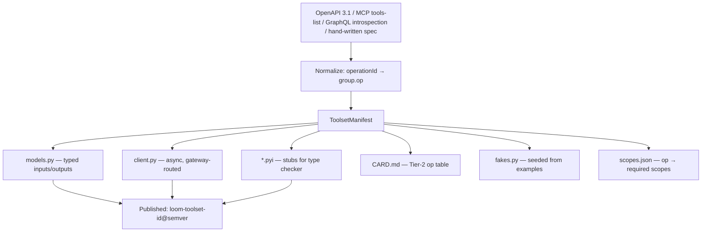
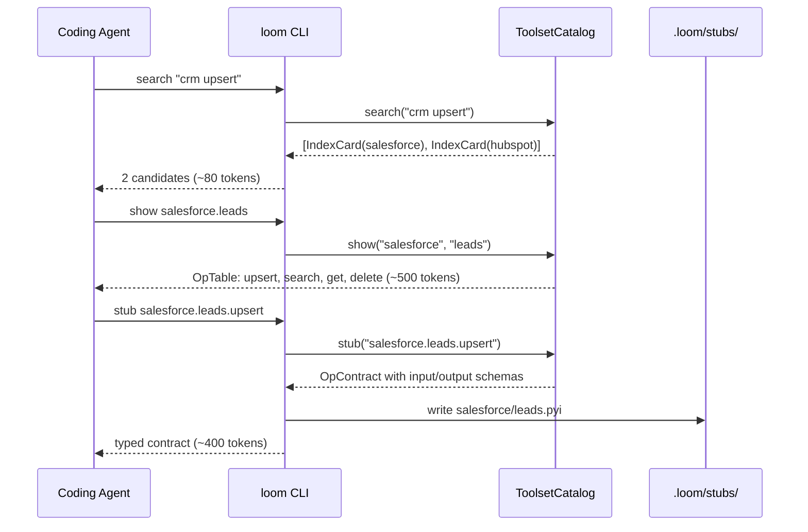
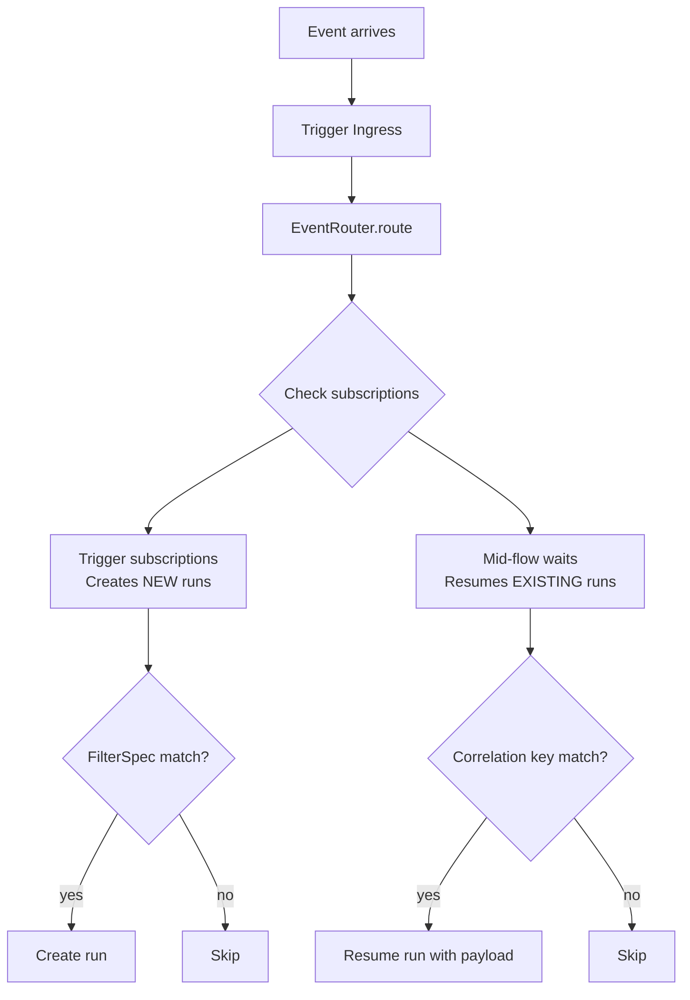

# Phase 3 — Integrations & Toolsets

**Goal:** Toolset catalog with three-tier lazy disclosure, generation pipeline, resource injection, event pub/sub, and 20 curated toolsets.

**Prerequisites:** Phase 1 (durable engine), Phase 2 partial (tool system — `tool_from_step`, `coerce_tool`).

**System Design References:** Chapters 6, 3.8 (custom nodes), 8.3-8.5 (event filtering, pub/sub), 9 (event_subscription table).

---

## 1. Exit Criteria & Success Metrics

| Metric | Gate | Target |
|--------|------|--------|
| Hallucinated-op rate | <= 3% | <= 0.5% |
| Toolset discovery latency (loom search) | < 500ms | < 200ms |
| 20 curated toolsets pass `loom certify` | All | All |
| Event routing fan-out works | 3+ subscribers | 10+ subscribers |

**"Done" means:** A coding agent can `loom search "crm"`, get index cards (~40 tokens each), `loom show salesforce.leads` for the op table, `loom stub salesforce.leads.upsert` for the typed contract, and generate correct code using the stubs. Events can fan-out to multiple subscribing workflows.

---

## 2. HLD — Toolset & Integration Architecture

```
┌─────────────────────── Phase 3 Scope ───────────────────────┐
│                                                              │
│  Coding Agent / User                                         │
│    │                                                         │
│    ├── loom search "crm" ──────────▶ Tier 1: Index cards     │
│    ├── loom show salesforce.leads ──▶ Tier 2: Op table       │
│    └── loom stub salesforce.leads.upsert ▶ Tier 3: Contract  │
│                                                              │
│  ┌───────────────────────────────────────────────────┐       │
│  │              Toolset Catalog                       │       │
│  │  ┌──────────┐ ┌──────────┐ ┌──────────────────┐  │       │
│  │  │ Manifests │ │ Clients  │ │ Stubs (.pyi)     │  │       │
│  │  │ (YAML)    │ │ (typed)  │ │ (type checker)   │  │       │
│  │  └──────────┘ └──────────┘ └──────────────────┘  │       │
│  └───────────────────────────────────────────────────┘       │
│                          │                                    │
│  ┌───────────────────────┼───────────────────────────┐       │
│  │            Connection Broker                       │       │
│  │  connection_id → scoped credential (gateway-side)  │       │
│  └────────────────────────────────────────────────────┘       │
│                                                              │
│  ┌────────────────────────────────────────────────────┐      │
│  │         Event Routing (Pub/Sub)                     │      │
│  │  FilterSpec + event_subscription → fan-out          │      │
│  └────────────────────────────────────────────────────┘      │
│                                                              │
│  ┌────────────────────────────────────────────────────┐      │
│  │         Resource System                             │      │
│  │  @resource + Depends → injection + pooling          │      │
│  └────────────────────────────────────────────────────┘      │
└──────────────────────────────────────────────────────────────┘
```

### Three-Tier Lazy Disclosure

```
Tier 0  ALWAYS LOADED     loom core skill card                    ~700 tokens
Tier 1  ON INTENT          loom search "<capability>"              ~40 tokens/hit
Tier 2  ON SELECTION        loom show <toolset>[.<group>]          ~300-900 tokens
Tier 3  ON USE             loom stub <toolset>.<op>                ~250-500 tokens
```

A typical 3-integration workflow costs ~4.5k tokens of toolset knowledge vs. millions for eager loading.

---

## 3. LLD — Subsystem Details

### 3.1 ToolsetManifest Format

```python
# toolsets/manifest.py (NEW)

class EffectClass(StrEnum):
    READ = "read"
    WRITE = "write"
    DESTRUCTIVE = "destructive"

class OperationSpec(BaseModel):
    id: str                              # e.g., "leads.upsert"
    summary: str                         # one-line (~40 tokens)
    description: str = ""                # full doc
    effect: EffectClass = EffectClass.READ
    input_type: type[BaseModel] | None = None
    output_type: type[BaseModel] | None = None
    input_schema: dict[str, Any] = {}    # JSON Schema if no Pydantic model
    output_schema: dict[str, Any] = {}
    scopes: list[str] = []               # required OAuth/API scopes
    pagination: bool = False             # returns Page[T]?
    rate_limit_group: str = ""           # shared rate limit key
    idempotent: bool = False             # safe to retry?

class ToolsetManifest(BaseModel):
    id: str                              # e.g., "salesforce"
    version: str                         # semver
    summary: str                         # Tier 1 index card
    description: str = ""
    groups: dict[str, list[OperationSpec]] = {}  # group_name → ops
    auth: dict[str, Any] = {}            # auth configuration
    base_url: str = ""
    rate_limits: dict[str, Any] = {}
    egress_hosts: list[str] = []         # declared egress for sandbox
    fakes_module: str = ""               # module with fake implementations
```

### 3.2 Three-Tier Disclosure Implementation

```python
# toolsets/catalog.py (NEW)

class ToolsetCatalog:
    """Serves toolset information at three tiers of detail."""

    def __init__(self):
        self._manifests: dict[str, ToolsetManifest] = {}

    def register(self, manifest: ToolsetManifest) -> None:
        self._manifests[manifest.id] = manifest

    def search(self, query: str, limit: int = 10) -> list[IndexCard]:
        """Tier 1: Return index cards (~40 tokens each)."""
        results = []
        for m in self._manifests.values():
            if self._matches(query, m):
                results.append(IndexCard(
                    toolset_id=m.id,
                    summary=m.summary,
                    groups=list(m.groups.keys()),
                ))
        return results[:limit]

    def show(self, toolset_id: str, group: str | None = None) -> OpTable:
        """Tier 2: Return op table (~300-900 tokens)."""
        manifest = self._manifests[toolset_id]
        ops = manifest.groups.get(group, []) if group else \
              [op for ops in manifest.groups.values() for op in ops]
        return OpTable(
            toolset_id=toolset_id,
            ops=[OpSummary(id=op.id, summary=op.summary, effect=op.effect) for op in ops],
        )

    def stub(self, op_path: str) -> OpContract:
        """Tier 3: Return typed contract (~250-500 tokens)."""
        toolset_id, op_id = op_path.split(".", 1)
        manifest = self._manifests[toolset_id]
        op = self._find_op(manifest, op_id)
        return OpContract(
            op_id=op.id,
            input_schema=op.input_schema,
            output_schema=op.output_schema,
            scopes=op.scopes,
            effect=op.effect,
            description=op.description,
        )
```

### 3.3 Toolset Generation Pipeline



```python
# toolsets/generator.py (NEW)

class ToolsetGenerator:
    """Generate toolset packages from API specifications."""

    def from_openapi(self, spec_url: str, toolset_id: str) -> ToolsetManifest:
        """Parse OpenAPI 3.1 spec and generate manifest + code."""
        ...

    def from_mcp(self, tools_list: list[dict], toolset_id: str) -> ToolsetManifest:
        """Parse MCP tools-list and generate manifest."""
        ...

    def from_graphql(self, schema_url: str, toolset_id: str) -> ToolsetManifest:
        """Parse GraphQL introspection and generate manifest."""
        ...

    def emit_package(self, manifest: ToolsetManifest, output_dir: Path) -> None:
        """Generate the full toolset package directory."""
        ...
```

### 3.4 Resource System

```python
# resources/base.py (NEW)

class ResourceScope(StrEnum):
    FLOW = "flow"          # one instance per flow invocation
    WORKER = "worker"      # shared across runs on same worker
    GLOBAL = "global"      # shared across all workers

def resource(scope: ResourceScope = ResourceScope.FLOW, health: Callable | None = None):
    """Declare an external resource (DB, cache, HTTP client)."""
    def decorator(fn):
        return ResourceDefinition(fn=fn, scope=scope, health=health)
    return decorator

class Depends:
    """Inject a resource into a step."""
    def __init__(self, resource_def: ResourceDefinition):
        self._def = resource_def

    async def resolve(self) -> Any:
        return await self._def.acquire()
```

### 3.5 Connection Broker

```python
# toolsets/connections.py (NEW)

class ConnectionBroker:
    """Exchanges connection_id for scoped, short-lived credentials."""

    async def resolve(self, connection_id: str, scopes: list[str]) -> Credential:
        """Returns scoped credential. In embedded mode: reads from env/config.
        In gateway mode: calls gateway API."""
        ...

class Credential(BaseModel):
    token: str
    expires_at: datetime | None = None
    scopes: list[str] = []
```

In embedded mode, the broker reads credentials from environment variables or config files. In gateway mode, it calls the gateway API. The worker never sees raw credentials (D7).

### 3.6 Page[T] — Durable Pagination

```python
# core/types.py — addition

class Page(BaseModel, Generic[T]):
    """Paginated result. Each page fetch is a durable sub-step."""
    items: list[T]
    cursor: str | None = None
    has_more: bool = False
    total: int | None = None

    async def pages(self, max_pages: int = 100) -> AsyncIterator[Page[T]]:
        """Iterate through pages. Each page = durable sub-step."""
        ...

    async def all(self, max_items: int = 10_000) -> list[T]:
        """Collect all items up to hard cap."""
        ...
```

### 3.7 FilterSpec — Event Filtering

```python
# triggers/filter.py (NEW)

class FilterSpec(BaseModel):
    """Declarative filter over event payload fields."""
    conditions: dict[str, Any]

    def matches(self, payload: dict[str, Any]) -> bool:
        for path, expected in self.conditions.items():
            actual = _get_nested(payload, path)
            if isinstance(expected, dict):
                if not _eval_operator(actual, expected):
                    return False
            elif actual != expected:
                return False
        return True

def _get_nested(obj: dict, path: str) -> Any:
    """Get a nested value by dotted path: 'fields.priority.name'"""
    for key in path.split("."):
        if isinstance(obj, dict):
            obj = obj.get(key)
        else:
            return None
    return obj

def _eval_operator(actual: Any, ops: dict) -> bool:
    """Evaluate MongoDB-style operators: $in, $gt, $regex, etc."""
    for op, val in ops.items():
        match op:
            case "$in": return actual in val
            case "$nin": return actual not in val
            case "$gt": return actual > val
            case "$gte": return actual >= val
            case "$lt": return actual < val
            case "$lte": return actual <= val
            case "$ne": return actual != val
            case "$regex": return bool(re.search(val, str(actual)))
            case "$exists": return (actual is not None) == val
            case _: raise ValueError(f"Unknown filter operator: {op}")
    return True
```

### 3.8 Event Pub/Sub Routing

```python
# triggers/routing.py (NEW)

class EventRouter:
    """Routes events to trigger subscriptions and waiting runs."""

    def __init__(self, store: ExecutionStore, registry: FlowRegistry):
        self._store = store
        self._registry = registry

    async def route(self, event: TriggerEvent) -> list[str]:
        """Route an event. Returns list of run_ids affected."""
        affected = []

        # 1. Fan-out to trigger subscriptions (creates NEW runs)
        for flow in self._registry.flows_subscribing_to(event.name):
            if flow.trigger_filter and not flow.trigger_filter.matches(event.payload):
                continue
            run_id = await self._create_run(flow, event)
            affected.append(run_id)

        # 2. Fan-out to waiting runs (resumes EXISTING runs)
        waiting = await self._store.runs_awaiting_event(event.name,
                                                         correlation_key=event.key)
        for run_id in waiting:
            await self._resume_run(run_id, event.payload)
            affected.append(run_id)

        return affected
```

### 3.9 Toolset Registration

```python
# toolsets/registry.py (NEW)

_catalog = ToolsetCatalog()

def register_toolset(manifest: ToolsetManifest) -> None:
    """Register a toolset manifest with the catalog."""
    _catalog.register(manifest)

def register_toolset_from_openapi(spec_url: str, id: str, **kw) -> None:
    """Generate and register a toolset from an OpenAPI spec."""
    gen = ToolsetGenerator()
    manifest = gen.from_openapi(spec_url, id)
    register_toolset(manifest)

def _discover_entry_points() -> None:
    """Auto-discover toolsets installed via pip entry points."""
    from importlib.metadata import entry_points
    for ep in entry_points(group="loom_toolset"):
        manifest = ep.load()
        if isinstance(manifest, ToolsetManifest):
            register_toolset(manifest)

# Called at import time
_discover_entry_points()
```

### 3.10 Grant Derivation

```python
# security/grants.py (NEW — basic, expanded in Phase 5)

class GrantSet(BaseModel):
    toolsets: list[str] = []    # e.g., ["jira.issues:write", "slack.chat:write"]
    agents: list[str] = []      # e.g., ["support-triage"]
    resources: list[str] = []   # e.g., ["pg:read"]
    subflows: list[str] = []
    egress: list[str] = []      # e.g., ["api.atlassian.com"]
    budget: dict[str, Any] = {} # e.g., {"usd_per_run": 0.50}

def derive_grants(flow_source: str) -> GrantSet:
    """Statically analyze flow source to derive required grants."""
    # AST visitor: find toolset imports, agent refs, resource deps
    ...
```

### 3.11 loom.lock / loom pin

```python
# toolsets/lock.py (NEW)

class ToolsetLock(BaseModel):
    """Pinned toolset versions and hashes."""
    toolsets: dict[str, ToolsetPin] = {}

class ToolsetPin(BaseModel):
    version: str
    manifest_hash: str
    pinned_at: datetime

def generate_lock(manifests: list[ToolsetManifest]) -> ToolsetLock: ...
def verify_lock(lock: ToolsetLock, manifests: list[ToolsetManifest]) -> list[Drift]: ...
```

### 3.12 Automated Certification

```python
# toolsets/certify.py (NEW)

CERT_CHECKS = [
    ("CERT-01", "manifest schema valid", check_manifest_schema),
    ("CERT-02", "every op has typed models", check_typed_models),
    ("CERT-03", "effect classification present", check_effect_classification),
    ("CERT-04", "scope mapping complete", check_scope_mapping),
    ("CERT-05", "no credential handling", check_no_credentials),
    ("CERT-06", "egress hosts declared", check_egress_hosts),
    ("CERT-07", "fakes present", check_fakes),
    ("CERT-08", "contract tests pass", check_contract_tests),
    ("CERT-09", "pagination declared", check_pagination),
    ("CERT-10", "rate limits declared", check_rate_limits),
    ("CERT-11", "SBOM clean", check_sbom),
    ("CERT-12", "package size < 5MB", check_package_size),
]

async def certify(manifest: ToolsetManifest) -> CertificationResult:
    """Run all 12 certification checks."""
    results = []
    for code, desc, check_fn in CERT_CHECKS:
        try:
            await check_fn(manifest)
            results.append(CertResult(code=code, passed=True))
        except CertFailure as e:
            results.append(CertResult(code=code, passed=False, reason=str(e)))
    return CertificationResult(results=results, certified=all(r.passed for r in results))
```

### 3.13 ctx.emit — Publishing Events

```python
# runtime/context.py — addition

async def emit(self, event_name: str, payload: Any) -> None:
    """Publish an event. Fans out to trigger subscriptions and waiting runs."""
    path = self._scope.allocate()
    entry = self._journal.lookup(path)
    if entry and entry.status == EntryStatus.COMPLETED:
        return  # already emitted on previous attempt

    event = TriggerEvent(
        id=self.uuid(), source="emit", name=event_name,
        payload=payload, tenant_id=self._tenant,
    )
    await self._router.route(event)
    self._journal.append(path, EntryKind.SIGNAL, EntryStatus.COMPLETED,
                         output=encode(event))
```

---

## 4. Directory Structure

### New Files

| File | Purpose |
|------|---------|
| `toolsets/__init__.py` | Package init |
| `toolsets/manifest.py` | `ToolsetManifest`, `OperationSpec`, `EffectClass` |
| `toolsets/catalog.py` | `ToolsetCatalog` — three-tier disclosure |
| `toolsets/registry.py` | `register_toolset()`, entry point discovery |
| `toolsets/generator.py` | `ToolsetGenerator` — OpenAPI/MCP/GraphQL → manifest |
| `toolsets/connections.py` | `ConnectionBroker`, `Credential` |
| `toolsets/lock.py` | `ToolsetLock`, `ToolsetPin`, `loom pin` |
| `toolsets/certify.py` | `loom certify` — 12-point automated certification |
| `toolsets/gateway.py` | Rate limiting gateway (in-process for embedded) |
| `triggers/filter.py` | `FilterSpec` — event filtering |
| `triggers/routing.py` | `EventRouter` — pub/sub routing |
| `resources/__init__.py` | Package init |
| `resources/base.py` | `@resource`, `Depends`, `ResourceDefinition` |
| `resources/pool.py` | Connection pooling, health checks |
| `security/grants.py` | `GrantSet`, `derive_grants()` |

### Modified Files

| File | Changes |
|------|---------|
| `runtime/context.py` | Add `ctx.emit()` |
| `triggers/base.py` | Ensure `TriggerEvent` supports `filter` field |
| `triggers/specs.py` | Add `filter=` param to `AppEvent`, `Webhook`; typed payload schemas |
| `state/base.py` | Add `runs_awaiting_event` with correlation_key param |
| `cli.py` | Add `loom search`, `loom show`, `loom stub`, `loom pin`, `loom certify` |
| `__init__.py` | Export `resource`, `Depends`, `Page`, `ToolsetManifest`, `register_toolset` |

---

## 5. Implementation Steps

### Step 1: ToolsetManifest & Catalog (3-4 hours)
1. Create `toolsets/manifest.py` with all data models
2. Create `toolsets/catalog.py` with search/show/stub
3. Tests: register manifest, search, show, stub

### Step 2: Registration & Discovery (2-3 hours)
1. Create `toolsets/registry.py` with `register_toolset()`, entry point discovery
2. Tests: register, discover via entry point

### Step 3: FilterSpec (2-3 hours)
1. Create `triggers/filter.py` with `FilterSpec` and all operators
2. Tests: exact match, nested path, $in, $gt, $regex, $exists

### Step 4: Event Routing & Pub/Sub (3-4 hours)
1. Create `triggers/routing.py` with `EventRouter`
2. Add `ctx.emit()` to Context
3. Wire routing into trigger ingress
4. Tests: fan-out to multiple subscribers, filter matching, mid-flow wait resume

### Step 5: Resource System (2-3 hours)
1. Create `resources/base.py` with `@resource`, `Depends`
2. Create `resources/pool.py` with pooling
3. Tests: resource injection, scope lifecycle

### Step 6: Connection Broker (2-3 hours)
1. Create `toolsets/connections.py`
2. Embedded mode: reads from env/config
3. Tests: resolve credential, scoping

### Step 7: Page[T] (1-2 hours)
1. Add `Page[T]` to `core/types.py`
2. Wire `.pages()` as durable sub-steps
3. Tests: paginate, collect all, hard cap

### Step 8: Generation Pipeline (4-6 hours)
1. Create `toolsets/generator.py`
2. OpenAPI parser → manifest
3. Code generator → models.py, client.py, stubs
4. Tests: generate from sample OpenAPI spec

### Step 9: loom.lock & Certification (2-3 hours)
1. Create `toolsets/lock.py` and `toolsets/certify.py`
2. 12 certification checks
3. Tests: certify valid/invalid toolsets

### Step 10: Grant Derivation (2-3 hours)
1. Create `security/grants.py`
2. AST visitor for static grant derivation
3. Tests: derive grants from sample flow

### Step 11: CLI Commands (2-3 hours)
1. Add `loom search`, `loom show`, `loom stub`, `loom pin`, `loom certify`

### Step 12: Rate Limiting Gateway (2-3 hours)
1. Create `toolsets/gateway.py` — in-process token bucket
2. Tests: rate limiting, backpressure

### Step 13: Curated Toolsets (ongoing)
1. Generate manifests for 20 integrations: Slack, Jira, GitHub, Stripe, Gmail, Google Calendar, HubSpot, Salesforce, Notion, Linear, Asana, PagerDuty, Twilio, SendGrid, Airtable, Zendesk, Intercom, Shopify, AWS S3, PostgreSQL

---

## 6. Data Flow Diagrams

### Toolset Discovery Flow



### Event Routing



---

## 7. Multi-Angle Review

### Security
- **Credential isolation (D7):** Connection broker never exposes raw tokens to workers. Embedded mode uses env vars; gateway mode uses short-lived scoped creds.
- **Egress control:** Toolset manifest declares `egress_hosts`. Sandbox (Phase 5) enforces. Phase 3 logs but doesn't block.
- **Grant set:** Derived statically from code. No wildcards in production (`LOOM-G003`).

### Performance
- **Search latency:** In-memory catalog lookup. Scales to 1000+ manifests with simple text matching.
- **Event routing:** Queries `event_subscription` table. Index on `event_name`. Fan-out is O(subscribers).
- **Rate limiting:** In-process token bucket. Zero network overhead in embedded mode.

### Edge Cases
- **Toolset not found:** `loom search` returns empty. Coding agent should try alternate queries.
- **Filter on nested null field:** `_get_nested` returns `None`. `$exists: false` matches.
- **Event with no subscribers:** Logged, discarded. No error.
- **Page[T] mid-pagination crash:** Each page fetch is a durable sub-step. Resumes from last completed page.
- **Circular ctx.emit:** Workflow A emits → triggers Workflow B → emits → triggers A. Guard: max event depth limit.

---

## 8. Test Plan

### Unit Tests

| Test | What |
|------|------|
| `test_manifest_validation` | ToolsetManifest schema |
| `test_catalog_search` | Search matching, ranking |
| `test_catalog_show` | Op table generation |
| `test_catalog_stub` | Contract generation |
| `test_filter_exact` | Exact field match |
| `test_filter_nested` | Dotted path access |
| `test_filter_operators` | $in, $gt, $regex, etc. |
| `test_event_routing_fanout` | Multiple subscribers get the event |
| `test_event_routing_filter` | Filter excludes non-matching |
| `test_page_iteration` | Page.pages(), Page.all() |
| `test_grant_derivation` | Static analysis produces correct grants |
| `test_certification` | 12 checks pass/fail correctly |

### Integration Tests

| Test | What |
|------|------|
| `test_toolset_in_workflow` | Workflow uses toolset op as effect step |
| `test_event_pubsub_end_to_end` | Emit → route → create run → execute |
| `test_resource_injection` | @resource injected into step via Depends |
| `test_entry_point_discovery` | Install mock package → auto-registered |

---

## 9. Known Gaps & Risks

| Gap | Impact | Mitigation |
|-----|--------|------------|
| **Gateway in embedded mode** | Design describes gateway as separate service, but embedded has no gateway | In-process gateway shim — same interface, direct function calls |
| **OpenAPI parser completeness** | Real-world OpenAPI specs are messy (discriminated unions, allOf, etc.) | Start with well-formed specs (Stripe, GitHub). Iterate parser. |
| **20 curated toolsets** | Manual effort to review and certify each | Prioritize by agent usage frequency. Start with 5, expand. |
| **Connection broker secrets** | Embedded mode reads secrets from env vars — not secure for production | Document: production uses gateway mode with proper secrets management |
| **Rate limit state** | In-process state lost on restart | Acceptable for embedded. Gateway mode persists in Redis. |

---

## 10. Documentation Updates

1. **CLAUDE.md:** Add `resource`, `Depends`, `Page`, `register_toolset` to public API. Add "Toolset System" to layer responsibilities.
2. **Toolset authoring guide:** How to create a toolset manifest, register it, publish as pip package.
3. **Event routing guide:** How to use `AppEvent`, `filter=`, `ctx.emit()`.
