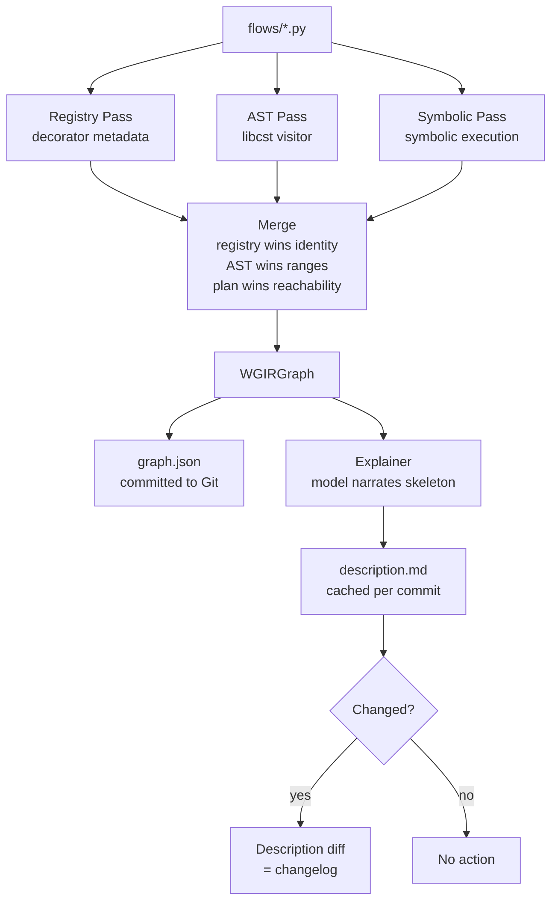
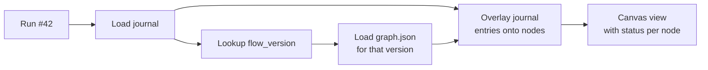

# Phase 4 — Visualization & Explainability

**Goal:** Deterministic graph extraction from code, commit-time narration, canvas projection, run trace overlay, and constrained round-trip editing.

**Prerequisites:** Phase 1 (decorators, registry, journal). Benefits from Phase 2 (agent nodes) and Phase 3 (toolset nodes).

**System Design References:** Chapters 7, 12.8-12.9 (L2f, L2g data flow diagrams).

**Host note (PipesHub).** WGIR extraction below is the structural contract —
what a host is allowed to trust as "everything this code does." A host that
wants a bespoke rendering surface (e.g. an agent that turns the code file into
a live React app, as PipesHub does) builds it as a consumer of WGIR, not a
replacement for it: render however you like, then verify the render's
node/edge set against WGIR before showing it to a user, the same way
`Explainer._verify_completeness` (§3.7) already checks a narration against the
skeleton. See [`docs/pipeshub-integration.md`](../docs/pipeshub-integration.md)
§9.2 for the full reconciliation and why an agent-only render (no
verification step) is a regression from what this phase guarantees.

---

## 1. Exit Criteria & Success Metrics

| Metric | Gate | Target |
|--------|------|--------|
| Explainer golden-set score | >= 0.80 | >= 0.90 |
| WGIR extraction covers all node kinds | All 18 | All 18 |
| Every node in skeleton appears in narration | 100% | 100% |
| graph.json committed deterministically | Always | Always |
| GraphPatch operations produce valid code | All 6 ops | All 6 ops |

**"Done" means:** A user can write a workflow, run `loom check`, get a `graph.json` committed alongside their code, view a narrated description generated at commit time, view run traces overlaid on the graph, and make constrained edits via GraphPatch that round-trip to code.

---

## 2. HLD — Visualization Architecture

```
┌─────────────────────── Phase 4 Pipeline ───────────────────────┐
│                                                                 │
│  flows/*.py                                                     │
│      │                                                          │
│      ├───▶ Registry Pass (exact: decorator metadata)            │
│      ├───▶ AST Pass (structural: libcst, control flow, ctx.*)   │
│      └───▶ Symbolic Plan Pass (dynamic: symbolic execution)     │
│                │                                                │
│                ▼                                                │
│      ┌─────────────────────┐                                   │
│      │    WGIR (Merged)     │                                   │
│      │  nodes + edges +     │                                   │
│      │  source ranges       │                                   │
│      └─────────┬───────────┘                                   │
│                │                                                │
│      ┌─────────┼──────────────────┐                            │
│      ▼         ▼                  ▼                             │
│  graph.json  Explainer          Canvas                          │
│  (committed) (commit-time       (static view +                  │
│              narration)          run overlay +                   │
│              description.md      GraphPatch editing)             │
│                                                                 │
│  ┌──────────────────────────────────────────────┐              │
│  │  Run Trace Narration                          │              │
│  │  Journal → overlay on WGIR → "why did this    │              │
│  │  run do that"                                 │              │
│  └──────────────────────────────────────────────┘              │
│                                                                 │
│  ┌──────────────────────────────────────────────┐              │
│  │  CI Golden Checks                             │              │
│  │  Human-written descriptions → score vs        │              │
│  │  generated → gate ≥ 0.85                      │              │
│  └──────────────────────────────────────────────┘              │
└─────────────────────────────────────────────────────────────────┘
```

---

## 3. LLD — Subsystem Details

### 3.1 WGIR Data Model

```python
# graph/wgir.py (NEW)

from pydantic import BaseModel
from enum import StrEnum

class NodeKind(StrEnum):
    TRIGGER = "trigger"
    PURE = "pure"
    EFFECT = "effect"
    TOOL = "tool"
    AGENT = "agent"
    AGENT_SESSION = "agent_session"
    MAP = "map"
    SWITCH = "switch"
    LOOP = "loop"
    PARALLEL = "parallel"
    RACE = "race"
    WAIT = "wait"
    HUMAN = "human"
    SUBFLOW = "subflow"
    EMIT = "emit"
    COMPENSATE = "compensate"
    ARTIFACT = "artifact"
    RETURN = "return"
    CODE = "code"         # opaque code block

class EdgeKind(StrEnum):
    DATA = "data"
    CONTROL = "control"
    ERROR = "error"
    COMPENSATION = "compensation"
    EVENT = "event"

class SourceRange(BaseModel):
    file: str
    start_line: int
    end_line: int
    start_col: int = 0
    end_col: int = 0

class WGIRNode(BaseModel):
    id: str                          # stable step identity
    kind: NodeKind
    label: str                       # human-readable name
    description: str = ""            # from docstring or narration
    input_type: str | None = None    # Pydantic model name
    output_type: str | None = None
    source: SourceRange | None = None
    step_class: str | None = None    # "pure" | "effect" | "agent"
    retry_policy: dict | None = None
    timeout: str | None = None
    tools: list[str] = []            # tool names (agent nodes)
    children: list[str] = []         # for container nodes (map, parallel)
    metadata: dict[str, Any] = {}

class WGIREdge(BaseModel):
    source: str                      # node id
    target: str                      # node id
    kind: EdgeKind
    label: str = ""
    condition: str | None = None     # for conditional edges (switch)
    variable: str | None = None      # data dependency variable name

class WGIRGraph(BaseModel):
    flow_id: str
    version: int = 1
    nodes: list[WGIRNode]
    edges: list[WGIREdge]
    triggers: list[dict] = []        # trigger specs
    resources: list[str] = []        # resource dependencies
    grants: list[str] = []           # derived grant set
    source_file: str = ""
    extracted_at: str = ""           # ISO timestamp
    extraction_hash: str = ""        # hash of the graph for change detection
```

### 3.2 Registry Pass (Exact)

Decorators register node metadata at import time. This pass collects everything already known.

```python
# graph/extractor.py (NEW) — registry pass

class RegistryCollector:
    """Collects step/flow definitions registered via decorators."""

    def collect(self, module) -> list[WGIRNode]:
        nodes = []
        for name, obj in inspect.getmembers(module):
            if isinstance(obj, StepDefinition):
                nodes.append(WGIRNode(
                    id=obj.name,
                    kind=self._step_kind(obj),
                    label=obj.name,
                    description=obj.description or (obj.fn.__doc__ or "").split("\n")[0],
                    input_type=self._type_name(obj.fn, "input"),
                    output_type=self._type_name(obj.fn, "return"),
                    source=self._source_range(obj.fn),
                    step_class=obj.klass.value,
                    retry_policy=obj.retry.dict() if obj.retry else None,
                    timeout=str(obj.timeout) if obj.timeout else None,
                ))
            elif isinstance(obj, WorkflowDefinition):
                # Add trigger nodes
                for trigger in obj.triggers:
                    nodes.append(WGIRNode(
                        id=f"trigger:{trigger.kind}",
                        kind=NodeKind.TRIGGER,
                        label=f"{trigger.kind} trigger",
                    ))
        return nodes

    def _step_kind(self, defn: StepDefinition) -> NodeKind:
        match defn.klass:
            case StepClass.PURE: return NodeKind.PURE
            case StepClass.EFFECT: return NodeKind.EFFECT
            case StepClass.AGENT: return NodeKind.AGENT
            case _: return NodeKind.CODE
```

### 3.3 AST Pass (Structural)

Uses `libcst` to visit the flow body and extract control flow, `ctx.*` calls, and data dependencies.

```python
# graph/extractor.py — AST pass

import libcst as cst

class ASTExtractor(cst.CSTVisitor):
    """Extract control flow and ctx.* calls from the flow body."""

    def __init__(self):
        self.nodes: list[WGIRNode] = []
        self.edges: list[WGIREdge] = []
        self._var_defs: dict[str, str] = {}  # variable → defining node id

    def visit_If(self, node: cst.If) -> None:
        self.nodes.append(WGIRNode(
            id=self._alloc_id("switch"),
            kind=NodeKind.SWITCH,
            label="if",
            source=self._source(node),
        ))

    def visit_For(self, node: cst.For) -> None:
        self.nodes.append(WGIRNode(
            id=self._alloc_id("loop"),
            kind=NodeKind.LOOP,
            label="for",
            source=self._source(node),
        ))

    def visit_Call(self, node: cst.Call) -> None:
        call_name = self._resolve_call(node)
        if call_name == "ctx.map":
            self.nodes.append(WGIRNode(
                id=self._alloc_id("map"), kind=NodeKind.MAP, label="map"))
        elif call_name == "ctx.gather":
            self.nodes.append(WGIRNode(
                id=self._alloc_id("parallel"), kind=NodeKind.PARALLEL, label="gather"))
        elif call_name == "ctx.race":
            self.nodes.append(WGIRNode(
                id=self._alloc_id("race"), kind=NodeKind.RACE, label="race"))
        elif call_name == "ctx.sleep" or call_name == "ctx.sleep_until":
            self.nodes.append(WGIRNode(
                id=self._alloc_id("wait"), kind=NodeKind.WAIT, label="sleep"))
        elif call_name == "ctx.wait_for_event":
            self.nodes.append(WGIRNode(
                id=self._alloc_id("wait"), kind=NodeKind.WAIT, label="wait_for_event"))
        elif call_name == "ctx.ask_human":
            self.nodes.append(WGIRNode(
                id=self._alloc_id("human"), kind=NodeKind.HUMAN, label="ask_human"))
        elif call_name == "ctx.emit":
            self.nodes.append(WGIRNode(
                id=self._alloc_id("emit"), kind=NodeKind.EMIT, label="emit"))
        elif call_name == "ctx.compensate":
            self.nodes.append(WGIRNode(
                id=self._alloc_id("compensate"), kind=NodeKind.COMPENSATE,
                label="compensate"))
        elif call_name == "ctx.artifact":
            self.nodes.append(WGIRNode(
                id=self._alloc_id("artifact"), kind=NodeKind.ARTIFACT, label="artifact"))
        # Track data dependencies via await variable assignment
        ...

    def _extract_data_edges(self) -> list[WGIREdge]:
        """Build data edges from variable use-def chains."""
        edges = []
        for var, consumer_node in self._var_uses.items():
            if var in self._var_defs:
                edges.append(WGIREdge(
                    source=self._var_defs[var],
                    target=consumer_node,
                    kind=EdgeKind.DATA,
                    variable=var,
                ))
        return edges
```

### 3.4 Symbolic Plan Pass (Dynamic)

Execute the flow body against a symbolic `ctx` to discover runtime paths:

```python
# graph/extractor.py — symbolic pass

class SymbolicContext:
    """A fake Context that records calls instead of executing them."""

    def __init__(self):
        self.calls: list[tuple[str, Any]] = []

    async def step(self, defn, *args, **kw):
        self.calls.append(("step", defn.name))
        return _sentinel(defn.output_type)

    async def map(self, items, node, **kw):
        self.calls.append(("map", node.name))
        return Batch([_sentinel(node.output_type)])

    async def gather(self, *awaitables):
        self.calls.append(("gather", len(awaitables)))
        return tuple(_sentinel(None) for _ in awaitables)

    # ... other ctx methods return sentinels

class SymbolicExtractor:
    def extract(self, flow_fn: Callable) -> list[WGIRNode]:
        ctx = SymbolicContext()
        try:
            asyncio.run(flow_fn(ctx, _sentinel(flow_fn.input_type)))
        except Exception:
            pass  # expected — some paths may error with sentinels
        return self._calls_to_nodes(ctx.calls)
```

### 3.5 Merge Rules

```python
# graph/extractor.py — merge

def merge_passes(registry: list[WGIRNode], ast: list[WGIRNode],
                 plan: list[WGIRNode], ast_edges: list[WGIREdge]) -> WGIRGraph:
    """Merge three passes into final WGIR."""
    nodes = {}

    # Registry wins on identity (step id, kind, types)
    for n in registry:
        nodes[n.id] = n

    # AST wins on source ranges
    for n in ast:
        if n.id in nodes:
            nodes[n.id].source = n.source
        else:
            nodes[n.id] = n

    # Plan wins on reachability
    for n in plan:
        if n.id not in nodes:
            nodes[n.id] = n
        nodes[n.id].metadata["reachable"] = True

    # Anything unresolved → opaque code node
    # ...

    return WGIRGraph(nodes=list(nodes.values()), edges=ast_edges, ...)
```

### 3.6 graph.json Emission

```python
# graph/emitter.py (NEW)

def emit_graph_json(graph: WGIRGraph, output_path: Path) -> None:
    """Write graph.json alongside the flow file."""
    content = graph.model_dump_json(indent=2)
    output_path.write_text(content)

def graph_changed(old_path: Path, new_graph: WGIRGraph) -> bool:
    """Check if graph changed from previous version."""
    if not old_path.exists():
        return True
    old = WGIRGraph.model_validate_json(old_path.read_text())
    return old.extraction_hash != new_graph.extraction_hash
```

### 3.7 Skeleton-First Narration

```python
# graph/explainer.py (NEW)

class Explainer(Protocol):
    """Generate human-readable narration from WGIR skeleton."""
    async def narrate(self, graph: WGIRGraph) -> Narration: ...

class Narration(BaseModel):
    summary: str                         # one-paragraph overview
    node_descriptions: dict[str, str]    # node_id → prose
    edge_descriptions: dict[str, str]    # edge key → prose
    capability_manifest: list[str]       # systems written to
    full_text: str                       # compiled description.md

class ModelExplainer:
    """Uses an LLM to narrate a verified skeleton."""

    def __init__(self, provider: ModelProvider):
        self._provider = provider

    async def narrate(self, graph: WGIRGraph) -> Narration:
        # 1. Build prompt with skeleton (nodes, edges, tool calls)
        prompt = self._build_skeleton_prompt(graph)

        # 2. Model narrates each node (cannot add/remove)
        response = await self._provider.complete(ModelRequest(
            messages=[Message(role="user", content=prompt)],
        ))

        # 3. Parse narration, verify every node is mentioned
        narration = self._parse_narration(response.message.content, graph)
        self._verify_completeness(narration, graph)
        return narration

    def _verify_completeness(self, narration: Narration, graph: WGIRGraph) -> None:
        """Ensure every node is narrated — no merging, no skipping."""
        graph_ids = {n.id for n in graph.nodes}
        narrated_ids = set(narration.node_descriptions.keys())
        missing = graph_ids - narrated_ids
        if missing:
            raise ExplainerIncomplete(f"Missing narration for: {missing}")
```

### 3.8 Commit-Time Generation Pipeline

```
git commit → CI / pre-commit hook
  │
  ├─ detect changed flow files
  ├─ for each changed flow:
  │    ├─ extract WGIR (three passes)
  │    ├─ emit graph.json
  │    ├─ model narrates skeleton → description.md
  │    ├─ cache: (flow_id, commit_sha) → description
  │    └─ if description changed from parent commit:
  │         └─ generate description diff → changelog entry
  └─ commit graph.json + description.md alongside code
```

```python
# graph/pipeline.py (NEW)

async def commit_time_pipeline(flow_files: list[Path], commit_sha: str,
                                explainer: Explainer) -> list[PipelineResult]:
    results = []
    for flow_file in flow_files:
        # 1. Extract WGIR
        graph = extract_wgir(flow_file)

        # 2. Emit graph.json
        graph_path = flow_file.with_suffix(".graph.json")
        emit_graph_json(graph, graph_path)

        # 3. Narrate
        narration = await explainer.narrate(graph)

        # 4. Write description
        desc_path = flow_file.with_suffix(".description.md")
        desc_path.write_text(narration.full_text)

        # 5. Cache
        cache_key = f"{graph.flow_id}:{commit_sha}"
        results.append(PipelineResult(
            flow_id=graph.flow_id, graph_path=graph_path,
            description_path=desc_path, cache_key=cache_key,
        ))
    return results
```

### 3.9 CI Golden Set Spot-Checking

```python
# graph/golden.py (NEW)

class GoldenCheck:
    """Compare generated narration against human-written golden descriptions."""

    def __init__(self, golden_dir: Path):
        self._golden_dir = golden_dir

    async def check(self, flow_file: Path, generated: Narration) -> GoldenResult:
        golden_path = self._golden_dir / f"{flow_file.stem}.golden.md"
        if not golden_path.exists():
            return GoldenResult(score=None, status="no_golden")

        golden_text = golden_path.read_text()
        score = self._similarity(generated.full_text, golden_text)

        # Also check structural completeness
        graph = extract_wgir(flow_file)
        mentioned = self._extract_mentioned_nodes(generated.full_text)
        all_ids = {n.id for n in graph.nodes}
        completeness = len(mentioned & all_ids) / len(all_ids) if all_ids else 1.0

        return GoldenResult(
            score=score, completeness=completeness,
            passed=score >= 0.85 and completeness == 1.0,
        )
```

### 3.10 Version-Locked Canvas Binding

```python
# graph/version.py (NEW)

class FlowVersion(BaseModel):
    """Immutable binding of code + WGIR + description at a specific version."""
    flow_id: str
    version: int
    artifact_ref: str           # code bundle reference
    graph_ref: str              # WGIR / graph.json reference
    description_ref: str        # commit-time narration reference
    steps_lock_ref: str         # step identity map reference
    created_at: datetime

    # Immutable once created — a code change produces a new version
```

**Guarantees:**
1. **At deploy:** `graph.json` generated deterministically, committed alongside.
2. **At view:** Canvas loads `graph_ref` for requested `(flow_id, version)`.
3. **At edit:** GraphPatch → new commit → new `flow_version`.
4. **Run overlay:** Run bound to `flow_version`. Overlay renders that version's WGIR.

### 3.11 Run Trace Narration

```python
# graph/trace.py (NEW)

class RunTraceNarrator:
    """Narrate a specific run's execution path over the WGIR."""

    async def narrate_run(self, run_id: str, store: ExecutionStore,
                           explainer: Explainer) -> RunNarration:
        journal = await store.load_journal(run_id)
        execution = await store.get_execution(run_id)
        graph = self._load_graph(execution.flow_id, execution.flow_version)

        # Overlay actual execution data onto skeleton
        for entry in journal:
            if entry.step_id in self._node_map(graph):
                node = self._node_map(graph)[entry.step_id]
                node.metadata["actual_status"] = entry.status.value
                node.metadata["actual_duration_ms"] = (
                    (entry.ended_at - entry.started_at).total_seconds() * 1000
                    if entry.ended_at else None
                )
                node.metadata["actual_attempt"] = entry.attempt

        # Model narrates what happened (real data, not inference)
        return await explainer.narrate_run(graph, journal)
```

### 3.12 GraphPatch — Constrained Canvas Editing

```python
# graph/canvas.py (NEW)

class PatchOp(StrEnum):
    SET_LAYOUT = "set_layout"
    SET_PARAM = "set_param"
    INSERT_NODE = "insert_node"
    REMOVE_NODE = "remove_node"
    REWIRE = "rewire"
    SET_POLICY = "set_policy"

class GraphPatch(BaseModel):
    op: PatchOp
    target: str              # node id or "layout"
    params: dict[str, Any] = {}

class PatchApplier:
    """Apply GraphPatch operations to source code."""

    def apply(self, patch: GraphPatch, source: str, graph: WGIRGraph) -> str:
        match patch.op:
            case PatchOp.SET_LAYOUT:
                return self._set_layout(patch, source)
            case PatchOp.SET_PARAM:
                return self._set_param(patch, source, graph)
            case PatchOp.INSERT_NODE:
                return self._insert_node(patch, source, graph)
            case PatchOp.REMOVE_NODE:
                return self._remove_node(patch, source, graph)
            case PatchOp.REWIRE:
                return self._rewire(patch, source, graph)
            case PatchOp.SET_POLICY:
                return self._set_policy(patch, source, graph)

    def _set_param(self, patch, source, graph) -> str:
        """Replace literal at source range."""
        node = self._find_node(graph, patch.target)
        # Use libcst to find and replace the parameter value
        ...

    def _insert_node(self, patch, source, graph) -> str:
        """Insert await + scaffold @effect if needed."""
        # Generate step definition + await call
        # Insert at the correct position in the flow body
        ...

    def _remove_node(self, patch, source, graph) -> str:
        """Delete statement. Error if output referenced downstream."""
        node = self._find_node(graph, patch.target)
        # Check no downstream data edges reference this node's output
        # Delete the statement at the source range
        ...
```

### 3.13 Mermaid/SVG Export

```python
# graph/export.py (NEW)

def to_mermaid(graph: WGIRGraph) -> str:
    """Export WGIR as Mermaid flowchart for PR review."""
    lines = ["flowchart TB"]
    for node in graph.nodes:
        shape = _node_shape(node.kind)
        lines.append(f"    {node.id}{shape}")
    for edge in graph.edges:
        arrow = _edge_arrow(edge.kind)
        lines.append(f"    {edge.source} {arrow} {edge.target}")
    return "\n".join(lines)

def to_svg(graph: WGIRGraph) -> bytes:
    """Export WGIR as SVG using a layout engine."""
    # Use graphviz or dagre for layout
    ...
```

### 3.14 Time-Travel

```python
# graph/timetravel.py (NEW)

class TimeTraveler:
    """Scrub a run timeline to any journal sequence number."""

    def snapshot_at(self, graph: WGIRGraph, journal: list[JournalEntry],
                     seq: int) -> WGIRGraph:
        """Return graph state at journal sequence N."""
        active_entries = [e for e in journal if e.seq <= seq]
        snapshot = graph.model_copy(deep=True)
        for node in snapshot.nodes:
            matching = [e for e in active_entries if e.step_id == node.id]
            if matching:
                latest = matching[-1]
                node.metadata["status"] = latest.status.value
                node.metadata["seq"] = latest.seq
            else:
                node.metadata["status"] = "pending"
        return snapshot
```

---

## 4. Directory Structure

### New Files

| File | Purpose |
|------|---------|
| `graph/__init__.py` | Package init |
| `graph/wgir.py` | `WGIRGraph`, `WGIRNode`, `WGIREdge`, `NodeKind`, `EdgeKind` |
| `graph/extractor.py` | `RegistryCollector`, `ASTExtractor`, `SymbolicExtractor`, `merge_passes` |
| `graph/emitter.py` | `emit_graph_json`, `graph_changed` |
| `graph/explainer.py` | `Explainer` protocol, `ModelExplainer`, `Narration` |
| `graph/pipeline.py` | `commit_time_pipeline` |
| `graph/golden.py` | `GoldenCheck` — CI spot-checking |
| `graph/version.py` | `FlowVersion` — immutable version binding |
| `graph/trace.py` | `RunTraceNarrator` — run overlay |
| `graph/canvas.py` | `GraphPatch`, `PatchApplier` — constrained editing |
| `graph/export.py` | `to_mermaid`, `to_svg` |
| `graph/timetravel.py` | `TimeTraveler` — journal sequence scrubbing |

### Modified Files

| File | Changes |
|------|---------|
| `cli.py` | Add `loom graph`, `loom explain`, `loom export` commands |
| `pyproject.toml` | Add optional `libcst` dependency |

---

## 5. Implementation Steps

### Step 1: WGIR Data Model (2-3 hours)
1. Create `graph/wgir.py` with all Pydantic models
2. Tests: serialize/deserialize, all node/edge kinds

### Step 2: Registry Pass (2-3 hours)
1. Create `RegistryCollector` in `graph/extractor.py`
2. Tests: extract from module with @pure/@effect/@flow

### Step 3: AST Pass (4-6 hours)
1. Create `ASTExtractor` using `libcst`
2. Visit: If, For, While, Try, Call (ctx.*)
3. Extract data dependencies from variable use-def chains
4. Tests: extract from sample flows with all control structures

### Step 4: Symbolic Plan Pass (3-4 hours)
1. Create `SymbolicContext` and `SymbolicExtractor`
2. Handle both-branch exploration for if/match
3. Tests: symbolic execution of sample flows

### Step 5: Merge & Emit (2-3 hours)
1. Implement `merge_passes`
2. Create `emitter.py` for graph.json output
3. Tests: merge three passes, verify completeness

### Step 6: Explainer (3-4 hours)
1. Create `Explainer` protocol and `ModelExplainer`
2. Skeleton prompt construction
3. Completeness verification
4. Tests: narrate sample graph, verify all nodes mentioned

### Step 7: Commit-Time Pipeline (2-3 hours)
1. Create `pipeline.py`
2. Wire into `loom check` and CI hook
3. Tests: pipeline end-to-end

### Step 8: Golden Set Checks (2-3 hours)
1. Create `golden.py`
2. Write 3-5 golden descriptions for sample flows
3. Tests: golden check pass/fail

### Step 9: GraphPatch (3-4 hours)
1. Create `canvas.py` with all 6 patch operations
2. Tests: each patch op produces valid code

### Step 10: Run Trace & Time-Travel (2-3 hours)
1. Create `trace.py` and `timetravel.py`
2. Tests: overlay journal on graph, scrub to specific seq

### Step 11: Export (1-2 hours)
1. Create `export.py` — Mermaid and SVG
2. Tests: valid Mermaid output

---

## 6. Data Flow Diagrams

### Code to WGIR to Narration



### Run Overlay



---

## 7. Multi-Angle Review

### Correctness
- **Skeleton integrity:** WGIR is deterministically extracted from AST + decorators. Model cannot add/remove nodes. The skeleton is guaranteed true.
- **Merge conflicts:** If two passes disagree, registry wins identity (most precise). Unresolved → opaque code node (safe default).
- **Version locking:** `flow_version` is immutable. Run overlay always uses the correct version's graph.

### Performance
- **AST extraction:** `libcst` is fast (~100ms for a 500-line file). Extraction at commit time, not on demand.
- **Model narration:** One LLM call per flow per commit. Cached. Only re-generated when code changes.
- **Golden checks:** Small set (5-20 flows). Runs in CI in seconds.

### Edge Cases
- **Dynamic step calls:** `await getattr(ctx, method_name)(args)` — AST can't resolve. Becomes opaque code node.
- **Conditional imports:** `if flag: from x import y` — registry pass may miss. AST pass catches the call.
- **Empty flow body:** Produces graph with only trigger and return nodes.
- **Agent with tools:** Agent node shows tool list in metadata. Tool calls are children.

---

## 8. Test Plan

| Test | What |
|------|------|
| `test_registry_extraction` | Collects all @pure/@effect/Agent from module |
| `test_ast_extraction_if` | If statement → switch node |
| `test_ast_extraction_ctx_map` | ctx.map → map node with children |
| `test_ast_extraction_data_edges` | Variable def-use → data edges |
| `test_symbolic_extraction` | Symbolic execution records calls |
| `test_merge_three_passes` | Registry + AST + symbolic merge correctly |
| `test_graph_json_deterministic` | Same code → same graph.json (hash stable) |
| `test_explainer_completeness` | Every node narrated, none invented |
| `test_golden_check_pass` | Good narration scores >= 0.85 |
| `test_golden_check_fail` | Bad narration scores < 0.85 |
| `test_graphpatch_set_param` | Patch changes parameter value in code |
| `test_graphpatch_insert_node` | Patch adds new step + await |
| `test_graphpatch_remove_guarded` | Remove errors if output referenced |
| `test_run_overlay` | Journal entries appear on graph nodes |
| `test_time_travel` | Snapshot at seq N shows correct state |
| `test_mermaid_export` | Valid Mermaid syntax |

---

## 9. Known Gaps & Risks

| Gap | Impact | Mitigation |
|-----|--------|------------|
| **libcst dependency** | Adds ~5MB to package | Make it optional (`pip install workflow-builder[viz]`) |
| **Symbolic execution failures** | Sentinel values may cause unexpected errors | Wrap in try/except, fall back to registry + AST only |
| **Model narration quality** | Depends on LLM quality; may degrade on model swap | Golden set CI catches quality drops |
| **GraphPatch completeness** | Only 6 ops — complex edits rejected | "Edit in IDE" fallback + coding agent |
| **Dynamic flows** | Flows generated at runtime bypass AST extraction | Document: extracted flows must be importable at check time |
| **Large graphs** | 100+ node graphs may produce unwieldy narrations | Hierarchical narration: summary + detail per section |
| **Agent-rendered canvases (host-built)** | A host renders WGIR as a custom UI (e.g. an agent generating a React app) without verifying the render against WGIR, silently reintroducing "the model can hide a step" | This phase's contract is WGIR, not a specific renderer; document the verify-against-WGIR requirement for any alternate rendering surface (see PipesHub integration §9.2) |

---

## 10. Documentation Updates

1. **CLAUDE.md:** Add "Visualization" section describing WGIR extraction, commit-time pipeline, graph.json.
2. **CLI docs:** `loom graph <flow>`, `loom explain <flow>`, `loom export <flow> --format mermaid`.
3. **Golden set guide:** How to write golden descriptions for CI.
