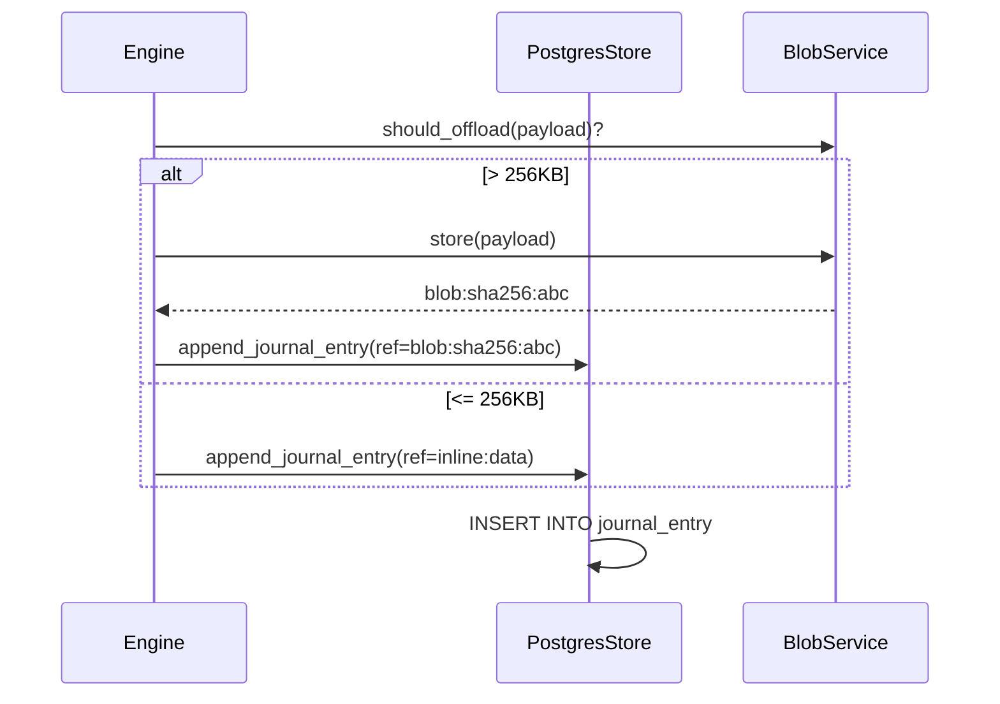
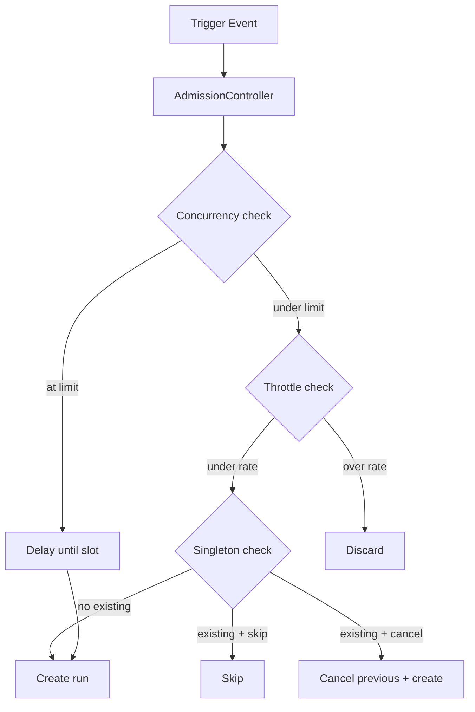
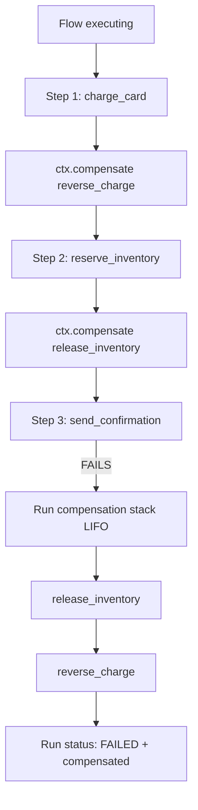

# Phase 5 — Production Hardening

**Goal:** PostgreSQL/MongoDB stores, blob service, flow control, saga, continue_as_new, Temporal adapter, HA, sandbox, OTel, RBAC, retention.

**Prerequisites:** Phase 1 (ExecutionStore protocol, DurabilityBackend). Benefits from Phase 2-3 (agent/toolset schemas).

**System Design References:** Chapters 4.5-4.8 (state, idempotency, structural replay, scheduling), 5.2 (persistent agents), 8.5 (admission control), 9 (full storage design), 10 (observability), 11 (security).

---

## 1. Exit Criteria & Success Metrics

| Metric | Gate | Target |
|--------|------|--------|
| Runs completing without intervention | >= 99.0% | >= 99.9% |
| Structural Replay false-green rate | 0 | 0 |
| PostgreSQL store passes full conformance suite | All | All |
| MongoDB store passes full conformance suite | All | All |
| OTel spans cover all 15 sufficiency questions | All | All |

**"Done" means:** A workflow runs against PostgreSQL or MongoDB with the same code as embedded mode. Flow control (concurrency, throttle, debounce, batch, singleton) gates admission. Saga compensation rolls back on failure. `continue_as_new` rotates forever-flows. Structural Replay shows green/amber/red plan. OTel traces answer all 15 sufficiency questions.

---

## 2. HLD — Production Architecture

```
┌──────────────────── Phase 5 Production Stack ────────────────────┐
│                                                                   │
│  ┌────────────┐  ┌────────────┐  ┌────────────────────┐         │
│  │ PostgreSQL  │  │  MongoDB   │  │  Temporal Adapter   │         │
│  │   Store     │  │   Store    │  │  (DurabilityBackend)│         │
│  │ (15+ tables)│  │ (documents)│  │                     │         │
│  └──────┬──────┘  └─────┬──────┘  └─────────┬──────────┘         │
│         │               │                    │                    │
│         └───────┬───────┘                    │                    │
│                 ▼                            │                    │
│         ExecutionStore                DurabilityBackend            │
│         (protocol)                   (protocol)                   │
│                                                                   │
│  ┌─────────────────────────────────────────────────────────┐     │
│  │                    Flow Control                          │     │
│  │  concurrency · throttle · rate · debounce · batch ·      │     │
│  │  singleton · priority · backpressure                     │     │
│  └─────────────────────────────────────────────────────────┘     │
│                                                                   │
│  ┌──────────┐ ┌──────────┐ ┌──────────┐ ┌──────────────────┐   │
│  │   Blob   │ │   Saga   │ │  OTel    │ │   RBAC           │   │
│  │  Service  │ │compensate│ │  Tracer  │ │ projects/envs    │   │
│  └──────────┘ └──────────┘ └──────────┘ └──────────────────┘   │
│                                                                   │
│  ┌──────────┐ ┌──────────┐ ┌──────────┐ ┌──────────────────┐   │
│  │ Sandbox  │ │ HA/Leader│ │Retention │ │Structural Replay │   │
│  │microVM   │ │ Election │ │Compaction│ │green/amber/red   │   │
│  └──────────┘ └──────────┘ └──────────┘ └──────────────────┘   │
└───────────────────────────────────────────────────────────────────┘
```

---

## 3. LLD — Subsystem Details

### 3.1 PostgreSQL Store

Implements `ExecutionStore` against the schema from system-design.md Chapter 9.2.

```python
# state/postgres.py (NEW)

class PostgresStore:
    """ExecutionStore backed by PostgreSQL with asyncpg."""

    def __init__(self, dsn: str, pool_size: int = 10):
        self._dsn = dsn
        self._pool: asyncpg.Pool | None = None

    async def initialize(self) -> None:
        """Create pool and run migrations."""
        self._pool = await asyncpg.create_pool(self._dsn, min_size=2, max_size=self._pool_size)
        await self._migrate()

    # --- Executions ---
    async def create_execution(self, record: ExecutionRecord) -> None:
        await self._pool.execute("""
            INSERT INTO run (id, tenant_id, flow_id, flow_version, status,
                            input_ref, idem_key, priority, partition_key, created_at)
            VALUES ($1, $2, $3, $4, $5, $6, $7, $8, $9, NOW())
        """, record.id, record.tenant_id, record.flow_id, ...)

    async def get_execution(self, run_id: str) -> ExecutionRecord | None:
        row = await self._pool.fetchrow("SELECT * FROM run WHERE id = $1", run_id)
        return self._row_to_record(row) if row else None

    # --- Journal ---
    async def append_journal_entry(self, run_id: str, entry: JournalEntry) -> None:
        await self._pool.execute("""
            INSERT INTO journal_entry (run_id, seq, step_id, kind, status, attempt,
                input_ref, output_ref, error_json, idem_key,
                contract_hash, closure_hash, agent_session_id, turn_index,
                started_at, ended_at, cost_usd)
            VALUES ($1, $2, $3, $4, $5, $6, $7, $8, $9, $10, $11, $12, $13, $14, $15, $16, $17)
        """, ...)

    async def load_journal(self, run_id: str) -> list[JournalEntry]:
        rows = await self._pool.fetch(
            "SELECT * FROM journal_entry WHERE run_id = $1 ORDER BY seq", run_id)
        return [self._row_to_entry(r) for r in rows]

    # --- Timers ---
    async def due_runs(self, now: datetime, *, limit: int = 100) -> list[str]:
        rows = await self._pool.fetch("""
            SELECT DISTINCT run_id FROM timer
            WHERE fire_at <= $1 ORDER BY fire_at LIMIT $2
        """, now, limit)
        return [r["run_id"] for r in rows]

    # --- KV Store ---
    async def kv_get(self, tenant_id: str, namespace: str, key: str) -> Any | None:
        row = await self._pool.fetchrow("""
            SELECT value_ref FROM kv_store
            WHERE tenant_id = $1 AND namespace = $2 AND key = $3
              AND (ttl IS NULL OR ttl > NOW())
        """, tenant_id, namespace, key)
        return decode(row["value_ref"]) if row else None
```

**Tables (from system-design.md):** `run`, `journal_entry`, `pause`, `timer`, `event`, `compensation`, `agent_session`, `agent_definition`, `authoring_session`, `flow_version`, `kv_store`, `blob`, `event_subscription`, `idem_record`.

**Partitioning:** `journal_entry` partitioned by `run_id` hash (hot table). `event` partitioned by month (time-series).

### 3.2 MongoDB Store

```python
# state/mongo.py (NEW)

class MongoStore:
    """ExecutionStore backed by MongoDB with motor."""

    def __init__(self, uri: str, db_name: str = "loom"):
        self._client = motor.motor_asyncio.AsyncIOMotorClient(uri)
        self._db = self._client[db_name]

    async def create_execution(self, record: ExecutionRecord) -> None:
        doc = {
            "_id": record.id,
            "tenant_id": record.tenant_id,
            "flow_id": record.flow_id,
            "status": record.status.value,
            "journal": [],  # embedded for small runs
            "state": {},
            "created_at": datetime.now(UTC),
        }
        await self._db.runs.insert_one(doc)

    async def append_journal_entry(self, run_id: str, entry: JournalEntry) -> None:
        # Embed in run document if < 256 entries
        result = await self._db.runs.update_one(
            {"_id": run_id, "journal.255": {"$exists": False}},
            {"$push": {"journal": entry.model_dump()}}
        )
        if result.modified_count == 0:
            # Overflow to separate collection
            await self._db.journal_overflow.update_one(
                {"_id": f"{run_id}:overflow"},
                {"$push": {"entries": entry.model_dump()}},
                upsert=True,
            )

    async def load_journal(self, run_id: str) -> list[JournalEntry]:
        doc = await self._db.runs.find_one({"_id": run_id}, {"journal": 1})
        entries = [JournalEntry(**e) for e in doc.get("journal", [])]
        # Check overflow
        overflow = await self._db.journal_overflow.find_one({"_id": f"{run_id}:overflow"})
        if overflow:
            entries.extend([JournalEntry(**e) for e in overflow.get("entries", [])])
        return sorted(entries, key=lambda e: e.seq)
```

**Design choices:** Small journals (<256 entries) embedded in run document for single-read efficiency. Large journals overflow. TTL indexes on `expires_at` fields.

### 3.3 Blob Service

```python
# storage/blob.py (NEW)

class BlobService:
    """Content-addressed payload offload for payloads > 256KB."""

    def __init__(self, backend: BlobBackend):
        self._backend = backend

    async def store(self, data: bytes, mime: str = "application/json") -> str:
        """Store data, return content-addressed reference."""
        content_hash = hashlib.sha256(data).hexdigest()
        ref = f"blob:{content_hash}"
        if not await self._backend.exists(ref):
            await self._backend.put(ref, data, mime)
        return ref

    async def load(self, ref: str) -> bytes:
        return await self._backend.get(ref)

    def should_offload(self, data: bytes) -> bool:
        return len(data) > 256 * 1024  # 256 KB threshold (D5)

class BlobBackend(Protocol):
    async def put(self, ref: str, data: bytes, mime: str) -> None: ...
    async def get(self, ref: str) -> bytes: ...
    async def exists(self, ref: str) -> bool: ...
    async def delete(self, ref: str) -> None: ...

class LocalBlobBackend:
    """Filesystem-backed blob storage for embedded profile."""
    ...

class S3BlobBackend:
    """S3-compatible blob storage for production."""
    ...
```

### 3.4 Flow Control

```python
# runtime/flowcontrol.py (NEW)

class FlowControlPolicy(BaseModel):
    concurrency: ConcurrencyPolicy | None = None
    throttle: ThrottlePolicy | None = None
    rate_limit: RateLimitPolicy | None = None
    debounce: DebouncePolicy | None = None
    batch: BatchPolicy | None = None
    singleton: SingletonPolicy | None = None
    priority: Callable | None = None

class ConcurrencyPolicy(BaseModel):
    limit: int
    key: Callable | str | None = None  # partition by

class AdmissionController:
    """Evaluates flow control policies before creating runs."""

    async def admit(self, flow: FlowRef, event: TriggerEvent,
                     policy: FlowControlPolicy) -> AdmissionDecision:
        if policy.concurrency:
            in_flight = await self._count_in_flight(flow, policy.concurrency.key, event)
            if in_flight >= policy.concurrency.limit:
                return AdmissionDecision.DELAY

        if policy.singleton:
            existing = await self._find_existing(flow, policy.singleton.key, event)
            if existing:
                if policy.singleton.mode == "skip":
                    return AdmissionDecision.SKIP
                elif policy.singleton.mode == "cancel_previous":
                    await self._cancel(existing)

        if policy.debounce:
            return AdmissionDecision.DEBOUNCE(period=policy.debounce.period)

        if policy.batch:
            return await self._accumulate(flow, event, policy.batch)

        return AdmissionDecision.ADMIT
```

### 3.5 Saga / Compensation

```python
# runtime/context.py — addition

async def compensate(self, fn: Callable, *args: Any) -> None:
    """Register a LIFO compensation handler. On failure, handlers run in reverse order."""
    path = self._scope.allocate()
    entry = self._journal.lookup(path)
    if entry and entry.status == EntryStatus.COMPLETED:
        return  # already registered

    self._compensation_stack.append((fn, args))
    self._journal.append(path, EntryKind.STEP, EntryStatus.COMPLETED,
                         output=encode({"fn": fn.__name__, "args": args}))

# Compensation execution on flow failure:
async def _run_compensations(self) -> None:
    """Execute compensation stack in LIFO order."""
    for fn, args in reversed(self._compensation_stack):
        try:
            await fn(*args)
        except Exception as e:
            logger.error(f"Compensation {fn.__name__} failed: {e}")
            # Log but don't stop — best effort
```

### 3.6 ctx.patched — Version Gates

```python
# runtime/context.py — addition

def patched(self, name: str) -> bool:
    """Version gate for in-flight migration. Returns True if patch is active."""
    # Check if current flow_version has this patch enabled
    return name in self._active_patches
```

### 3.7 ctx.continue_as_new

```python
# runtime/context.py — addition

async def continue_as_new(self, seed: Any) -> NoReturn:
    """Rotate a forever-flow. Starts a new run with seed, current run completes."""
    # 1. Journal the rotation
    path = self._scope.allocate()
    self._journal.append(path, EntryKind.STEP, EntryStatus.COMPLETED,
                         output=encode({"rotation_seed": seed}))

    # 2. Start new run with seed
    await self._backend.child(
        StepKey(step_id="continue_as_new", ...),
        FlowRef(flow_id=self._flow_id),
        seed, detached=True,
    )

    # 3. Mark current run as completed (rotated)
    raise _ContinueAsNew(seed)
```

### 3.8 Temporal Adapter

```python
# backends/temporal.py (NEW)

class TemporalBackend:
    """DurabilityBackend implementation for Temporal."""

    def __init__(self, client: temporalio.Client, task_queue: str = "loom"):
        self._client = client
        self._task_queue = task_queue

    def capabilities(self) -> Capabilities:
        return Capabilities(
            journal_introspection=False,  # Temporal owns the history
            continue_as_new=True,
            searchable_attributes=True,
            sub_second_timers=False,
        )

    async def step(self, key: StepKey, fn: Callable, *, policy: StepPolicy) -> Any:
        # Map to Temporal activity execution
        return await temporalio.workflow.execute_activity(
            fn, args=(key,), start_to_close_timeout=policy.timeout,
            retry_policy=self._map_retry(policy.retry),
        )

    async def sleep(self, key: StepKey, until: datetime) -> None:
        await temporalio.workflow.sleep_until(until)

    async def child(self, key: StepKey, flow: FlowRef, inp: Any, *,
                     detached: bool = False) -> Any:
        return await temporalio.workflow.execute_child_workflow(
            flow.flow_id, inp, id=f"{flow.flow_id}-{key.step_id}",
        )
```

**Conformance suite:** A set of tests that verify any `DurabilityBackend` implements all Tier-1 operations correctly. Run against `EmbeddedBackend` and `TemporalBackend`.

### 3.9 HA / Leader Election

```python
# runtime/leader.py (NEW)

class LeaderElector:
    """Leader election for scheduler, timer wheel, and cron triggers."""

    def __init__(self, lock_provider: LockProvider, node_id: str):
        self._lock = lock_provider
        self._node_id = node_id

    async def acquire_leadership(self, group: str, ttl: float = 30.0) -> bool:
        return await self._lock.acquire(f"leader:{group}", self._node_id, ttl)

    async def renew(self, group: str, ttl: float = 30.0) -> bool:
        return await self._lock.renew(f"leader:{group}", self._node_id, ttl)
```

### 3.10 OTel Integration

```python
# observability/otel.py (NEW)

from opentelemetry import trace
from opentelemetry.trace import Span, Tracer as OTelTracerAPI

class OTelTracer:
    """OpenTelemetry tracer implementing the Tracer protocol."""

    def __init__(self, service_name: str = "loom"):
        self._tracer = trace.get_tracer(service_name)

    def start_span(self, name: str, attributes: dict | None = None) -> OTelSpan:
        span = self._tracer.start_span(name, attributes=attributes)
        return OTelSpan(span)

    def end_span(self, span: OTelSpan, status: str = "ok") -> None:
        span._span.set_status(trace.StatusCode.OK if status == "ok" else trace.StatusCode.ERROR)
        span._span.end()

# GenAI span conventions
SPAN_ATTRS = {
    "loom.run_id": "run_id",
    "loom.flow_id": "flow_id",
    "loom.step_id": "step_id",
    "loom.step_class": "klass",
    "loom.attempt": "attempt",
    "gen_ai.system": "model_provider",
    "gen_ai.request.model": "model",
    "gen_ai.usage.input_tokens": "input_tokens",
    "gen_ai.usage.output_tokens": "output_tokens",
}
```

### 3.11 Structural Replay

```python
# runtime/structural_replay.py (NEW)

class ReplayPlan(BaseModel):
    steps: list[StepPlan]

class StepPlan(BaseModel):
    step_id: str
    status: str  # "reuse" (green) | "recompute" (amber) | "ask" (amber) | "invalidate" (red)
    reason: str
    estimated_cost: float = 0.0
    external_effects: list[str] = []  # effects that will be re-issued

def plan_structural_replay(old_lock: dict, new_lock: dict,
                            journal: list[JournalEntry]) -> ReplayPlan:
    """Compare steps.lock hashes to build green/amber/red plan."""
    plans = []
    for step_id, old_identity in old_lock.items():
        new_identity = new_lock.get(step_id)
        entry = next((e for e in journal if e.step_id == step_id), None)

        if new_identity is None:
            plans.append(StepPlan(step_id=step_id, status="orphan", reason="Step removed"))
        elif (old_identity.contract_hash == new_identity.contract_hash and
              old_identity.closure_hash == new_identity.closure_hash):
            plans.append(StepPlan(step_id=step_id, status="reuse", reason="Unchanged"))
        elif old_identity.klass == "pure" and old_identity.contract_hash == new_identity.contract_hash:
            plans.append(StepPlan(step_id=step_id, status="recompute", reason="Pure step changed"))
        elif old_identity.contract_hash == new_identity.contract_hash:
            plans.append(StepPlan(step_id=step_id, status="ask",
                                  reason="Effect closure changed, contract same"))
        else:
            plans.append(StepPlan(step_id=step_id, status="invalidate",
                                  reason="Contract changed", estimated_cost=...))

    # New steps
    for step_id in new_lock:
        if step_id not in old_lock:
            plans.append(StepPlan(step_id=step_id, status="new", reason="New step"))

    return ReplayPlan(steps=plans)
```

### 3.12 RBAC

```python
# security/rbac.py (NEW)

class Role(StrEnum):
    ADMIN = "admin"
    DEVELOPER = "developer"
    OPERATOR = "operator"
    VIEWER = "viewer"

class Permission(StrEnum):
    FLOW_AUTHOR = "flow:author"
    FLOW_DEPLOY = "flow:deploy"
    FLOW_RUN = "flow:run"
    FLOW_CANCEL = "flow:cancel"
    RUN_VIEW = "run:view"
    GRANT_APPROVE = "grant:approve"
    ADMIN_ALL = "admin:*"

ROLE_PERMISSIONS = {
    Role.ADMIN: {Permission.ADMIN_ALL},
    Role.DEVELOPER: {Permission.FLOW_AUTHOR, Permission.FLOW_DEPLOY, Permission.FLOW_RUN,
                     Permission.FLOW_CANCEL, Permission.RUN_VIEW},
    Role.OPERATOR: {Permission.FLOW_RUN, Permission.FLOW_CANCEL, Permission.RUN_VIEW},
    Role.VIEWER: {Permission.RUN_VIEW},
}
```

### 3.13 Retention / Compaction

```python
# storage/retention.py (NEW)

class RetentionPolicy(BaseModel):
    journal_hot_days: int = 7
    journal_warm_days: int = 90
    payload_hot_days: int = 7
    payload_warm_days: int = 30
    run_record_days: int = 365

class RetentionManager:
    async def compact(self, store: ExecutionStore, policy: RetentionPolicy) -> CompactionResult:
        """Run retention compaction. Typically called by cron."""
        # 1. Archive old journals
        # 2. Delete expired payloads
        # 3. Archive completed run records
        # 4. Clean expired KV entries
        ...
```

---

## 4. Directory Structure

### New Files

| File | Purpose |
|------|---------|
| `state/postgres.py` | PostgresStore — full ExecutionStore |
| `state/mongo.py` | MongoStore — document-based ExecutionStore |
| `storage/__init__.py` | Storage package |
| `storage/blob.py` | BlobService, BlobBackend, LocalBlobBackend, S3BlobBackend |
| `storage/retention.py` | RetentionPolicy, RetentionManager |
| `runtime/flowcontrol.py` | FlowControlPolicy, AdmissionController |
| `runtime/structural_replay.py` | ReplayPlan, plan_structural_replay |
| `runtime/leader.py` | LeaderElector |
| `backends/__init__.py` | Backends package |
| `backends/temporal.py` | TemporalBackend |
| `observability/otel.py` | OTelTracer |
| `security/rbac.py` | Role, Permission, RBAC |

### Modified Files

| File | Changes |
|------|---------|
| `runtime/context.py` | Add `compensate`, `patched`, `continue_as_new` |
| `runtime/engine.py` | Flow control integration, compensation execution |
| `state/base.py` | Blob-aware payload methods |
| `pyproject.toml` | Optional extras: `[postgres]`, `[mongodb]`, `[temporal]`, `[otel]` |

---

## 5. Implementation Steps

### Step 1: PostgreSQL Store (6-8 hours)
1. Create schema migration SQL
2. Implement all `ExecutionStore` methods
3. Run full conformance suite

### Step 2: MongoDB Store (4-6 hours)
1. Implement with embedded/overflow journal pattern
2. TTL indexes, compound indexes
3. Run full conformance suite

### Step 3: Blob Service (2-3 hours)
1. BlobBackend protocol + LocalBlobBackend + S3BlobBackend
2. Wire into journal payload handling (D5 threshold)

### Step 4: Flow Control (4-6 hours)
1. All 7 primitives: concurrency, throttle, rate, debounce, batch, singleton, priority
2. Integration with trigger ingress

### Step 5: Saga / Compensation (2-3 hours)
1. ctx.compensate in Context
2. LIFO execution on flow failure
3. compensation table

### Step 6: Version Gates & Continue-as-New (2-3 hours)
1. ctx.patched
2. ctx.continue_as_new with rotation

### Step 7: Structural Replay (3-4 hours)
1. Plan computation from steps.lock diff
2. CLI: `loom replay --plan <run_id>`
3. User approval UI for amber/red steps

### Step 8: Temporal Adapter (4-6 hours)
1. TemporalBackend implementing DurabilityBackend
2. Conformance suite

### Step 9: OTel Integration (2-3 hours)
1. OTelTracer implementing Tracer protocol
2. GenAI span conventions
3. Wire into engine, agent runtime

### Step 10: HA & Leader Election (2-3 hours)
1. LeaderElector using LockProvider
2. Scheduler, timer wheel, cron leader election

### Step 11: RBAC (2-3 hours)
1. Role/Permission model
2. Middleware for API endpoints

### Step 12: Retention / Compaction (2-3 hours)
1. RetentionPolicy model
2. Compaction logic
3. CLI: `loom compact`

### Step 13: Store Conformance Suite (2-3 hours)
1. Parameterized test suite that runs against any ExecutionStore
2. Tests: MemoryStore, SQLiteStore, PostgresStore, MongoStore all pass

---

## 6. Data Flow Diagrams

### PostgreSQL Write Path



### Flow Control Admission



### Saga Compensation



---

## 7. Multi-Angle Review

### Performance
- **PostgreSQL:** Batch journal writes. Partitioned `journal_entry` table. Connection pooling via asyncpg.
- **MongoDB:** Embedded journal avoids join. Read-one-document for small runs.
- **Blob offload:** Prevents journal bloat. Content-addressed deduplication.
- **Flow control:** In-memory counts + periodic sync to store. Acceptable lag for non-critical admission.

### Security
- **RBAC enforcement:** Check at API layer, not engine layer. Engine trusts the caller.
- **Sandbox:** Phase 5 introduces microVM/gVisor. Untrusted code runs in isolated environment.
- **Credential rotation:** `AuthExpired` error → run parks → credential refreshed → resume.

### Data Integrity
- **Structural Replay:** False-green rate must be 0. Conservative: any ambiguity → "ask" (amber).
- **Compensation:** Best-effort. If compensation fails, log and continue (don't double-fail).
- **Retention:** Never delete in-flight run data. Only archive completed runs past TTL.

---

## 8. Test Plan

### Store Conformance Suite (parameterized)
Run against every `ExecutionStore` implementation:
- `test_create_get_execution`
- `test_journal_append_load`
- `test_timer_schedule_due`
- `test_event_enqueue_take`
- `test_kv_get_set_delete`
- `test_kv_ttl_expiry`
- `test_idempotency_key`
- `test_concurrent_writes`

### Phase 5 Specific Tests
| Test | What |
|------|------|
| `test_blob_offload` | Payload > 256KB → blob ref in journal |
| `test_concurrency_limit` | 11th run delayed when limit=10 |
| `test_debounce` | Rapid events → one run after quiet period |
| `test_saga_compensation` | Failure → LIFO rollback |
| `test_continue_as_new` | Forever-flow rotates, new run starts |
| `test_structural_replay_plan` | Correct green/amber/red classification |
| `test_temporal_conformance` | TemporalBackend passes Tier-1 suite |
| `test_otel_spans` | Spans emitted for run/step/agent |
| `test_leader_election` | Only one node is leader at a time |

---

## 9. Known Gaps & Risks

| Gap | Impact | Mitigation |
|-----|--------|------------|
| **Temporal SDK version** | temporalio Python SDK may change API | Pin version, track upstream |
| **MongoDB journal overflow** | Separate collection adds read complexity | Optimize with capped collection or bucketed pattern |
| **Sandbox platform** | microVM/gVisor not available on all platforms | Make sandbox optional; default to process isolation |
| **RBAC granularity** | Flow-level RBAC may not be enough for enterprise | Start simple (project/env/role), extend later |
| **PostgreSQL migrations** | Schema evolution across versions | Use alembic for migrations |
| **Flow control state** | In-memory counts may drift from reality | Periodic reconciliation with store |

---

## 10. Documentation Updates

1. **CLAUDE.md:** Add PostgresStore, MongoStore to extension points. Document optional extras.
2. **Deployment guide:** How to configure each profile (embedded, server, external-durability).
3. **Migration guide:** Moving from SQLite to PostgreSQL.
