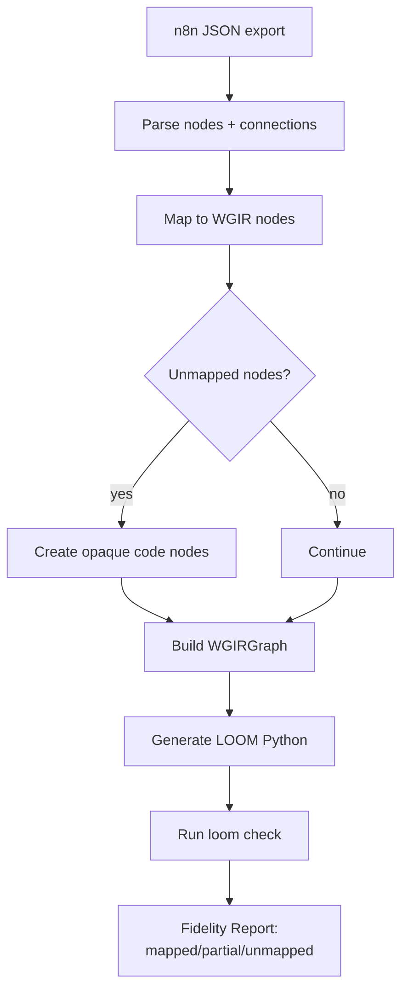
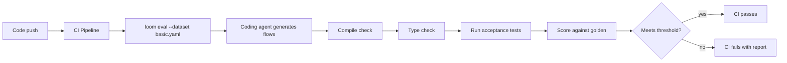
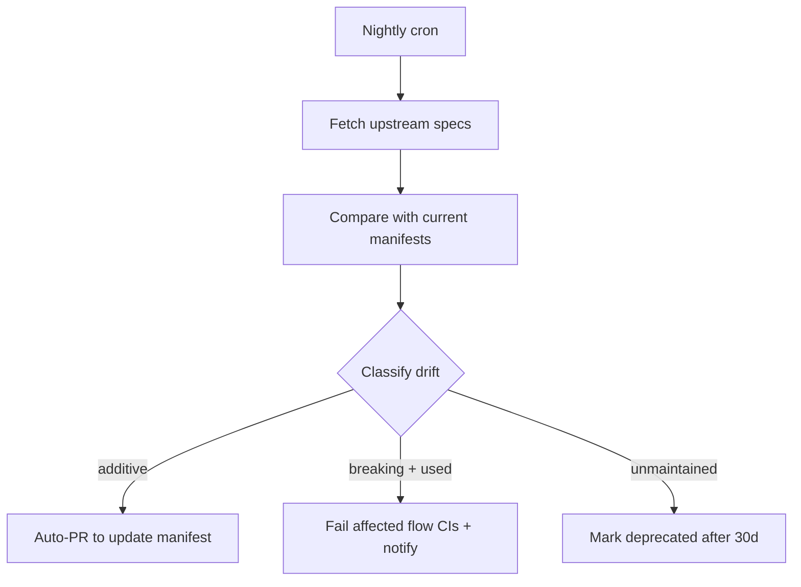

# Phase 6 — Ecosystem

**Goal:** n8n importer, templates, community toolsets, Knowledge/Memory/Skill kinds, drift detection, eval framework, VS Code extension.

**Prerequisites:** Phase 2-3 complete. Benefits from Phase 4-5 for full features.

**System Design References:** Chapters 6.2 (scaling), 6.5 (toolset registration), 14 (Phase 6 scope).

---

## 1. Exit Criteria & Success Metrics

| Metric | Gate | Target |
|--------|------|--------|
| n8n import fidelity | >= 70% | >= 90% |
| Community toolset packages installable | 5+ | 20+ |
| Eval framework CI gate works | Yes | Yes |
| VS Code extension renders canvas | Yes | Yes |

**"Done" means:** A user can import an n8n workflow and get a generated LOOM flow with a fidelity report. Community members can publish toolset packages that auto-register via pip entry points. An eval framework runs benchmark datasets through the coding agent and CI-gates regressions. A VS Code extension shows the canvas and supports debugging.

---

## 2. HLD — Ecosystem Architecture

```
┌─────────────────────── Phase 6 Ecosystem ───────────────────────┐
│                                                                   │
│  ┌──────────────────┐  ┌──────────────────┐  ┌───────────────┐  │
│  │   n8n Importer    │  │   Templates      │  │  Community    │  │
│  │   JSON → WGIR     │  │   export/import  │  │  Toolsets     │  │
│  │   → generated code│  │   parameterize   │  │  Plugin SDK   │  │
│  └──────────────────┘  └──────────────────┘  └───────────────┘  │
│                                                                   │
│  ┌──────────────────┐  ┌──────────────────┐  ┌───────────────┐  │
│  │  Knowledge /      │  │  Drift Detection │  │   Eval        │  │
│  │  Memory / Skill   │  │  nightly re-gen  │  │  Framework    │  │
│  │  toolset kinds    │  │  from upstream    │  │  datasets +   │  │
│  └──────────────────┘  └──────────────────┘  │  judges + CI  │  │
│                                               └───────────────┘  │
│  ┌─────────────────────────────────────────────────────────────┐ │
│  │                    VS Code Extension                         │ │
│  │  canvas view · debugging · IntelliSense · loom commands     │ │
│  └─────────────────────────────────────────────────────────────┘ │
└───────────────────────────────────────────────────────────────────┘
```

---

## 3. LLD — Subsystem Details

### 3.1 n8n Importer

Converts n8n JSON workflow files to LOOM workflows.

```python
# importers/n8n.py (NEW)

class N8nImporter:
    """Import n8n JSON workflows into LOOM code."""

    def import_workflow(self, n8n_json: dict) -> ImportResult:
        """Parse n8n JSON → WGIR → generated LOOM code + fidelity report."""
        # 1. Parse n8n nodes and connections
        nodes = self._parse_nodes(n8n_json["nodes"])
        connections = self._parse_connections(n8n_json["connections"])

        # 2. Map n8n nodes to LOOM constructs
        wgir = self._to_wgir(nodes, connections)

        # 3. Generate LOOM code from WGIR
        code = self._generate_code(wgir)

        # 4. Build fidelity report
        report = self._fidelity_report(nodes, wgir)

        return ImportResult(code=code, wgir=wgir, report=report)

    def _parse_nodes(self, n8n_nodes: list[dict]) -> list[N8nNode]:
        """Parse n8n node definitions."""
        result = []
        for node in n8n_nodes:
            result.append(N8nNode(
                id=node["id"],
                type=node["type"],           # e.g., "n8n-nodes-base.httpRequest"
                name=node["name"],
                parameters=node.get("parameters", {}),
                position=node.get("position", [0, 0]),
            ))
        return result

    def _to_wgir(self, nodes: list[N8nNode], connections: list) -> WGIRGraph:
        """Map n8n constructs to WGIR nodes and edges."""
        wgir_nodes = []
        for n8n_node in nodes:
            mapping = N8N_NODE_MAP.get(n8n_node.type)
            if mapping:
                wgir_nodes.append(mapping.to_wgir(n8n_node))
            else:
                # Unknown node type → opaque code node
                wgir_nodes.append(WGIRNode(
                    id=n8n_node.id,
                    kind=NodeKind.CODE,
                    label=n8n_node.name,
                    metadata={"n8n_type": n8n_node.type, "fidelity": "low"},
                ))
        ...

class ImportResult(BaseModel):
    code: str                            # generated Python source
    wgir: WGIRGraph                      # extracted graph
    report: FidelityReport               # what was imported vs skipped

class FidelityReport(BaseModel):
    total_nodes: int
    mapped_nodes: int                    # successfully mapped to LOOM constructs
    partial_nodes: int                   # mapped but with caveats
    unmapped_nodes: int                  # could not map (opaque code blocks)
    warnings: list[str]
    fidelity_score: float                # mapped / total

# n8n → LOOM node mapping table
N8N_NODE_MAP = {
    "n8n-nodes-base.httpRequest": HttpRequestMapping(),
    "n8n-nodes-base.slack": SlackMapping(),
    "n8n-nodes-base.if": IfMapping(),
    "n8n-nodes-base.merge": GatherMapping(),
    "n8n-nodes-base.wait": SleepMapping(),
    "n8n-nodes-base.code": CodeMapping(),
    "n8n-nodes-base.webhook": WebhookTriggerMapping(),
    "n8n-nodes-base.schedule": ScheduleTriggerMapping(),
    # ... more mappings
}
```

### 3.2 Template System

```python
# templates/template.py (NEW)

class TemplateManifest(BaseModel):
    id: str
    name: str
    description: str
    category: str                        # "crm" | "billing" | "devops" | ...
    tags: list[str] = []
    parameters: list[TemplateParam] = []
    source_file: str                     # relative path to the flow file
    toolsets: list[str] = []             # required toolsets
    version: str = "1.0.0"

class TemplateParam(BaseModel):
    name: str
    description: str
    type: str                            # "string" | "int" | "bool" | "enum"
    default: Any = None
    required: bool = True
    enum_values: list[str] = []

class TemplateEngine:
    """Export and import workflow templates."""

    def export(self, flow_file: Path) -> TemplateManifest:
        """Extract a template from an existing flow."""
        # Parse flow, identify parameterizable values
        # Generate manifest with parameters
        ...

    def instantiate(self, template: TemplateManifest,
                     params: dict[str, Any]) -> str:
        """Generate a flow from a template with parameter substitution."""
        source = Path(template.source_file).read_text()
        for param in template.parameters:
            value = params.get(param.name, param.default)
            source = source.replace(f"{{{{ {param.name} }}}}", str(value))
        return source

    def list_templates(self, category: str | None = None) -> list[TemplateManifest]:
        """List available templates."""
        ...
```

### 3.3 Community Toolset SDK

The SDK for community members to create and publish toolset packages.

**Package structure:**

```
loom-toolset-my-service/
├── pyproject.toml
├── src/
│   └── loom_toolset_my_service/
│       ├── __init__.py          # exports ToolsetManifest
│       ├── manifest.py          # toolset definition
│       ├── models.py            # Pydantic input/output models
│       ├── client.py            # async client
│       ├── fakes.py             # fake implementations for testing
│       └── scopes.json          # op → required scopes
├── tests/
│   ├── test_contract.py         # contract tests against sandbox
│   └── test_fakes.py            # fake implementation tests
└── CARD.md                      # Tier-2 op table (auto-generated)
```

**pyproject.toml entry point:**

```toml
[project.entry-points."loom_toolset"]
my-service = "loom_toolset_my_service:manifest"
```

```python
# Community toolset __init__.py
from loom_toolset_my_service.manifest import manifest

# manifest.py
from loom.toolsets import ToolsetManifest, OperationSpec

manifest = ToolsetManifest(
    id="my-service",
    version="1.0.0",
    summary="My custom service integration",
    groups={
        "items": [
            OperationSpec(id="items.create", summary="Create an item", ...),
            OperationSpec(id="items.list", summary="List items", ...),
        ],
    },
)
```

### 3.4 Knowledge/Memory/Skill Toolset Kinds

Reserved namespaces (D8) for special-purpose toolsets:

```python
# toolsets/kinds.py (NEW)

class ToolsetKind(StrEnum):
    APP = "app"              # standard integration (Slack, Jira, etc.)
    MCP = "mcp"              # MCP server tools
    KNOWLEDGE = "knowledge"  # retrieval / RAG
    MEMORY = "memory"        # agent long-term memory
    SKILL = "skill"          # reusable agent capabilities

# Reserved namespace prefixes
RESERVED_NAMESPACES = {
    "knowledge": ToolsetKind.KNOWLEDGE,   # knowledge.* toolsets
    "memory": ToolsetKind.MEMORY,         # memory.* toolsets
    "skill": ToolsetKind.SKILL,           # skill.* toolsets
}

# Knowledge toolset interface
class KnowledgeToolset(BaseModel):
    """RAG / retrieval toolset."""
    id: str  # must start with "knowledge."
    sources: list[KnowledgeSource]

    class Config:
        ops = [
            OperationSpec(id="search", summary="Search knowledge base"),
            OperationSpec(id="retrieve", summary="Retrieve specific document"),
            OperationSpec(id="ingest", summary="Add content to knowledge base",
                          effect=EffectClass.WRITE),
        ]

# Memory toolset interface
class MemoryToolset(BaseModel):
    """Agent long-term memory."""
    id: str  # must start with "memory."
    ops = [
        OperationSpec(id="remember", summary="Store a memory", effect=EffectClass.WRITE),
        OperationSpec(id="recall", summary="Retrieve relevant memories"),
        OperationSpec(id="forget", summary="Delete a memory", effect=EffectClass.DESTRUCTIVE),
    ]

# Skill toolset interface
class SkillToolset(BaseModel):
    """Reusable agent capability (e.g., web browsing, code execution)."""
    id: str  # must start with "skill."
    # Skills are bundles of tools that work together
```

### 3.5 Drift Detection

```python
# toolsets/drift.py (NEW)

class DriftDetector:
    """Detect changes in upstream API specs and manage toolset updates."""

    async def check_drift(self, manifest: ToolsetManifest,
                           upstream_spec_url: str) -> DriftReport:
        """Compare current manifest against upstream spec."""
        upstream = await self._fetch_spec(upstream_spec_url)
        current_ops = {op.id for g in manifest.groups.values() for op in g}
        upstream_ops = self._extract_ops(upstream)

        added = upstream_ops - current_ops
        removed = current_ops - upstream_ops
        changed = self._detect_signature_changes(manifest, upstream)

        return DriftReport(
            toolset_id=manifest.id,
            added_ops=list(added),
            removed_ops=list(removed),
            changed_ops=changed,
            severity=self._classify_severity(added, removed, changed),
        )

class DriftReport(BaseModel):
    toolset_id: str
    added_ops: list[str]           # additive — auto-PR
    removed_ops: list[str]         # breaking — warn
    changed_ops: list[ChangedOp]   # breaking if used — fail CI
    severity: str                  # "additive" | "breaking" | "unmaintained"

# Nightly CI job:
# for each toolset with upstream_spec_url:
#   drift = await detector.check_drift(manifest, url)
#   if drift.severity == "additive": create_auto_pr(drift)
#   if drift.severity == "breaking": fail_ci(drift)
#   if drift.severity == "unmaintained": mark_deprecated(manifest)
```

### 3.6 Eval Framework

```python
# eval/__init__.py (NEW package)

class EvalDataset(BaseModel):
    """A benchmark dataset for evaluating the workflow coding agent."""
    id: str
    name: str
    description: str = ""
    cases: list[EvalCase]
    version: str = "1.0.0"

class EvalCase(BaseModel):
    id: str
    input: str                          # natural language spec
    expected_flow_id: str | None = None # expected flow structure
    expected_steps: list[str] = []      # expected step names
    expected_toolsets: list[str] = []   # expected toolset usage
    golden_code: str | None = None      # reference implementation
    acceptance_tests: list[str] = []    # test function names
    difficulty: str = "medium"          # "easy" | "medium" | "hard"
    tags: list[str] = []

class EvalJudge(Protocol):
    """Scores a generated workflow against an eval case."""
    async def score(self, case: EvalCase, generated_code: str,
                     execution_result: Any | None) -> EvalScore: ...

class EvalScore(BaseModel):
    case_id: str
    compile_pass: bool                  # does it compile?
    type_check_pass: bool               # passes mypy/loom check?
    behavioral_pass: bool               # passes acceptance tests?
    structural_score: float             # 0-1: step overlap with expected
    code_quality_score: float           # 0-1: lint + style
    overall: float                      # weighted composite

class EvalRunner:
    """Run eval datasets and produce reports."""

    def __init__(self, coding_agent: Agent, judge: EvalJudge):
        self._agent = coding_agent
        self._judge = judge

    async def run_dataset(self, dataset: EvalDataset) -> EvalReport:
        scores = []
        for case in dataset.cases:
            # 1. Have the coding agent generate a workflow
            generated = await self._agent(case.input)

            # 2. Try to compile and type-check
            compile_ok = await self._try_compile(generated)
            type_ok = await self._try_type_check(generated)

            # 3. Try to run acceptance tests
            behavioral_ok = await self._run_tests(generated, case.acceptance_tests)

            # 4. Score
            score = await self._judge.score(case, generated, None)
            scores.append(score)

        return EvalReport(
            dataset_id=dataset.id,
            scores=scores,
            aggregate=self._aggregate(scores),
        )

class EvalReport(BaseModel):
    dataset_id: str
    scores: list[EvalScore]
    aggregate: AggregateScore

class AggregateScore(BaseModel):
    compile_rate: float
    type_check_rate: float
    behavioral_pass_rate: float
    mean_structural: float
    mean_overall: float
```

**CI integration:**

```python
# In CI pipeline:
# loom eval --dataset benchmarks/basic.yaml --gate compile_rate>=0.80
```

### 3.7 VS Code Extension

The VS Code extension is a separate TypeScript project:

```
loom-vscode/
├── package.json
├── src/
│   ├── extension.ts            # activation, commands
│   ├── canvas/
│   │   ├── CanvasPanel.ts      # WebviewPanel for graph
│   │   └── renderer.ts         # graph.json → SVG/canvas
│   ├── debugging/
│   │   ├── LoomDebugAdapter.ts # DAP adapter
│   │   └── journal.ts          # journal viewer
│   ├── intellisense/
│   │   ├── completion.ts       # ctx.* completions
│   │   └── diagnostics.ts      # LOOM-D* lint
│   └── commands/
│       ├── run.ts              # loom run from editor
│       ├── check.ts            # loom check from editor
│       └── search.ts           # loom search from editor
├── media/
│   └── canvas.css
└── test/
```

**Features:**
- **Canvas view:** Read `graph.json` and render as interactive graph in a WebviewPanel.
- **Run overlay:** Connect to running `loom dev` and show live run status on canvas.
- **Debugging:** Custom Debug Adapter Protocol adapter that maps journal entries to source locations.
- **IntelliSense:** Completions for `ctx.*` methods, `@pure`/`@effect` decorators, trigger types.
- **Diagnostics:** Run `loom check` on save and show LOOM-D* diagnostics inline.
- **Commands:** `Loom: Run Flow`, `Loom: Check`, `Loom: Search Toolset` in command palette.

---

## 4. Directory Structure

### New Files (Python)

| File | Purpose |
|------|---------|
| `importers/__init__.py` | Importers package |
| `importers/n8n.py` | N8nImporter, N8N_NODE_MAP, FidelityReport |
| `templates/__init__.py` | Templates package |
| `templates/template.py` | TemplateManifest, TemplateEngine |
| `toolsets/kinds.py` | ToolsetKind, KnowledgeToolset, MemoryToolset, SkillToolset |
| `toolsets/drift.py` | DriftDetector, DriftReport |
| `eval/__init__.py` | Eval package |
| `eval/dataset.py` | EvalDataset, EvalCase |
| `eval/judge.py` | EvalJudge protocol, scoring |
| `eval/runner.py` | EvalRunner, EvalReport |

### New Project (TypeScript)

| Directory | Purpose |
|-----------|---------|
| `loom-vscode/` | VS Code extension (separate repo/project) |

### Modified Files

| File | Changes |
|------|---------|
| `cli.py` | Add `loom import n8n`, `loom template`, `loom eval` |
| `toolsets/registry.py` | Handle reserved namespaces for knowledge/memory/skill |

---

## 5. Implementation Steps

### Step 1: n8n Importer (4-6 hours)
1. Parse n8n JSON format (nodes, connections, credentials, settings)
2. Build node mapping table (top 30 n8n node types)
3. Generate WGIR from n8n graph
4. Code generator from WGIR to LOOM Python
5. Fidelity report
6. Tests: import sample n8n workflows, verify code compiles

### Step 2: Template System (2-3 hours)
1. TemplateManifest format
2. Export from existing flow (parameterize)
3. Instantiate from template
4. Tests: export → instantiate round-trip

### Step 3: Community Toolset SDK (3-4 hours)
1. Document package structure
2. Create `loom create-toolset` CLI command (scaffolding)
3. Entry point discovery enhanced
4. Example toolset package
5. Tests: create, install, auto-register

### Step 4: Knowledge/Memory/Skill Kinds (2-3 hours)
1. Define interfaces for each kind
2. Reserved namespace enforcement
3. Default implementations (in-memory knowledge, simple memory)
4. Tests: register and use each kind

### Step 5: Drift Detection (2-3 hours)
1. DriftDetector implementation
2. Nightly CI job template
3. Auto-PR for additive changes
4. Tests: detect added/removed/changed ops

### Step 6: Eval Framework (4-6 hours)
1. Dataset format (YAML)
2. EvalJudge protocol
3. EvalRunner with compile/type-check/behavioral gates
4. CLI: `loom eval --dataset X --gate Y`
5. Create initial benchmark dataset (10-20 cases)
6. Tests: run eval on sample cases

### Step 7: VS Code Extension (8-12 hours)
1. Extension scaffolding (Yeoman)
2. Canvas WebviewPanel reading graph.json
3. Basic graph rendering (dagre layout)
4. Run overlay (connect to loom dev via SSE/WebSocket)
5. IntelliSense provider for ctx.* completions
6. Diagnostic provider (loom check on save)
7. Command palette integration

---

## 6. Data Flow Diagrams

### n8n Import Pipeline



### Eval CI Pipeline



### Drift Detection



---

## 7. Multi-Angle Review

### Correctness
- **n8n fidelity:** Unmapped nodes become opaque code blocks, never silently dropped. Fidelity report is honest.
- **Eval scoring:** Compile pass is binary (no partial credit). Behavioral pass requires all acceptance tests.
- **Drift detection:** False positives (reporting drift that isn't there) are preferable to false negatives.

### User Perspective
- **n8n migration:** Users can start from existing n8n workflows instead of from scratch. Low-fidelity nodes are clearly flagged.
- **Templates:** Quick start for common patterns. Parameter substitution makes templates reusable.
- **Community toolsets:** `pip install` + auto-register = zero configuration.

### Edge Cases
- **n8n credentials:** n8n stores credentials differently. Import maps credential references but doesn't migrate secrets.
- **Template parameter types:** Complex types (nested objects) may not template cleanly. Warn in export.
- **Eval non-determinism:** Coding agent may produce different code on each run. Run eval N times and report variance.

---

## 8. Test Plan

| Test | What |
|------|------|
| `test_n8n_import_basic` | Import simple n8n workflow → valid LOOM code |
| `test_n8n_import_unmapped` | Unknown node type → opaque code node in report |
| `test_n8n_fidelity_score` | Score calculation correct |
| `test_template_export_import` | Round-trip: flow → template → flow |
| `test_template_parameterize` | Parameter substitution works |
| `test_community_toolset_scaffold` | `loom create-toolset` produces valid package |
| `test_knowledge_toolset` | Register and search knowledge base |
| `test_memory_toolset` | Remember and recall |
| `test_drift_additive` | New ops detected, auto-PR suggested |
| `test_drift_breaking` | Changed signature detected, CI fails |
| `test_eval_compile_gate` | Non-compiling code fails eval |
| `test_eval_behavioral_gate` | Failed acceptance test fails eval |
| `test_eval_aggregate` | Aggregate scores computed correctly |

---

## 9. Known Gaps & Risks

| Gap | Impact | Mitigation |
|-----|--------|------------|
| **n8n node coverage** | Only top 30 of 400+ n8n node types mapped | Start with common nodes. Opaque fallback for the rest. Community can contribute mappings. |
| **VS Code extension complexity** | Full canvas rendering + debugging is substantial | Start with graph.json viewer + diagnostics. Add debugging and run overlay iteratively. |
| **Eval benchmark quality** | Benchmark quality determines eval usefulness | Start with 10 hand-crafted cases. Grow from real user workflows. |
| **Community trust model** | pip packages can run arbitrary code | `loom certify` + SBOM + egress declaration. Community vetting process. |
| **Knowledge toolset backends** | RAG requires vector DB (Pinecone, Weaviate, pgvector) | Define interface. Ship with simple in-memory backend. Vector backends as optional extras. |
| **Drift detection rate limiting** | Nightly re-gen from 1000+ upstream specs | Batch, cache, parallelize. Only check specs that have changed (ETag/If-Modified-Since). |

---

## 10. Documentation Updates

1. **CLAUDE.md:** Add ecosystem section — importers, templates, eval, community toolsets.
2. **n8n migration guide:** Step-by-step import process, fidelity expectations, manual fixup patterns.
3. **Community toolset guide:** How to create, test, publish, and maintain a toolset package.
4. **Eval guide:** How to create benchmark datasets, write judges, configure CI gates.
5. **VS Code extension README:** Installation, features, configuration.
