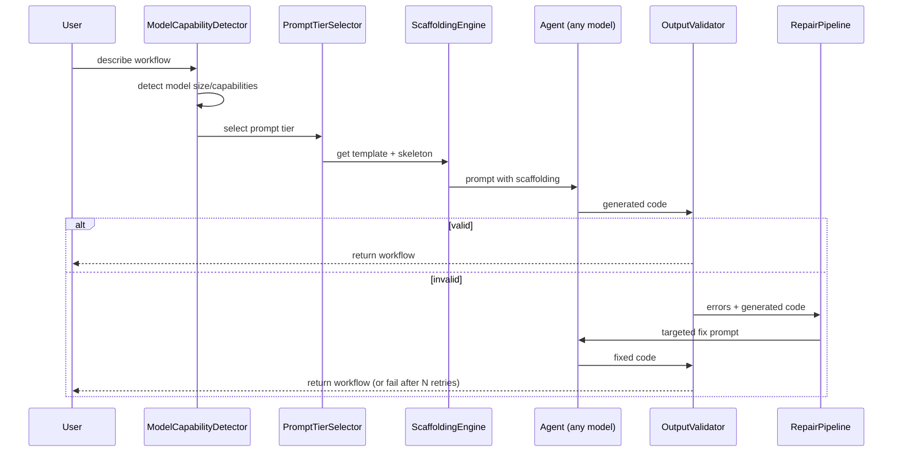
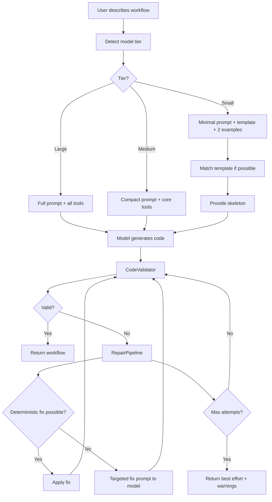
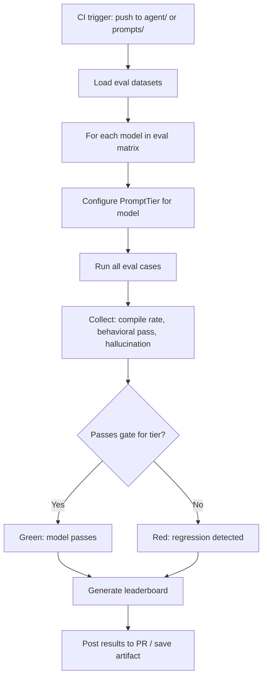

# Phase 7 — Small Model Compatibility

**Goal:** Ensure that even small language models (7B-14B parameter range: Llama 3.1 8B, Mistral 7B, Phi-3, Gemma 2 9B, Qwen 2.5 7B) can reliably use the SDK's Workflow Builder Agent prompt and tools to create correct, runnable workflows.

**Prerequisites:** Phase 2 (agent layer, tool system, coding agent), Phase 3 (toolset catalog, lazy disclosure).

**System Design References:** Chapters 3 (SDK surface, ~22 symbols), 5 (agent system, coding agent), 6 (three-tier disclosure), 14 (phasing).

---

## 1. Exit Criteria & Success Metrics

| Metric | Gate | Target |
|--------|------|--------|
| Workflow compile rate (8B model) | >= 70% | >= 90% |
| Workflow behavioral pass (8B model) | >= 50% | >= 75% |
| Tool-call format accuracy (8B model) | >= 80% | >= 95% |
| Average prompt tokens per workflow | <= 8k | <= 4k |
| Hallucinated API calls (non-existent methods) | <= 10% | <= 2% |
| Eval suite regression vs large model baseline | <= 20% drop | <= 10% drop |

**"Done" means:** A user running `Llama 3.1 8B` locally via Ollama can invoke the Workflow Coding Agent, describe a 3-5 step workflow, and receive compilable, runnable code on the first attempt >= 70% of the time. The same prompt and tools work across model sizes without configuration changes.

---

## 2. HLD — Small Model Compatibility Architecture

```
+------------------------------- Phase 7 Scope ---------------------------------+
|                                                                                 |
|  User: "Create a workflow that fetches RSS, summarizes with AI, posts to Slack" |
|    |                                                                            |
|    v                                                                            |
|  +-------------------+     +---------------------------+                        |
|  | Model Capability  |---->| Prompt Tier Selection     |                        |
|  | Detector          |     | (full / compact / minimal)|                        |
|  +-------------------+     +---------------------------+                        |
|                                    |                                            |
|                +-------------------+-------------------+                        |
|                |                   |                   |                         |
|                v                   v                   v                         |
|  +----------------+   +----------------+   +----------------+                   |
|  | Full Prompt    |   | Compact Prompt |   | Minimal Prompt |                   |
|  | (>70B models)  |   | (14B-70B)      |   | (<14B models)  |                   |
|  | ~6k tokens     |   | ~3k tokens     |   | ~1.5k tokens   |                   |
|  | all patterns   |   | core patterns  |   | template-fill  |                   |
|  +----------------+   +----------------+   +----------------+                   |
|                                    |                                            |
|                                    v                                            |
|  +-------------------------------------------------------------+               |
|  |              Scaffolding Engine                               |              |
|  |  +------------------+  +------------------+  +--------------+|              |
|  |  | Template Library |  | Skeleton Builder |  | Validator    ||              |
|  |  | (proven patterns)|  | (fill-in-blank)  |  | (syntax +   ||              |
|  |  |                  |  |                  |  |  semantic)   ||              |
|  |  +------------------+  +------------------+  +--------------+|              |
|  +-------------------------------------------------------------+               |
|                                    |                                            |
|                                    v                                            |
|  +-------------------------------------------------------------+               |
|  |         Tool Schema Simplifier                                |              |
|  |  Complex schemas --> simplified with examples                 |              |
|  |  Enum constraints --> explicit allowed values                 |              |
|  |  Nested objects --> flattened where possible                  |              |
|  +-------------------------------------------------------------+               |
|                                    |                                            |
|                                    v                                            |
|  +-------------------------------------------------------------+               |
|  |         Output Repair Pipeline                                |              |
|  |  Parse error --> targeted fix prompt --> re-validate          |              |
|  |  Missing import --> auto-add --> re-validate                  |              |
|  |  Wrong API --> suggest closest match --> re-generate step     |              |
|  +-------------------------------------------------------------+               |
|                                    |                                            |
|                                    v                                            |
|  +-------------------------------------------------------------+               |
|  |         Eval Framework (from Phase 6)                         |              |
|  |  Model-stratified benchmarks | regression gates | leaderboard |              |
|  +-------------------------------------------------------------+               |
+---------------------------------------------------------------------------------+
```

### Component Interactions



---

## 3. LLD — Subsystem Details

### 3.1 Model Capability Detection

Detect model capabilities without requiring explicit configuration. The system infers tier from the model name or probes with a calibration prompt.

```python
# agents/capability.py (NEW)

from __future__ import annotations
from dataclasses import dataclass
from enum import StrEnum
import re

class ModelTier(StrEnum):
    LARGE = "large"       # >= 70B or frontier (GPT-4o, Claude Sonnet+, Gemini Pro)
    MEDIUM = "medium"     # 14B-70B (Llama 3.1 70B, Mixtral, Qwen 72B)
    SMALL = "small"       # < 14B (Llama 3.1 8B, Mistral 7B, Phi-3, Gemma 9B)

@dataclass(frozen=True)
class ModelCapabilities:
    tier: ModelTier
    supports_tool_use: bool = True
    supports_structured_output: bool = False
    supports_parallel_tools: bool = False
    max_reliable_output_tokens: int = 2048
    json_mode_available: bool = False

# Known model patterns → tier mapping
MODEL_TIER_MAP: dict[str, ModelTier] = {
    # Frontier models
    r"gpt-4": ModelTier.LARGE,
    r"claude-3.5|claude-sonnet|claude-opus|claude-4": ModelTier.LARGE,
    r"gemini.*pro|gemini.*ultra": ModelTier.LARGE,
    # Medium models
    r"llama.*70b|qwen.*72b|mixtral": ModelTier.MEDIUM,
    r"claude-haiku|gemini.*flash": ModelTier.MEDIUM,
    # Small models
    r"llama.*8b|mistral.*7b|phi-3|gemma.*9b|qwen.*7b": ModelTier.SMALL,
    r"llama.*3b|phi-2|gemma.*2b": ModelTier.SMALL,
}

def detect_tier(model_id: str) -> ModelTier:
    """Infer model tier from model identifier string."""
    model_lower = model_id.lower()
    for pattern, tier in MODEL_TIER_MAP.items():
        if re.search(pattern, model_lower):
            return tier
    # Default to medium — safe middle ground
    return ModelTier.MEDIUM

def detect_capabilities(model_id: str) -> ModelCapabilities:
    """Build full capability profile for a model."""
    tier = detect_tier(model_id)
    if tier == ModelTier.LARGE:
        return ModelCapabilities(
            tier=tier,
            supports_tool_use=True,
            supports_structured_output=True,
            supports_parallel_tools=True,
            max_reliable_output_tokens=4096,
            json_mode_available=True,
        )
    elif tier == ModelTier.MEDIUM:
        return ModelCapabilities(
            tier=tier,
            supports_tool_use=True,
            supports_structured_output=True,
            supports_parallel_tools=False,
            max_reliable_output_tokens=2048,
            json_mode_available=True,
        )
    else:  # SMALL
        return ModelCapabilities(
            tier=tier,
            supports_tool_use=True,
            supports_structured_output=False,
            supports_parallel_tools=False,
            max_reliable_output_tokens=1024,
            json_mode_available=False,
        )
```

### 3.2 Tiered Prompt System

Three prompt tiers that deliver the same information at different compression levels. Small models get a template-fill approach rather than open-ended generation.

```python
# agents/prompts.py (NEW)

from __future__ import annotations
from dataclasses import dataclass, field
from agents.capability import ModelTier, ModelCapabilities

@dataclass
class PromptTier:
    """A prompt variant optimized for a specific model capability tier."""
    tier: ModelTier
    system_prompt: str
    tool_descriptions: dict[str, str]  # simplified per tier
    examples: list[dict[str, str]]     # few-shot examples
    max_tokens: int

class PromptLibrary:
    """Manages prompt tiers for the Workflow Coding Agent."""

    def __init__(self):
        self._tiers: dict[ModelTier, PromptTier] = {}
        self._register_defaults()

    def get_prompt(self, capabilities: ModelCapabilities) -> PromptTier:
        return self._tiers[capabilities.tier]

    def _register_defaults(self):
        # --- LARGE: Full prompt with all patterns ---
        self._tiers[ModelTier.LARGE] = PromptTier(
            tier=ModelTier.LARGE,
            system_prompt=FULL_SYSTEM_PROMPT,
            tool_descriptions=FULL_TOOL_DESCRIPTIONS,
            examples=FULL_EXAMPLES,
            max_tokens=4096,
        )

        # --- MEDIUM: Compact prompt with core patterns ---
        self._tiers[ModelTier.MEDIUM] = PromptTier(
            tier=ModelTier.MEDIUM,
            system_prompt=COMPACT_SYSTEM_PROMPT,
            tool_descriptions=COMPACT_TOOL_DESCRIPTIONS,
            examples=COMPACT_EXAMPLES,
            max_tokens=2048,
        )

        # --- SMALL: Minimal prompt with template-fill ---
        self._tiers[ModelTier.SMALL] = PromptTier(
            tier=ModelTier.SMALL,
            system_prompt=MINIMAL_SYSTEM_PROMPT,
            tool_descriptions=MINIMAL_TOOL_DESCRIPTIONS,
            examples=MINIMAL_EXAMPLES,
            max_tokens=1024,
        )


# ---- Prompt Content ----

FULL_SYSTEM_PROMPT = """You are a Workflow Coding Agent. You generate Python workflow code
using the LOOM SDK. You have access to tools for discovering integrations.

Key APIs:
- @workflow: marks a workflow function
- @step / @pure / @effect: marks step functions
- ctx.step(step_fn, args): execute a durable step
- ctx.sleep(duration): durable sleep
- ctx.wait_for_event(name): wait for external event
- ctx.gather(*awaitables): parallel execution
- ctx.spawn(workflow, input): child workflow

Rules:
1. All I/O must happen inside @step functions
2. Workflow bodies must be deterministic
3. Use ctx.now() instead of datetime.now()
4. Use ctx.uuid4() instead of uuid.uuid4()
"""

COMPACT_SYSTEM_PROMPT = """You generate LOOM SDK workflow code.

Pattern:
  @workflow → orchestrates steps
  @step    → does work (API calls, I/O)
  ctx.step(fn, args) → runs a step durably

Rules: All I/O in @step. Workflow body is deterministic. Use ctx.now() not datetime.now().
"""

MINIMAL_SYSTEM_PROMPT = """Generate a LOOM workflow. Fill in the template below.

```python
from loom import workflow, step, Context

@step
async def STEP_NAME(ARG: TYPE) -> RETURN_TYPE:
    \"\"\"DESCRIPTION\"\"\"
    # Your implementation here
    return result

@workflow
async def WORKFLOW_NAME(ctx: Context, INPUT_ARG: INPUT_TYPE) -> OUTPUT_TYPE:
    result = await ctx.step(STEP_NAME, INPUT_ARG)
    return result
```

Replace CAPS placeholders. Add more @step functions as needed. All API calls go inside @step.
"""
```

### 3.3 Tool Schema Simplification

Small models struggle with deeply nested JSON schemas. Simplify tool schemas while preserving semantic meaning.

```python
# agents/schema_simplifier.py (NEW)

from __future__ import annotations
from typing import Any
from agents.capability import ModelTier

class SchemaSimplifier:
    """Simplifies tool JSON schemas for smaller models."""

    def simplify(self, schema: dict[str, Any], tier: ModelTier) -> dict[str, Any]:
        """Reduce schema complexity based on model tier."""
        if tier == ModelTier.LARGE:
            return schema  # no simplification

        simplified = dict(schema)
        props = simplified.get("properties", {})

        for key, prop in props.items():
            # Flatten single-level nested objects
            if tier == ModelTier.SMALL and prop.get("type") == "object":
                props[key] = self._flatten_object(prop)

            # Add explicit enum descriptions
            if "enum" in prop:
                prop["description"] = (
                    f"{prop.get('description', '')} "
                    f"Allowed values: {', '.join(str(v) for v in prop['enum'])}"
                ).strip()

            # Add examples for non-obvious types
            if tier == ModelTier.SMALL and "examples" not in prop:
                prop["examples"] = self._generate_example(key, prop)

        # Remove optional parameters for small models
        if tier == ModelTier.SMALL:
            required = set(simplified.get("required", []))
            simplified["properties"] = {
                k: v for k, v in props.items()
                if k in required or k in ("workflow_id", "input", "name")
            }

        return simplified

    def _flatten_object(self, prop: dict[str, Any]) -> dict[str, Any]:
        """Convert nested object to string with format description."""
        inner_props = prop.get("properties", {})
        if len(inner_props) <= 3:
            desc_parts = [f"JSON object with keys: "]
            for k, v in inner_props.items():
                desc_parts.append(f"  {k} ({v.get('type', 'any')}): {v.get('description', '')}")
            return {
                "type": "string",
                "description": "\n".join(desc_parts),
                "format": "json",
            }
        return prop

    def _generate_example(self, key: str, prop: dict) -> list[Any]:
        """Generate a representative example for a schema property."""
        ptype = prop.get("type", "string")
        examples_map = {
            "string": [f"example_{key}"],
            "integer": [1],
            "number": [1.0],
            "boolean": [True],
            "array": [[]],
            "object": [{}],
        }
        return examples_map.get(ptype, ["example"])
```

### 3.4 Scaffolding Engine

Provides templates and skeletons that constrain the model's output to known-good patterns. For small models, this shifts from "generate code" to "fill in blanks."

```python
# agents/scaffolding.py (NEW)

from __future__ import annotations
from dataclasses import dataclass, field
from typing import Any

@dataclass
class WorkflowSkeleton:
    """A partially-filled workflow that the model completes."""
    name: str
    description: str
    steps: list[StepSkeleton]
    trigger: str = "manual"
    imports: list[str] = field(default_factory=list)

@dataclass
class StepSkeleton:
    """A step slot for the model to fill."""
    name: str
    description: str
    input_type: str = "dict"
    output_type: str = "dict"
    body_hint: str = ""  # e.g., "use requests.get to fetch URL"

class ScaffoldingEngine:
    """Generates workflow skeletons from user intent for template-fill generation."""

    def __init__(self):
        self._templates: dict[str, WorkflowSkeleton] = {}
        self._register_builtin_templates()

    def match_template(self, user_intent: str) -> WorkflowSkeleton | None:
        """Find the best matching template for the user's description."""
        # Keyword-based matching (simple); upgraded to semantic in future
        intent_lower = user_intent.lower()
        scores: list[tuple[str, int]] = []
        for name, template in self._templates.items():
            score = sum(1 for kw in name.split("_") if kw in intent_lower)
            if score > 0:
                scores.append((name, score))
        if scores:
            scores.sort(key=lambda x: x[1], reverse=True)
            return self._templates[scores[0][0]]
        return None

    def build_skeleton(self, intent: str, steps: list[dict[str, str]]) -> str:
        """Build a fill-in-the-blank skeleton from parsed intent."""
        parts = [
            'from loom import workflow, step, Context\n',
        ]
        for i, s in enumerate(steps):
            parts.append(f'''
@step
async def {s.get("name", f"step_{i}")}({s.get("input_param", "data")}: {s.get("input_type", "dict")}) -> {s.get("output_type", "dict")}:
    """TODO: {s.get("description", "implement this step")}"""
    raise NotImplementedError("Fill in implementation")
''')
        step_names = [s.get("name", f"step_{i}") for i, s in enumerate(steps)]
        parts.append(f'''
@workflow
async def main(ctx: Context, input_data: dict) -> dict:
    """TODO: {intent}"""
''')
        prev_var = "input_data"
        for name in step_names:
            parts.append(f'    {name}_result = await ctx.step({name}, {prev_var})\n')
            prev_var = f"{name}_result"
        parts.append(f'    return {prev_var}\n')
        return "".join(parts)

    def _register_builtin_templates(self):
        """Register common workflow patterns as templates."""
        self._templates["fetch_transform_notify"] = WorkflowSkeleton(
            name="fetch_transform_notify",
            description="Fetch data, transform it, send notification",
            steps=[
                StepSkeleton("fetch_data", "Fetch data from external source",
                             body_hint="Use requests/httpx to call API"),
                StepSkeleton("transform_data", "Transform/process the data",
                             body_hint="Parse and restructure the response"),
                StepSkeleton("send_notification", "Send result via notification channel",
                             body_hint="Post to Slack/email/webhook"),
            ],
        )
        self._templates["webhook_process_store"] = WorkflowSkeleton(
            name="webhook_process_store",
            description="Receive webhook, process data, store results",
            steps=[
                StepSkeleton("validate_payload", "Validate incoming webhook data"),
                StepSkeleton("process_data", "Process/enrich the data"),
                StepSkeleton("store_results", "Save to database/spreadsheet"),
            ],
            trigger="webhook",
        )
        self._templates["schedule_scrape_report"] = WorkflowSkeleton(
            name="schedule_scrape_report",
            description="On schedule, scrape data, generate report",
            steps=[
                StepSkeleton("scrape_source", "Scrape or fetch source data"),
                StepSkeleton("analyze_data", "Analyze with AI or rules"),
                StepSkeleton("generate_report", "Create report document"),
                StepSkeleton("distribute_report", "Send report to stakeholders"),
            ],
            trigger="schedule",
        )
        self._templates["ai_pipeline"] = WorkflowSkeleton(
            name="ai_pipeline",
            description="AI processing pipeline with multiple LLM calls",
            steps=[
                StepSkeleton("prepare_input", "Prepare/clean input for LLM"),
                StepSkeleton("call_llm", "Call LLM for main processing"),
                StepSkeleton("validate_output", "Validate LLM output"),
                StepSkeleton("post_process", "Post-process and format results"),
            ],
        )
```

### 3.5 Output Repair Pipeline

When a small model produces invalid code, repair it with targeted prompts rather than full re-generation.

```python
# agents/repair.py (NEW)

from __future__ import annotations
import ast
import re
from dataclasses import dataclass
from typing import Any

@dataclass
class RepairResult:
    code: str
    was_repaired: bool
    repairs_applied: list[str]
    attempts: int

class CodeValidator:
    """Validates generated workflow code for correctness."""

    def validate(self, code: str) -> list[ValidationError]:
        """Check generated code for common issues."""
        errors: list[ValidationError] = []

        # 1. Syntax check
        try:
            tree = ast.parse(code)
        except SyntaxError as e:
            errors.append(ValidationError("syntax", f"Line {e.lineno}: {e.msg}", severity="error"))
            return errors  # can't continue without valid AST

        # 2. Check for @workflow decorator
        has_workflow = any(
            isinstance(node, ast.AsyncFunctionDef)
            and any(self._decorator_name(d) in ("workflow", "flow")
                    for d in node.decorator_list)
            for node in ast.walk(tree)
        )
        if not has_workflow:
            errors.append(ValidationError("structure", "No @workflow function found", "error"))

        # 3. Check for @step decorators
        has_steps = any(
            isinstance(node, (ast.FunctionDef, ast.AsyncFunctionDef))
            and any(self._decorator_name(d) in ("step", "pure", "effect", "node")
                    for d in node.decorator_list)
            for node in ast.walk(tree)
        )
        if not has_steps:
            errors.append(ValidationError("structure", "No @step functions found", "warning"))

        # 4. Check for bare I/O in workflow body (not inside a step)
        self._check_bare_io(tree, errors)

        # 5. Check for nondeterminism
        self._check_nondeterminism(tree, errors)

        # 6. Check imports
        self._check_imports(tree, code, errors)

        return errors

    def _decorator_name(self, decorator: ast.expr) -> str:
        if isinstance(decorator, ast.Name):
            return decorator.id
        if isinstance(decorator, ast.Call) and isinstance(decorator.func, ast.Name):
            return decorator.func.id
        return ""

    def _check_bare_io(self, tree: ast.Module, errors: list):
        """Detect I/O calls directly in workflow body (should be in @step)."""
        for node in ast.walk(tree):
            if isinstance(node, ast.AsyncFunctionDef):
                for d in node.decorator_list:
                    if self._decorator_name(d) in ("workflow", "flow"):
                        # Check for common I/O calls in this function's body
                        for child in ast.walk(node):
                            if isinstance(child, ast.Call):
                                call_name = self._call_name(child)
                                if call_name in ("requests.get", "requests.post",
                                                 "httpx.get", "httpx.post",
                                                 "open", "aiohttp"):
                                    errors.append(ValidationError(
                                        "determinism",
                                        f"I/O call '{call_name}' in workflow body should be in a @step",
                                        "error"
                                    ))

    def _check_nondeterminism(self, tree: ast.Module, errors: list):
        """Check for datetime.now(), uuid4(), random.* in workflow body."""
        for node in ast.walk(tree):
            if isinstance(node, ast.AsyncFunctionDef):
                for d in node.decorator_list:
                    if self._decorator_name(d) in ("workflow", "flow"):
                        for child in ast.walk(node):
                            call_name = self._call_name(child) if isinstance(child, ast.Call) else ""
                            if call_name in ("datetime.now", "uuid.uuid4", "uuid4",
                                            "random.random", "random.randint", "random.choice"):
                                errors.append(ValidationError(
                                    "determinism",
                                    f"Nondeterministic call '{call_name}' — use ctx.now()/ctx.uuid4()/ctx.random()",
                                    "error"
                                ))

    def _check_imports(self, tree: ast.Module, code: str, errors: list):
        """Check that loom imports are present."""
        has_wb_import = any(
            (isinstance(n, ast.ImportFrom) and n.module and "loom" in n.module)
            or (isinstance(n, ast.Import) and any("loom" in a.name for a in n.names))
            for n in ast.iter_child_nodes(tree)
        )
        if not has_wb_import:
            errors.append(ValidationError("imports", "Missing loom import", "error"))

    def _call_name(self, node: ast.Call) -> str:
        if isinstance(node.func, ast.Name):
            return node.func.id
        if isinstance(node.func, ast.Attribute):
            if isinstance(node.func.value, ast.Name):
                return f"{node.func.value.id}.{node.func.attr}"
        return ""


@dataclass
class ValidationError:
    category: str    # syntax, structure, determinism, imports
    message: str
    severity: str    # error, warning


class RepairPipeline:
    """Attempts to fix invalid generated code with targeted prompts."""

    MAX_REPAIR_ATTEMPTS = 3

    def __init__(self, validator: CodeValidator):
        self._validator = validator

    async def repair(self, code: str, errors: list[ValidationError],
                     model_fn) -> RepairResult:
        """Attempt automated repairs on invalid code."""
        repairs_applied = []
        current_code = code

        for attempt in range(self.MAX_REPAIR_ATTEMPTS):
            # Try deterministic fixes first
            current_code, det_repairs = self._apply_deterministic_fixes(current_code, errors)
            repairs_applied.extend(det_repairs)

            # Re-validate
            errors = self._validator.validate(current_code)
            real_errors = [e for e in errors if e.severity == "error"]
            if not real_errors:
                return RepairResult(current_code, bool(repairs_applied), repairs_applied, attempt + 1)

            # Use model for remaining fixes
            fix_prompt = self._build_fix_prompt(current_code, real_errors)
            current_code = await model_fn(fix_prompt)
            repairs_applied.append(f"model_fix_attempt_{attempt + 1}")

            # Re-validate after model fix
            errors = self._validator.validate(current_code)
            real_errors = [e for e in errors if e.severity == "error"]
            if not real_errors:
                return RepairResult(current_code, True, repairs_applied, attempt + 1)

        return RepairResult(current_code, True, repairs_applied, self.MAX_REPAIR_ATTEMPTS)

    def _apply_deterministic_fixes(self, code: str, errors: list[ValidationError]) -> tuple[str, list[str]]:
        """Apply fixes that don't need the model."""
        repairs = []

        # Fix missing imports
        import_errors = [e for e in errors if e.category == "imports"]
        if import_errors:
            if "from loom import" not in code:
                code = "from loom import workflow, step, Context\n\n" + code
                repairs.append("added_workflow_builder_import")

        # Fix common nondeterminism patterns
        replacements = {
            "datetime.now()": "ctx.now()",
            "datetime.utcnow()": "ctx.now()",
            "uuid.uuid4()": "ctx.uuid4()",
            "uuid4()": "ctx.uuid4()",
        }
        for old, new in replacements.items():
            if old in code:
                code = code.replace(old, new)
                repairs.append(f"replaced_{old}_with_{new}")

        return code, repairs

    def _build_fix_prompt(self, code: str, errors: list[ValidationError]) -> str:
        """Build a targeted fix prompt from specific errors."""
        error_list = "\n".join(f"- [{e.category}] {e.message}" for e in errors)
        return f"""Fix these errors in the workflow code. Only change what's needed.

Errors:
{error_list}

Code:
```python
{code}
```

Return ONLY the fixed Python code, no explanation."""
```

### 3.6 Few-Shot Example Bank

Curated examples that small models can pattern-match against. Each example demonstrates one core pattern.

```python
# agents/examples.py (NEW)

CORE_EXAMPLES: list[dict[str, str]] = [
    {
        "description": "Simple two-step workflow: fetch and notify",
        "code": '''from loom import workflow, step, Context
import httpx

@step
async def fetch_data(url: str) -> dict:
    """Fetch data from a URL."""
    async with httpx.AsyncClient() as client:
        resp = await client.get(url)
        return resp.json()

@step
async def send_slack(message: str) -> bool:
    """Post a message to Slack."""
    async with httpx.AsyncClient() as client:
        await client.post(SLACK_WEBHOOK, json={"text": message})
    return True

@workflow
async def fetch_and_notify(ctx: Context, url: str) -> bool:
    data = await ctx.step(fetch_data, url)
    summary = f"Got {len(data)} items"
    return await ctx.step(send_slack, summary)
''',
    },
    {
        "description": "Parallel execution with gather",
        "code": '''from loom import workflow, step, Context

@step
async def fetch_page(url: str) -> str:
    """Fetch a web page."""
    import httpx
    async with httpx.AsyncClient() as client:
        resp = await client.get(url)
        return resp.text

@workflow
async def scrape_multiple(ctx: Context, urls: list[str]) -> list[str]:
    tasks = [ctx.step(fetch_page, url) for url in urls]
    return await ctx.gather(*tasks)
''',
    },
    {
        "description": "Wait for human approval",
        "code": '''from loom import workflow, step, Context

@step
async def create_order(items: list[str]) -> dict:
    """Create a pending order."""
    return {"order_id": "ORD-123", "items": items, "status": "pending"}

@workflow
async def order_with_approval(ctx: Context, items: list[str]) -> dict:
    order = await ctx.step(create_order, items)
    approval = await ctx.wait_for_event("order_approval")
    if approval.get("approved"):
        return {**order, "status": "approved"}
    return {**order, "status": "rejected"}
''',
    },
    {
        "description": "Scheduled workflow with retry",
        "code": '''from loom import workflow, step, Context
from loom import Retry

@step(retry=Retry(max_attempts=3, backoff=2.0))
async def sync_records(source: str) -> int:
    """Sync records from external CRM. Retries on failure."""
    import httpx
    async with httpx.AsyncClient() as client:
        resp = await client.get(f"https://api.crm.com/{source}/records")
        records = resp.json()
    return len(records)

@workflow
async def daily_sync(ctx: Context, sources: list[str]) -> dict:
    results = {}
    for source in sources:
        count = await ctx.step(sync_records, source)
        results[source] = count
    return results
''',
    },
]

def get_examples_for_tier(tier: str, max_examples: int = 2) -> list[dict[str, str]]:
    """Return appropriate examples based on model tier."""
    if tier == "large":
        return CORE_EXAMPLES  # all examples
    elif tier == "medium":
        return CORE_EXAMPLES[:3]  # first three
    else:  # small
        return CORE_EXAMPLES[:2]  # simplest two only
```

### 3.7 Model-Stratified Eval Suite

Extends the Phase 6 eval framework with model-size stratification.

```python
# eval/model_eval.py (NEW — extends Phase 6 eval framework)

from __future__ import annotations
from dataclasses import dataclass, field

@dataclass
class ModelEvalConfig:
    """Configuration for evaluating the coding agent across model sizes."""
    models: list[ModelSpec]
    datasets: list[str]       # eval dataset names from Phase 6
    pass_thresholds: dict[str, float]  # tier → minimum pass rate

@dataclass
class ModelSpec:
    model_id: str
    tier: str                  # "large", "medium", "small"
    provider: str              # "openai", "anthropic", "ollama", "together"
    cost_per_1k_tokens: float = 0.0

@dataclass
class ModelEvalResult:
    model: ModelSpec
    compile_rate: float        # fraction that parse without errors
    behavioral_pass_rate: float  # fraction that pass behavioral tests
    avg_tokens_used: int
    avg_repair_attempts: float
    hallucination_rate: float  # fraction with non-existent API calls
    total_cases: int

    @property
    def passes_gate(self) -> bool:
        thresholds = {
            "large": 0.90,
            "medium": 0.80,
            "small": 0.70,
        }
        return self.behavioral_pass_rate >= thresholds.get(self.model.tier, 0.70)

class ModelEvalRunner:
    """Run coding agent eval across multiple models."""

    def __init__(self, config: ModelEvalConfig):
        self.config = config

    async def run_all(self) -> list[ModelEvalResult]:
        results = []
        for model in self.config.models:
            result = await self._eval_model(model)
            results.append(result)
        return results

    async def _eval_model(self, model: ModelSpec) -> ModelEvalResult:
        """Run all eval datasets against a single model."""
        # Uses Phase 6 EvalRunner with model-specific configuration
        # Configures PromptTier based on model tier
        # Runs CodeValidator on each output
        # Tracks repair attempts
        ...

    def leaderboard(self, results: list[ModelEvalResult]) -> str:
        """Generate a markdown leaderboard table."""
        lines = ["| Model | Tier | Compile | Behavioral | Hallucination | Tokens | Gate |",
                 "|-------|------|---------|-----------|---------------|--------|------|"]
        for r in sorted(results, key=lambda x: x.behavioral_pass_rate, reverse=True):
            gate = "PASS" if r.passes_gate else "FAIL"
            lines.append(
                f"| {r.model.model_id} | {r.model.tier} | "
                f"{r.compile_rate:.0%} | {r.behavioral_pass_rate:.0%} | "
                f"{r.hallucination_rate:.0%} | {r.avg_tokens_used} | {gate} |"
            )
        return "\n".join(lines)
```

---

## 4. Directory Structure

```
src/loom/
├── agents/
│   ├── capability.py        # NEW: ModelTier, detect_tier(), detect_capabilities()
│   ├── prompts.py           # NEW: PromptLibrary, tiered system/tool prompts
│   ├── schema_simplifier.py # NEW: SchemaSimplifier for small models
│   ├── scaffolding.py       # NEW: ScaffoldingEngine, WorkflowSkeleton
│   ├── repair.py            # NEW: CodeValidator, RepairPipeline
│   ├── examples.py          # NEW: Few-shot example bank
│   ├── models.py            # MODIFY: Wire capability detection into ModelProvider
│   ├── tools.py             # MODIFY: Apply schema simplification per tier
│   └── ...existing files...
├── eval/
│   ├── model_eval.py        # NEW: Model-stratified eval runner
│   └── ...existing from Phase 6...
tests/
├── unit/
│   ├── test_capability_detection.py
│   ├── test_schema_simplifier.py
│   ├── test_scaffolding.py
│   ├── test_code_validator.py
│   └── test_repair_pipeline.py
├── integration/
│   ├── test_tiered_prompt_generation.py
│   ├── test_small_model_end_to_end.py
│   └── test_repair_with_model.py
├── e2e/
│   ├── test_ollama_8b_workflow.py
│   └── test_model_eval_suite.py
└── eval/
    ├── datasets/
    │   ├── basic_workflows.json
    │   ├── medium_workflows.json
    │   └── complex_workflows.json
    └── golden/
        ├── fetch_and_notify.py
        ├── webhook_processor.py
        └── ai_pipeline.py
```

---

## 5. Files Requiring Changes

| File | Change Type | What Changes |
|------|-------------|--------------|
| `agents/models.py` | MODIFY | Wire `detect_capabilities()` into `ModelProvider` |
| `agents/tools.py` | MODIFY | Apply `SchemaSimplifier` when building tool schemas |
| `agents/output.py` | MODIFY | Use `CodeValidator` before returning structured output |
| `agents/runtime.py` (Phase 2) | MODIFY | Integrate `PromptLibrary` and `ScaffoldingEngine` into agent turn loop |
| `agents/definition.py` (Phase 2) | MODIFY | Add `model_tier` override field to `AgentDefinition` |
| `eval/` (Phase 6) | MODIFY | Extend `EvalRunner` to accept `ModelSpec` parameter |
| `__init__.py` | NO CHANGE | No new public symbols (all internal to agent system) |

---

## 6. Implementation Steps

| Step | Task | Depends On |
|------|------|------------|
| 7.1 | Implement `ModelTier` enum, `detect_tier()`, `detect_capabilities()` | — |
| 7.2 | Implement `SchemaSimplifier` with tier-aware simplification | 7.1 |
| 7.3 | Write three-tier prompt system (`PromptLibrary`) | 7.1 |
| 7.4 | Create few-shot example bank (`CORE_EXAMPLES`) with 10+ examples | 7.3 |
| 7.5 | Implement `ScaffoldingEngine` with 6+ builtin templates | 7.3 |
| 7.6 | Implement `CodeValidator` (AST-based static checks) | — |
| 7.7 | Implement `RepairPipeline` (deterministic fixes + model-assisted) | 7.6 |
| 7.8 | Wire into agent turn loop: detect tier → select prompt → scaffold → validate → repair | 7.1-7.7 |
| 7.9 | Build eval datasets: 20 basic, 15 medium, 10 complex workflow specs | 7.6 |
| 7.10 | Implement `ModelEvalRunner` with leaderboard generation | 7.8, 7.9 |
| 7.11 | Run eval suite against 3+ small models, tune prompts | 7.10 |
| 7.12 | Add CLI: `loom eval --models ollama/llama3.1:8b,openai/gpt-4o` | 7.10 |

---

## 7. Data Flow Diagrams

### 7.1 Workflow Generation with Small Model



### 7.2 Model Eval CI Pipeline



---

## 8. Multi-Angle Review

### Correctness
- `CodeValidator` catches real issues (syntax, missing decorators, nondeterminism) but won't catch semantic bugs (wrong API endpoint, wrong data transformation). The eval suite with behavioral tests covers this gap.
- Template matching is keyword-based initially — may misclassify complex intents. Acceptable for v1; semantic matching is a future upgrade.

### Security
- `RepairPipeline` re-prompts the model with generated code. The fix prompt must not leak system prompts or internal context. Fix prompts contain only the user's code and error messages.
- Schema simplification must not remove security-critical parameters (e.g., `auth_token` fields). The simplifier only removes optional parameters not in a security-relevant set.

### Performance
- Capability detection is O(1) regex matching — negligible overhead.
- Scaffolding adds ~200ms for template matching. Acceptable since workflow generation is an interactive task.
- Repair pipeline adds 1-3 extra model calls on failure. Budget enforcement (Phase 2) caps total cost.

### Edge Cases
- Model not in `MODEL_TIER_MAP`: defaults to MEDIUM tier (safe middle ground).
- Model supports tool use but generates malformed JSON: `RepairPipeline` catches and re-prompts.
- Template matches but user intent is actually different: the model can override the skeleton since it's provided as a hint, not a constraint.
- Zero-shot generation (no matching template): falls back to minimal prompt without skeleton.

### Maintainability
- Adding a new model: add one regex pattern to `MODEL_TIER_MAP`.
- Adding a new template: add one entry to `ScaffoldingEngine._register_builtin_templates()`.
- Tuning prompts: edit string constants in `prompts.py`, no code changes.

### Testing
- Eval suite is the primary quality gate. Unit tests verify mechanics; eval tests verify outcomes.
- Eval datasets must be maintained as the SDK API evolves (breaking changes require updating golden examples).

### User Perspective
- Users with small models get the same API — no configuration needed. The system adapts automatically.
- If a small model can't produce valid code after repairs, the error message should explain what went wrong and suggest trying a larger model.
- `loom eval` CLI command lets users benchmark their local model before committing to it.

---

## 9. Test Plan

### Unit Tests (7)
| Test | What |
|------|------|
| `test_detect_tier_known_models` | All models in `MODEL_TIER_MAP` resolve correctly |
| `test_detect_tier_unknown_defaults_medium` | Unknown model → MEDIUM |
| `test_schema_simplifier_small` | Nested object flattened, optional params removed |
| `test_schema_simplifier_large_noop` | LARGE tier returns schema unchanged |
| `test_code_validator_valid_workflow` | Clean workflow passes with no errors |
| `test_code_validator_bare_io` | Detects `requests.get` in workflow body |
| `test_code_validator_nondeterminism` | Detects `datetime.now()` in workflow body |

### Integration Tests (5)
| Test | What |
|------|------|
| `test_repair_pipeline_missing_import` | Adds import deterministically, no model call needed |
| `test_repair_pipeline_nondeterminism` | Replaces `datetime.now()` with `ctx.now()` |
| `test_scaffolding_match` | "fetch RSS and post to Slack" matches `fetch_transform_notify` |
| `test_prompt_tier_selection` | `llama-3.1-8b` gets SMALL tier prompt |
| `test_full_pipeline_with_mock_model` | End-to-end: intent → tier → prompt → (mock) generation → validation → repair |

### E2E Tests (3)
| Test | What |
|------|------|
| `test_eval_basic_dataset` | 20 basic workflow specs pass compile gate at >= 90% (using frontier model) |
| `test_eval_medium_dataset` | 15 medium specs pass behavioral gate at >= 80% |
| `test_leaderboard_generation` | Eval runner produces valid markdown leaderboard |

---

## 10. Known Gaps & Mitigations

| Gap | Risk | Mitigation |
|-----|------|------------|
| Model tier map is static | New models not recognized | Default to MEDIUM; user can override via `AgentDefinition.model_tier` |
| Template matching is keyword-based | Poor recall for unusual descriptions | Degrade gracefully to no-template path; upgrade to embeddings later |
| Repair pipeline may loop | Wasted tokens on unfixable code | Hard cap at 3 attempts; budget enforcement from Phase 2 |
| No semantic validation | Code compiles but does wrong thing | Behavioral eval tests catch this; but only for known patterns |
| Small models may not support tool_use | Can't call `loom search/show/stub` | Fallback to prompt-only mode: embed toolset stubs directly in prompt |
| Prompt engineering is empirical | What works today may not work with next model release | Eval suite detects regressions; versioned prompts per model family |
| Example bank needs curation | Bad examples teach bad patterns | Golden examples are reviewed and version-controlled |
