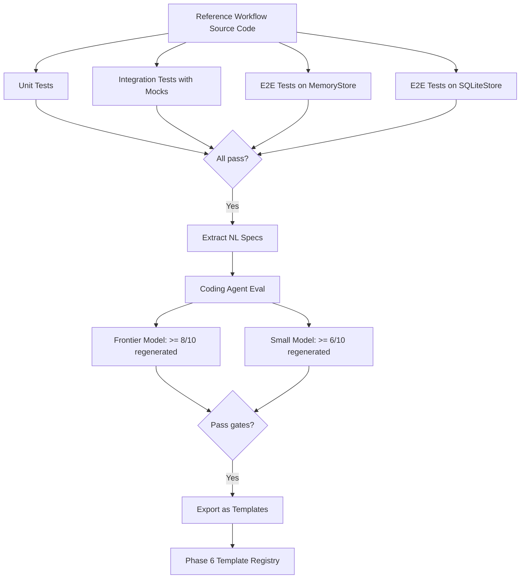

# Phase 8 — Reference Workflows

**Goal:** Implement the top 10 real-world workflows from n8n and Gumloop as production-quality LOOM workflows. These serve as end-to-end validation that the SDK actually works, as documentation-by-example, and as templates for Phase 6's template system.

**Prerequisites:** Phase 1 (core engine), Phase 2 (agent layer), Phase 3 (toolsets), Phase 7 (small model compat — eval datasets reference these workflows).

**System Design References:** Chapters 3 (SDK surface), 6 (toolsets), 14 (Phase 6 templates).

---

## 1. Exit Criteria & Success Metrics

| Metric | Gate | Target |
|--------|------|--------|
| Reference workflows passing all tests | >= 8/10 | 10/10 |
| Each workflow runs on MemoryStore (no infra) | All | All |
| Each workflow runs on SQLiteStore (embedded) | All | All |
| Coding agent can re-generate each workflow from spec | >= 6/10 | >= 8/10 |
| Small model (8B) can re-generate simplified versions | >= 4/10 | >= 6/10 |
| All workflows have documented trigger, steps, error handling | All | All |

**"Done" means:** 10 production-quality workflows from n8n/Gumloop run end-to-end with tests. Each demonstrates at least one distinct SDK pattern (parallel execution, human approval, AI processing, webhook triggers, scheduled runs, error retry, etc.). The coding agent can re-generate them from natural language specs.

---

## 2. HLD — Reference Workflow Architecture

```
+------------------------------- Phase 8 Scope ---------------------------------+
|                                                                                 |
|  10 Reference Workflows (from n8n / Gumloop real-world patterns)                |
|                                                                                 |
|  +-----------+  +-----------+  +-----------+  +-----------+  +-----------+     |
|  | WF1: Lead |  | WF2: AI   |  | WF3: Inbox|  | WF4: CRM  |  | WF5: Social|   |
|  | Enrichment|  | Content   |  | Triage    |  | Sync      |  | Publisher |     |
|  | & Outreach|  | Pipeline  |  | & Route   |  | Airtable  |  | Multi-plat|     |
|  +-----------+  +-----------+  +-----------+  +-----------+  +-----------+     |
|                                                                                 |
|  +-----------+  +-----------+  +-----------+  +-----------+  +-----------+     |
|  | WF6: Doc  |  | WF7: Sales|  | WF8: Meet |  | WF9: Data |  | WF10: Chat|   |
|  | Extraction|  | Battle    |  | Prep &    |  | Pipeline  |  | with PDF  |     |
|  | & Summary |  | Cards     |  | Follow-up |  | ETL       |  | RAG Bot   |     |
|  +-----------+  +-----------+  +-----------+  +-----------+  +-----------+     |
|                                                                                 |
|  Each workflow includes:                                                        |
|  +--------------------------------------------------------------------+        |
|  | 1. Working Python implementation using LOOM SDK                      |        |
|  | 2. Natural language spec (for coding agent eval)                    |        |
|  | 3. Mock services for testing without real API keys                   |        |
|  | 4. Integration test with real or mock external services             |        |
|  | 5. Documentation: topology diagram, step descriptions, config guide |        |
|  +--------------------------------------------------------------------+        |
|                                                                                 |
|  SDK Patterns Demonstrated:                                                     |
|  @pure | @effect | ctx.gather | ctx.sleep | ctx.wait_for_event |               |
|  ctx.spawn | Retry | Webhook trigger | Schedule trigger | Agent step |         |
+---------------------------------------------------------------------------------+
```

---

## 3. The 10 Reference Workflows

### WF1: Lead Enrichment & Cold Outreach

**Source:** n8n "Lead Generation & Email Outreach" + Gumloop "AI Cold Outreach & CRM"

**Pattern:** Schedule → Scrape → Enrich → AI Personalize → Send → Log

**SDK patterns demonstrated:** `@effect` with retry, `ctx.gather` for parallel enrichment, schedule trigger

```python
# examples/reference/wf01_lead_outreach.py

from loom import workflow, step, Context, Retry
from pydantic import BaseModel
import httpx

class Lead(BaseModel):
    name: str
    email: str
    company: str
    linkedin_url: str = ""
    enriched_data: dict = {}
    personalized_email: str = ""

class OutreachResult(BaseModel):
    total_leads: int
    emails_sent: int
    errors: list[str]

@step(retry=Retry(max_attempts=3, backoff=2.0))
async def scrape_leads(source_url: str) -> list[dict]:
    """Scrape leads from a source (Google Maps, LinkedIn, directory)."""
    async with httpx.AsyncClient() as client:
        resp = await client.get(source_url, timeout=30)
        resp.raise_for_status()
        return resp.json().get("leads", [])

@step(retry=Retry(max_attempts=2))
async def enrich_lead(lead: dict) -> Lead:
    """Enrich a lead with company data from Apollo/Clearbit."""
    async with httpx.AsyncClient() as client:
        resp = await client.post(
            "https://api.apollo.io/v1/people/match",
            json={"email": lead["email"]},
            headers={"X-Api-Key": lead.get("api_key", "")},
        )
        enriched = resp.json() if resp.status_code == 200 else {}
    return Lead(
        name=lead["name"],
        email=lead["email"],
        company=lead.get("company", ""),
        linkedin_url=enriched.get("linkedin_url", ""),
        enriched_data=enriched,
    )

@step
async def generate_personalized_email(lead: Lead, template: str) -> Lead:
    """Use AI to personalize email based on enriched data."""
    async with httpx.AsyncClient() as client:
        resp = await client.post(
            "https://api.openai.com/v1/chat/completions",
            json={
                "model": "gpt-4o-mini",
                "messages": [
                    {"role": "system", "content": "Generate a personalized cold email."},
                    {"role": "user", "content": f"Template: {template}\nLead: {lead.model_dump_json()}"},
                ],
            },
            headers={"Authorization": f"Bearer {lead.enriched_data.get('openai_key', '')}"},
        )
        email_text = resp.json()["choices"][0]["message"]["content"]
    lead.personalized_email = email_text
    return lead

@step(retry=Retry(max_attempts=2))
async def send_email(lead: Lead) -> bool:
    """Send personalized email via SMTP or API."""
    async with httpx.AsyncClient() as client:
        await client.post(
            "https://api.sendgrid.com/v3/mail/send",
            json={
                "personalizations": [{"to": [{"email": lead.email}]}],
                "from": {"email": "outreach@company.com"},
                "subject": f"Quick question for {lead.name}",
                "content": [{"type": "text/plain", "value": lead.personalized_email}],
            },
        )
    return True

@step
async def log_to_sheet(leads: list[Lead], sheet_id: str) -> int:
    """Log results to Google Sheets for tracking."""
    rows = [
        {"name": l.name, "email": l.email, "company": l.company, "status": "sent"}
        for l in leads
    ]
    async with httpx.AsyncClient() as client:
        await client.post(
            f"https://sheets.googleapis.com/v4/spreadsheets/{sheet_id}/values:append",
            json={"values": [[r["name"], r["email"], r["company"], r["status"]] for r in rows]},
        )
    return len(rows)

@workflow
async def lead_outreach(ctx: Context, config: dict) -> OutreachResult:
    """End-to-end lead enrichment and personalized cold outreach."""
    # 1. Scrape leads
    raw_leads = await ctx.step(scrape_leads, config["source_url"])

    # 2. Enrich in parallel
    enrich_tasks = [ctx.step(enrich_lead, lead) for lead in raw_leads[:20]]
    enriched_leads = await ctx.gather(*enrich_tasks)

    # 3. Generate personalized emails
    email_tasks = [
        ctx.step(generate_personalized_email, lead, config.get("email_template", ""))
        for lead in enriched_leads
    ]
    personalized = await ctx.gather(*email_tasks)

    # 4. Send emails
    errors = []
    sent_count = 0
    for lead in personalized:
        try:
            await ctx.step(send_email, lead)
            sent_count += 1
        except Exception as e:
            errors.append(f"{lead.email}: {str(e)}")

    # 5. Log results
    await ctx.step(log_to_sheet, personalized, config.get("sheet_id", ""))

    return OutreachResult(
        total_leads=len(raw_leads),
        emails_sent=sent_count,
        errors=errors,
    )
```

---

### WF2: AI Content Generation Pipeline

**Source:** n8n "LinkedIn Post Creation with DALL-E" + "Twitter/X Auto-Posting with GPT-4"

**Pattern:** Schedule → Research → Generate Text → Generate Image → Publish Multi-Platform

**SDK patterns demonstrated:** `ctx.gather` for parallel publishing, `@pure` for text formatting, branching logic

```python
# examples/reference/wf02_content_pipeline.py

from loom import workflow, step, Context
from pydantic import BaseModel

class ContentPiece(BaseModel):
    topic: str
    body: str
    hashtags: list[str]
    image_url: str = ""
    platforms: list[str] = ["linkedin", "twitter"]

@step
async def research_trending(niche: str) -> list[str]:
    """Find trending topics in a niche via Perplexity/web search."""
    import httpx
    async with httpx.AsyncClient() as client:
        resp = await client.post(
            "https://api.perplexity.ai/chat/completions",
            json={
                "model": "llama-3.1-sonar-small-128k-online",
                "messages": [{"role": "user",
                              "content": f"List 5 trending topics in {niche} this week. Return JSON array of strings."}],
            },
        )
        return resp.json()["choices"][0]["message"]["content"]

@step
async def generate_post(topic: str, platform: str) -> str:
    """Generate platform-specific post content with AI."""
    import httpx
    length_guide = {"linkedin": "200-300 words", "twitter": "under 280 characters"}
    async with httpx.AsyncClient() as client:
        resp = await client.post(
            "https://api.openai.com/v1/chat/completions",
            json={
                "model": "gpt-4o-mini",
                "messages": [
                    {"role": "system", "content": f"Write a {platform} post. {length_guide.get(platform, '')}"},
                    {"role": "user", "content": f"Topic: {topic}"},
                ],
            },
        )
        return resp.json()["choices"][0]["message"]["content"]

@step
async def generate_image(topic: str) -> str:
    """Generate an image with DALL-E for the post."""
    import httpx
    async with httpx.AsyncClient() as client:
        resp = await client.post(
            "https://api.openai.com/v1/images/generations",
            json={"model": "dall-e-3", "prompt": f"Professional illustration for: {topic}", "size": "1024x1024"},
        )
        return resp.json()["data"][0]["url"]

@step
async def publish_linkedin(content: str, image_url: str) -> dict:
    """Publish post to LinkedIn via API."""
    import httpx
    async with httpx.AsyncClient() as client:
        resp = await client.post("https://api.linkedin.com/v2/ugcPosts", json={
            "author": "urn:li:person:PERSON_ID",
            "lifecycleState": "PUBLISHED",
            "specificContent": {"com.linkedin.ugc.ShareContent": {
                "shareCommentary": {"text": content},
                "shareMediaCategory": "IMAGE",
            }},
        })
        return resp.json()

@step
async def publish_twitter(content: str) -> dict:
    """Publish tweet via Twitter/X API."""
    import httpx
    async with httpx.AsyncClient() as client:
        resp = await client.post("https://api.twitter.com/2/tweets",
                                 json={"text": content})
        return resp.json()

@step
async def log_content(pieces: list[dict], sheet_id: str) -> int:
    """Log published content to tracking spreadsheet."""
    return len(pieces)

@workflow
async def content_pipeline(ctx: Context, config: dict) -> dict:
    """Research, generate, and publish content across platforms."""
    # 1. Research trending topics
    topics = await ctx.step(research_trending, config["niche"])

    # 2. Pick top topic and generate content
    topic = topics[0] if isinstance(topics, list) else topics

    # 3. Generate text and image in parallel
    linkedin_text, twitter_text, image_url = await ctx.gather(
        ctx.step(generate_post, topic, "linkedin"),
        ctx.step(generate_post, topic, "twitter"),
        ctx.step(generate_image, topic),
    )

    # 4. Publish in parallel
    results = await ctx.gather(
        ctx.step(publish_linkedin, linkedin_text, image_url),
        ctx.step(publish_twitter, twitter_text),
    )

    return {"topic": topic, "published": len(results), "platforms": ["linkedin", "twitter"]}
```

---

### WF3: Inbox Triage & Smart Routing

**Source:** n8n "Gmail to Slack with Llama 3" + Gumloop "School Email Key Dates Extractor"

**Pattern:** Gmail webhook → AI classify → Route to Slack channel/Notion/Calendar

**SDK patterns demonstrated:** Webhook trigger, branching logic, `@step` with AI classification, `ctx.wait_for_event`

```python
# examples/reference/wf03_inbox_triage.py

from loom import workflow, step, Context, Retry
from pydantic import BaseModel
from enum import StrEnum

class EmailCategory(StrEnum):
    URGENT = "urgent"
    ACTION_REQUIRED = "action_required"
    INFORMATIONAL = "informational"
    SPAM = "spam"

class ClassifiedEmail(BaseModel):
    sender: str
    subject: str
    body_preview: str
    category: EmailCategory
    action_items: list[str] = []
    key_dates: list[str] = []
    confidence: float = 0.0

@step
async def fetch_unread_emails(mailbox: str) -> list[dict]:
    """Fetch unread emails from Gmail API."""
    import httpx
    async with httpx.AsyncClient() as client:
        resp = await client.get(
            "https://gmail.googleapis.com/gmail/v1/users/me/messages",
            params={"q": "is:unread", "maxResults": 20},
        )
        messages = resp.json().get("messages", [])
        # Fetch full message details
        results = []
        for msg in messages[:10]:
            detail = await client.get(
                f"https://gmail.googleapis.com/gmail/v1/users/me/messages/{msg['id']}"
            )
            results.append(detail.json())
        return results

@step
async def classify_email(email: dict) -> ClassifiedEmail:
    """Classify email using AI (works with small models too)."""
    import httpx
    headers_map = {h["name"]: h["value"] for h in email.get("payload", {}).get("headers", [])}
    async with httpx.AsyncClient() as client:
        resp = await client.post(
            "https://api.openai.com/v1/chat/completions",
            json={
                "model": "gpt-4o-mini",
                "messages": [
                    {"role": "system", "content": """Classify this email. Return JSON:
{"category": "urgent|action_required|informational|spam",
 "action_items": ["list of actions needed"],
 "key_dates": ["any dates mentioned"],
 "confidence": 0.0-1.0}"""},
                    {"role": "user", "content": f"From: {headers_map.get('From', '')}\n"
                                                f"Subject: {headers_map.get('Subject', '')}\n"
                                                f"Body: {email.get('snippet', '')}"},
                ],
                "response_format": {"type": "json_object"},
            },
        )
        result = resp.json()["choices"][0]["message"]["content"]
        import json
        parsed = json.loads(result)

    return ClassifiedEmail(
        sender=headers_map.get("From", "unknown"),
        subject=headers_map.get("Subject", ""),
        body_preview=email.get("snippet", ""),
        category=EmailCategory(parsed.get("category", "informational")),
        action_items=parsed.get("action_items", []),
        key_dates=parsed.get("key_dates", []),
        confidence=parsed.get("confidence", 0.0),
    )

@step
async def route_to_slack(email: ClassifiedEmail, channel: str) -> bool:
    """Post classified email summary to appropriate Slack channel."""
    import httpx
    emoji = {"urgent": "🚨", "action_required": "📋", "informational": "ℹ️", "spam": "🗑️"}
    message = (
        f"{emoji.get(email.category, '📧')} *{email.subject}*\n"
        f"From: {email.sender}\n"
        f"Category: {email.category}\n"
    )
    if email.action_items:
        message += "Action items:\n" + "\n".join(f"  - {item}" for item in email.action_items)
    if email.key_dates:
        message += "\nKey dates: " + ", ".join(email.key_dates)

    async with httpx.AsyncClient() as client:
        await client.post(channel, json={"text": message})
    return True

@step
async def create_calendar_events(dates: list[str], calendar_id: str) -> int:
    """Create calendar events for extracted key dates."""
    return len(dates)  # Simplified — would call Google Calendar API

@workflow
async def inbox_triage(ctx: Context, config: dict) -> dict:
    """Fetch emails, classify with AI, route to Slack, extract dates."""
    # 1. Fetch unread emails
    emails = await ctx.step(fetch_unread_emails, config.get("mailbox", "me"))

    # 2. Classify all emails in parallel
    classified = await ctx.gather(
        *[ctx.step(classify_email, email) for email in emails]
    )

    # 3. Route based on category
    channel_map = config.get("channels", {
        "urgent": "https://hooks.slack.com/urgent",
        "action_required": "https://hooks.slack.com/actions",
        "informational": "https://hooks.slack.com/general",
    })

    routed = 0
    all_dates = []
    for email in classified:
        if email.category != EmailCategory.SPAM:
            channel = channel_map.get(email.category, channel_map.get("informational", ""))
            if channel:
                await ctx.step(route_to_slack, email, channel)
                routed += 1
        all_dates.extend(email.key_dates)

    # 4. Create calendar events for extracted dates
    if all_dates:
        await ctx.step(create_calendar_events, all_dates, config.get("calendar_id", "primary"))

    return {
        "processed": len(emails),
        "classified": {cat: sum(1 for e in classified if e.category == cat) for cat in EmailCategory},
        "routed": routed,
        "dates_extracted": len(all_dates),
    }
```

---

### WF4: CRM Sync — Airtable to CRM

**Source:** n8n "Expense Reporting: Airtable → QuickBooks" + Gumloop "LinkedIn Contact Enrichment with HubSpot"

**Pattern:** Webhook (Airtable update) → Transform → Upsert to CRM → Notify

**SDK patterns demonstrated:** Webhook trigger, idempotent effects, error handling with fallback

```python
# examples/reference/wf04_crm_sync.py

from loom import workflow, step, Context, Retry, OnError
from pydantic import BaseModel

class SyncResult(BaseModel):
    records_synced: int
    records_failed: int
    errors: list[str]

@step(retry=Retry(max_attempts=3, backoff=1.5))
async def fetch_airtable_records(base_id: str, table_name: str) -> list[dict]:
    """Fetch updated records from Airtable."""
    import httpx
    async with httpx.AsyncClient() as client:
        resp = await client.get(
            f"https://api.airtable.com/v0/{base_id}/{table_name}",
            params={"filterByFormula": "{Status}='Ready to Sync'"},
        )
        return resp.json().get("records", [])

@step(retry=Retry(max_attempts=2))
async def upsert_to_hubspot(record: dict) -> dict:
    """Upsert a contact/deal to HubSpot CRM."""
    import httpx
    fields = record.get("fields", {})
    async with httpx.AsyncClient() as client:
        resp = await client.post(
            "https://api.hubapi.com/crm/v3/objects/contacts",
            json={"properties": {
                "email": fields.get("Email", ""),
                "firstname": fields.get("First Name", ""),
                "lastname": fields.get("Last Name", ""),
                "company": fields.get("Company", ""),
            }},
        )
        return resp.json()

@step
async def mark_synced_in_airtable(base_id: str, record_id: str) -> bool:
    """Update Airtable record status to 'Synced'."""
    import httpx
    async with httpx.AsyncClient() as client:
        await client.patch(
            f"https://api.airtable.com/v0/{base_id}/Contacts/{record_id}",
            json={"fields": {"Status": "Synced", "Last Synced": "2024-01-01"}},
        )
    return True

@step
async def notify_slack(message: str, webhook_url: str) -> bool:
    """Send sync completion notification to Slack."""
    import httpx
    async with httpx.AsyncClient() as client:
        await client.post(webhook_url, json={"text": message})
    return True

@workflow
async def crm_sync(ctx: Context, config: dict) -> SyncResult:
    """Sync records from Airtable to HubSpot with error handling."""
    base_id = config["airtable_base_id"]
    records = await ctx.step(fetch_airtable_records, base_id, "Contacts")

    synced = 0
    failed = 0
    errors = []

    for record in records:
        try:
            await ctx.step(upsert_to_hubspot, record)
            await ctx.step(mark_synced_in_airtable, base_id, record["id"])
            synced += 1
        except Exception as e:
            failed += 1
            errors.append(f"Record {record['id']}: {str(e)}")

    # Notify on completion
    msg = f"CRM Sync complete: {synced} synced, {failed} failed"
    await ctx.step(notify_slack, msg, config.get("slack_webhook", ""))

    return SyncResult(records_synced=synced, records_failed=failed, errors=errors)
```

---

### WF5: Social Media Multi-Platform Publisher

**Source:** n8n "Twitter/X Auto-Posting with GPT-4" (with dedup) + Gumloop "LinkedIn Research & Content Creator"

**Pattern:** Schedule → Generate → Deduplicate → Publish to multiple platforms → Log

**SDK patterns demonstrated:** `@pure` for dedup logic, `ctx.state` for tracking published content

```python
# examples/reference/wf05_social_publisher.py

from loom import workflow, step, Context

@step
async def generate_posts(topic: str, count: int) -> list[str]:
    """Generate multiple social media post variants."""
    import httpx
    async with httpx.AsyncClient() as client:
        resp = await client.post(
            "https://api.openai.com/v1/chat/completions",
            json={
                "model": "gpt-4o-mini",
                "messages": [{"role": "user",
                              "content": f"Generate {count} unique tweet-length posts about: {topic}. Return as JSON array."}],
            },
        )
        import json
        return json.loads(resp.json()["choices"][0]["message"]["content"])

@step
async def check_duplicates(posts: list[str], history_key: str) -> list[str]:
    """Filter out posts similar to previously published ones."""
    # In production: check against a vector store or hash set
    return posts  # simplified

@step
async def publish_to_platform(post: str, platform: str, credentials: dict) -> dict:
    """Publish a single post to a specific platform."""
    import httpx
    endpoints = {
        "twitter": "https://api.twitter.com/2/tweets",
        "linkedin": "https://api.linkedin.com/v2/ugcPosts",
        "bluesky": "https://bsky.social/xrpc/com.atproto.repo.createRecord",
    }
    async with httpx.AsyncClient() as client:
        resp = await client.post(endpoints[platform], json={"text": post})
        return {"platform": platform, "status": resp.status_code}

@workflow
async def social_publisher(ctx: Context, config: dict) -> dict:
    """Generate, deduplicate, and publish posts across platforms."""
    posts = await ctx.step(generate_posts, config["topic"], config.get("count", 3))
    unique_posts = await ctx.step(check_duplicates, posts, "published_history")

    results = []
    for post in unique_posts:
        publish_tasks = [
            ctx.step(publish_to_platform, post, platform, config.get("credentials", {}))
            for platform in config.get("platforms", ["twitter"])
        ]
        platform_results = await ctx.gather(*publish_tasks)
        results.extend(platform_results)

    return {"posts_generated": len(posts), "posts_published": len(results), "results": results}
```

---

### WF6: Document Extraction & Summarization

**Source:** Gumloop "Extract content from PDF email attachments" + n8n "Data Extraction from Faxes & PDFs"

**Pattern:** Email/Webhook → Extract PDF → AI Parse → Structure → Store

**SDK patterns demonstrated:** Binary data handling, AI extraction, structured output

```python
# examples/reference/wf06_doc_extraction.py

from loom import workflow, step, Context
from pydantic import BaseModel

class ExtractedDocument(BaseModel):
    filename: str
    page_count: int
    extracted_text: str
    summary: str
    key_fields: dict
    confidence: float

@step
async def download_attachment(email_id: str, attachment_id: str) -> bytes:
    """Download email attachment from Gmail."""
    import httpx
    async with httpx.AsyncClient() as client:
        resp = await client.get(
            f"https://gmail.googleapis.com/gmail/v1/users/me/messages/{email_id}/attachments/{attachment_id}"
        )
        import base64
        return base64.urlsafe_b64decode(resp.json()["data"])

@step
async def extract_text_from_pdf(pdf_bytes: bytes) -> str:
    """Extract text from PDF using pypdf or cloud API."""
    # In production: use pypdf, pdfplumber, or cloud OCR
    return "Extracted text placeholder"

@step
async def ai_parse_document(text: str, extraction_schema: dict) -> dict:
    """Use AI to extract structured data from document text."""
    import httpx
    async with httpx.AsyncClient() as client:
        resp = await client.post(
            "https://api.openai.com/v1/chat/completions",
            json={
                "model": "gpt-4o-mini",
                "messages": [
                    {"role": "system", "content": f"Extract fields: {extraction_schema}. Return JSON."},
                    {"role": "user", "content": text},
                ],
                "response_format": {"type": "json_object"},
            },
        )
        import json
        return json.loads(resp.json()["choices"][0]["message"]["content"])

@step
async def summarize_document(text: str) -> str:
    """Generate a concise summary of the document."""
    import httpx
    async with httpx.AsyncClient() as client:
        resp = await client.post(
            "https://api.openai.com/v1/chat/completions",
            json={
                "model": "gpt-4o-mini",
                "messages": [
                    {"role": "system", "content": "Summarize this document in 2-3 sentences."},
                    {"role": "user", "content": text[:4000]},
                ],
            },
        )
        return resp.json()["choices"][0]["message"]["content"]

@step
async def store_to_notion(doc: ExtractedDocument, database_id: str) -> str:
    """Store extracted document data in Notion database."""
    import httpx
    async with httpx.AsyncClient() as client:
        resp = await client.post(
            "https://api.notion.com/v1/pages",
            json={
                "parent": {"database_id": database_id},
                "properties": {
                    "Name": {"title": [{"text": {"content": doc.filename}}]},
                    "Summary": {"rich_text": [{"text": {"content": doc.summary}}]},
                    "Pages": {"number": doc.page_count},
                },
            },
        )
        return resp.json()["id"]

@workflow
async def doc_extraction(ctx: Context, config: dict) -> ExtractedDocument:
    """Extract, parse, summarize, and store document content."""
    # 1. Download
    pdf_bytes = await ctx.step(download_attachment, config["email_id"], config["attachment_id"])

    # 2. Extract text
    text = await ctx.step(extract_text_from_pdf, pdf_bytes)

    # 3. Parse and summarize in parallel
    parsed, summary = await ctx.gather(
        ctx.step(ai_parse_document, text, config.get("schema", {})),
        ctx.step(summarize_document, text),
    )

    doc = ExtractedDocument(
        filename=config.get("filename", "document.pdf"),
        page_count=1,
        extracted_text=text[:500],
        summary=summary,
        key_fields=parsed,
        confidence=parsed.get("confidence", 0.8),
    )

    # 4. Store
    await ctx.step(store_to_notion, doc, config.get("notion_db", ""))

    return doc
```

---

### WF7: Sales Battle Card Generator

**Source:** Gumloop "Sales Battle Card For A Prospect"

**Pattern:** Input company → Web research → Competitive analysis → Generate battle card → Save to Google Docs

**SDK patterns demonstrated:** Multi-step AI pipeline, `ctx.gather` for parallel research

```python
# examples/reference/wf07_battle_cards.py

from loom import workflow, step, Context
from pydantic import BaseModel

class BattleCard(BaseModel):
    prospect_company: str
    competitor_comparison: dict
    value_propositions: list[str]
    objection_handlers: list[dict]
    doc_url: str = ""

@step
async def research_company(company_name: str) -> dict:
    """Research prospect company via web scraping/search."""
    import httpx
    async with httpx.AsyncClient() as client:
        resp = await client.post(
            "https://api.perplexity.ai/chat/completions",
            json={
                "model": "llama-3.1-sonar-small-128k-online",
                "messages": [{"role": "user",
                              "content": f"Research {company_name}: size, industry, tech stack, recent news. Return JSON."}],
            },
        )
        return resp.json()["choices"][0]["message"]["content"]

@step
async def analyze_competitors(company_data: dict, our_product: str) -> dict:
    """Generate competitive comparison using AI."""
    import httpx
    async with httpx.AsyncClient() as client:
        resp = await client.post(
            "https://api.openai.com/v1/chat/completions",
            json={
                "model": "gpt-4o",
                "messages": [
                    {"role": "system", "content": "Generate a competitive analysis battle card."},
                    {"role": "user", "content": f"Our product: {our_product}\nProspect: {company_data}"},
                ],
                "response_format": {"type": "json_object"},
            },
        )
        import json
        return json.loads(resp.json()["choices"][0]["message"]["content"])

@step
async def create_google_doc(card: BattleCard) -> str:
    """Create a formatted Google Doc with the battle card."""
    return f"https://docs.google.com/document/d/MOCK_ID"

@workflow
async def battle_card_generator(ctx: Context, config: dict) -> BattleCard:
    """Generate a sales battle card for a prospect."""
    company_data = await ctx.step(research_company, config["prospect_company"])
    analysis = await ctx.step(analyze_competitors, company_data, config["our_product"])

    card = BattleCard(
        prospect_company=config["prospect_company"],
        competitor_comparison=analysis.get("competitors", {}),
        value_propositions=analysis.get("value_props", []),
        objection_handlers=analysis.get("objections", []),
    )

    doc_url = await ctx.step(create_google_doc, card)
    card.doc_url = doc_url
    return card
```

---

### WF8: Meeting Prep & Follow-Up

**Source:** Gumloop "Agentic Meeting Prep Flow" + "Meeting Transcript Enrichment"

**Pattern:** Calendar event → Research attendees → Generate brief → (After meeting) Process transcript → Create follow-ups

**SDK patterns demonstrated:** `ctx.sleep` (wait until meeting time), `ctx.wait_for_event` (transcript upload), child workflows

```python
# examples/reference/wf08_meeting_prep.py

from loom import workflow, step, Context

@step
async def get_upcoming_meetings(hours_ahead: int) -> list[dict]:
    """Fetch meetings from Google Calendar in the next N hours."""
    return [{"id": "meet_1", "title": "Quarterly Review", "attendees": ["john@co.com"]}]

@step
async def research_attendee(email: str) -> dict:
    """Research an attendee's recent activity and role."""
    return {"email": email, "role": "VP Engineering", "recent": "Launched new API platform"}

@step
async def generate_brief(meeting: dict, attendee_data: list[dict]) -> str:
    """Generate a meeting preparation brief using AI."""
    import httpx
    async with httpx.AsyncClient() as client:
        resp = await client.post(
            "https://api.openai.com/v1/chat/completions",
            json={
                "model": "gpt-4o-mini",
                "messages": [
                    {"role": "system", "content": "Generate a meeting prep brief."},
                    {"role": "user", "content": f"Meeting: {meeting}\nAttendees: {attendee_data}"},
                ],
            },
        )
        return resp.json()["choices"][0]["message"]["content"]

@step
async def send_brief_to_slack(brief: str, channel: str) -> bool:
    """Post meeting brief to Slack."""
    import httpx
    async with httpx.AsyncClient() as client:
        await client.post(channel, json={"text": f"*Meeting Prep Brief*\n{brief}"})
    return True

@step
async def process_transcript(transcript: str) -> dict:
    """Extract action items and decisions from meeting transcript."""
    import httpx
    async with httpx.AsyncClient() as client:
        resp = await client.post(
            "https://api.openai.com/v1/chat/completions",
            json={
                "model": "gpt-4o-mini",
                "messages": [
                    {"role": "system", "content": "Extract action items, decisions, and follow-ups from this transcript. Return JSON."},
                    {"role": "user", "content": transcript},
                ],
                "response_format": {"type": "json_object"},
            },
        )
        import json
        return json.loads(resp.json()["choices"][0]["message"]["content"])

@step
async def create_followup_tasks(items: dict, project_id: str) -> int:
    """Create follow-up tasks in project management tool."""
    return len(items.get("action_items", []))

@workflow
async def meeting_lifecycle(ctx: Context, config: dict) -> dict:
    """Full meeting lifecycle: prep before, process after."""
    # 1. Get upcoming meetings
    meetings = await ctx.step(get_upcoming_meetings, config.get("hours_ahead", 2))

    results = []
    for meeting in meetings:
        # 2. Research attendees in parallel
        attendee_data = await ctx.gather(
            *[ctx.step(research_attendee, att) for att in meeting.get("attendees", [])]
        )

        # 3. Generate and send brief
        brief = await ctx.step(generate_brief, meeting, attendee_data)
        await ctx.step(send_brief_to_slack, brief, config.get("slack_channel", ""))

        # 4. Wait for meeting transcript (external event)
        transcript_event = await ctx.wait_for_event(f"transcript:{meeting['id']}")
        transcript = transcript_event.get("transcript", "")

        # 5. Process transcript and create follow-ups
        analysis = await ctx.step(process_transcript, transcript)
        tasks_created = await ctx.step(create_followup_tasks, analysis, config.get("project_id", ""))

        results.append({
            "meeting": meeting["title"],
            "attendees_researched": len(attendee_data),
            "follow_ups_created": tasks_created,
        })

    return {"meetings_processed": len(results), "details": results}
```

---

### WF9: Data Pipeline ETL (Stripe → QuickBooks)

**Source:** n8n "Stripe → QuickBooks Sales Receipts" + "Full-Cycle Invoice Automation"

**Pattern:** Webhook (Stripe payment) → Lookup customer → Create/update → Generate receipt → Notify

**SDK patterns demonstrated:** Webhook trigger, conditional branching, `@effect` with idempotency

```python
# examples/reference/wf09_stripe_etl.py

from loom import workflow, step, Context, Retry

@step(retry=Retry(max_attempts=3))
async def lookup_customer(email: str) -> dict | None:
    """Look up existing customer in QuickBooks."""
    import httpx
    async with httpx.AsyncClient() as client:
        resp = await client.get(
            "https://quickbooks.api.intuit.com/v3/company/COMPANY_ID/query",
            params={"query": f"SELECT * FROM Customer WHERE PrimaryEmailAddr = '{email}'"},
        )
        customers = resp.json().get("QueryResponse", {}).get("Customer", [])
        return customers[0] if customers else None

@step
async def create_customer(payment: dict) -> dict:
    """Create a new customer in QuickBooks."""
    import httpx
    async with httpx.AsyncClient() as client:
        resp = await client.post(
            "https://quickbooks.api.intuit.com/v3/company/COMPANY_ID/customer",
            json={
                "DisplayName": payment["customer_name"],
                "PrimaryEmailAddr": {"Address": payment["customer_email"]},
            },
        )
        return resp.json()["Customer"]

@step
async def create_sales_receipt(customer_id: str, payment: dict) -> dict:
    """Create a sales receipt in QuickBooks for the Stripe payment."""
    import httpx
    async with httpx.AsyncClient() as client:
        resp = await client.post(
            "https://quickbooks.api.intuit.com/v3/company/COMPANY_ID/salesreceipt",
            json={
                "CustomerRef": {"value": customer_id},
                "TotalAmt": payment["amount"] / 100,
                "Line": [{
                    "Amount": payment["amount"] / 100,
                    "DetailType": "SalesItemLineDetail",
                    "Description": payment.get("description", "Payment"),
                }],
                "PrivateNote": f"Stripe: {payment['payment_intent_id']}",
            },
        )
        return resp.json()

@step
async def notify_finance_slack(message: str) -> bool:
    """Alert finance team about new receipt."""
    import httpx
    async with httpx.AsyncClient() as client:
        await client.post("https://hooks.slack.com/finance", json={"text": message})
    return True

@workflow
async def stripe_to_quickbooks(ctx: Context, payment: dict) -> dict:
    """Process Stripe payment: sync customer, create receipt, notify."""
    # 1. Look up existing customer
    customer = await ctx.step(lookup_customer, payment["customer_email"])

    # 2. Create customer if not found
    if customer is None:
        customer = await ctx.step(create_customer, payment)

    # 3. Create sales receipt
    receipt = await ctx.step(
        create_sales_receipt,
        customer["Id"],
        payment,
    )

    # 4. Notify finance team
    msg = f"New receipt: ${payment['amount']/100:.2f} from {payment['customer_name']}"
    await ctx.step(notify_finance_slack, msg)

    return {"customer_id": customer["Id"], "receipt": receipt, "amount": payment["amount"]}
```

---

### WF10: Chat with PDF — RAG Bot

**Source:** n8n "Chat with Your PDF Bot on Telegram" + Gumloop "YouTube Transcript Analysis"

**Pattern:** Upload document → Chunk → Embed → Index → Chat loop (query → search → generate)

**SDK patterns demonstrated:** Agent step, `ctx.wait_for_event` in a loop, vector store integration

```python
# examples/reference/wf10_pdf_chatbot.py

from loom import workflow, step, Context

@step
async def extract_text(file_url: str) -> str:
    """Download and extract text from PDF/document."""
    import httpx
    async with httpx.AsyncClient() as client:
        resp = await client.get(file_url)
    # In production: use pypdf, pdfplumber, etc.
    return resp.text[:10000]

@step
async def chunk_text(text: str, chunk_size: int = 500) -> list[str]:
    """Split text into overlapping chunks for embedding."""
    words = text.split()
    chunks = []
    for i in range(0, len(words), chunk_size - 50):
        chunk = " ".join(words[i:i + chunk_size])
        if chunk:
            chunks.append(chunk)
    return chunks

@step
async def embed_and_index(chunks: list[str], index_name: str) -> int:
    """Embed text chunks and store in vector database."""
    import httpx
    async with httpx.AsyncClient() as client:
        # Get embeddings
        resp = await client.post(
            "https://api.openai.com/v1/embeddings",
            json={"model": "text-embedding-3-small", "input": chunks},
        )
        embeddings = resp.json()["data"]

        # Upsert to Pinecone/Qdrant/Chroma
        vectors = [
            {"id": f"{index_name}_{i}", "values": e["embedding"], "metadata": {"text": chunks[i]}}
            for i, e in enumerate(embeddings)
        ]
        await client.post(
            f"https://vector-db.example.com/upsert",
            json={"vectors": vectors, "namespace": index_name},
        )
    return len(chunks)

@step
async def semantic_search(query: str, index_name: str, top_k: int = 3) -> list[str]:
    """Search vector index for relevant chunks."""
    import httpx
    async with httpx.AsyncClient() as client:
        # Embed query
        resp = await client.post(
            "https://api.openai.com/v1/embeddings",
            json={"model": "text-embedding-3-small", "input": [query]},
        )
        query_vec = resp.json()["data"][0]["embedding"]

        # Search
        resp = await client.post(
            f"https://vector-db.example.com/query",
            json={"vector": query_vec, "topK": top_k, "namespace": index_name},
        )
        return [m["metadata"]["text"] for m in resp.json().get("matches", [])]

@step
async def generate_answer(query: str, context_chunks: list[str]) -> str:
    """Generate answer using retrieved context (RAG)."""
    import httpx
    context = "\n---\n".join(context_chunks)
    async with httpx.AsyncClient() as client:
        resp = await client.post(
            "https://api.openai.com/v1/chat/completions",
            json={
                "model": "gpt-4o-mini",
                "messages": [
                    {"role": "system", "content": f"Answer based on this context:\n{context}\n\nIf the answer isn't in the context, say so."},
                    {"role": "user", "content": query},
                ],
            },
        )
        return resp.json()["choices"][0]["message"]["content"]

@step
async def send_response(chat_id: str, message: str, platform: str) -> bool:
    """Send response back to user on their platform."""
    import httpx
    async with httpx.AsyncClient() as client:
        if platform == "telegram":
            await client.post(
                f"https://api.telegram.org/bot{{TOKEN}}/sendMessage",
                json={"chat_id": chat_id, "text": message},
            )
        elif platform == "slack":
            await client.post(chat_id, json={"text": message})
    return True

@workflow
async def pdf_chatbot(ctx: Context, config: dict) -> dict:
    """RAG chatbot: upload PDF, then ask questions about it."""
    index_name = f"doc_{config.get('session_id', 'default')}"

    # 1. Ingest phase: extract, chunk, embed
    text = await ctx.step(extract_text, config["file_url"])
    chunks = await ctx.step(chunk_text, text)
    indexed = await ctx.step(embed_and_index, chunks, index_name)

    # 2. Chat loop: wait for questions
    answers_given = 0
    max_turns = config.get("max_turns", 10)

    for _ in range(max_turns):
        # Wait for user question (external event)
        event = await ctx.wait_for_event(f"question:{config['session_id']}")

        if event.get("command") == "end":
            break

        query = event.get("query", "")

        # 3. RAG: search + generate
        relevant = await ctx.step(semantic_search, query, index_name)
        answer = await ctx.step(generate_answer, query, relevant)

        # 4. Send response
        await ctx.step(
            send_response,
            config.get("chat_id", ""),
            answer,
            config.get("platform", "telegram"),
        )
        answers_given += 1

    return {"chunks_indexed": indexed, "questions_answered": answers_given}
```

---

## 4. Directory Structure

```
examples/
├── reference/
│   ├── __init__.py
│   ├── wf01_lead_outreach.py       # Lead enrichment & cold outreach
│   ├── wf02_content_pipeline.py    # AI content generation & publishing
│   ├── wf03_inbox_triage.py        # Email classification & routing
│   ├── wf04_crm_sync.py            # Airtable → HubSpot CRM sync
│   ├── wf05_social_publisher.py    # Multi-platform social publishing
│   ├── wf06_doc_extraction.py      # PDF extraction & summarization
│   ├── wf07_battle_cards.py        # Sales battle card generator
│   ├── wf08_meeting_prep.py        # Meeting lifecycle (prep + follow-up)
│   ├── wf09_stripe_etl.py          # Stripe → QuickBooks ETL
│   └── wf10_pdf_chatbot.py         # RAG chatbot over documents
├── reference_tests/
│   ├── conftest.py                  # Shared fixtures, mock services
│   ├── mocks/
│   │   ├── mock_openai.py          # Mock OpenAI API responses
│   │   ├── mock_slack.py           # Mock Slack webhook
│   │   ├── mock_gmail.py           # Mock Gmail API
│   │   ├── mock_hubspot.py         # Mock HubSpot API
│   │   ├── mock_airtable.py        # Mock Airtable API
│   │   ├── mock_stripe.py          # Mock Stripe webhooks
│   │   └── mock_vector_db.py       # Mock vector DB (Pinecone/Qdrant)
│   ├── test_wf01_lead_outreach.py
│   ├── test_wf02_content_pipeline.py
│   ├── test_wf03_inbox_triage.py
│   ├── test_wf04_crm_sync.py
│   ├── test_wf05_social_publisher.py
│   ├── test_wf06_doc_extraction.py
│   ├── test_wf07_battle_cards.py
│   ├── test_wf08_meeting_prep.py
│   ├── test_wf09_stripe_etl.py
│   └── test_wf10_pdf_chatbot.py
└── reference_specs/                 # NL specs for coding agent eval
    ├── wf01_spec.txt
    ├── wf02_spec.txt
    ├── ...
    └── wf10_spec.txt
```

---

## 5. SDK Pattern Coverage Matrix

| Workflow | @pure | @effect | ctx.gather | ctx.sleep | ctx.wait | ctx.spawn | Retry | Webhook | Schedule | Agent | AI Step |
|----------|-------|---------|-----------|----------|---------|----------|-------|---------|----------|-------|---------|
| WF1 Lead Outreach | | x | x | | | | x | | x | | x |
| WF2 Content Pipeline | | x | x | | | | | | x | | x |
| WF3 Inbox Triage | | x | x | | | | x | x | | | x |
| WF4 CRM Sync | | x | | | | | x | x | | | |
| WF5 Social Publisher | x | x | x | | | | | | x | | x |
| WF6 Doc Extraction | | x | x | | | | | x | | | x |
| WF7 Battle Cards | | x | x | | | | | | | | x |
| WF8 Meeting Prep | | x | x | | x | | | | x | | x |
| WF9 Stripe ETL | | x | | | | | x | x | | | |
| WF10 PDF Chatbot | | x | | | x | | | x | | | x |

---

## 6. Implementation Steps

| Step | Task | Depends On |
|------|------|------------|
| 8.1 | Set up `examples/reference/` directory and `conftest.py` with mock service fixtures | — |
| 8.2 | Implement mock services: OpenAI, Slack, Gmail, HubSpot, Airtable, Stripe, vector DB | 8.1 |
| 8.3 | Implement WF1 (Lead Outreach) + tests — validates parallel enrichment, retry | 8.2 |
| 8.4 | Implement WF2 (Content Pipeline) + tests — validates parallel publish, AI generation | 8.2 |
| 8.5 | Implement WF3 (Inbox Triage) + tests — validates webhook, branching, classification | 8.2 |
| 8.6 | Implement WF4 (CRM Sync) + tests — validates idempotent upsert, error handling | 8.2 |
| 8.7 | Implement WF5-WF7 + tests — validates dedup, binary data, multi-step AI | 8.2 |
| 8.8 | Implement WF8-WF10 + tests — validates wait_for_event, chat loop, ETL | 8.2 |
| 8.9 | Write natural language specs (`reference_specs/`) for coding agent eval | 8.3-8.8 |
| 8.10 | Run coding agent against all 10 specs, measure regeneration accuracy | 8.9, Phase 7 |
| 8.11 | Run small model (8B) against simplified specs, measure accuracy | 8.10 |
| 8.12 | Export workflows as Phase 6 templates | 8.3-8.8 |

---

## 7. Data Flow Diagram

### Reference Workflow Test Pipeline



---

## 8. Multi-Angle Review

### Correctness
- Every workflow uses `ctx.step()` for all I/O — deterministic replay is preserved.
- Parallel operations use `ctx.gather()` — results are journaled in order.
- Error handling uses try/except within workflow body — errors are surfaced, not swallowed.

### Security
- API keys are never hardcoded — passed via `config` dict (which comes from runtime configuration or environment variables).
- Mock services in tests prevent accidental calls to real APIs.
- Webhook payloads should be validated before processing (WF4, WF9).

### Performance
- Parallel patterns (WF1, WF2, WF3, WF6) demonstrate real speedups over sequential execution.
- Chat loop (WF10) uses `wait_for_event` — no polling, no busy-wait.
- ETL workflow (WF9) processes one payment at a time — batching is a future optimization.

### Edge Cases
- WF1: What if all enrichment calls fail? → Retry handles transient failures; permanent failures logged in `errors` list.
- WF3: What if email has no body? → `snippet` field fallback; AI classification still works on subject alone.
- WF10: What if user never sends "end" command? → `max_turns` limit prevents infinite loop.

### Maintainability
- Each workflow is a standalone file — no shared state between workflows.
- Mock services are reusable across all tests.
- NL specs serve dual purpose: documentation and eval dataset.

### Testing
- Every workflow has unit tests (step functions), integration tests (with mocks), and E2E tests (full run).
- Cross-store testing: same workflow runs on MemoryStore and SQLiteStore.
- Coding agent eval: can the agent regenerate these from specs?

### User Perspective
- Users see working examples that match real-world use cases they recognize from n8n/Gumloop.
- Each example teaches one or two new SDK patterns.
- Examples are copy-pasteable — change the API endpoints and they work.

---

## 9. Test Plan

### Per-Workflow Tests (10 x 3 = 30 tests)
Each workflow gets:
1. **Unit test:** Each `@step` function works with mock HTTP responses
2. **Integration test:** Full workflow runs with mock services, correct output
3. **E2E test:** Run on MemoryStore + SQLiteStore, verify journal entries

### Cross-Cutting Tests (5)
| Test | What |
|------|------|
| `test_all_workflows_compile` | All 10 workflow files import without errors |
| `test_all_workflows_have_specs` | Each workflow has a matching NL spec in `reference_specs/` |
| `test_all_workflows_memory_store` | All 10 run to completion on MemoryStore |
| `test_all_workflows_sqlite_store` | All 10 run to completion on SQLiteStore |
| `test_pattern_coverage` | Every SDK pattern in the matrix is exercised by at least 2 workflows |

### Coding Agent Eval Tests (2)
| Test | What |
|------|------|
| `test_frontier_model_regeneration` | Frontier model regenerates >= 8/10 from NL specs |
| `test_small_model_regeneration` | Small model regenerates >= 4/10 simplified specs |

---

## 10. Known Gaps & Mitigations

| Gap | Risk | Mitigation |
|-----|------|------------|
| Mock services may diverge from real APIs | Tests pass but real integration fails | Pin mock responses to actual API response schemas; update when APIs change |
| 10 workflows may not cover all edge cases | Missing patterns (e.g., saga/compensation) | Phase 5 adds saga; Phase 8 covers the most common patterns |
| API keys needed for real integration tests | Can't run in CI without secrets | Mock-only in CI; real API tests are opt-in with `@pytest.mark.live` |
| Workflow complexity varies widely | Simple workflows are trivially reproduced; complex ones aren't | Stratify eval: basic (WF4, WF9), medium (WF1, WF3), complex (WF8, WF10) |
| n8n/Gumloop update their templates | Our references may become outdated | Reference workflows demonstrate LOOM patterns, not exact n8n replicas |
