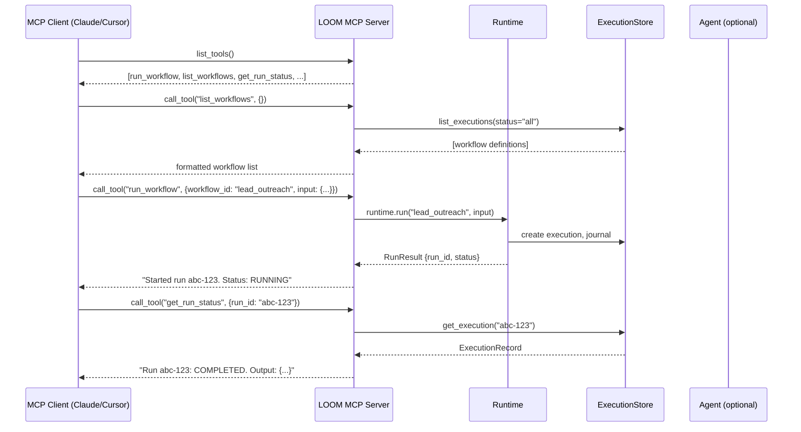
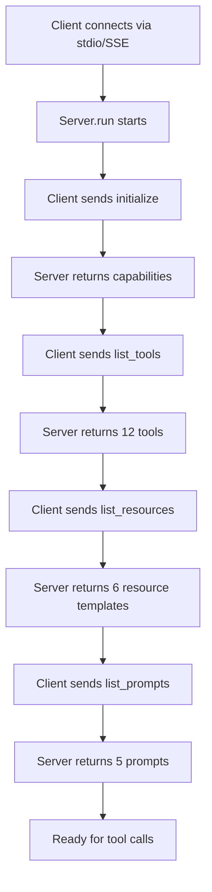
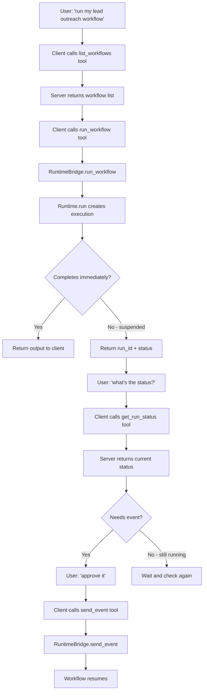

# Phase 9 — MCP Server

**Goal:** Expose the LOOM workflow system as a Model Context Protocol (MCP) server so that Claude Desktop, Cursor, Claude Code, VS Code Copilot, and any MCP-compatible client can discover, run, monitor, and manage workflows through natural language.

**Prerequisites:** Phase 1 (core engine), Phase 2 (agent layer), Phase 3 (toolsets). Benefits from Phase 4 (visualization — WGIR graphs as resources) and Phase 8 (reference workflows as examples).

**System Design References:** Chapters 3 (SDK surface), 5.9 (coding agent), 6 (toolset discovery), 8 (triggers — webhook/manual).

---

## 1. Exit Criteria & Success Metrics

| Metric | Gate | Target |
|--------|------|--------|
| MCP tools callable from Claude Desktop | >= 5 tools | >= 10 tools |
| MCP resources browsable from Cursor | >= 3 resource types | >= 6 resource types |
| MCP prompts usable from Claude Code | >= 2 prompts | >= 5 prompts |
| Round-trip: "create and run workflow" via MCP | Works | Works |
| stdio transport works | Yes | Yes |
| Streamable HTTP transport works | Yes | Yes |
| Tests pass without real MCP client | All | All |

**"Done" means:** A user adds `{"mcpServers": {"loom": {"command": "python", "args": ["-m", "workflow_builder.mcp"]}}}` to their Claude Desktop or Cursor config, and can then ask "list my workflows," "run the lead outreach workflow," "show me the status of run X," or "create a new workflow that does Y" — all through natural language, with the MCP server handling tool dispatch.

---

## 2. HLD — MCP Server Architecture

```
+------------------------------- Phase 9 Scope --------------------------------+
|                                                                                |
|  MCP Clients                                                                   |
|  +---------------+  +---------------+  +---------------+  +---------------+   |
|  | Claude Desktop|  | Cursor        |  | Claude Code   |  | VS Code +     |   |
|  | (stdio)       |  | (stdio)       |  | (stdio/SSE)   |  | Copilot (SSE) |   |
|  +-------+-------+  +-------+-------+  +-------+-------+  +-------+-------+   |
|          |                   |                   |                  |           |
|          +-------------------+-------------------+------------------+           |
|                              |                                                  |
|                              v                                                  |
|  +---------------------------------------------------------------+             |
|  |                    LOOM MCP Server                              |            |
|  |                                                                 |            |
|  |  Transport Layer                                                |            |
|  |  +------------------+  +------------------+  +---------------+ |            |
|  |  | stdio (default)  |  | Streamable HTTP  |  | SSE (legacy)  | |            |
|  |  +------------------+  +------------------+  +---------------+ |            |
|  |                                                                 |            |
|  |  +-----------------------------------------------------------+ |            |
|  |  |                    Tool Registry                            | |            |
|  |  |  run_workflow | list_workflows | get_run_status |           | |            |
|  |  |  resume_run  | cancel_run     | send_event     |           | |            |
|  |  |  create_workflow | search_toolsets | show_toolset |         | |            |
|  |  |  get_run_logs | replay_run | list_runs                     | |            |
|  |  +-----------------------------------------------------------+ |            |
|  |                                                                 |            |
|  |  +-----------------------------------------------------------+ |            |
|  |  |                    Resource Registry                        | |            |
|  |  |  workflow://list | workflow://{id} | run://{id}             | |            |
|  |  |  run://{id}/journal | run://{id}/graph | toolset://list     | |            |
|  |  +-----------------------------------------------------------+ |            |
|  |                                                                 |            |
|  |  +-----------------------------------------------------------+ |            |
|  |  |                    Prompt Registry                          | |            |
|  |  |  create-workflow | debug-run | explain-workflow |           | |            |
|  |  |  optimize-workflow | review-workflow                        | |            |
|  |  +-----------------------------------------------------------+ |            |
|  |                                                                 |            |
|  |  +-----------------------------------------------------------+ |            |
|  |  |                    LOOM Runtime Bridge                      | |            |
|  |  |  Runtime + Store + Agent Layer (Phases 1-3)                | |            |
|  |  +-----------------------------------------------------------+ |            |
|  +---------------------------------------------------------------+             |
+--------------------------------------------------------------------------------+
```

### Component Interactions



---

## 3. LLD — Subsystem Details

### 3.1 MCP Server Core

Uses the official `mcp` Python SDK (v2+) with the `FastMCP` high-level API.

```python
# mcp_server/__init__.py (NEW)

"""LOOM MCP Server — exposes workflow system to Claude, Cursor, and Claude Code."""

from __future__ import annotations
import logging

from mcp.server import Server

logger = logging.getLogger("workflow.mcp")

def create_server(
    store_url: str = "sqlite:///.loom/journal.db",
    name: str = "loom",
) -> Server:
    """Create and configure the LOOM MCP server."""
    from workflow_builder.mcp_server.tools import register_tools
    from workflow_builder.mcp_server.resources import register_resources
    from workflow_builder.mcp_server.prompts import register_prompts
    from workflow_builder.mcp_server.bridge import RuntimeBridge

    server = Server(name)
    bridge = RuntimeBridge(store_url=store_url)

    register_tools(server, bridge)
    register_resources(server, bridge)
    register_prompts(server, bridge)

    logger.info("LOOM MCP server initialized with store: %s", store_url)
    return server
```

### 3.2 Runtime Bridge

Bridges MCP server to the LOOM runtime. Manages lifecycle of Runtime, Store, and optional Agent.

```python
# mcp_server/bridge.py (NEW)

from __future__ import annotations
import asyncio
import logging
from typing import Any

from workflow_builder.runtime.engine import Runtime
from workflow_builder.state.sqlite import SQLiteStore
from workflow_builder.state.memory import MemoryStore

logger = logging.getLogger("workflow.mcp.bridge")

class RuntimeBridge:
    """Bridge between MCP server and LOOM runtime."""

    def __init__(self, store_url: str = "sqlite:///.loom/journal.db"):
        self._store_url = store_url
        self._runtime: Runtime | None = None
        self._store = None
        self._workflow_registry: dict[str, Any] = {}

    async def ensure_runtime(self) -> Runtime:
        """Lazily initialize runtime on first use."""
        if self._runtime is None:
            if self._store_url.startswith("sqlite"):
                self._store = SQLiteStore(self._store_url)
            else:
                self._store = MemoryStore()
            self._runtime = Runtime(store=self._store)
            await self._discover_workflows()
        return self._runtime

    async def _discover_workflows(self):
        """Discover registered workflows from the store and importable modules."""
        # Scan for @workflow decorated functions in the project
        # This uses the same registry as the CLI
        logger.info("Discovering workflows...")

    async def list_workflows(self) -> list[dict[str, Any]]:
        """List all registered workflows."""
        await self.ensure_runtime()
        return [
            {"id": name, "description": wf.description, "input_schema": wf.input_schema}
            for name, wf in self._workflow_registry.items()
        ]

    async def run_workflow(self, workflow_id: str, input_data: dict) -> dict:
        """Run a workflow and return initial status."""
        runtime = await self.ensure_runtime()
        result = await runtime.run(workflow_id, input_data)
        return {
            "run_id": result.run_id,
            "status": str(result.status),
            "output": result.output if result.status.value == "completed" else None,
        }

    async def get_run_status(self, run_id: str) -> dict:
        """Get current status of a workflow run."""
        await self.ensure_runtime()
        record = await self._store.get_execution(run_id)
        if not record:
            return {"error": f"Run {run_id} not found"}
        return {
            "run_id": record.run_id,
            "workflow_id": record.workflow_id,
            "status": str(record.status),
            "output": record.output,
            "error": str(record.error) if record.error else None,
            "started_at": str(record.started_at),
            "completed_at": str(record.completed_at) if record.completed_at else None,
        }

    async def list_runs(self, workflow_id: str | None = None,
                        status: str | None = None, limit: int = 20) -> list[dict]:
        """List recent workflow runs with optional filters."""
        await self.ensure_runtime()
        runs = await self._store.list_executions(
            workflow_id=workflow_id, status=status, limit=limit
        )
        return [
            {
                "run_id": r.run_id,
                "workflow_id": r.workflow_id,
                "status": str(r.status),
                "started_at": str(r.started_at),
            }
            for r in runs
        ]

    async def get_run_journal(self, run_id: str) -> list[dict]:
        """Get journal entries for a run (step-by-step execution log)."""
        await self.ensure_runtime()
        journal = await self._store.load_journal(run_id)
        return [entry.model_dump() for entry in journal.entries]

    async def resume_run(self, run_id: str) -> dict:
        """Resume a suspended run."""
        runtime = await self.ensure_runtime()
        result = await runtime.resume(run_id)
        return {"run_id": run_id, "status": str(result.status)}

    async def cancel_run(self, run_id: str) -> dict:
        """Cancel a running workflow."""
        runtime = await self.ensure_runtime()
        await runtime.cancel(run_id)
        return {"run_id": run_id, "status": "cancelled"}

    async def send_event(self, run_id: str, event_name: str, payload: dict) -> dict:
        """Send an event to a waiting workflow."""
        runtime = await self.ensure_runtime()
        await runtime.send_event(run_id, event_name, payload)
        return {"run_id": run_id, "event": event_name, "delivered": True}

    async def replay_run(self, run_id: str) -> dict:
        """Replay a completed/failed run for debugging."""
        runtime = await self.ensure_runtime()
        result = await runtime.replay(run_id)
        return {"run_id": run_id, "replay_status": str(result.status)}
```

### 3.3 MCP Tools

The primary interface — functions the model can call.

```python
# mcp_server/tools.py (NEW)

from __future__ import annotations
import json
from typing import Any

from mcp.server import Server
from mcp.types import TextContent

from workflow_builder.mcp_server.bridge import RuntimeBridge

def register_tools(server: Server, bridge: RuntimeBridge):
    """Register all LOOM tools with the MCP server."""

    @server.tool()
    async def list_workflows() -> str:
        """List all available workflows with their descriptions and input schemas."""
        workflows = await bridge.list_workflows()
        if not workflows:
            return "No workflows registered. Create one with the create_workflow prompt."
        lines = []
        for wf in workflows:
            lines.append(f"- **{wf['id']}**: {wf.get('description', 'No description')}")
        return "\n".join(lines)

    @server.tool()
    async def run_workflow(workflow_id: str, input_data: str = "{}") -> str:
        """Run a workflow with the given input.

        Args:
            workflow_id: The workflow to run (use list_workflows to see available ones)
            input_data: JSON string of input parameters for the workflow
        """
        try:
            parsed_input = json.loads(input_data)
        except json.JSONDecodeError:
            return f"Error: input_data must be valid JSON. Got: {input_data}"

        result = await bridge.run_workflow(workflow_id, parsed_input)
        status = result["status"]
        if status == "completed":
            return f"Workflow completed.\nRun ID: {result['run_id']}\nOutput: {json.dumps(result['output'], indent=2)}"
        elif status == "suspended":
            return f"Workflow suspended (waiting for event).\nRun ID: {result['run_id']}\nUse send_event to resume."
        else:
            return f"Workflow started.\nRun ID: {result['run_id']}\nStatus: {status}\nUse get_run_status to check progress."

    @server.tool()
    async def get_run_status(run_id: str) -> str:
        """Check the current status of a workflow run.

        Args:
            run_id: The run ID returned by run_workflow
        """
        result = await bridge.get_run_status(run_id)
        if "error" in result:
            return result["error"]
        parts = [
            f"**Run:** {result['run_id']}",
            f"**Workflow:** {result['workflow_id']}",
            f"**Status:** {result['status']}",
            f"**Started:** {result['started_at']}",
        ]
        if result.get("completed_at"):
            parts.append(f"**Completed:** {result['completed_at']}")
        if result.get("output"):
            parts.append(f"**Output:**\n```json\n{json.dumps(result['output'], indent=2)}\n```")
        if result.get("error"):
            parts.append(f"**Error:** {result['error']}")
        return "\n".join(parts)

    @server.tool()
    async def list_runs(workflow_id: str = "", status: str = "", limit: int = 10) -> str:
        """List recent workflow runs with optional filters.

        Args:
            workflow_id: Filter by workflow (optional)
            status: Filter by status: running, completed, failed, suspended (optional)
            limit: Max number of runs to return (default: 10)
        """
        runs = await bridge.list_runs(
            workflow_id=workflow_id or None,
            status=status or None,
            limit=limit,
        )
        if not runs:
            return "No runs found."
        lines = []
        for r in runs:
            lines.append(f"- `{r['run_id'][:8]}...` | {r['workflow_id']} | {r['status']} | {r['started_at']}")
        return "\n".join(lines)

    @server.tool()
    async def resume_run(run_id: str) -> str:
        """Resume a suspended workflow run.

        Args:
            run_id: The run ID to resume
        """
        result = await bridge.resume_run(run_id)
        return f"Run {run_id} resumed. New status: {result['status']}"

    @server.tool()
    async def cancel_run(run_id: str) -> str:
        """Cancel a running or suspended workflow.

        Args:
            run_id: The run ID to cancel
        """
        result = await bridge.cancel_run(run_id)
        return f"Run {run_id} cancelled."

    @server.tool()
    async def send_event(run_id: str, event_name: str, payload: str = "{}") -> str:
        """Send an event to a workflow waiting for it (e.g., approval, data input).

        Args:
            run_id: The run ID waiting for the event
            event_name: The event name the workflow is waiting for
            payload: JSON payload to deliver with the event
        """
        try:
            parsed = json.loads(payload)
        except json.JSONDecodeError:
            return f"Error: payload must be valid JSON."
        result = await bridge.send_event(run_id, event_name, parsed)
        return f"Event '{event_name}' delivered to run {run_id}."

    @server.tool()
    async def get_run_logs(run_id: str) -> str:
        """Get the step-by-step execution journal for a run. Useful for debugging.

        Args:
            run_id: The run ID to inspect
        """
        journal = await bridge.get_run_journal(run_id)
        if not journal:
            return f"No journal entries for run {run_id}."
        lines = []
        for entry in journal:
            lines.append(
                f"- [{entry.get('kind', '?')}] {entry.get('step_id', '?')} "
                f"| status={entry.get('status', '?')} | {entry.get('timestamp', '')}"
            )
        return "\n".join(lines)

    @server.tool()
    async def replay_run(run_id: str) -> str:
        """Replay a completed or failed run for debugging. Uses the journal to re-execute.

        Args:
            run_id: The run ID to replay
        """
        result = await bridge.replay_run(run_id)
        return f"Replay of {run_id}: {result['replay_status']}"

    @server.tool()
    async def search_toolsets(query: str) -> str:
        """Search available toolset integrations (Slack, Gmail, HubSpot, etc.).

        Args:
            query: Search term (e.g., "crm", "email", "slack")
        """
        # Delegates to Phase 3 toolset catalog
        return f"Searching toolsets for: {query}..."

    @server.tool()
    async def show_toolset(toolset_name: str) -> str:
        """Show details of a specific toolset including its operations.

        Args:
            toolset_name: The toolset to inspect (e.g., "slack", "gmail")
        """
        return f"Toolset details for: {toolset_name}..."
```

### 3.4 MCP Resources

Read-only data that clients can browse and fetch.

```python
# mcp_server/resources.py (NEW)

from __future__ import annotations
import json
from mcp.server import Server
from workflow_builder.mcp_server.bridge import RuntimeBridge

def register_resources(server: Server, bridge: RuntimeBridge):
    """Register LOOM resources with the MCP server."""

    @server.resource("workflow://list")
    async def list_workflow_resource() -> str:
        """All registered workflows as a browsable list."""
        workflows = await bridge.list_workflows()
        return json.dumps(workflows, indent=2)

    @server.resource("workflow://{workflow_id}")
    async def workflow_detail(workflow_id: str) -> str:
        """Detailed information about a specific workflow including input schema."""
        workflows = await bridge.list_workflows()
        wf = next((w for w in workflows if w["id"] == workflow_id), None)
        if not wf:
            return f"Workflow '{workflow_id}' not found."
        return json.dumps(wf, indent=2)

    @server.resource("run://{run_id}")
    async def run_detail(run_id: str) -> str:
        """Current status and output of a workflow run."""
        status = await bridge.get_run_status(run_id)
        return json.dumps(status, indent=2)

    @server.resource("run://{run_id}/journal")
    async def run_journal(run_id: str) -> str:
        """Step-by-step execution journal for a run."""
        journal = await bridge.get_run_journal(run_id)
        return json.dumps(journal, indent=2)

    @server.resource("run://{run_id}/graph")
    async def run_graph(run_id: str) -> str:
        """WGIR graph for a run (if Phase 4 visualization is available)."""
        # Delegates to Phase 4 WGIR extraction
        return json.dumps({"note": "WGIR graph — requires Phase 4"})

    @server.resource("toolset://list")
    async def toolset_list() -> str:
        """All available toolset integrations."""
        return json.dumps({"note": "Toolset catalog — requires Phase 3"})
```

### 3.5 MCP Prompts

Reusable prompt templates that guide the model's interaction with LOOM.

```python
# mcp_server/prompts.py (NEW)

from __future__ import annotations
from mcp.server import Server
from mcp.types import PromptMessage, TextContent
from workflow_builder.mcp_server.bridge import RuntimeBridge

def register_prompts(server: Server, bridge: RuntimeBridge):
    """Register LOOM prompt templates with the MCP server."""

    @server.prompt()
    async def create_workflow(description: str) -> list[PromptMessage]:
        """Generate a new LOOM workflow from a natural language description.

        Args:
            description: What the workflow should do
        """
        return [PromptMessage(
            role="user",
            content=TextContent(
                type="text",
                text=f"""Create a LOOM workflow that does the following:

{description}

Use the LOOM SDK with these patterns:
- @workflow decorator for the main function
- @step decorator for each I/O operation
- ctx.step(fn, args) to call steps durably
- ctx.gather(*tasks) for parallel execution
- ctx.sleep(duration) for timed waits
- ctx.wait_for_event(name) for external events

Generate complete, runnable Python code. Include all imports.
All API calls must be inside @step functions — never in the workflow body directly.
Use httpx for HTTP calls. Use Pydantic models for structured data."""
            ),
        )]

    @server.prompt()
    async def debug_run(run_id: str) -> list[PromptMessage]:
        """Debug a failed or stuck workflow run by analyzing its journal.

        Args:
            run_id: The run ID to debug
        """
        journal = await bridge.get_run_journal(run_id)
        status = await bridge.get_run_status(run_id)

        import json
        return [PromptMessage(
            role="user",
            content=TextContent(
                type="text",
                text=f"""Debug this workflow run:

**Status:** {status.get('status', 'unknown')}
**Error:** {status.get('error', 'none')}

**Journal (step-by-step execution):**
```json
{json.dumps(journal[-20:], indent=2)}
```

Analyze:
1. Which step failed and why?
2. Was there a nondeterminism issue?
3. What would you change to fix it?
4. Are there any retry or timeout issues?"""
            ),
        )]

    @server.prompt()
    async def explain_workflow(workflow_id: str) -> list[PromptMessage]:
        """Explain what a workflow does in plain language.

        Args:
            workflow_id: The workflow to explain
        """
        workflows = await bridge.list_workflows()
        wf = next((w for w in workflows if w["id"] == workflow_id), None)

        import json
        return [PromptMessage(
            role="user",
            content=TextContent(
                type="text",
                text=f"""Explain this LOOM workflow in plain language:

**Workflow:** {workflow_id}
**Details:** {json.dumps(wf, indent=2) if wf else 'Not found'}

Explain:
1. What does this workflow do? (1-2 sentences)
2. What are the steps? (bulleted list)
3. What triggers it?
4. What integrations does it use?
5. What could go wrong? (error scenarios)"""
            ),
        )]

    @server.prompt()
    async def optimize_workflow(workflow_id: str) -> list[PromptMessage]:
        """Suggest optimizations for a workflow.

        Args:
            workflow_id: The workflow to optimize
        """
        return [PromptMessage(
            role="user",
            content=TextContent(
                type="text",
                text=f"""Review the workflow '{workflow_id}' and suggest optimizations:

1. Can any sequential steps run in parallel with ctx.gather()?
2. Are retries configured appropriately for external API calls?
3. Are there any nondeterminism violations?
4. Could any steps be marked @pure instead of @effect?
5. Is error handling sufficient?
6. Are there any missing timeout configurations?"""
            ),
        )]

    @server.prompt()
    async def review_workflow(workflow_code: str) -> list[PromptMessage]:
        """Code review a workflow for correctness, security, and best practices.

        Args:
            workflow_code: The Python workflow code to review
        """
        return [PromptMessage(
            role="user",
            content=TextContent(
                type="text",
                text=f"""Review this LOOM workflow code:

```python
{workflow_code}
```

Check for:
1. **Correctness:** All I/O in @step functions, deterministic workflow body
2. **Security:** No hardcoded secrets, validated inputs
3. **Durability:** All side effects journaled via ctx.step()
4. **Error handling:** Retries on transient failures, graceful degradation
5. **Performance:** Parallel execution where possible
6. **Best practices:** Pydantic models for data, type annotations"""
            ),
        )]
```

### 3.6 Server Entry Point & CLI

```python
# mcp_server/__main__.py (NEW)

"""Entry point: python -m workflow_builder.mcp"""

import argparse
import asyncio
import logging

def main():
    parser = argparse.ArgumentParser(description="LOOM MCP Server")
    parser.add_argument("--store", default="sqlite:///.loom/journal.db",
                        help="Store URL (default: sqlite:///.loom/journal.db)")
    parser.add_argument("--transport", choices=["stdio", "sse", "streamable-http"],
                        default="stdio", help="Transport protocol (default: stdio)")
    parser.add_argument("--host", default="localhost", help="HTTP host (for sse/streamable-http)")
    parser.add_argument("--port", type=int, default=8765, help="HTTP port (for sse/streamable-http)")
    parser.add_argument("--log-level", default="INFO",
                        choices=["DEBUG", "INFO", "WARNING", "ERROR"])
    parser.add_argument("--name", default="loom", help="Server name")
    args = parser.parse_args()

    logging.basicConfig(level=getattr(logging, args.log_level))

    from workflow_builder.mcp_server import create_server

    server = create_server(store_url=args.store, name=args.name)

    if args.transport == "stdio":
        from mcp.server.stdio import stdio_server
        async def run():
            async with stdio_server() as (read_stream, write_stream):
                await server.run(read_stream, write_stream)
        asyncio.run(run())

    elif args.transport == "sse":
        from mcp.server.sse import SseServerTransport
        from starlette.applications import Starlette
        from starlette.routing import Route
        import uvicorn

        sse = SseServerTransport("/messages/")

        async def handle_sse(request):
            async with sse.connect_sse(request.scope, request.receive, request._send) as streams:
                await server.run(streams[0], streams[1])

        app = Starlette(routes=[
            Route("/sse", endpoint=handle_sse),
            Route("/messages/", endpoint=sse.handle_post_message, methods=["POST"]),
        ])
        uvicorn.run(app, host=args.host, port=args.port)

    elif args.transport == "streamable-http":
        from mcp.server.streamable_http import StreamableHTTPServerTransport
        import uvicorn

        transport = StreamableHTTPServerTransport(server)
        uvicorn.run(transport.app, host=args.host, port=args.port)

if __name__ == "__main__":
    main()
```

### 3.7 Client Configuration Examples

```python
# mcp_server/examples/config_claude_desktop.json
{
    "mcpServers": {
        "loom": {
            "command": "python",
            "args": ["-m", "workflow_builder.mcp"],
            "env": {
                "LOOM_STORE_URL": "sqlite:///~/.loom/journal.db"
            }
        }
    }
}

# mcp_server/examples/config_cursor.json  (.cursor/mcp.json)
{
    "mcpServers": {
        "loom": {
            "command": "python",
            "args": ["-m", "workflow_builder.mcp", "--store", "sqlite:///workflows.db"]
        }
    }
}

# mcp_server/examples/config_claude_code.json  (.claude/settings.json)
{
    "mcpServers": {
        "loom": {
            "command": "python",
            "args": ["-m", "workflow_builder.mcp"],
            "env": {}
        }
    }
}

# mcp_server/examples/config_remote.json  (SSE for remote access)
{
    "mcpServers": {
        "loom-remote": {
            "url": "http://localhost:8765/sse"
        }
    }
}
```

---

## 4. Directory Structure

```
src/workflow_builder/
├── mcp_server/                     # NEW: Phase 9
│   ├── __init__.py                 # create_server() factory
│   ├── __main__.py                 # CLI entry point (python -m workflow_builder.mcp)
│   ├── bridge.py                   # RuntimeBridge — connects MCP to LOOM runtime
│   ├── tools.py                    # MCP tool definitions (12 tools)
│   ├── resources.py                # MCP resource definitions (6 resource types)
│   ├── prompts.py                  # MCP prompt templates (5 prompts)
│   └── examples/
│       ├── config_claude_desktop.json
│       ├── config_cursor.json
│       ├── config_claude_code.json
│       └── config_remote.json
tests/
├── unit/
│   ├── test_mcp_bridge.py          # RuntimeBridge methods
│   ├── test_mcp_tools.py           # Tool registration and dispatch
│   ├── test_mcp_resources.py       # Resource URI resolution
│   └── test_mcp_prompts.py         # Prompt template generation
├── integration/
│   ├── test_mcp_server_stdio.py    # Full server over stdio transport
│   ├── test_mcp_server_sse.py      # Full server over SSE transport
│   └── test_mcp_round_trip.py      # Create → run → status → cancel cycle
├── e2e/
│   └── test_mcp_with_reference_workflows.py  # Run Phase 8 workflows via MCP
```

---

## 5. Files Requiring Changes

| File | Change Type | What Changes |
|------|-------------|--------------|
| `mcp_server/` (entire directory) | NEW | All MCP server code |
| `setup.py` / `pyproject.toml` | MODIFY | Add `mcp` optional dependency: `pip install workflow-builder[mcp]` |
| `cli.py` | MODIFY | Add `loom mcp` subcommand (alias for `python -m workflow_builder.mcp`) |
| `__init__.py` | NO CHANGE | MCP server is not part of the public SDK surface |

---

## 6. Implementation Steps

| Step | Task | Depends On |
|------|------|------------|
| 9.1 | Add `mcp` to optional dependencies in pyproject.toml | — |
| 9.2 | Implement `RuntimeBridge` with lazy initialization | Phase 1 runtime |
| 9.3 | Implement `register_tools()` — core tools: list, run, status, cancel | 9.2 |
| 9.4 | Implement `register_tools()` — advanced tools: resume, send_event, replay, logs | 9.2 |
| 9.5 | Implement `register_tools()` — discovery tools: search_toolsets, show_toolset | Phase 3 |
| 9.6 | Implement `register_resources()` — workflow and run resources | 9.2 |
| 9.7 | Implement `register_prompts()` — all 5 prompt templates | 9.2 |
| 9.8 | Implement `__main__.py` with stdio and SSE transports | 9.3-9.7 |
| 9.9 | Write unit tests for bridge, tools, resources, prompts | 9.3-9.7 |
| 9.10 | Write integration tests: stdio transport, round-trip lifecycle | 9.8 |
| 9.11 | Write E2E test: run Phase 8 reference workflows via MCP | 9.8, Phase 8 |
| 9.12 | Create config examples for Claude Desktop, Cursor, Claude Code | 9.8 |
| 9.13 | Add `loom mcp` CLI subcommand | 9.8 |

---

## 7. Data Flow Diagrams

### 7.1 MCP Server Initialization



### 7.2 Workflow Lifecycle via MCP



---

## 8. Multi-Angle Review

### Correctness
- Tools return formatted strings, not raw JSON — MCP clients display text content to users.
- `RuntimeBridge` lazily initializes to avoid startup overhead when server is started but unused.
- Journal resource returns last 20 entries by default — prevents overwhelming context.

### Security
- MCP server runs locally (stdio) or on localhost (SSE) by default — not exposed to internet.
- No authentication mechanism in v1 — appropriate for local use. Remote deployment needs auth (future).
- Store URL is configurable — user controls where workflow data lives.
- Prompt templates don't expose system internals — they guide the model's questions.

### Performance
- stdio transport: minimal overhead, no network.
- SSE transport: suitable for remote access, adds HTTP overhead.
- `RuntimeBridge` caches runtime instance — no re-initialization per request.
- Resource fetches are read-only against the store — fast.

### Edge Cases
- Client connects but no workflows registered: `list_workflows` returns helpful empty message.
- Run ID not found: returns error message, not exception.
- Invalid JSON in tool input: caught and returned as user-friendly error.
- Store file doesn't exist yet: SQLiteStore creates it on first use.
- Multiple simultaneous tool calls: `RuntimeBridge` is async-safe.

### Maintainability
- Adding a new tool: one `@server.tool()` function in `tools.py`.
- Adding a new resource: one `@server.resource()` function in `resources.py`.
- Adding a new prompt: one `@server.prompt()` function in `prompts.py`.
- Bridge isolates MCP concerns from runtime — runtime changes don't affect MCP.

### Testing
- Unit tests mock `RuntimeBridge` — no real store or runtime needed.
- Integration tests use in-memory transport — no actual stdio/network.
- E2E tests run against MemoryStore with Phase 8 reference workflows.

### User Perspective
- Setup is one line in config file — `"command": "python", "args": ["-m", "workflow_builder.mcp"]`.
- Natural language works: "list my workflows" → `list_workflows` tool → formatted response.
- Prompts guide users through common tasks: creating, debugging, reviewing workflows.
- Works with any MCP client — not locked to a specific IDE or assistant.

---

## 9. Test Plan

### Unit Tests (8)
| Test | What |
|------|------|
| `test_bridge_lazy_init` | Runtime not created until first tool call |
| `test_bridge_list_workflows` | Returns formatted workflow list |
| `test_bridge_run_workflow` | Runs workflow, returns run_id and status |
| `test_bridge_get_status_not_found` | Returns error for unknown run_id |
| `test_tools_list_workflows` | Tool returns markdown-formatted list |
| `test_tools_run_with_invalid_json` | Returns user-friendly error |
| `test_resources_workflow_detail` | Resolves workflow URI template |
| `test_prompts_create_workflow` | Returns properly formatted prompt messages |

### Integration Tests (5)
| Test | What |
|------|------|
| `test_stdio_server_lifecycle` | Server starts, handles initialize, returns capabilities |
| `test_round_trip_run` | list → run → status → complete via stdio |
| `test_suspend_resume_via_mcp` | Run → suspend → send_event → resume → complete |
| `test_cancel_running_workflow` | Start → cancel → verify cancelled status |
| `test_journal_resource_fetch` | Run workflow → fetch journal via resource URI |

### E2E Tests (3)
| Test | What |
|------|------|
| `test_reference_workflow_via_mcp` | Run WF1 (lead outreach) entirely through MCP tools |
| `test_event_driven_workflow_mcp` | Run WF8 (meeting prep) with wait_for_event via MCP |
| `test_sse_transport_lifecycle` | Full lifecycle over HTTP/SSE transport |

---

## 10. Known Gaps & Mitigations

| Gap | Risk | Mitigation |
|-----|------|------------|
| No authentication for remote transport | Unauthorized access when SSE is exposed | v1 is local-only (stdio); remote auth is a Phase 5 concern |
| Workflow discovery is basic | Can't discover workflows from arbitrary Python files | Start with explicit registration; file scanning is a future enhancement |
| No streaming for long-running workflows | User waits without progress updates | Return run_id immediately; use `get_run_status` for polling; streaming is future |
| MCP SDK v2 may have breaking changes | Server code may need updates | Pin `mcp>=2.0,<3.0` in dependencies; follow upstream releases |
| Resource URIs are custom scheme | May not render as clickable links in all clients | Use standard text formatting; URIs are for programmatic access |
| Prompt templates are static | Can't adapt to user's specific workflow codebase | Prompts provide structure; the model fills in specifics from tool results |
| No WebSocket transport | Some clients may prefer WebSocket | stdio covers local; SSE covers remote; WebSocket can be added later |
