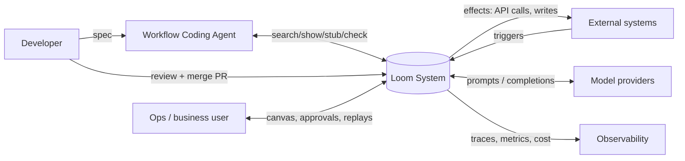
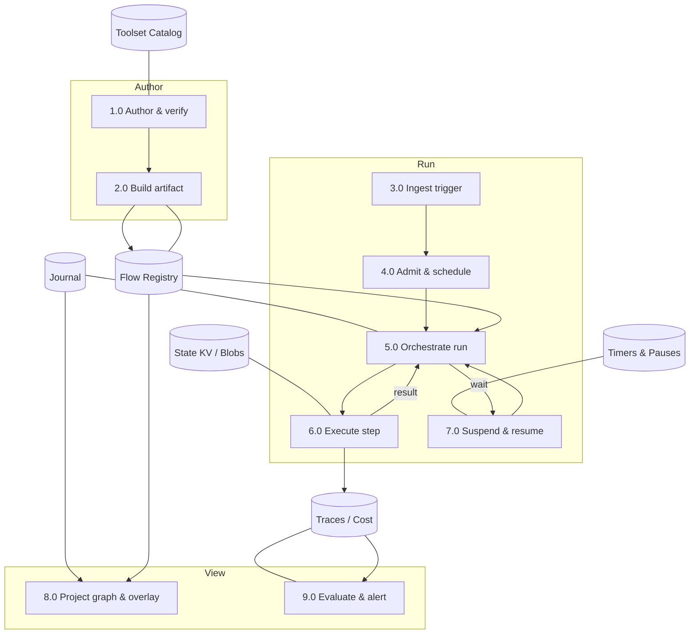
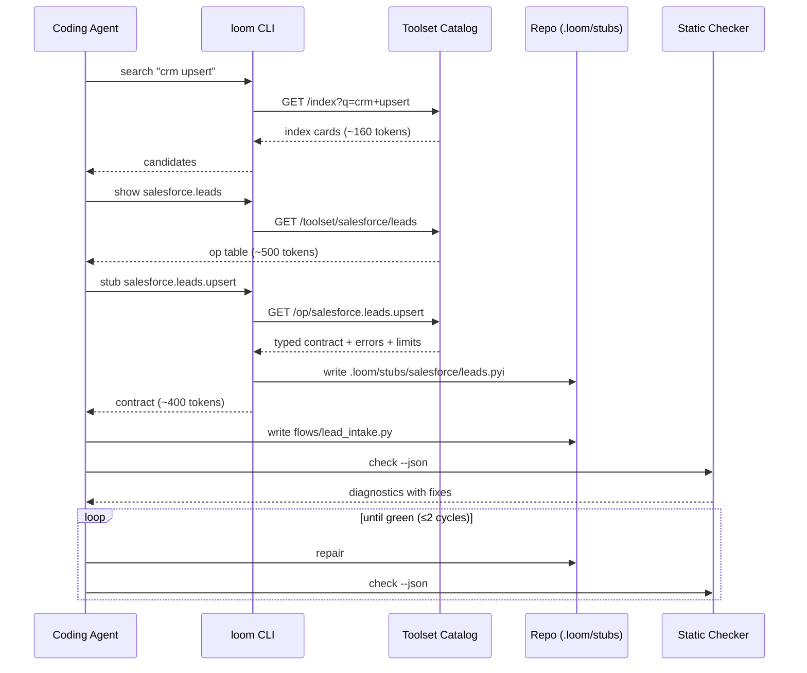
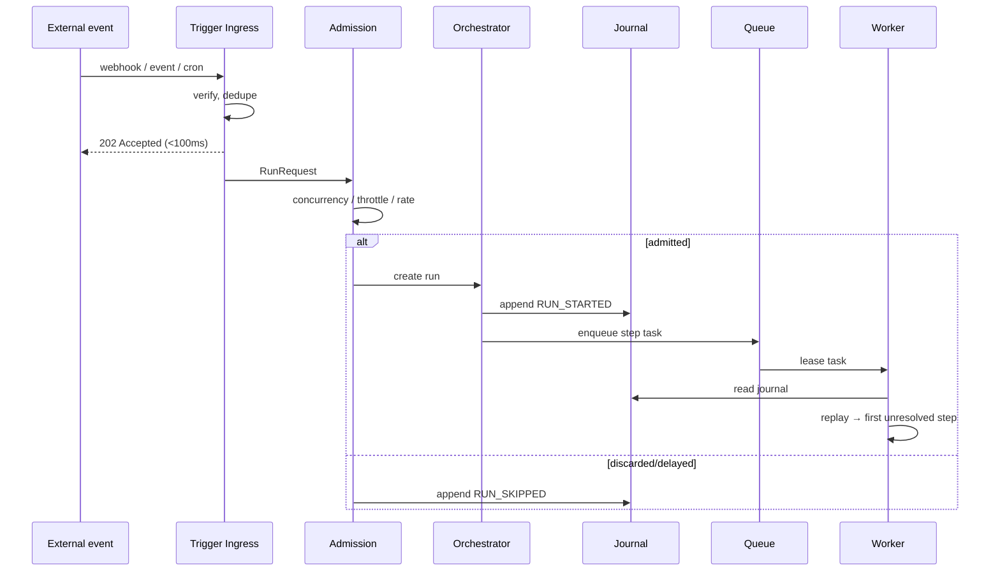
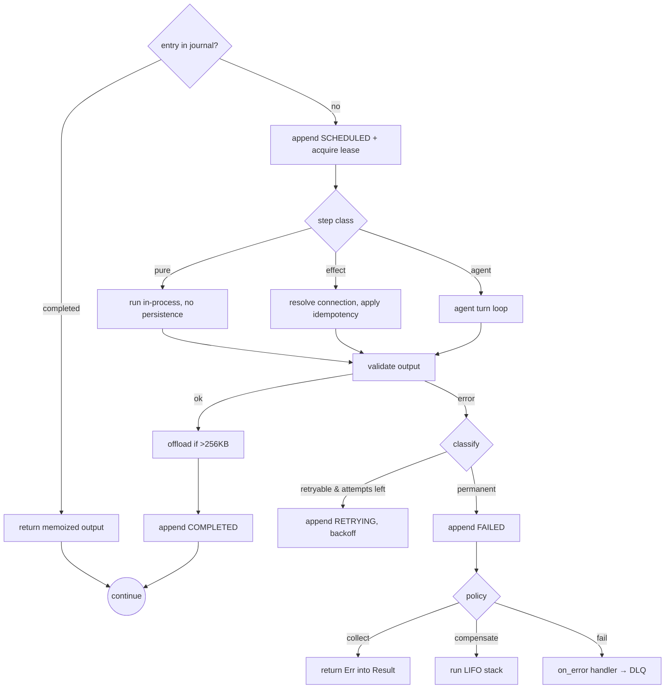
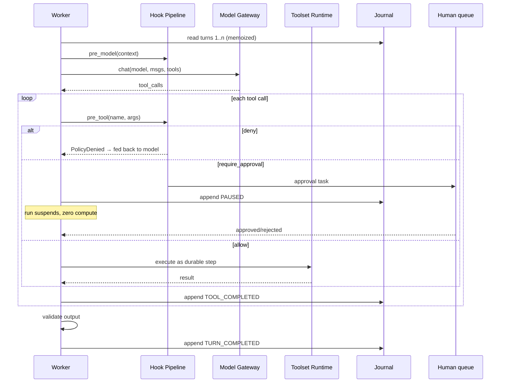
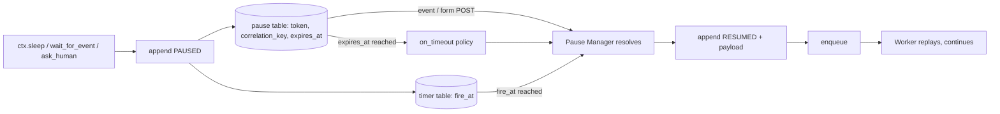
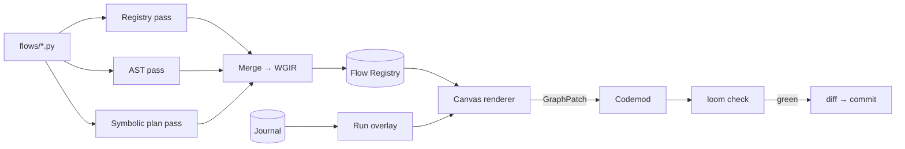
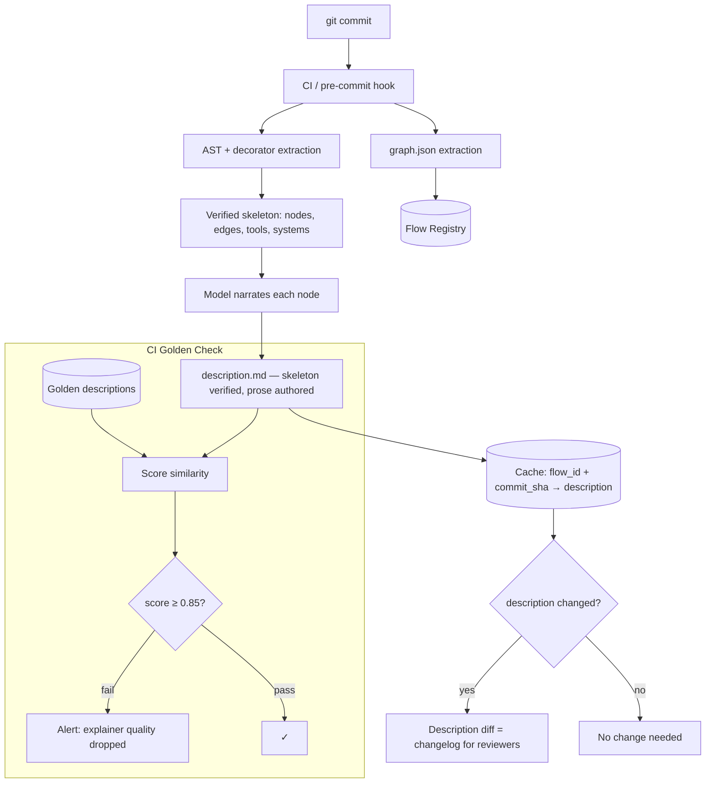

# LOOM — System Design Document

**Code-first, agent-authored workflow SDK. Pip-installable. Execution-portable.**

Version 1.0 · Codename `loom` · Author: PipesHub AI

> **Code is the source of truth. The canvas is a projection. Durability is the runtime.
> The SDK is designed for an LLM to write, not for a human to click.**

---

## Table of Contents

1. [Vision, Goals & Principles](#chapter-1-vision-goals--principles)
2. [High-Level Design (HLD)](#chapter-2-high-level-design-hld)
3. [Programming Model](#chapter-3-programming-model)
4. [Durable Execution Engine](#chapter-4-durable-execution-engine)
5. [Agent System](#chapter-5-agent-system)
6. [Toolset & Integration Architecture](#chapter-6-toolset--integration-architecture)
7. [Visualization & Explainability](#chapter-7-visualization--explainability)
8. [Triggers & Ingress](#chapter-8-triggers--ingress)
9. [Storage Design](#chapter-9-storage-design)
10. [Observability & Logging](#chapter-10-observability--logging)
11. [Security & Governance](#chapter-11-security--governance)
12. [Data Flow Diagrams](#chapter-12-data-flow-diagrams)
13. [Flaws in Current Implementation & Mitigations](#chapter-13-flaws-in-current-implementation--mitigations)
14. [Phasing & Implementation Roadmap](#chapter-14-phasing--implementation-roadmap)
15. [Extension Points & SOLID Design](#chapter-15-extension-points--solid-design)

---

# Chapter 1: Vision, Goals & Principles

## 1.1 The Thesis

**workflow-builder** (codename LOOM) is a pip-installable, library-first durable execution SDK whose
primary deliverable is a **Workflow Coding Agent** — an LLM-powered agent that authors workflow code
mixing third-party SDK calls, workflow constructs (`@workflow`, `@step`, `ctx.*`), and raw Python.

Users describe what they want. The agent produces a ready-to-run workflow. The workflow executes
anywhere: embedded (SQLite, no infra), in a sandbox, against PostgreSQL/MongoDB, or on an external
durable backend (Temporal, DBOS, Restate, Inngest). The SDK never forces a specific runtime.

Five decisions carry the entire design:

| # | Decision | Why |
|---|----------|-----|
| 1 | **Tiny core SDK** (~22 symbols, one import) | An LLM can hold the entire API in working memory. Generation accuracy is a function of surface area. |
| 2 | **Three step classes** — `pure`, `effect`, `agent` | Determinism is a type-level property, not tribal knowledge. Enables replay, exactly-once effects, cheap recompute. |
| 3 | **Three-tier lazy toolset disclosure** | 1,000+ integrations cannot fit in context. Load ~40 tokens per index card, ~500 per operation contract. |
| 4 | **Named steps as the universal join key** | One stable id links code ↔ journal ↔ trace span ↔ canvas node ↔ eval case. |
| 5 | **Graph IR extracted from code, never model-generated** | Deterministic skeleton from AST + decorators. The model narrates nodes it is handed; it cannot invent steps or hide destructive actions. |

## 1.2 Goals

**G1 — Agent-authorable.** A workflow coding agent, given a natural-language spec, produces a
correct, type-checked, runnable workflow on the first or second attempt using bounded context.

**G2 — 10x complexity ceiling.** Recursive decomposition, dynamic DAGs, typed fan-in/fan-out over
10k items, multi-day human approvals, saga compensation, agent loops with tool budgets.

**G3 — Durable by default.** A worker crash, a deploy, a 3-day human wait, or a provider 500 never
loses work and never double-charges a customer.

**G4 — Visual without being visual-first.** Non-authors (ops, PMs, support) can read a graph
projection and watch a live run — but code remains authoritative.

**G5 — Testable.** Unit tests for steps, replay tests for determinism, golden-run evals for agents,
all gating CI.

**G6 — Execution-portable.** Same workflow code runs with `MemoryStore` (tests), `SQLiteStore` (dev),
PostgreSQL/MongoDB (prod), or external backends. No code change between profiles.

## 1.3 Non-Goals

- **Not a no-code builder.** Business users consume templates and forms; they don't author complex flows.
- **Not a general compute platform.** Long CPU-bound jobs are dispatched, not hosted.
- **Not a model provider.** Model routing is a gateway concern, pluggable.
- **Not a bidirectional WYSIWYG editor.** Canvas edits are a constrained op set, not free-form code round-tripping.

## 1.4 Design Principles

1. **Small surface beats rich surface.** Every symbol added to the core SDK taxes every generation forever. Richness goes in toolsets (lazily loaded), never in core.
2. **One obvious way.** No alternate spellings. Two ways to await a step means the agent picks wrong half the time.
3. **Fail at author time, not run time.** Type checker + `loom check` catch schema mismatches, determinism violations, and unknown operations before deploy.
4. **Code is truth; the canvas is a compiled view.** The graph is a projection of decorators and AST, never the reverse. Agent-era workflows change weekly — you need diffs and rollback, which only work on text.
5. **Projectable code.** Constrain the orchestration layer to a builder API / decorators where the graph is literally declared data. Anything else lives inside opaque, visible-but-uneditable nodes. This is why Prefect, Dagster, and Airflow render clean DAGs — the structure was declared, not inferred.
6. **Determinism is a dial, not a foundation.** As models get cheaper and more reliable, the deterministic/agentic boundary moves toward the agent. The architecture must accommodate this shift without a rewrite. Step classes (`pure` → `effect` → `agent`) are the dial positions.
7. **Skeleton-first narration.** Extract the graph skeleton (nodes, edges, tool calls, capability manifest, which systems get written to) deterministically from the AST and SDK primitives. The model narrates every node it's handed — no merging, no skipping. It cannot invent a step or hide a destructive action.
8. **Generate at commit, not on demand.** Cached per commit, the description diff becomes the changelog non-technical reviewers read. No drift, no nondeterministic re-explanations.
9. **Policy is orthogonal.** Guardrails, PII, approvals, budgets: hooks and middleware, never core.
10. **Library first, service optional.** `pip install`, embedded profile with SQLite, Docker optional.
11. **Target the intersection, gate the rest.** Core SDK assumes only capabilities every durable backend provides. Everything else is capability-gated and checked at build time per backend.
12. **Everything has a stable id.** Steps, flows, toolsets, connections, runs, eval cases.

## 1.5 One-Way Doors (Decide Now)

These decisions are irreversible. Getting them wrong costs migration of every deployed flow, stored run, and audit record.

| # | Door | Decision | Cost of Getting It Wrong |
|---|------|----------|--------------------------|
| D1 | **Step identity** | Stable name + `steps.lock` with contract hash and transitive closure hash. Ids never encode position. | No replay, no retry-from-failure, no history across a refactor |
| D2 | **Determinism contract** | Strict from day one: no I/O, no clock, no randomness in the flow body. Enforced by lint + replay-mode runtime. | Can never adopt external engines; replay is unsound |
| D3 | **Durability port semantics** | Core targets Tier-1 universal capabilities only. Everything else is capability-gated per backend. | Locked to your own kernel forever |
| D4 | **Agent persistence model** | Three classes: ephemeral / session / persistent, with `agent_id` and `session_id` journaled. | Every multi-turn agent flow needs rewriting |
| D5 | **Payload addressing** | Reference-first. Values inlined only below 256 KB, behind the same accessor. | Memory blowups, unbounded journal growth |
| D6 | **Tenancy** | `tenant_id` on every row, every queue partition — even with one tenant on day one. | Cross-tenant leakage or a rewrite before first enterprise deal |
| D7 | **Authorization boundary** | Gateway-side always. Tokens never enter the worker process. | Credential exfiltration is a code bug away |
| D8 | **Grant vocabulary** | `<toolset>.<group>:<action>` with actions from a closed set. Reserve all namespaces now. | Audit trail becomes uninterpretable |
| D9 | **Contract evolution** | Additive-optional is safe; everything else requires a patch gate. Enforced by `loom check` against `steps.lock`. | Silent data corruption on resume |
| D10 | **Time/randomness** | Recorded in the journal at first execution, replayed thereafter. | Replay produces different results |
| D11 | **Packaging** | Library-first with pluggable backends. | Never runs embedded; users need infra before hello-world |
| D12 | **Error taxonomy root** | Fixed root hierarchy; new categories are leaves only. | Every hook and error path breaks on upgrade |
| D13 | **Idempotency key derivation** | Caller-supplied for writes. System-derived `{run_id}:{step_id}:{seq}` only as fallback for reads. | Duplicate charges after any refactor |

## 1.6 Two-Way Doors (Defer Safely)

| Area | Why Safe to Defer | Condition |
|------|-------------------|-----------|
| Canvas rendering and editing | Pure projection of code + journal | Emit `graph.json` at build time from Phase 1 |
| Additional triggers beyond webhook/schedule/manual | All normalize to `TriggerEvent` → `start_run` | Normalization boundary exists from Phase 1 |
| Agent pattern helpers (routing, voting, orchestrator-workers) | Thin compositions over existing primitives | — |
| Model providers and routing | Gateway concern | Gateway exists from Phase 1 |
| n8n importer, templates | Additive | Manifest + node conventions stable |
| Knowledge / Memory / Skill toolset kinds | Additive under reserved namespace | Namespace reserved in D8 |

---

# Chapter 2: High-Level Design (HLD)

## 2.1 System Component Map

```
┌──────────────────────────────── AUTHORING PLANE ────────────────────────────────┐
│  Workflow Coding Agent ──▶ loom CLI / MCP server ──▶ Toolset Catalog            │
│         │                     │  search/show/stub/check/pin                     │
│         │                     ├─▶ Stub Generator ──▶ .loom/stubs/*.pyi          │
│         ▼                     ├─▶ Static Checker (types + determinism lint)     │
│  flows/*.py  (Git)            ├─▶ Graph Extractor ──▶ WGIR (graph.json)        │
│         │                     ├─▶ Explainer (commit-time narration)             │
│         ▼                     └─▶ Dev Server (local runtime, hot reload)        │
│  CI: check → tests → evals → build artifact → deploy                           │
└─────────────────────────────────────────────────────────────────────────────────┘
                                        │  artifact (code + WGIR + lockfile)
                                        ▼
┌──────────────────────────────── CONTROL PLANE ──────────────────────────────────┐
│  API Gateway (REST + SSE)        Flow Registry (versions, WGIR, artifacts)      │
│  Trigger Ingress                 Scheduler & Admission (flow control)           │
│   ├ Webhook receiver             Timer Service (durable sleeps, cron)           │
│   ├ Cron scheduler               Pause Manager (waits, HITL tokens)            │
│   ├ Event bus consumer           Orchestrator (journal manager, dispatch)       │
│   ├ Poller pool                  DLQ & Recovery                                │
│   ├ Form / Email / Chat          Connection & Secrets Broker                   │
│   └ MCP endpoint (flow-as-tool)  Model Gateway (routing, cache, budgets)       │
│  Policy Engine                   Blob/Payload Service                          │
│  Identity, RBAC, Audit           Notification & Egress                         │
└─────────────────────────────────────────────────────────────────────────────────┘
                                        │  step tasks (leased)
                                        ▼
┌──────────────────────────────── EXECUTION PLANE ────────────────────────────────┐
│  Worker Fleet (autoscaled, per-tenant pools)                                    │
│   ├ Replay Engine (journal → resume flow body)                                  │
│   ├ Sandbox (microVM/gVisor for untrusted code)                                 │
│   ├ Toolset Runtime (lazy import, egress-filtered HTTP client)                  │
│   ├ Agent Runtime (turn loop, tool dispatch, hooks, validation)                 │
│   └ Sticky cache (hot run state, avoids full replay)                            │
└─────────────────────────────────────────────────────────────────────────────────┘
                                        │
┌──────────── STORAGE ────────────────┐  ┌──────── OBSERVABILITY ──────────────┐
│ Journal DB (Postgres/MongoDB)       │  │ OTel Collector → traces/metrics/logs │
│ State KV (Redis + durable backing)  │  │ GenAI spans, cost ledger             │
│ Blob store (S3-compatible)          │  │ Run index (search)                   │
│ Event log (Kafka/NATS)              │  │ Eval store (datasets, scores)        │
│ Secrets (Vault/KMS/external)        │  │ Alerting                             │
└─────────────────────────────────────┘  └──────────────────────────────────────┘
```

## 2.2 Component Responsibilities

| Component | Responsibility | Phase |
|-----------|---------------|-------|
| **Toolset Catalog** | Serves index/cards/contracts; owns manifests, versions, effect classification | Phase 3 |
| **Static Checker** | Type check + determinism lint + policy lint; the agent's feedback loop | Phase 1 |
| **Graph Extractor** | Produces WGIR from code (registry + AST + symbolic plan) | Phase 4 |
| **Explainer** | Commit-time narration over AST-extracted skeleton | Phase 4 |
| **Flow Registry** | Immutable versioned artifacts; maps flow_id@version → code bundle + WGIR | Phase 5 |
| **Trigger Ingress** | Normalizes all trigger sources into a single `RunRequest`; dedupes; acks fast | Phase 1 |
| **Scheduler & Admission** | Concurrency/throttle/rate-limit/debounce/batch/priority/singleton before enqueue | Phase 5 |
| **Orchestrator** | Owns the journal; decides next step; issues leases; enforces determinism | Phase 1 |
| **Timer/Pause Manager** | Durable sleeps and waits at zero compute; correlation-key matching | Phase 1 |
| **Worker** | Replays flow body, executes one step, reports result; sandboxed | Phase 1 |
| **Agent Runtime** | Turn loop, structured output, tool dispatch, budgets, hooks | Phase 2 |
| **Model Gateway** | Provider routing/failover, caching, token/cost accounting | Phase 2 |
| **Connection Broker** | Exchanges connection id for short-lived scoped credential at the worker | Phase 3 |
| **Blob Service** | Offloads payloads > 256 KB; content-addressed; TTL tiers | Phase 5 |
| **Explainer Pipeline** | Commit-time: AST skeleton → model narration → cached description | Phase 4 |

## 2.3 Deployment Profiles

| Profile | Journal | Workers | Gateway | Use |
|---------|---------|---------|---------|-----|
| **embedded** | SQLite in `.loom/` | in-process | in-process | dev, single-user, CI, tests |
| **server** | PostgreSQL or MongoDB | separate `loom worker` processes | separate service | team self-host, HA |
| **external-durability** | Temporal / DBOS / Restate / Inngest | that engine's workers | separate service | orgs already running one |
| **managed** | hosted | hosted or BYOC | hosted | SaaS |

Moving between profiles is a config change plus a migration, **never a code change**. The same
`flow.py` runs in all four.

### Zero External Dependencies (Embedded Profile)

The embedded profile has **zero external dependencies** beyond Python itself:

```bash
pip install workflow-builder       # only requires: pydantic, pydantic-settings
python my_workflow.py              # runs with SQLite journal, in-process worker
```

No Docker, no PostgreSQL, no MongoDB, no Redis, no message queue, no external services.
The core package dependencies are:
- `pydantic>=2.0` (data validation)
- `pydantic-settings>=2.0` (configuration)

SQLite (bundled with Python) provides the durable journal. The in-process worker executes
steps directly. This is the `MemoryStore` (for tests) and `SQLiteStore` (for persistent dev)
path. Production features (PostgreSQL/MongoDB, HA, external backends) are optional extras
installed only when needed:

```bash
pip install workflow-builder[postgres]    # adds asyncpg
pip install workflow-builder[mongodb]     # adds motor
pip install workflow-builder[temporal]    # adds temporalio
```

## 2.4 The Determinism Dial

The boundary between deterministic orchestration and agentic execution is not a fixed architectural
line — it is a dial with three positions:

```
PURE ◀────────────────── DETERMINISM DIAL ──────────────────▶ AGENT

  @pure              @effect              Agent(...)
  Recomputed.        Journaled.           Journaled per turn.
  Free to replay.    Memoized.            Memoized per turn.
  No I/O.            All I/O.             LLM + tools.

  As models get cheaper and more reliable, work
  slides RIGHT from effect → agent. Architecture
  must never need rewriting when this happens.
```

**Design rule:** A step's class determines its durability and replay semantics. Changing a step from
`@effect` to `Agent(...)` or vice versa is a code change on that step only, not an architectural
migration. The journal envelope carries a `class` field from day one so the engine handles all three
identically at the storage layer.

---

# Chapter 3: Programming Model

## 3.1 The Three Step Classes

| Class | Decorator | Semantics | Journaled? | On Replay | Retries | Phase |
|-------|-----------|-----------|------------|-----------|---------|-------|
| **Pure** | `@pure` | Deterministic transform. No I/O. | Optional (only if expensive) | Recomputed (free) | N/A | Phase 1 |
| **Effect** | `@effect` | Side-effecting I/O. Network, DB, payments. | Always | Memoized — never re-executed | Configurable backoff | Phase 1 |
| **Agent** | `Agent(...)` | Probabilistic. LLM call + tool loop. | Always, per turn | Memoized per turn | + validation repair | Phase 2 |

## 3.2 Forced Orchestrator vs Free-Flow Bodies

This is the core projectability rule. The split is by scope, not by feature:

| | Orchestrator scope (`@workflow` body) | Node scope (`@pure` / `@effect` / custom code) |
|---|---|---|
| **Style** | Forced — restricted subset | Free-flow — ordinary Python |
| **Allowed** | SDK primitives, `await` of steps, `if/match/for/while/try`, pure local computation | Anything: pandas, numpy, httpx, any pip package |
| **Forbidden** | I/O, clocks, randomness, threads, global mutable state, unbounded loops, resource acquisition | Nothing (subject to sandbox + egress grants) |
| **Enforced by** | Lint (`LOOM-D*`) + replay-mode runtime that raises | Sandbox only |
| **Why** | Replay, graph extraction, canvas fidelity, portability across durability backends | Full Python ecosystem power |

**A flow body that reads like a graph is not a coincidence — it is a constraint.** That is what
makes the projection honest rather than decorative, and what enables Prefect/Dagster-style clean DAG
rendering from Python.

## 3.3 Core SDK Surface

```python
from loom import (flow, pure, effect, node, resource, Depends, Agent, ctx,
                  Batch, Page, Blob, Result, Artifact, Refusal, Loom)
from loom.triggers import (Webhook, Schedule, Poll, AppEvent, Chat, Form,
                           Email, Queue, SubFlow, OnComplete, Manual)
```

### Definitions (7)

| Symbol | Purpose | Phase |
|--------|---------|-------|
| `@flow(id, triggers, resources, state, **policy)` | Declare a workflow | Phase 1 |
| `@pure` | Deterministic step | Phase 1 |
| `@effect(retries, idempotency, timeout, on_error)` | Side-effecting step | Phase 1 |
| `@node` | Generic step (custom code node) | Phase 1 |
| `@resource(scope, health)` | Declare an external resource (DB, cache) | Phase 3 |
| `Depends(...)` | Inject a resource into a step | Phase 3 |
| `Agent(id, output, tools, budget, persistence)` | Probabilistic step | Phase 2 |

### Composition — `ctx` (21)

| Call | Purpose | Phase |
|------|---------|-------|
| `ctx.map(items, node, concurrency=, on_error=)` | Typed fan-out → `Batch[T]` | Phase 1 |
| `ctx.gather(*awaitables)` / `ctx.race(*awaitables)` | Parallel / first-wins | Phase 1 |
| `ctx.sleep("5m")` / `ctx.sleep_until(dt)` | Durable timer | Phase 1 |
| `ctx.wait_for_event(name, key=, timeout=)` | Durable external wait | Phase 1 |
| `ctx.ask_human(form=, to=, timeout=, on_timeout=)` | HITL approval | Phase 2 |
| `ctx.call(flow, input)` / `ctx.spawn(flow, input)` | Sub-flow sync / async | Phase 1 |
| `ctx.emit(event, payload)` | Publish event | Phase 3 |
| `ctx.compensate(fn, *args)` | Register LIFO rollback | Phase 5 |
| `ctx.artifact(name, data, mime=)` | User-visible output | Phase 2 |
| `ctx.reply(text_or_artifact)` | Post into bound conversation | Phase 2 |
| `ctx.state` / `ctx.store` | Run-scoped state / cross-run KV | Phase 1 |
| `ctx.now()` / `ctx.uuid()` / `ctx.random()` | Deterministic primitives | Phase 1 |
| `ctx.patched(name)` | Version gate | Phase 5 |
| `ctx.continue_as_new(seed)` | Forever-flow rotation | Phase 5 |
| `ctx.log` / `ctx.progress(pct, msg)` | Structured logs / progress | Phase 1 |
| `ctx.run_id` / `ctx.attempt` / `ctx.env` / `ctx.tenant` | Ambient metadata | Phase 1 |

### Types (6)

| Type | Purpose | Phase |
|------|---------|-------|
| `Batch[T]` | Typed collection with optional lineage | Phase 1 |
| `Page[T]` | Paginated result, durable per page | Phase 3 |
| `Blob` | Reference handle for large/binary payloads | Phase 5 |
| `Result[T]` | `Ok[T] \| Err[StepError]` for `on_error="collect"` | Phase 1 |
| `Artifact` | User-visible output with render hint | Phase 2 |
| `Refusal` | Agent declined the request (typed, not an exception) | Phase 2 |

## 3.4 Projectable Code Design

The orchestration layer is constrained to produce a **projectable graph**. This means:

1. **Decorators declare the graph.** `@flow`, `@pure`, `@effect`, `Agent(...)` — each registers metadata at import time: id, class, in/out types, retry policy, source location.
2. **`ctx.*` calls declare edges.** `ctx.map`, `ctx.gather`, `ctx.call` — each creates a known edge type between declared nodes.
3. **Control flow is standard Python.** `if/match/for/while/try` — the AST visitor extracts these as regions.
4. **Everything else is an opaque node.** Raw Python computation within a step body is visible but uneditable from the canvas — rendered as a single box labeled from the docstring.

This is the same pattern that makes Prefect, Dagster, and Airflow render clean DAGs from Python. The
structure is declared, not inferred.

## 3.5 Canonical Example

```python
from loom import flow, pure, effect, Agent, ctx
from loom.triggers import Event
from pydantic import BaseModel
from typing import Literal

class RefundRequest(BaseModel):
    charge_id: str
    amount_cents: int
    customer_email: str

class RiskAssessment(BaseModel):
    score: float
    recommended: Literal["auto_approve", "review", "deny"]

class Outcome(BaseModel):
    status: Literal["refunded", "denied", "expired"]
    refund_id: str | None = None

risk_agent = Agent("refund-risk", output=RiskAssessment)

@pure
def normalize(req: RefundRequest) -> RefundRequest:
    return req.model_copy(update={"customer_email": req.customer_email.lower().strip()})

@effect(retries=5, idempotency=lambda r: f"refund:{r.charge_id}")
async def issue_refund(req: RefundRequest) -> str:
    # Any Python code: SDK calls, HTTP requests, DB queries
    ...

@flow(id="refund-approval", triggers=[Event("billing.refund.requested")])
async def refund_approval(req: RefundRequest) -> Outcome:
    req = await normalize(req)
    risk = await risk_agent(req)

    if risk.recommended == "deny":
        return Outcome(status="denied")

    if risk.recommended == "review":
        decision = await ctx.ask_human(form=ApprovalForm, to="team:billing", timeout="3d")
        if decision is None:
            return Outcome(status="expired")
        if not decision.approved:
            return Outcome(status="denied")

    refund_id = await issue_refund(req)
    ctx.compensate(reverse_refund, refund_id)
    return Outcome(status="refunded", refund_id=refund_id)
```

## 3.6 Determinism Rules (Lint-Enforced)

| Rule | Diagnostic | Autofix |
|------|-----------|---------|
| No I/O in flow body or `@pure` | `LOOM-D001` | Wrap in `@effect` |
| No `datetime.now()` / `random` / `uuid4` | `LOOM-D002` | Use `ctx.now()/ctx.random()/ctx.uuid()` |
| No unbounded `while` in flow body | `LOOM-D003` | Add `max_iterations=` |
| No mutable module-level state | `LOOM-D004` | Use `ctx.state` |
| No resource acquisition in flow body | `LOOM-D005` | Declare on `@flow`, inject via `Depends` |
| No secrets as literals | `LOOM-S001` | Use connection binding |
| No write effect without idempotency key | `LOOM-E002` | Add `idempotency=` |

## 3.7 DAG Parallelism & Dependency Graph

The orchestrator supports explicit parallelism through three primitives:

```python
# Fan-out with bounded concurrency
results = await ctx.map(items, process_item, concurrency=25, on_error="collect")

# Named parallel tasks
a, b, c = await ctx.gather(
    fetch_users(),
    fetch_orders(),
    fetch_inventory(),
)

# Race: first to complete wins, others cancelled
winner = await ctx.race(
    primary_provider(req),
    fallback_provider(req),
)
```

Dependency graph is implicit from `await` ordering in the flow body:

```python
async def pipeline(inp: Input) -> Output:
    a = await step_a(inp)        # depends on: input
    b = await step_b(inp)        # depends on: input (parallel with a if using gather)
    c = await step_c(a, b)       # depends on: a, b
    return await step_d(c)       # depends on: c
```

The WGIR extractor (Chapter 7) captures these dependencies as explicit `data` edges.

## 3.8 Custom Nodes

A custom node is **just Python code** — a typed function with Pydantic input and output. There
is no special node SDK, no registration ceremony, no plugin framework. Any function decorated
with `@pure`, `@effect`, or `@node` is a node.

### Programmatic Creation (by developers and community)

```python
from loom import effect, pure
from pydantic import BaseModel

# A custom node is any typed function with a decorator
class SentimentInput(BaseModel):
    text: str
    language: str = "en"

class SentimentOutput(BaseModel):
    score: float          # -1.0 to 1.0
    label: str            # "positive" | "negative" | "neutral"
    confidence: float

@effect(retries=2, timeout="10s")
async def analyze_sentiment(inp: SentimentInput) -> SentimentOutput:
    """Analyze text sentiment using an NLP model.

    Args:
        inp: Text and language to analyze.
    """
    # Any Python code: call an API, run a local model, use a library
    ...
```

This node:
- Has Pydantic input (`SentimentInput`) and Pydantic output (`SentimentOutput`)
- Is immediately usable in any workflow (`result = await analyze_sentiment(inp)`)
- Is automatically exposable to the coding agent as a tool (`tool_from_step(analyze_sentiment)`)
- Appears in the WGIR graph as a typed node with edges
- Is unit-testable as a plain function (`await analyze_sentiment(SentimentInput(...))`)

### Natural Language Creation (by the Workflow Coding Agent)

The coding agent can **generate custom nodes from natural language descriptions:**

```
User: "I need a node that takes a customer email and returns their purchase history
       from our internal API at api.internal.com/v2/purchases"

Agent generates:
    class PurchaseHistoryInput(BaseModel):
        email: EmailStr

    class Purchase(BaseModel):
        order_id: str
        amount_cents: int
        date: datetime
        items: list[str]

    class PurchaseHistoryOutput(BaseModel):
        purchases: list[Purchase]
        total_spent_cents: int

    @effect(retries=3, timeout="15s", idempotency=lambda inp: f"purchases:{inp.email}")
    async def get_purchase_history(inp: PurchaseHistoryInput) -> PurchaseHistoryOutput:
        """Fetch customer purchase history from the internal API.

        Args:
            inp: Customer email to look up.
        """
        async with httpx.AsyncClient() as client:
            resp = await client.get(f"https://api.internal.com/v2/purchases",
                                    params={"email": inp.email})
            resp.raise_for_status()
            data = resp.json()
            purchases = [Purchase(**p) for p in data["purchases"]]
            return PurchaseHistoryOutput(
                purchases=purchases,
                total_spent_cents=sum(p.amount_cents for p in purchases),
            )
```

The generated node is standard Python — reviewable in a PR, testable with pytest, and
immediately usable in workflows and as an agent tool.

### Exposing Custom Nodes to the Coding Agent

Custom nodes are exposed to the workflow coding agent through the same toolset discovery
mechanism as built-in operations:

```python
from loom.toolsets import register_toolset

# Register custom nodes so loom search / loom show / loom stub find them
register_toolset(ToolsetManifest(
    id="my-nodes",
    summary="Custom business logic nodes",
    ops=[analyze_sentiment, get_purchase_history, enrich_lead],
))
```

Once registered, the coding agent discovers them via `loom search "sentiment"` and generates
code that uses them, exactly as it would for built-in Slack or Jira operations.

### Community Node Packages

Community members publish node packages as pip-installable libraries:

```bash
pip install loom-nodes-nlp          # community NLP nodes
pip install loom-nodes-payments     # community payment nodes
```

These packages export nodes via the `loom_toolset` entry point and auto-register at import time.

---

# Chapter 4: Durable Execution Engine

## 4.1 The Durability Port

The SDK never assumes capabilities unique to any one engine. The port defines two tiers:

### Tier 1 — Universal (core SDK may assume these)

| Capability | Surfaces As | Phase |
|------------|------------|-------|
| Durable step execution with memoization | `await step(...)` | Phase 1 |
| Durable timer | `ctx.sleep`, `ctx.sleep_until` | Phase 1 |
| External signal / event wait | `ctx.wait_for_event` | Phase 1 |
| Child workflow, sync and async | `ctx.call`, `ctx.spawn` | Phase 1 |
| Cancellation | `runtime.cancel(run_id)` | Phase 1 |
| Deterministic replay | The whole model | Phase 1 |
| At-least-once step delivery | Why D13 (idempotency) exists | Phase 1 |

### Tier 2 — Capability-Gated (checked at build time per backend)

| Capability | Surfaces As | If Absent | Phase |
|------------|------------|-----------|-------|
| Journal introspection | Structural Replay, time-travel | Build error if used | Phase 5 |
| Continue-as-new with seed | Forever-flows | Emulated as child-run chaining | Phase 5 |
| Searchable run attributes | `ctx.log.meta(...)` queryable | Falls back to local index | Phase 5 |
| Sub-second timers | `ctx.sleep("500ms")` | Rounded up with warning | Phase 1 |

### The Port Interface

```python
class DurabilityBackend(Protocol):
    """The single integration point for any durable backend."""

    def capabilities(self) -> Capabilities: ...

    # Tier 1 — every backend must implement these
    async def step(self, key: StepKey, fn: Callable, *, policy: StepPolicy) -> Any: ...
    async def sleep(self, key: StepKey, until: datetime) -> None: ...
    async def wait(self, key: StepKey, name: str, corr: str, timeout: timedelta | None) -> Any: ...
    async def signal(self, target: RunRef, name: str, payload: Any) -> None: ...
    async def child(self, key: StepKey, flow: FlowRef, inp: Any, *, detached: bool) -> Any: ...
    async def cancel(self, target: RunRef) -> None: ...

    # Tier 2 — presence declared in capabilities()
    async def history(self, run: RunRef) -> Iterable[JournalEntry]: ...
    async def continue_as_new(self, seed: Any) -> NoReturn: ...
```

`StepKey` is the D1 identity: `{step_id, contract_hash, closure_hash, attempt}`.

## 4.2 Journal & Replay

### Core Loop

```
worker picks up run ──▶ load journal (or sticky cache)
                    ──▶ re-execute flow body from the top with REPLAYING ctx
                         · every await of a step → journal lookup → instant return
                         · ctx.now()/uuid()/random() → values recorded in journal
                         · step-sequence hash compared at each step
                    ──▶ reach first unresolved step ──▶ leave replay mode ──▶ execute for real
```

Cost of replay is CPU-only re-execution of deterministic glue — no network, no model calls, no
double side effects.

### Journal Entry

```python
@dataclass
class JournalEntry:
    run_id: str
    seq: int                    # monotonic within a run
    step_id: str                # stable identity (D1)
    kind: EntryKind             # STEP | SLEEP | WAIT | AGENT_TURN | ...
    status: EntryStatus         # SCHEDULED | COMPLETED | FAILED | RETRYING
    attempt: int
    input_ref: str | None       # reference to stored payload (D5)
    output_ref: str | None
    error_json: dict | None
    idem_key: str | None        # idempotency key (D13)
    contract_hash: str          # Pydantic schema hash
    closure_hash: str           # transitive closure hash
    started_at: datetime
    ended_at: datetime | None
    cost_usd: float = 0.0
```

## 4.3 Step Execution Algorithm (LLD)

```python
async def execute_step(run: ExecutionRecord, key: StepKey, node: StepDefinition, args: Any) -> Any:
    # 1. Check journal for memoized result
    entry = journal.lookup(run.id, key.step_id)
    if entry and entry.status == "completed":
        return decode(entry.output_ref)                   # memoized — heart of durability
    if entry and entry.status == "failed_permanent":
        raise decode_error(entry.error)

    # 2. Pure steps: recompute without journaling (free)
    if node.klass == "pure" and not node.cache:
        return await node.fn(*args)

    # 3. Journal the attempt
    seq = journal.append(run.id, key.step_id, "scheduled",
                         input_ref=store(args),
                         attempt=(entry.attempt + 1 if entry else 1),
                         contract_hash=node.contract_hash,
                         closure_hash=node.closure_hash)
    lease = leases.acquire(run.id, key.step_id, ttl="60s")

    try:
        # 4. Derive idempotency key
        idem = node.idempotency(args) if node.idempotency else f"{run.id}:{key.step_id}:{seq}"

        # 5. Execute with timeout
        with span(key.step_id, {"loom.class": node.klass, "loom.idem": idem}):
            out = await asyncio.wait_for(node.fn(*args, _idem=idem), node.timeout)

        # 6. Validate output, journal completion
        validate(out, node.out_type)
        journal.append(run.id, key.step_id, "completed", output_ref=store(out))
        return out

    except Exception as ex:
        err = classify(ex)                                # retryable | permanent | validation
        if err.retryable and attempt < node.retries:
            journal.append(run.id, key.step_id, "retrying", error=err)
            schedule_retry(run, key, backoff(attempt, jitter=True))
            raise StepSuspended()
        journal.append(run.id, key.step_id, "failed_permanent", error=err)
        raise StepError(err)
    finally:
        lease.release()
```

**Guarantees:** The journal write for `completed` happens after the effect, so a crash between
effect and journal causes a retry — hence at-least-once. Idempotency keys turn that into
effectively-once observable effects.

## 4.4 Suspension Model

Workflows park themselves by raising `Suspend`:

```python
class Suspend(Exception):
    wake_at: datetime | None = None         # for ctx.sleep
    awaiting_event: str | None = None       # for ctx.wait_for_event
    correlation_key: str | None = None      # for event matching
    form_schema: type[BaseModel] | None = None  # for ctx.ask_human
```

The engine persists the suspension:
1. Creates a `pause` record (correlation key, expiry, form schema)
2. If timer-based, creates a `timer` record (fire_at)
3. Releases the worker — **zero compute while waiting**
4. On event/timer: resolves the pause, re-enqueues the run
5. Worker replays journal → reaches the wait → receives the stored event payload → continues

## 4.5 State Management (Three Tiers)

| Tier | API | Scope | Durability | Phase |
|------|-----|-------|------------|-------|
| **Run state** | `ctx.state` (typed model) | One run | Journaled as deltas | Phase 1 |
| **Store** | `ctx.store.ns("x")` | Cross-run, tenant-scoped | Durable KV, transactional | Phase 1 |
| **Memory** | `memory.*` toolset | Agent-facing | Durable, namespaced | Phase 2 |

```python
class ReconcileState(BaseModel):
    processed: int = 0
    last_cursor: str | None = None

@flow(id="reconcile", state=ReconcileState)
async def reconcile(_: None) -> Summary:
    while page := await fetch_page(ctx.state.last_cursor):
        await ctx.map(page.items, handle, concurrency=20)
        ctx.state.processed += len(page.items)
        ctx.state.last_cursor = page.next_cursor
```

## 4.6 Idempotency

At-least-once is unavoidable, so **every write effect carries an idempotency key** (D13).

| Strategy | Mechanism |
|----------|-----------|
| Native | `Idempotency-Key` header passed through (Stripe, etc.) |
| Gateway dedupe | `(connection_id, op, idem_key)` table with configurable window |
| System fallback | `{run_id}:{step_id}:{seq}` for non-writes |

Missing idempotency on a write effect is lint error `LOOM-E002`.

## 4.7 Structural Replay

Retry a failed run against edited code. `steps.lock` makes this tractable:

| Situation | Class | Action |
|-----------|-------|--------|
| name + contract + closure all match | **reuse** (green) | Memoized output stands |
| pure step, closure changed | **recompute** (amber) | Safe, cheap |
| effect step, closure changed, contract same | **ask** (amber) | Never silently reuse across a code change |
| contract changed | **invalidate** (red) | This step and downstream re-execute |
| step removed | orphan | Entries retained, marked skipped |
| step added | new | Executes fresh |

The user sees a **replay plan preview** — green/amber/red per step, estimated cost, and an explicit
list of external effects that will be re-issued — and approves it.

## 4.8 OS-Like Workflow Scheduling & Interrupt Model

Large-scale deployments run thousands of concurrent, long-running, and forever-running workflows.
The system provides an **OS-like scheduling model** where workflows are analogous to processes:

### The Process Analogy

| OS Concept | Workflow Equivalent | Mechanism |
|------------|-------------------|-----------|
| **Process** | Workflow run | `ExecutionRecord` with `run_id` |
| **Process state** (running/sleeping/blocked/zombie) | Run status (`running`/`suspended`/`waiting`/`completed`/`failed`) | Journal + status field |
| **Context switch** | Worker releases run, picks up another | Lease expiry → re-enqueue |
| **Sleep** | `ctx.sleep("5m")` | Timer table; zero compute while sleeping |
| **Wait on I/O** | `ctx.wait_for_event(name)` | Pause table; zero compute |
| **Signal** | `runtime.send_event(run_id, name, payload)` | Event delivery → resume |
| **Kill** | `runtime.cancel(run_id)` | Cancellation flag checked at next durable op |
| **Interrupt (SIGINT)** | `runtime.pause(run_id)` | Run parks at next step boundary |
| **Resume (SIGCONT)** | `runtime.resume(run_id)` | Re-enqueue; replay from journal |
| **Fork** | `ctx.spawn(flow, input)` | Detached child workflow with own journal |
| **Nice / priority** | `priority=fn` on `@flow` | Priority queue scheduling |
| **Cron job** | `Schedule(cron, tz=)` trigger | Timer wheel + leader election |
| **OOM kill** | Budget exceeded | `BudgetExceeded` error → run parks |

### Interrupt Semantics

Workflows can be interrupted at **step boundaries** (between durable operations), not mid-step:

```python
# External API
await runtime.pause(run_id)    # sets a flag; run parks at next step boundary
await runtime.resume(run_id)   # re-enqueues; replay continues from where it paused
await runtime.cancel(run_id)   # cancellation; checked at next durable op
```

**Why step boundaries, not mid-execution:** A step may have partially completed external
effects (e.g., sent an email). Interrupting mid-step would leave the system in an
inconsistent state. By interrupting at boundaries, the journal accurately reflects what
has completed.

### Scheduler Architecture

```
                    ┌─────────────────────────────────────────────┐
                    │           WORKFLOW SCHEDULER                │
                    │                                             │
  Timer wheel ─────▶│  Due runs      ─┐                          │
  Event arrival ───▶│  Resumed runs  ─┼─▶ Priority queue ──▶ Workers
  New triggers ────▶│  New runs      ─┘    (per partition)       │
  Pause/cancel ────▶│  Interrupt     ──▶ Flag on run record      │
                    │                                             │
                    │  Fairness: per-tenant weighted fair queue   │
                    │  Priority: flow-level + run-level           │
                    │  Backpressure: when queue depth > threshold │
                    │    → throttle new runs for that flow        │
                    └─────────────────────────────────────────────┘
```

### Forever-Running Workflows

Workflows that never terminate use `continue_as_new` to bound journal growth:

```python
@flow(id="watch-inbox", triggers=[Manual()], forever=True)
async def watch(seed: WatchSeed) -> NoReturn:
    while True:
        batch = await poll_since(ctx.state.cursor)
        await ctx.map(batch, handle, concurrency=10)
        ctx.state.cursor = batch.next_cursor
        if ctx.journal_size > ctx.limits.rotate_at:       # default 5k entries
            await ctx.continue_as_new(WatchSeed(cursor=ctx.state.cursor))
```

**Rotation contract:** What survives is exactly the seed model + the store. Run state,
open pauses, in-flight children do not. `forever=True` makes the checker require a rotation
call on every loop path.

### Concurrency & Backpressure

| Mechanism | Description | Phase |
|-----------|-------------|-------|
| **Per-tenant fair queue** | Each tenant gets a weighted share; one runaway tenant can't starve others | Phase 5 |
| **Per-flow concurrency** | `concurrency={limit: 20, key: lambda r: r.customer_id}` | Phase 5 |
| **Backpressure** | When queue depth exceeds threshold, throttle new runs (delay, not discard) | Phase 5 |
| **Priority scheduling** | `priority=fn` on `@flow`; higher-priority runs dequeue first | Phase 5 |
| **Worker pools** | Heterogeneous pools by label (`cpu-heavy`, `mem-heavy`, `gpu`) | Phase 5 |

---

# Chapter 5: Agent System

## 5.1 Agent Executor Abstraction

The workflow system does **not** force a specific agent framework. Two separate protocols exist:

### 5.1.1 AgentExecutor Protocol — Framework Pluggability

Any agent framework (LangGraph, Agno, Pydantic AI, CrewAI, custom) can be plugged in by
implementing the `AgentExecutor` protocol. This is the boundary between the workflow engine
and the agent implementation:

```python
@runtime_checkable
class AgentExecutor(Protocol):
    """Plug in any agent framework: LangGraph, Agno, Pydantic AI, CrewAI, or custom.

    The workflow system calls `execute()` and journals the result. Everything inside
    `execute()` — the turn loop, tool dispatch, memory management, prompt engineering —
    belongs to the framework, not to the workflow engine.
    """

    agent_id: str

    async def execute(
        self,
        input: Any,
        *,
        tools: list[Tool] | None = None,
        output_type: type[BaseModel] | None = None,
        settings: AgentSettings | None = None,
        context: AgentContext | None = None,
    ) -> AgentResult: ...

class AgentSettings(BaseModel):
    max_turns: int | None = None
    max_tokens: int | None = None
    max_cost_usd: float | None = None
    timeout: Duration | None = None
    extra: dict[str, Any] = {}          # framework-specific config

class AgentContext(BaseModel):
    run_id: str
    session_id: str | None = None
    session_history: list[Message] | None = None   # for session persistence
    principal: str | None = None                    # for persistent agents
    workflow_ctx: Any | None = None                 # durable context for tool calls

class AgentResult(BaseModel):
    output: Any
    usage: Usage = Usage()
    messages: list[Message] = []        # conversation record (journaled)
    refusal: str | None = None          # if the agent declined
```

**How frameworks plug in:**

```python
# LangGraph adapter
class LangGraphExecutor:
    agent_id: str = "my-langgraph-agent"

    def __init__(self, graph: CompiledGraph):
        self._graph = graph

    async def execute(self, input, *, tools=None, output_type=None, **kw) -> AgentResult:
        result = await self._graph.ainvoke({"input": input})
        return AgentResult(output=result["output"], usage=...)

# Agno adapter
class AgnoExecutor:
    agent_id: str = "my-agno-agent"

    def __init__(self, agent: AgnoAgent):
        self._agent = agent

    async def execute(self, input, *, tools=None, **kw) -> AgentResult:
        response = await self._agent.run(str(input))
        return AgentResult(output=response.content, usage=...)

# Register with the workflow
@flow(id="support-ticket")
async def handle_ticket(req: TicketRequest) -> Resolution:
    # The workflow doesn't know or care which framework runs behind the executor
    result = await ctx.call_agent(langgraph_executor, req)
    ...
```

The workflow engine journals `AgentResult` — it never reaches inside the executor's implementation.
Session state, memory management, and turn loops are the framework's concern. The workflow system
provides `AgentContext` with session history if the persistence class requires it, but the executor
decides how to use it.

### 5.1.2 ModelProvider Protocol — LLM Vendor Abstraction

For the built-in agent runtime (shipped with the SDK as a default `AgentExecutor`), a second
protocol abstracts the LLM vendor:

```python
@runtime_checkable
class ModelProvider(Protocol):
    """The single integration point for any LLM vendor.
    Used by the built-in agent runtime. External frameworks bring their own."""
    model_name: str
    async def complete(self, request: ModelRequest) -> ModelResponse: ...

class ModelSettings(BaseModel):
    temperature: float | None = None
    top_p: float | None = None
    max_tokens: int | None = None
    seed: int | None = None
    tool_choice: str | None = None      # "auto" | "required" | "none" | specific name
    timeout: float | None = None

class ModelRequest(BaseModel):
    messages: list[Message]
    tools: list[ToolSchema] = []
    output_schema: dict[str, Any] | None = None
    settings: ModelSettings = ModelSettings()

class ModelResponse(BaseModel):
    message: Message
    usage: Usage = Usage()
    finish_reason: FinishReason = FinishReason.STOP
    model: str = ""
```

The built-in runtime is the default for users who don't bring their own framework. It handles
the turn loop, tool dispatch, structured output validation, and budget enforcement. But it is
**one implementation of `AgentExecutor`**, not the only one.

### 5.1.3 The Two-Level Stack

```
Workflow Engine
    │
    └─▶ AgentExecutor (protocol)        ← plug in any framework here
            │
            ├─▶ BuiltInAgentRuntime     ← ships with SDK (default)
            │       └─▶ ModelProvider   ← plug in any LLM vendor here
            │
            ├─▶ LangGraphExecutor       ← user-provided adapter
            ├─▶ AgnoExecutor            ← user-provided adapter
            ├─▶ PydanticAIExecutor      ← user-provided adapter
            └─▶ CustomExecutor          ← user-provided adapter
```

## 5.1.4 Agent Registry & Configuration

Agents are **defined and configured in a registry**, not inline in workflow code. The registry
is the single source of truth for which model an agent uses, what system prompt it has, which
tools are available, and what budget constraints apply.

### Agent Definition

```python
from loom import Agent, AgentDefinition
from loom.agents import ModelProvider

# Define an agent in the registry (typically in agents/definitions.py)
support_triage = AgentDefinition(
    id="support-triage",
    description="Classifies support tickets by priority and routes them.",
    model="claude-sonnet-4",                           # model selection
    provider=AnthropicProvider(api_key_env="ANTHROPIC_API_KEY"),  # or OpenAIProvider, custom
    system_prompt="""You are a support triage agent. Classify incoming tickets
    by priority (low/med/high) and recommend a routing action.""",
    output_type=Triage,                                 # structured output
    tools=["crm.customers:read", "kb.support-docs:read"],  # tool grants
    budget=AgentLimits(max_turns=12, max_tokens=50_000, max_cost_usd=0.50),
    persistence="ephemeral",                            # or "session" or "persistent"
    temperature=0.3,
    extra={"reasoning_effort": "medium"},               # provider-specific settings
)

# Define an agent backed by an external framework
langgraph_researcher = AgentDefinition(
    id="deep-researcher",
    description="Multi-step research agent using LangGraph.",
    executor=LangGraphExecutor(graph=research_graph),   # external framework
    output_type=ResearchBrief,
    budget=AgentLimits(max_turns=40, max_cost_usd=2.00),
    persistence="session",
)
```

### Using Agents in Workflows

```python
# Workflow code references agents by ID — the registry resolves everything
triage = Agent("support-triage")           # looks up AgentDefinition from registry
researcher = Agent("deep-researcher")      # LangGraph-backed — workflow doesn't know or care

@flow(id="handle-ticket")
async def handle_ticket(ticket: Ticket) -> Resolution:
    classification = await triage(ticket)              # uses registry's model, prompt, tools
    if classification.priority == "high":
        brief = await researcher(ticket)               # uses LangGraph executor
    ...
```

### What the Registry Manages

| Concern | Where Configured | Where Used |
|---------|-----------------|------------|
| **Model selection** | `AgentDefinition.model` or `AgentDefinition.provider` | Built-in runtime selects model; external executors manage their own |
| **System prompt** | `AgentDefinition.system_prompt` | Injected as first message by built-in runtime |
| **Prompt versioning** | `AgentDefinition` is pinned in `loom.lock` by content hash | Prompt change = new version, triggers eval gates |
| **Tool grants** | `AgentDefinition.tools` | Intersected with flow grants at runtime (D7) |
| **Budget** | `AgentDefinition.budget` | Enforced at model gateway |
| **Executor** | `AgentDefinition.executor` (optional) | If set, uses external framework; otherwise built-in runtime |
| **Temperature / settings** | `AgentDefinition.temperature`, `.extra` | Passed to `ModelSettings` or `AgentSettings` |

### Prompt Management

Prompts are **versioned alongside agent definitions**. A prompt change is a production change:

```python
# loom.lock tracks agent definition hashes
[agents.support-triage]
definition_hash = "sha256:abc123..."
prompt_hash = "sha256:def456..."
model = "claude-sonnet-4"
tools = ["crm.customers:read", "kb.support-docs:read"]
```

- Changing a prompt updates the hash in `loom.lock`
- CI runs eval gates on agent-definition changes independently of flow changes
- The journal records `(agent_id, definition_hash)` so replay uses the same prompt version

### Registry Storage

```sql
CREATE TABLE agent_definition (
    id              TEXT PRIMARY KEY,
    tenant_id       TEXT NOT NULL,
    description     TEXT,
    model           TEXT,
    provider_config JSONB,                              -- serialized provider settings
    system_prompt   TEXT,
    output_schema   JSONB,                              -- Pydantic JSON Schema
    tools           TEXT[],                              -- tool grant references
    budget_json     JSONB,                              -- AgentLimits
    persistence     TEXT NOT NULL DEFAULT 'ephemeral',
    executor_ref    TEXT,                                -- external framework reference
    settings_json   JSONB,                              -- temperature, extra, etc.
    definition_hash TEXT NOT NULL,                       -- content hash for versioning
    created_at      TIMESTAMPTZ NOT NULL DEFAULT NOW(),
    updated_at      TIMESTAMPTZ
);
```

## 5.2 Three Persistence Classes

| Class | Identity | State Between Calls | Replay | Phase |
|-------|----------|---------------------|--------|-------|
| **Ephemeral** (default) | `agent_id` only | None | Memoized per call | Phase 2 |
| **Session** | `agent_id` + `session_id` | Message history within session | Memoized per `(session_id, turn_index)` | Phase 2 |
| **Persistent** | `agent_id` + `principal` | Long-term memory across all sessions | Memoized per turn; memory reads recorded | Phase 5 |

```python
triage = Agent("support-triage", output=Triage)

# Ephemeral: single-shot
verdict = await triage(ticket)

# Session: multi-turn, survives across runs
convo = triage.session(key=f"ticket:{ticket.id}")
summary = await convo.ask("Summarize the problem.")
proposal = await convo.ask("Propose a fix.")           # sees previous turn

# Persistent: long-term memory bound to a principal
am = Agent("account-manager", persistence="persistent")
bound = am.for_principal(f"account:{account.id}")
brief = await bound.ask("What changed since last quarter?")
```

## 5.3 Tool System

Any `@step`, `WorkflowDefinition`, or plain function can be surfaced as a tool:

```python
# tools.py — schema derived from signature + docstring Args: section
@dataclass
class Tool:
    fn: Callable
    name: str
    description: str            # from docstring summary
    parameters: dict[str, Any]  # JSON Schema from signature
    takes_context: bool
    needs_approval: bool | Callable[[dict[str, Any]], bool]
    validator: TypeAdapter | None
```

Adapters:
- `tool_from_step(step_def)` — step keeps its retry policy and journaling
- `tool_from_workflow(workflow_def)` — spawns a child workflow
- `coerce_tool(candidate)` — accepts Tool, StepDefinition, WorkflowDefinition, or callable

## 5.4 Hook Pipeline (Guardrails)

```
pre_model → [model] → post_model
              └─ per tool call: pre_tool → [tool as durable step] → post_tool
```

- `pre_tool` returns `allow | deny(reason) | modify(args) | require_approval(...)`
- `require_approval` suspends into the same HITL machinery as `ctx.ask_human`
- Hooks are registered in the platform registry, **never in workflow code**
- Hooks that do I/O run as effects; pure hooks run inline

## 5.5 Budgets & Limits

```python
class AgentLimits(BaseModel):
    max_turns: int | None = None
    max_tokens: int | None = None
    max_cost_usd: float | None = None
    max_tool_calls: int | None = None
    timeout: Duration | None = None
```

Enforced at the model gateway. Exceeding any limit yields `BudgetExceeded`, not a silent stop.

## 5.6 The Workflow Coding Agent (Builder)

The primary user-facing feature. It takes a natural-language description and produces a valid,
runnable workflow file.

### Build Pipeline (5 Stages)

```
┌──────────┐  ┌───────────────┐  ┌──────────┐  ┌──────────────┐  ┌──────────┐
│ 1. SPEC  │─▶│ 2. PRE-FLIGHT │─▶│ 3. CODE  │─▶│ 4. VERIFY    │─▶│ 5. GRANT │─▶ deploy
│ elicit   │  │ connections   │  │ generate │  │ 4a types     │  │ approve  │
│ + intent │  │ resources     │  │ w/ SDK   │  │ 4b graph     │  │ + sign   │
│ + tests  │  │ backend caps  │  │          │  │ 4c critique  │  └──────────┘
└──────────┘  └───────────────┘  └──────────┘  │ 4d mock run  │
     ▲                                ▲        └──────┬───────┘
     └──── clarifying questions ──────┴─ repair ◀─────┘ (≤2 cycles)
```

**Stage 1 — Spec:** Free-prompt → structured `WorkflowSpec` with acceptance tests.
**Stage 2 — Pre-flight:** Resolve capabilities before writing code.
**Stage 3 — Codegen:** Generate using the SDK surface + toolset stubs.
**Stage 4 — Verify:** Types (4a), graph (4b), critic (4c), mock run (4d).
**Stage 5 — Grants:** Derive from code, approve, sign artifact.

### Authoring Sessions as Durable Artifacts

```python
class AuthoringSession(BaseModel):
    id: str
    tenant_id: str
    flow_id: str
    status: str
    spec_ref: str               # the WorkflowSpec, versioned
    decision_log_ref: str       # every choice + why
    diagnostics_ref: str        # full check/critic/mock trail
    toolset_refs: list[str]     # which contracts were fetched
    transcript_ref: str         # for humans reviewing intent
```

The builder is itself a session agent: `Agent("workflow-builder", persistence="session")` whose
session key is the `authoring_session.id`. Reload from spec + decision log + diagnostics, not the
transcript.

## 5.8 Incremental Workflow Updates via Natural Language

Users can update an existing workflow by describing changes in natural language. The coding
agent performs **targeted modifications**, not full regeneration.

### Update Flow

```
User: "Add a Slack notification after the refund is issued"

Builder agent:
  1. Load authoring session → existing spec + decision log + current code
  2. Diff intent: spec.steps += ["notify billing channel on Slack"]
  3. Targeted codegen: insert ONE step + import, not rewrite entire flow
  4. Run verification gates 4a-4d on the DIFF (not the whole file)
  5. Produce a PR-ready diff

Code diff:
  + from loom.toolsets import slack
  +
  + @effect(retries=2)
  + async def notify_refund(req: RefundRequest, refund_id: str) -> None:
  +     await slack.chat.post_message(
  +         channel="#billing",
  +         text=f"Refunded ${req.amount_cents/100:.2f} for {req.customer_email}"
  +     )
  +
    async def refund_approval(req: RefundRequest) -> Outcome:
        ...
        refund_id = await issue_refund(req)
  +     await notify_refund(req, refund_id)
        return Outcome(status="refunded", refund_id=refund_id)
```

### How the Builder Knows What to Change

The authoring session stores structured artifacts — not just a transcript:

| Artifact | Enables |
|----------|---------|
| `spec_ref` (WorkflowSpec) | Builder knows the original intent and can diff against the new request |
| `decision_log_ref` | Builder knows *why* each choice was made ("used effect not agent because schema known") |
| `toolset_refs[]` | Builder knows which contracts are already fetched — no re-discovery needed |
| Current code (on disk) | Builder reads the file directly and applies targeted edits |

### Visualization Auto-Update

When code changes (whether by NL update or manual edit):

```
Code change → loom check (gates 4a-4b) → new graph.json (WGIR) → new flow_version
                                                                        │
                                    Canvas auto-refreshes ◀─────────────┘
                                    Description diff generated (commit-time)
```

The visualization is **never manually updated**. It is always a deterministic projection of
the current code version. A code change produces a new `flow_version` with a new `graph_ref`,
and the canvas reflects the new version immediately.

### Incremental vs Full Regeneration

| Scenario | Strategy | Why |
|----------|----------|-----|
| "Add a Slack notification" | **Incremental** — insert one step | Spec diff is additive; existing steps untouched |
| "Change the approval to require two reviewers" | **Incremental** — modify one step's parameters | Localized change |
| "Completely redesign this to use a different API" | **Full regeneration** — rewrite from updated spec | Spec diff is structural; most steps change |
| "Fix the bug where duplicate emails are sent" | **Incremental** — add idempotency key or dedupe check | Targeted fix |

The builder chooses incremental by default and falls back to full regeneration only when the
spec diff is structural (> 50% of steps affected). This decision is logged in the decision log.

---

# Chapter 6: Toolset & Integration Architecture

## 6.1 Three-Tier Lazy Disclosure Protocol

```
Tier 0  ALWAYS LOADED        loom core skill card                      ~700 tokens
Tier 1  ON INTENT            loom search "<capability>"                ~40 tokens/hit
Tier 2  ON SELECTION          loom show <toolset>[.<group>]            ~300-900 tokens
Tier 3  ON USE               loom stub <toolset>.<op>                  ~250-500 tokens
```

A typical 3-integration workflow costs ~4.5k tokens of toolset knowledge vs. millions for eager loading.

## 6.2 Scaling to 1000+ Integrations

The path to 1000+ toolsets is **automated generation + community contribution**, not hand-curation:

| Tier | Count | How Created | Review |
|------|-------|-------------|--------|
| **Hand-curated** (Slack, Stripe, Jira, ...) | ~20 | Manual authoring + deep review | Human review gate |
| **Auto-generated** (from OpenAPI/MCP) | ~200-500 | Pipeline from upstream specs | **Automated certification** |
| **Community** (pip packages) | Unbounded | Plugin SDK + entry points | Automated + community vetting |

### Automated Certification (replaces human review at scale)

For auto-generated and community toolsets, the `[human review gate]` is replaced by an
**automated certification suite**:

```
loom certify my-toolset
  ✓ CERT-01  manifest schema valid
  ✓ CERT-02  every op has typed input and output models
  ✓ CERT-03  effect classification (read/write/destructive) present on all ops
  ✓ CERT-04  scope mapping complete (op → required scopes)
  ✓ CERT-05  no credential handling in package (no token/secret literals)
  ✓ CERT-06  egress hosts declared and match actual HTTP calls (static analysis)
  ✓ CERT-07  fakes present for all ops
  ✓ CERT-08  contract tests pass against vendor sandbox
  ✓ CERT-09  pagination declared on list ops
  ✓ CERT-10  rate limits declared
  ✓ CERT-11  SBOM generated, no known vulnerabilities
  ✓ CERT-12  package size < 5 MB (keeps worker images small)

  Result: CERTIFIED (auto-approved for publishing)
```

Toolsets that pass all 12 checks are auto-published without human review. Failing checks
produce actionable diagnostics. This is what makes 1000+ integrations operationally feasible.

### Drift Detection (keeps 1000+ toolsets alive)

Nightly CI re-generates from upstream specs and diffs:
- **Additive drift** (new ops) → auto-PR to update
- **Breaking drift** (changed op signature) on a **used** op → fail that flow's CI, notify owner
- **Unmaintained** (upstream spec gone, tests failing > 30 days) → mark `deprecated`, eventually archive

## 6.3 Toolset Generation Pipeline

```
OpenAPI 3.1 / MCP tools-list / GraphQL introspection / hand-written spec
   │  normalize: operationId → group.op
   ▼
ToolsetManifest
   ├─▶ models.py     typed inputs/outputs
   ├─▶ client.py     async, gateway-routed, typed errors
   ├─▶ *.pyi         stubs for type checker and agent
   ├─▶ CARD.md       Tier-2 op table
   ├─▶ fakes.py      seeded from spec examples
   └─▶ scopes.json   op → required scopes
   ▼
[human review gate]
   ▼
published: loom-toolset-<id>@<semver>
```

## 6.3 Pagination

List ops return `Page[T]`, never a bare list (one-way door):

```python
page = await jira.issues.search(jql="project=ENG")     # Page[Issue]
async for p in jira.issues.search(jql=...).pages(max_pages=50): ...
items = await jira.issues.search(jql=...).all(max_items=10_000)  # hard cap REQUIRED
```

Each page fetch is its own durable sub-step, so a 50-page crawl resumes mid-pagination.

## 6.4 Rate Limiting (Gateway-Side)

Rate-limit state is per-connection and shared across runs and workers, so it **must** live at the
gateway, not client-side.

| Layer | Mechanism |
|-------|-----------|
| Declared | Manifest states known limits |
| Enforced | Gateway token bucket keyed by `(connection_id, limit_group)` |
| Adaptive | Parse `Retry-After`, `X-RateLimit-Remaining` |
| On 429 | Retry with backoff inside step's retry budget |
| Backpressure | Sustained saturation throttles new runs |

## 6.5 Toolset Registration by Users

The workflow system ships with built-in toolsets, but users **register their own** through
the same mechanism. The system never forces a closed toolset catalog.

### Programmatic Registration

```python
from loom import Loom, effect
from loom.toolsets import ToolsetManifest, register_toolset

# Option 1: Register an existing @effect step as a toolset operation
@effect(retries=3)
async def send_sms(to: str, body: str) -> MessageResult:
    """Send an SMS via Twilio.

    Args:
        to: Phone number in E.164 format.
        body: Message body (max 1600 chars).
    """
    ...

# Option 2: Register a manifest (for multi-op toolsets)
register_toolset(ToolsetManifest(
    id="internal-crm",
    version="1.0.0",
    summary="Internal CRM operations",
    ops=[send_sms, update_contact, search_contacts],
    auth={"kind": "api_key"},
))

# Option 3: Auto-register from an OpenAPI spec
register_toolset_from_openapi("https://api.internal.com/openapi.json", id="internal-api")
```

### Registration at `pip install` Time

Users install toolset packages as pip extras, and they auto-register:

```bash
pip install workflow-builder                        # core only
pip install loom-toolset-slack                       # community toolset
pip install my-company-toolset                       # custom internal toolset
```

Toolset packages export a `loom_toolset` entry point (setuptools). The system discovers
and registers them at import time via `importlib.metadata`.

### User vs System Toolsets

| Source | Discovery | Registration | Phase |
|--------|-----------|-------------|-------|
| **Built-in** (shipped with SDK) | Always available | Automatic | Phase 3 |
| **Community** (pip packages) | `loom search` after install | Via entry point | Phase 6 |
| **User-defined** (in-repo) | `loom search` within project | `register_toolset()` call | Phase 3 |
| **Generated** (from OpenAPI/MCP) | `loom search` after generation | `register_toolset_from_*()` | Phase 3 |

All sources appear identically in `loom search` / `loom show` / `loom stub`. The coding
agent cannot distinguish user-defined from built-in toolsets — they share the same manifest
format and the same three-tier disclosure protocol.

## 6.6 Grant System

Grants are **derived statically from code** at build time, never declared by the coding agent:

```yaml
grants:
  toolsets:  [jira.issues:write, slack.chat:write]
  agents:    [support-triage]
  resources: [pg:read]
  subflows:  [notify-oncall]
  egress:    [api.atlassian.com, slack.com]
  budget:    {usd_per_run: 0.50, turns_per_run: 40}
```

**Wildcards and dynamic dispatch are banned in production** (`LOOM-G003`).

---

# Chapter 7: Visualization & Explainability

## 7.1 The Two Purposes of Visualization

| Purpose | Artifact | Source | Trustworthiness |
|---------|----------|--------|-----------------|
| **"What does this system do?"** | Static graph + narration | AST-extracted skeleton, commit-time | Guaranteed true — deterministic extraction |
| **"Why did my run do that yesterday?"** | Execution trace narration | Journal of that specific run | Real data, not inference |

For "what does this system do," the static structure is the right artifact. For "why did my run do
that," the execution trace of that specific run narrated the same way is what non-technical users
actually need.

## 7.2 WGIR — The Workflow Graph IR

### Extraction (Three Passes, Merged)

1. **Registry pass (exact).** Decorators register node metadata at import: id, class, in/out types,
   retry policy, source location. Zero inference.

2. **AST pass (structural).** A `libcst` visitor over the flow body extracts control flow — `if`,
   `match`, `for`, `while`, `try` — plus `ctx.*` calls, `await` of registered nodes, and data
   dependencies from variable use-def chains.

3. **Symbolic plan pass (dynamic).** The flow body is executed once against a symbolic `ctx`: every
   node call returns a typed sentinel; branches take both paths where decidable; `ctx.map` records
   a dynamic region.

**Merge rule:** Registry wins on identity; AST wins on source ranges; plan wins on reachability.
Anything the three passes cannot agree on becomes an **opaque code node** with declared reads/writes.

### Node Kinds

`trigger · pure · effect · tool · agent · agent_session · map · switch · loop · parallel · race ·
wait · human · subflow · emit · compensate · artifact · return · code`

### Edge Kinds

`data · control · error · compensation · event`

## 7.3 Skeleton-First Narration

**The core insight:** Nobody in the approval loop can catch a wrong description. The audience reading
it cannot check it against the code. A confidently-worded diagram that omits the branch where the
workflow emails the entire list instead of one customer is worse than no diagram.

**The fix: don't let the model decide the structure.**

1. Extract the skeleton **deterministically** from AST and SDK primitives: nodes, edges, tool calls,
   capability manifest, which systems get written to. This part is guaranteed true.

2. The model only writes prose for nodes it's been handed, and must narrate **every one** — no
   merging, no skipping. It cannot invent a step or hide a destructive action, because the node
   list was never its to choose.

3. Fluent narration over a verified skeleton.

```
AST + Decorators                    Model
─────────────────                   ─────
Extract nodes ──────────────────▶   Narrate each node
Extract edges                       (cannot add/remove)
Extract tool calls                  Narrate each edge
Extract capability manifest         Explain purpose
Extract systems written to           Summarize
                                     ▼
                              Narrated Description
                              (skeleton = verified,
                               prose = model-authored)
```

## 7.4 Commit-Time Generation

Generate descriptions **at commit, not on demand.** Otherwise:

- **Drift:** The description may not match the code at read-time.
- **Nondeterminism:** Re-explanation produces different text, making users think the workflow changed.
- **No changelog:** Without commit-pinned descriptions, there's no diff for non-technical reviewers.

### Pipeline

```
git commit → pre-commit hook or CI
  │
  ├─ AST extract skeleton (deterministic)
  ├─ Model narrates skeleton → description.md
  ├─ Cache: store description keyed by (flow_id, commit_sha)
  ├─ If description changed from parent commit:
  │    └─ description diff = changelog entry for reviewers
  └─ Store graph.json (WGIR) alongside
```

The description diff becomes the changelog non-technical reviewers read — which is more valuable
than the diagram itself.

## 7.5 CI Spot-Checking the Explainer

A small golden set of workflows with **human-written descriptions**, run against the explainer in CI:

```python
# tests/explainer/golden/test_refund_approval.py
GOLDEN_DESCRIPTION = """
This workflow processes refund requests. It normalizes the email,
runs a risk assessment via the refund-risk agent, and either...
"""

def test_explainer_quality():
    skeleton = extract_skeleton("flows/refund_approval.py")
    generated = explain(skeleton)
    score = similarity(generated, GOLDEN_DESCRIPTION)
    assert score >= 0.85, f"Explainer quality dropped: {score}"
    # Also check: every node mentioned, no invented nodes
    assert set(skeleton.node_ids) == set(extract_mentioned_nodes(generated))
```

This is the only thing standing between you and silent quality decay when you swap models.

## 7.6 Run Trace Narration

For "why did my run do that," the execution trace — not the static graph — is the right artifact:

```python
def narrate_run(run_id: str) -> RunNarration:
    journal = load_journal(run_id)
    skeleton = extract_skeleton(flow_source)

    # Overlay actual execution data onto the skeleton
    for entry in journal.entries:
        node = skeleton.nodes[entry.step_id]
        node.actual_status = entry.status
        node.actual_duration = entry.ended_at - entry.started_at
        node.actual_input = redact(entry.input_ref)
        node.actual_output = redact(entry.output_ref)

    # Model narrates what actually happened (real data, not inference)
    return explain_run(skeleton, journal)
```

## 7.7 Version-Locked Canvas Binding

The visual canvas for a workflow is **atomically locked** to a specific code version. There is
no drift between what the canvas shows and what the code does.

### The 1:1 Guarantee

```
flow_version(flow_id, version) ──▶ artifact_ref  (code bundle)
                                ──▶ graph_ref     (WGIR / graph.json)
                                ──▶ description_ref (commit-time narration)
                                ──▶ steps_lock_ref (step identity map)
```

Every field in `flow_version` is **immutable once created.** A code change produces a new
version with a new WGIR, a new description, and a new `steps.lock`. The canvas always loads
`graph_ref` for the version being viewed — never a stale or shared graph.

**Guarantees:**
1. **At deploy:** `graph.json` is generated deterministically from code and committed alongside.
   The deploy artifact contains both. They cannot diverge.
2. **At view time:** The canvas loads `graph_ref` for the requested `(flow_id, version)`. If
   no version is specified, it loads the currently deployed version.
3. **At edit time:** A `GraphPatch` edit produces a new code commit, which produces a new
   `flow_version` with a new `graph_ref`. The old version's canvas is unaffected.
4. **Run overlay:** A run is bound to a specific `flow_version`. The run overlay always renders
   against that version's WGIR, even if a newer version has been deployed since.

This means: viewing run #42 (which ran on version 3) shows version 3's canvas, even if the
workflow is now on version 7.

## 7.8 Canvas → Code (Constrained Round-Trip)

The canvas emits **GraphPatch** operations, each with a guaranteed codemod:

| Patch Op | Codemod | Phase |
|----------|---------|-------|
| `set_layout` | Writes `flow.layout.json` sidecar only | Phase 4 |
| `set_param(node, key, value)` | Literal replacement at source range | Phase 4 |
| `insert_node(after, kind, spec)` | Inserts `await` + scaffolds `@effect` if needed | Phase 4 |
| `remove_node(id)` | Deletes statement; errors if output referenced | Phase 4 |
| `rewire(edge)` | Renames variable binding; refuses if types break | Phase 4 |
| `set_policy(node, retries/timeout)` | Edits decorator kwargs | Phase 4 |

Anything else is **rejected with a reason** ("this is opaque code — edit in IDE") plus a "describe
the change and let the coding agent do it" button.

---

# Chapter 8: Triggers & Ingress

## 8.1 Trigger Types

| Trigger | Semantics | Phase |
|---------|-----------|-------|
| `Webhook(path, auth=, respond=)` | Test + prod URLs; HMAC + timestamp | Phase 1 |
| `Schedule(cron, tz=, catchup=)` | 6-field cron; leader-elected | Phase 1 |
| `Manual()` | CLI/API/UI invoke | Phase 1 |
| `Poll(op, cursor=, interval=)` | System flow with cursor in store | Phase 3 |
| `AppEvent(toolset, event, filter=)` | Provider push subscription | Phase 3 |
| `Chat(session=, stream=)` | Conversation-bound | Phase 2 |
| `Form(schema, page_flow=)` | Generated from Pydantic model | Phase 2 |
| `Email(mailbox, filter=)` | IMAP/push; attachments → `Blob` | Phase 5 |
| `Queue(source, group=)` | Kafka/SQS/Redis Streams | Phase 5 |
| `SubFlow(schema)` | Called by another flow | Phase 1 |
| `OnComplete(flow_id, status=)` | Chain on terminal state | Phase 5 |

## 8.2 Trigger Normalization

All triggers normalize to one envelope:

```python
class TriggerEvent(BaseModel):
    id: str                     # globally unique
    source: str                 # "webhook" | "schedule" | "manual" | ...
    name: str                   # event type
    key: str | None = None      # correlation key
    payload: Any                # typed per trigger
    idem_key: str | None = None # deduplication
    tenant_id: str
    trace_id: str | None = None
    timestamp: datetime
```

## 8.3 Typed Event Schemas for Code Generation

Each trigger type carries a **typed payload schema** so the coding agent can generate correct
handler code. The `TriggerEvent.payload` field is `Any` at the envelope level, but individual
trigger specs bind it to a concrete Pydantic model:

```python
# Trigger specs declare their payload schema
class AppEvent(TriggerSpec):
    toolset: str
    event: str
    filter: dict[str, Any] | None = None
    schema: type[BaseModel] | None = None   # typed payload model

    def payload_type(self) -> type[BaseModel] | None:
        """Return the Pydantic model for this event's payload.
        Used by the coding agent to generate correctly-typed handler functions."""
        if self.schema:
            return self.schema
        # Fall back to the toolset's event schema registry
        return toolset_registry.event_schema(self.toolset, self.event)

# Usage: the schema flows through to the generated code
@flow(id="handle-issue", triggers=[
    AppEvent("jira", "issue_created", schema=JiraIssue, filter={"fields.priority.name": "Critical"})
])
async def handle_issue(issue: JiraIssue) -> None:  # ← typed from trigger's schema
    ...
```

The coding agent uses `trigger.payload_type()` to determine the function parameter type.
`loom check` validates that the flow function's parameter type matches the trigger's schema.

## 8.4 Event Filtering

Workflows often need to listen to a **subset** of events — e.g., only Slack messages from
`#billing`, or only Jira issues with `priority=critical`. Filtering is specified declaratively
on the trigger and evaluated at the ingress layer before a run is created.

### Filter Expressions

```python
from loom.triggers import AppEvent, Webhook

# Filter by event payload fields
@flow(id="billing-alerts", triggers=[
    AppEvent("slack", "message_posted", filter={
        "channel": "#billing",                    # exact match
        "user.is_bot": False,                     # nested field
    })
])
async def handle_billing_message(msg: SlackMessage) -> None: ...

# Filter with expressions for complex conditions
@flow(id="critical-issues", triggers=[
    AppEvent("jira", "issue_created", filter={
        "fields.priority.name": {"$in": ["Critical", "Blocker"]},
        "fields.project.key": "PROD",
    })
])
async def handle_critical_issue(issue: JiraIssue) -> None: ...

# Webhook with payload filtering
@flow(id="github-prs", triggers=[
    Webhook("/github", auth=AuthMode.HMAC, filter={
        "action": "opened",
        "pull_request.base.ref": "main",
    })
])
async def handle_pr(pr: PullRequest) -> None: ...
```

### Filter Evaluation

Filters are evaluated **at the ingress layer**, before run creation. Events that don't match
are discarded without creating a run, journal entry, or any overhead.

```python
class FilterSpec(BaseModel):
    """Declarative filter over event payload fields."""
    conditions: dict[str, Any]    # field_path → match_value or operator

    def matches(self, payload: dict[str, Any]) -> bool:
        for path, expected in self.conditions.items():
            actual = get_nested(payload, path)
            if isinstance(expected, dict):
                # Operator mode: {"$in": [...], "$gt": 5, "$regex": "..."}
                if not eval_operator(actual, expected):
                    return False
            elif actual != expected:
                return False
        return True
```

Supported operators: `$in`, `$nin`, `$gt`, `$gte`, `$lt`, `$lte`, `$regex`, `$exists`,
`$ne`. This is a subset of MongoDB query operators — deliberately chosen so the same
filter expressions work for both event filtering and MongoDB queries.

### Filter in `ctx.wait_for_event`

Filtering also applies to mid-flow event waits:

```python
# Wait for a specific approval event, filtered by approver role
event = await ctx.wait_for_event(
    "approval.decision",
    key=f"order:{order.id}",          # correlation key (exact match)
    filter={"approver.role": "manager"},  # payload filter
    timeout="3d",
)
```

## 8.4 Event Pub/Sub Model

Multiple workflows can subscribe to the same event type. The system uses a **publisher-subscriber
model** where event routing is fan-out by default.

### How Pub/Sub Works

```
Publisher                          Event Bus                        Subscribers
─────────                          ─────────                        ───────────
ctx.emit("order.created", order)   │                                ┌─ @flow(triggers=[AppEvent("order.created")])
                                   ├─▶ Match trigger subscriptions ─┤  async def fulfill(order): ...
External webhook                   │                                │
  POST /events/order.created  ────▶│                                ├─ @flow(triggers=[AppEvent("order.created",
                                   │                                │      filter={"region": "EU"})])
                                   │                                │  async def eu_compliance(order): ...
                                   │                                │
                                   │                                └─ run awaiting ctx.wait_for_event("order.created",
                                   │                                       key="order:123")
```

### Three Subscription Types

| Type | Mechanism | Fan-out | Phase |
|------|-----------|---------|-------|
| **Trigger subscription** | `triggers=[AppEvent("name", filter=...)]` on `@flow` | Each matching flow gets a new run | Phase 3 |
| **Mid-flow wait** | `ctx.wait_for_event("name", key=..., filter=...)` | All runs waiting on this event+key resume | Phase 1 |
| **Emit from workflow** | `ctx.emit("name", payload)` | Publishes to both trigger subscriptions and mid-flow waits | Phase 3 |

### Event Routing Algorithm

```python
async def route_event(event: TriggerEvent) -> None:
    # 1. Fan-out to trigger subscriptions (creates NEW runs)
    for flow in registry.flows_subscribing_to(event.name):
        if flow.trigger.filter and not flow.trigger.filter.matches(event.payload):
            continue  # filter mismatch — skip, no run created
        await admission.submit(flow, event)

    # 2. Fan-out to waiting runs (resumes EXISTING runs)
    waiting = await store.runs_awaiting_event(event.name, correlation_key=event.key)
    for run_id in waiting:
        await runtime.resume(run_id, event_payload=event.payload)
```

### Event Storage

Events are durably stored in the event log for replay and audit:

```sql
CREATE TABLE event_subscription (
    flow_id         TEXT NOT NULL,
    event_name      TEXT NOT NULL,
    filter_json     JSONB,                  -- FilterSpec conditions
    created_at      TIMESTAMPTZ NOT NULL DEFAULT NOW(),
    PRIMARY KEY (flow_id, event_name)
);

CREATE INDEX idx_sub_event ON event_subscription(event_name);
```

When a flow is deployed with `triggers=[AppEvent("order.created", filter=...)]`, an entry is
written to `event_subscription`. The event router queries this table on each incoming event.

## 8.5 Admission Control

| Primitive | Semantics | Phase |
|-----------|-----------|-------|
| `concurrency={limit, key}` | ≤ N in flight per key | Phase 5 |
| `throttle={limit, period}` | Delays excess | Phase 5 |
| `rate_limit={limit, period}` | Discards excess | Phase 5 |
| `debounce={period, key}` | Run once after events stop | Phase 5 |
| `batch={max_size, timeout}` | Accumulate → one run with `Batch[T]` | Phase 5 |
| `singleton={key, mode}` | Skip or cancel-previous | Phase 5 |
| `priority=fn` | Reorder within partition | Phase 5 |

## 8.6 Dry Run & Mock System

Workflows can be executed in **dry-run mode** where all side effects are replaced with mocks,
no external calls are made, and timers are fast-forwarded. This is both a developer tool and
a verification gate (4d).

### Three Test Layers

| Layer | Runs | Faked | Speed | Used By | Phase |
|-------|------|-------|-------|---------|-------|
| **Unit** | One step | Nothing (plain function) | ms | `pytest` | Phase 1 |
| **Mock run** | Whole flow body | Toolsets, models, timers, humans; **egress hard-denied** | 2-20 s | Gate 4d, CI | Phase 2 |
| **Replay test** | Recorded production journals | Everything (pure replay) | s | CI, pre-deploy | Phase 1 |

### Mock Run API

```python
# CLI
loom test --dry-run flows/refund_approval.py

# Programmatic (pytest integration)
async def test_high_risk_requires_approval(loom_test):
    # Mock agent responses
    loom_test.mock_agent("refund-risk",
        RiskAssessment(score=0.93, recommended="review"))

    # Mock effect steps
    loom_test.mock_effect(issue_refund, returns="re_123")

    # Mock toolset operations
    loom_test.mock_op("stripe.refunds.create", returns=Refund(id="re_123"))

    # Start the workflow
    run = await loom_test.start(refund_approval, RefundRequest(
        charge_id="ch_1", amount_cents=4200, customer_email="a@b.com"
    ))

    # Assert it suspended at the human approval step
    await run.expect_waiting("ask_human#1")

    # Resolve the human approval
    await run.resolve_human("ask_human#1", ApprovalForm(approved=True))

    # Assert final result
    assert (await run.result()).status == "refunded"

    # Assert idempotency
    loom_test.assert_called_once("stripe.refunds.create")
    loom_test.assert_no_egress()          # no real HTTP calls made
```

### What Gets Mocked

| Component | Mock Behavior | How |
|-----------|--------------|-----|
| **Effect steps** | Return configured value or raise configured error | `loom_test.mock_effect(fn, returns=...)` |
| **Agent steps** | Return configured `AgentResult` without calling any model | `loom_test.mock_agent(id, output)` |
| **Toolset ops** | Return configured response; no HTTP | `loom_test.mock_op("jira.issues.create", returns=...)` |
| **`ctx.sleep`** | Instant (fast-forwarded to wake time) | Automatic |
| **`ctx.wait_for_event`** | Suspended; resolved via `run.send_event(...)` | Manual trigger in test |
| **`ctx.ask_human`** | Suspended; resolved via `run.resolve_human(...)` | Manual trigger in test |
| **Network egress** | Hard-denied; any real HTTP call raises `MockEgressDenied` | Automatic |
| **Session agents** | Return configured turns: `loom_test.mock_session(id, turns=[...])` | Per-turn mocking |

### Fixture Recording (VCR-style)

```bash
# Record real production data as test fixtures
loom pin <run_id> --step normalize#1     # freeze real output as a fixture
loom pin <run_id> --all                  # freeze entire run as replay fixture
```

Fixtures are typed (Pydantic), diffable, and CI warns when they go stale (upstream contract drift).

---

# Chapter 9: Storage Design

## 9.1 ExecutionStore Protocol

```python
class ExecutionStore(Protocol):
    """Pluggable persistence for executions, journals, events, and timers."""

    # Execution lifecycle
    async def create_execution(self, record: ExecutionRecord) -> None: ...
    async def get_execution(self, run_id: str) -> ExecutionRecord | None: ...
    async def update_execution(self, run_id: str, **updates: Any) -> None: ...
    async def list_executions(self, *, status: str | None = None,
                               flow_id: str | None = None,
                               limit: int = 100) -> list[ExecutionRecord]: ...
    async def find_by_idempotency_key(self, key: str) -> ExecutionRecord | None: ...

    # Journal
    async def save_journal(self, run_id: str, journal: list[JournalEntry]) -> None: ...
    async def load_journal(self, run_id: str) -> list[JournalEntry]: ...
    async def append_journal_entry(self, run_id: str, entry: JournalEntry) -> None: ...

    # Events
    async def enqueue_event(self, event: TriggerEvent) -> None: ...
    async def take_event(self, name: str, correlation_key: str) -> TriggerEvent | None: ...

    # Timers
    async def schedule_timer(self, run_id: str, step_id: str, fire_at: datetime) -> None: ...
    async def due_runs(self, now: datetime, limit: int = 100) -> list[str]: ...
```

## 9.2 PostgreSQL Schema

```sql
-- Core execution tracking
CREATE TABLE run (
    id              TEXT PRIMARY KEY,
    tenant_id       TEXT NOT NULL,
    flow_id         TEXT NOT NULL,
    flow_version    INT NOT NULL DEFAULT 1,
    status          TEXT NOT NULL DEFAULT 'pending',    -- pending|running|suspended|completed|failed|cancelled
    trigger_id      TEXT,
    input_ref       TEXT,                               -- reference to stored payload (D5)
    output_ref      TEXT,
    parent_run_id   TEXT REFERENCES run(id),
    root_run_id     TEXT,
    idem_key        TEXT,                               -- deduplication (D13)
    priority        INT NOT NULL DEFAULT 0,
    partition_key   TEXT,                                -- tenant + flow + concurrency key
    seq_hash        TEXT,                                -- step-sequence hash for replay verification
    grant_set_hash  TEXT,
    state_ref       TEXT,                                -- typed run state
    started_at      TIMESTAMPTZ,
    ended_at        TIMESTAMPTZ,
    deadline        TIMESTAMPTZ,
    cost_usd        NUMERIC(12,6) NOT NULL DEFAULT 0,
    tokens_in       BIGINT NOT NULL DEFAULT 0,
    tokens_out      BIGINT NOT NULL DEFAULT 0,
    meta_json       JSONB,                              -- searchable custom metadata
    created_at      TIMESTAMPTZ NOT NULL DEFAULT NOW()
);

CREATE INDEX idx_run_tenant_status ON run(tenant_id, status);
CREATE INDEX idx_run_flow ON run(flow_id, status);
CREATE INDEX idx_run_idem ON run(idem_key) WHERE idem_key IS NOT NULL;
CREATE INDEX idx_run_parent ON run(parent_run_id) WHERE parent_run_id IS NOT NULL;
CREATE INDEX idx_run_meta ON run USING GIN(meta_json);

-- Append-only journal per run
CREATE TABLE journal_entry (
    run_id          TEXT NOT NULL REFERENCES run(id),
    seq             INT NOT NULL,
    step_id         TEXT NOT NULL,
    kind            TEXT NOT NULL,                      -- STEP|SLEEP|WAIT|AGENT_TURN|...
    status          TEXT NOT NULL,                      -- scheduled|completed|failed|retrying
    attempt         INT NOT NULL DEFAULT 1,
    input_ref       TEXT,
    output_ref      TEXT,
    error_json      JSONB,
    idem_key        TEXT,
    contract_hash   TEXT,
    closure_hash    TEXT,
    agent_session_id TEXT,
    turn_index      INT,
    page_cursor     TEXT,
    span_id         TEXT,
    worker_id       TEXT,
    started_at      TIMESTAMPTZ NOT NULL,
    ended_at        TIMESTAMPTZ,
    cost_usd        NUMERIC(12,6) NOT NULL DEFAULT 0,
    PRIMARY KEY (run_id, seq)
);

-- Durable pauses (waits, approvals, events)
CREATE TABLE pause (
    run_id          TEXT NOT NULL REFERENCES run(id),
    step_id         TEXT NOT NULL,
    kind            TEXT NOT NULL,                      -- sleep|event|human|signal
    token           TEXT NOT NULL UNIQUE,               -- resolution token
    correlation_key TEXT,
    expires_at      TIMESTAMPTZ,
    on_timeout      TEXT DEFAULT 'expire',
    form_schema_ref TEXT,
    assignee        TEXT,
    channel         TEXT,
    created_at      TIMESTAMPTZ NOT NULL DEFAULT NOW()
);

CREATE INDEX idx_pause_corr ON pause(correlation_key) WHERE correlation_key IS NOT NULL;
CREATE INDEX idx_pause_expires ON pause(expires_at) WHERE expires_at IS NOT NULL;

-- Durable timers
CREATE TABLE timer (
    fire_at         TIMESTAMPTZ NOT NULL,
    run_id          TEXT NOT NULL REFERENCES run(id),
    step_id         TEXT NOT NULL,
    token           TEXT NOT NULL,
    PRIMARY KEY (fire_at, run_id, step_id)
);

CREATE INDEX idx_timer_fire ON timer(fire_at);

-- Event log
CREATE TABLE event (
    id              TEXT PRIMARY KEY,
    tenant_id       TEXT NOT NULL,
    name            TEXT NOT NULL,
    key             TEXT,
    payload_ref     TEXT,
    ts              TIMESTAMPTZ NOT NULL DEFAULT NOW(),
    source          TEXT,
    dedupe_key      TEXT
);

CREATE INDEX idx_event_name_key ON event(name, key);

-- Compensation stack (LIFO rollback)
CREATE TABLE compensation (
    run_id          TEXT NOT NULL REFERENCES run(id),
    ordinal         INT NOT NULL,
    fn_ref          TEXT NOT NULL,
    args_ref        TEXT,
    status          TEXT NOT NULL DEFAULT 'pending',
    PRIMARY KEY (run_id, ordinal)
);

-- Agent sessions
CREATE TABLE agent_session (
    id              TEXT PRIMARY KEY,
    tenant_id       TEXT NOT NULL,
    agent_id        TEXT NOT NULL,
    key             TEXT NOT NULL,                      -- deterministic session key
    principal       TEXT,
    persistence_class TEXT NOT NULL DEFAULT 'ephemeral',
    transcript_ref  TEXT,
    turn_count      INT NOT NULL DEFAULT 0,
    prompt_version  TEXT,
    model           TEXT,
    compaction_ref  TEXT,
    created_at      TIMESTAMPTZ NOT NULL DEFAULT NOW(),
    last_used_at    TIMESTAMPTZ,
    expires_at      TIMESTAMPTZ
);

CREATE UNIQUE INDEX idx_session_key ON agent_session(agent_id, key);

-- Agent definitions (registry)
CREATE TABLE agent_definition (
    id              TEXT PRIMARY KEY,
    tenant_id       TEXT NOT NULL,
    description     TEXT,
    model           TEXT,
    provider_config JSONB,
    system_prompt   TEXT,
    output_schema   JSONB,
    tools           TEXT[],
    budget_json     JSONB,
    persistence     TEXT NOT NULL DEFAULT 'ephemeral',
    executor_ref    TEXT,
    settings_json   JSONB,
    definition_hash TEXT NOT NULL,
    created_at      TIMESTAMPTZ NOT NULL DEFAULT NOW(),
    updated_at      TIMESTAMPTZ
);

-- Authoring sessions
CREATE TABLE authoring_session (
    id              TEXT PRIMARY KEY,
    tenant_id       TEXT NOT NULL,
    flow_id         TEXT NOT NULL,
    created_by      TEXT,
    status          TEXT NOT NULL DEFAULT 'active',
    spec_ref        TEXT,
    decision_log_ref TEXT,
    diagnostics_ref TEXT,
    toolset_refs    TEXT[],
    grant_diff_ref  TEXT,
    transcript_ref  TEXT,
    created_at      TIMESTAMPTZ NOT NULL DEFAULT NOW()
);

-- Flow versions (immutable)
CREATE TABLE flow_version (
    flow_id         TEXT NOT NULL,
    version         INT NOT NULL,
    artifact_ref    TEXT NOT NULL,
    graph_ref       TEXT,                               -- WGIR
    steps_lock_ref  TEXT,
    description_ref TEXT,                               -- commit-time narration
    grant_set_ref   TEXT,
    created_at      TIMESTAMPTZ NOT NULL DEFAULT NOW(),
    PRIMARY KEY (flow_id, version)
);

-- Key-value store (cross-run state)
CREATE TABLE kv_store (
    tenant_id       TEXT NOT NULL,
    namespace       TEXT NOT NULL,
    key             TEXT NOT NULL,
    value_ref       TEXT NOT NULL,
    version         BIGINT NOT NULL DEFAULT 1,
    ttl             TIMESTAMPTZ,
    updated_at      TIMESTAMPTZ NOT NULL DEFAULT NOW(),
    PRIMARY KEY (tenant_id, namespace, key)
);

-- Blob metadata (payloads stored externally)
CREATE TABLE blob (
    id              TEXT PRIMARY KEY,
    content_hash    TEXT NOT NULL,
    size_bytes      BIGINT NOT NULL,
    mime_type       TEXT,
    storage_uri     TEXT NOT NULL,
    retention_until TIMESTAMPTZ,
    created_at      TIMESTAMPTZ NOT NULL DEFAULT NOW()
);

-- Event subscriptions (pub/sub routing)
CREATE TABLE event_subscription (
    flow_id         TEXT NOT NULL,
    event_name      TEXT NOT NULL,
    filter_json     JSONB,                              -- FilterSpec conditions
    created_at      TIMESTAMPTZ NOT NULL DEFAULT NOW(),
    PRIMARY KEY (flow_id, event_name)
);

CREATE INDEX idx_sub_event ON event_subscription(event_name);

-- Idempotency deduplication
CREATE TABLE idem_record (
    connection_id   TEXT NOT NULL,
    op              TEXT NOT NULL,
    idem_key        TEXT NOT NULL,
    result_ref      TEXT,
    created_at      TIMESTAMPTZ NOT NULL DEFAULT NOW(),
    PRIMARY KEY (connection_id, op, idem_key)
);
```

## 9.3 MongoDB Document Design

For MongoDB deployments, the same logical schema maps to document collections:

```javascript
// runs collection
{
  _id: "run_abc123",
  tenant_id: "acme",
  flow_id: "refund-approval",
  flow_version: 3,
  status: "running",
  input_ref: "blob:input_xyz",
  output_ref: null,
  parent_run_id: null,
  idem_key: "evt_9f...",
  partition_key: "acme:refund-approval",
  state: { processed: 42, last_cursor: "abc" },    // embedded for small state
  journal: [                                        // embedded for small runs
    { seq: 0, step_id: "normalize#1", kind: "STEP", status: "completed",
      input_ref: "inline:...", output_ref: "inline:...",
      contract_hash: "sha256:...", closure_hash: "sha256:...",
      started_at: ISODate(), ended_at: ISODate() },
    // ... more entries
  ],
  meta: { customer: "acme-corp" },                  // indexed for search
  cost_usd: 0.0042,
  started_at: ISODate(),
  created_at: ISODate()
}

// When journal exceeds 256 entries, overflow to separate collection:
// journal_overflow collection
{
  _id: "run_abc123:overflow",
  run_id: "run_abc123",
  entries: [ /* entries 257+ */ ]
}

// pauses collection
{
  _id: "pause_token_xyz",
  run_id: "run_abc123",
  step_id: "ask_human#1",
  kind: "human",
  correlation_key: "approval:order_42",
  expires_at: ISODate(),
  form_schema_ref: "blob:schema_form"
}

// agent_sessions collection
{
  _id: "session_abc",
  agent_id: "support-triage",
  key: "ticket:42",
  persistence_class: "session",
  turns: [
    { index: 0, input: "Summarize...", output: "The customer...",
      tokens_in: 450, tokens_out: 120, cost_usd: 0.001 }
  ],
  turn_count: 1,
  created_at: ISODate()
}
```

**Design choices for MongoDB:**
- Small journals (< 256 entries) are embedded in the run document for single-read efficiency
- Large journals overflow to a separate collection
- Run state is embedded when small, referenced when large
- Compound indexes on `{tenant_id, status}`, `{flow_id, status}`, `{idem_key}`
- TTL indexes on `expires_at` fields for automatic cleanup

## 9.4 Retention & Compaction

| Tier | Hot | Warm | Cold | Phase |
|------|-----|------|------|-------|
| Journal | 7 days | 90 days | Archive | Phase 5 |
| Payloads | 7 days | 30 days | Per-flow TTL | Phase 5 |
| Run records | 90 days | 1 year | Archive | Phase 5 |
| Blobs | Per-artifact `retention_until` | — | — | Phase 5 |
| Store entries | Per-entry TTL | — | — | Phase 1 |

---

# Chapter 10: Observability & Logging

## 10.1 Correlation Identifiers

Every record carries:

```
trace_id · run_id · parent_run_id · root_run_id · flow_id · flow_version · step_id ·
attempt · tenant_id · env · trigger_id · agent_id · agent_session_id · turn_index ·
model · idem_key · connection_id · toolset.op · worker_id
```

## 10.2 The 15 Sufficiency Questions

These must be answerable from logs and journal alone, with no reproduction:

1. Why did this run start, and what triggered it?
2. Why did it not start (throttled? deduped? singleton?)?
3. Which step failed, on which attempt, with what error?
4. Was the external effect actually applied before the failure?
5. Did anything run twice? Where did the idempotency key come from?
6. What did the agent see, and what did it decide, on turn N?
7. Which tool call was blocked, by which hook, under which policy?
8. What did this run cost, split by model, tool, and step?
9. Who approved the grant set this run executed under?
10. Which connection and scopes were used for that call?
11. Why is this run still open after 3 days — what is it waiting on?
12. If we replay now, which steps are reused vs re-executed?
13. Which page of a paginated crawl did we stop on?
14. Was a rate limit hit, on which connection?
15. Which toolset version did this run execute against?

Any question needing an engineer to add logging and wait for recurrence is a design bug.

## 10.3 Cost Ledger

```python
class Usage(BaseModel):
    requests: int = 0
    input_tokens: int = 0
    output_tokens: int = 0
    cached_input_tokens: int = 0
    reasoning_tokens: int = 0
    cost_usd: float = 0.0

def estimate_cost(model: str, usage: Usage) -> float:
    """Best-effort USD cost. Advisory pricing table."""
    prices = PRICING.get(model)
    if prices is None: return 0.0
    input_price, output_price = prices
    billable_input = max(0, usage.input_tokens - usage.cached_input_tokens)
    cached = usage.cached_input_tokens * input_price * 0.25
    return (billable_input * input_price + usage.output_tokens * output_price + cached) / 1_000_000
```

---

# Chapter 11: Security & Governance

## 11.1 Threat Model

Generated code is **untrusted**: written by a model, possibly influenced by data the model read,
running against real systems. The question is not "how do we stop it writing bad code" but "what is
it structurally unable to do."

## 11.2 Security Controls

| Concern | Control | Phase |
|---------|---------|-------|
| Secret exposure | Connection indirection; short-lived scoped creds; serializer-level redaction | Phase 3 |
| Prompt injection → tool abuse | `pre_tool` hooks; grant checks; egress allowlist | Phase 2 |
| Untrusted code | Per-run sandbox (microVM/gVisor); no ambient network | Phase 5 |
| Data residency | Region-pinned workers and blob buckets | Phase 5 |
| PII | Field-level `pii=True`; redaction modes for journal and model context | Phase 5 |
| Access control | Projects → environments → roles; separation of authoring/deploy/run | Phase 5 |
| Cost abuse | Per-tenant, per-flow, per-run budgets with hard stop | Phase 2 |
| Supply chain | Toolset packages pinned + hash-verified | Phase 3 |

## 11.3 Error Taxonomy (Fixed Root — D12)

```
StepError
├─ RetryableError        network · 5xx · 429 · timeout · lease lost
├─ PermanentError        4xx semantic · not found · bad config
├─ ValidationError       Pydantic mismatch · agent output invalid
├─ GrantDenied           op outside grant set (gateway)
├─ PolicyDenied          hook denied (policy id, reason)
├─ AuthExpired           connection token expired → run PARKS
├─ BudgetExceeded        tokens · usd · turns · deadline
├─ NonDeterminismError   replay divergence (expected vs actual + source line)
├─ SessionExhausted      agent session TTL or max-turn cap
├─ ResourceUnavailable   pool exhausted or health check failed
├─ BackendCapability     feature unsupported by target backend
├─ Cancelled
└─ ToolError             typed per toolset
```

Escalation: step retry → region `on_error` → flow `on_error` handler → DLQ.

---

# Chapter 12: Data Flow Diagrams

## 12.1 L0 — Context Diagram



## 12.2 L1 — Major Processes



## 12.3 L2a — Authoring with Toolset Disclosure



## 12.4 L2b — Trigger to First Step



## 12.5 L2c — Step Execution & Journaling



## 12.6 L2d — Agent Step with Hooks



## 12.7 L2e — Durable Wait & Resume



## 12.8 L2f — Code to Canvas to Overlay



## 12.9 L2g — Commit-Time Explainer Pipeline (NEW)



---

# Chapter 13: Flaws in Current Implementation & Mitigations

## 13.1 Gap Analysis: Current Code vs Design

| Area | Current State | Design Target | Gap Severity |
|------|--------------|---------------|-------------|
| **Step classes** | Single `@step` decorator; no `@pure` / `@effect` distinction | Three classes with different durability semantics | **High** — blocks determinism dial, replay optimization |
| **Naming** | Uses `@workflow` / `@step`; design calls for `@flow` / `@pure` / `@effect` | `@flow`, `@pure`, `@effect`, `@node` | Medium — rename is mechanical |
| **Durability port** | Engine is tightly coupled to `ExecutionStore` | `DurabilityBackend` protocol with capability tiers | **High** — blocks external backend adoption |
| **Journal** | `Journal` class is an in-memory list; `JournalEntry` lacks contract/closure hashes | Append-only with hashes for Structural Replay | **High** — blocks replay safety |
| **Agent persistence** | No session/persistent classes; agents are ephemeral only | Three persistence classes with `session_id` journaled | **High** — one-way door (D4) |
| **Toolset system** | No toolset catalog, no lazy disclosure | Three-tier disclosure with generated typed SDKs | Medium — additive |
| **Graph extraction** | No WGIR, no AST extraction | Three-pass extraction + commit-time narration | Medium — additive (two-way door) |
| **Resources** | No resource declaration/injection system | `@resource` + `Depends` with pooling and health checks | Medium — but needed for DB workflows |
| **Grant system** | No authorization model | Static derivation + gateway enforcement | Medium — additive for security |
| **Storage** | `MemoryStore` and `SQLiteStore` only | PostgreSQL + MongoDB + blob offload + retention | Medium — `ExecutionStore` protocol exists |
| **Error taxonomy** | Basic exception hierarchy; no `GrantDenied`, `SessionExhausted`, etc. | Full fixed root hierarchy (D12) | **High** — one-way door |
| **Linting** | No `LOOM-D*` lint rules | Full determinism + idempotency lint suite | Medium — additive |
| **Testing** | Basic pytest; no mock runtime, no replay tests | Unit + mock run + replay test layers | Medium — additive |
| **README** | Outdated; references `Workflow`, `Node`, `Edge` classes that don't exist in current code | Should reflect actual public API | Low |

## 13.2 Architectural Gaps

### 13.2.1 Missing: Step Class Distinction

**Problem:** The current `@step` decorator conflates pure transforms, side-effecting I/O, and agent
calls. This means:
- Pure steps are journaled unnecessarily (storage waste)
- Effect steps cannot be distinguished for idempotency enforcement
- The determinism dial (Principle 6) has no positions to turn

**Mitigation:** Introduce `@pure` and `@effect` as specializations of `@step`. The existing `@step`
becomes `@effect` (the safe default). `@pure` adds a `klass="pure"` field to `StepDefinition` and
the journal checks this to skip persistence.

### 13.2.2 Missing: Transitive Closure Hashing

**Problem:** Current `StepDefinition` has no `contract_hash` or `closure_hash`. Without these,
Structural Replay is unsound — a changed helper function could produce a different result while the
hash says "reuse."

**Mitigation:** Add hash computation at registration time. `contract_hash` covers the Pydantic
in/out schemas. `closure_hash` covers the step body + transitive callables + referenced constants.
Generate `steps.lock` at `loom check` time.

### 13.2.3 Missing: Durability Port Abstraction

**Problem:** `Runtime` in `engine.py` directly calls `ExecutionStore` methods. This couples the
engine to the store's capabilities. An external backend (Temporal) would need a different interaction
pattern.

**Mitigation:** Extract a `DurabilityBackend` protocol from `Runtime`. The embedded backend wraps
`ExecutionStore`; external backends implement the protocol directly. `Runtime` talks only to
`DurabilityBackend`.

### 13.2.4 Missing: Proper Error Hierarchy

**Problem:** Current exceptions in `core/exceptions.py` are incomplete. Missing: `GrantDenied`,
`AuthExpired`, `BudgetExceeded`, `SessionExhausted`, `BackendCapability`, `ToolError`. The root
shape is a one-way door (D12).

**Mitigation:** Establish the full hierarchy now. New categories must be leaves only.

## 13.3 Migration Path

| Step | Action | Breaking? |
|------|--------|-----------|
| 1 | Add `klass` field to `StepDefinition` with values `pure`/`effect`/`agent`; default to `effect` | No |
| 2 | Add `@pure` and `@effect` decorators as aliases for `@step(klass=...)` | No |
| 3 | Add `contract_hash`/`closure_hash` to `JournalEntry`; compute at step registration | No |
| 4 | Extract `DurabilityBackend` protocol from `Runtime`; wrap `ExecutionStore` | No |
| 5 | Add full error taxonomy; existing `StepError` becomes the root | No |
| 6 | Rename public API: `@workflow` → keep (already matches design's `@flow` intent); add `@pure`/`@effect` | Additive |
| 7 | Add agent persistence fields to `JournalEntry` (`agent_session_id`, `turn_index`) | No |

All steps are additive. No breaking changes to the existing public API.

---

# Chapter 14: Phasing & Implementation Roadmap

## Phase 1 — Core Library (V1)

**Goal:** `pip install workflow-builder`, a working durable execution engine with the correct
one-way-door decisions baked in.

| Deliverable | Description | Exit Criteria |
|-------------|-------------|---------------|
| `@pure` / `@effect` decorators | Step class distinction with `klass` field | Steps are classifiable |
| `@workflow` decorator | Workflow declaration with triggers | Workflows are declarable |
| `Context` API | `step`, `gather`, `sleep`, `wait_for_event`, `call`, `spawn`, `now`, `uuid`, `random`, `state`, `store`, `log`, `progress` | All Tier-1 operations work |
| Journal with hashes | `contract_hash` + `closure_hash` on every entry | Hashes computed at registration |
| `steps.lock` generation | `loom check` generates step identity map | Committed, survives renames |
| Replay engine | Deterministic re-entry from journal | Crash mid-flow → resume with zero duplicate effects |
| `MemoryStore` | In-memory `ExecutionStore` implementation | Tests pass |
| `SQLiteStore` | Persistent `ExecutionStore` for embedded profile | `loom dev` works |
| `DurabilityBackend` protocol | Abstraction over store; capability tiers declared | Protocol defined and embedded backend implements it |
| Error taxonomy | Full root hierarchy (D12) | All leaf types exist |
| `Suspend` / `resume` | Sleep, wait-for-event, timer wheel | Durable waits work |
| CLI | `loom dev`, `loom check`, basic commands | Time-to-first-webhook < 5 min |
| Determinism lint | `LOOM-D001` through `LOOM-D005` | Lint catches common violations |
| Basic triggers | `Webhook`, `Schedule`, `Manual`, `SubFlow` | Triggers fire and create runs |
| Typed state | `ctx.state` with Pydantic model, journaled deltas | State survives crashes |
| Cross-run store | `ctx.store` with namespaced KV | Cursors, dedupe sets work |

**Not in Phase 1:** Agents, HITL, toolset catalog, graph extraction, canvas, PostgreSQL/MongoDB,
flow control, saga, OAuth, RBAC.

## Phase 2 — Agent Layer (V1 addon)

**Goal:** Agents with three persistence classes, tool dispatch, hooks, budgets, structured output.

| Deliverable | Description |
|-------------|-------------|
| `Agent(...)` step class | Ephemeral, session, persistent |
| Agent sessions | `session(key=)`, `for_principal(...)`, journaled turn-by-turn |
| Tool system | `tool_from_step`, `tool_from_workflow`, `coerce_tool`, `@tool` decorator |
| Hook pipeline | `pre_model`, `post_model`, `pre_tool`, `post_tool` |
| Structured output | Validation with bounded repair retries |
| Budgets | `max_turns`, `max_tokens`, `max_cost_usd`, `timeout` |
| `ctx.ask_human` | Typed approval forms, assignment, timeout |
| `ctx.artifact` / `ctx.reply` | User-visible outputs |
| Workflow Coding Agent (basic) | Build pipeline stages 1-4 |
| Authoring sessions | Durable spec + decision log |
| `Refusal` type | Agent declined → typed value, not exception |

## Phase 3 — Integrations & Toolsets (addon)

| Deliverable | Description |
|-------------|-------------|
| Toolset manifest format | YAML + typed client + stubs |
| Three-tier disclosure | `loom search` / `show` / `stub` |
| Toolset generation pipeline | OpenAPI/MCP/GraphQL → manifest → client |
| `@resource` / `Depends` | Resource declaration, injection, pooling, health |
| Connection broker | Connection id → scoped credential at gateway |
| `Page[T]` | Paginated results, durable per page |
| Rate limiting | Gateway-side token bucket per connection |
| Grant derivation | Static from code; approval workflow |
| `loom.lock` / `loom pin` | Toolset version pinning |
| 20 hand-curated toolsets | Slack, Jira, GitHub, Stripe, Gmail, ... |

## Phase 4 — Visualization (addon)

| Deliverable | Description |
|-------------|-------------|
| WGIR extraction | Three-pass: registry + AST + symbolic plan |
| `graph.json` emission | At build time, committed |
| Commit-time explainer | AST skeleton → model narration → cached per commit |
| Explainer CI checks | Golden set spot-checking |
| Canvas renderer | Static graph + run overlay |
| Run trace narration | Journal-based "why did this run do that" |
| GraphPatch editing | Constrained canvas → code round-trip |
| Mermaid/SVG export | For PR review |
| Time-travel | Scrub run timeline to any journal sequence |

## Phase 5 — Production Hardening (addon)

| Deliverable | Description |
|-------------|-------------|
| PostgreSQL store | `ExecutionStore` implementation with partitioning |
| MongoDB store | Document-based `ExecutionStore` implementation |
| `Blob` service | Payload offload > 256 KB; content-addressed; TTL |
| Flow control | Concurrency, throttle, rate limit, debounce, batch, singleton, priority |
| `ctx.compensate` / saga | LIFO durable rollback |
| `ctx.patched` | Version gates for in-flight migration |
| `ctx.continue_as_new` | Forever-flow rotation |
| External backend: Temporal | Adapter + conformance suite |
| HA / leader election | Multi-replica control plane |
| Sandbox | microVM/gVisor for untrusted code |
| OTel integration | Full span tree with GenAI conventions |
| RBAC | Projects, environments, roles |
| Retention / compaction | Tiered storage, journal cleanup |

## Phase 6 — Ecosystem (addon)

| Deliverable | Description |
|-------------|-------------|
| n8n importer | n8n JSON → WGIR → generated code + fidelity report |
| Templates | Exportable flow templates |
| Community toolsets | Plugin SDK, certification checks |
| Knowledge/Memory/Skill toolset kinds | Under reserved namespaces |
| Drift detection | Nightly re-gen from upstream specs |
| Eval framework | Datasets, judges, CI gates |
| VS Code extension | In-editor canvas, debugging |

---

# Chapter 15: Extension Points & SOLID Design

## 15.1 Interface Segregation

Each subsystem exposes a narrow protocol. Implementors are never forced to implement methods they
don't use:

| Protocol | Methods | Implementors |
|----------|---------|-------------- |
| `ExecutionStore` | CRUD for executions, journals, events, timers | `MemoryStore`, `SQLiteStore`, `PostgresStore`, `MongoStore` |
| `DurabilityBackend` | `step`, `sleep`, `wait`, `signal`, `child`, `cancel` + optional Tier-2 | `EmbeddedBackend`, `TemporalBackend` |
| `AgentExecutor` | `execute(input, tools, output_type, settings, context)` | `BuiltInAgentRuntime`, `LangGraphExecutor`, `AgnoExecutor`, custom |
| `ModelProvider` | `complete(request) → response` (used by built-in runtime) | `AnthropicProvider`, `OpenAIProvider`, custom |
| `Tracer` | `start_span`, `end_span`, `set_status` | `NoopTracer`, `OTelTracer` |
| `CacheStore` | `get`, `set` with TTL | `MemoryCache`, `RedisCache` |
| `LockProvider` | `acquire`, `release` | `MemoryLock`, `RedisLock`, `PostgresLock` |

## 15.2 Open/Closed Principle

New step classes, trigger types, toolset kinds, and error types can be added without modifying
existing code:

- **Step classes:** Add a new `klass` value to `StepDefinition`; the journal envelope already carries a `kind` field. The engine dispatches on `kind`.
- **Triggers:** All normalize to `TriggerEvent`. A new trigger type adds a spec class and an ingress handler.
- **Toolset kinds:** Reserved namespaces (D8) allow `knowledge.*`, `memory.*`, `skill.*` to be added later.
- **Errors:** New error types must be leaves under the fixed root hierarchy (D12).

## 15.3 Dependency Inversion

High-level modules (Runtime, Agent Runtime) depend on abstractions (protocols), not implementations:

```python
class Runtime:
    def __init__(self, backend: DurabilityBackend, tracer: Tracer = NoopTracer()): ...

class AgentRuntime:
    def __init__(self, provider: ModelProvider, hooks: list[Hook] = []): ...
```

No concrete store, provider, or tracer is imported at the module level. Selection happens at
configuration time:

```python
from loom import Loom

app = Loom(profile="embedded")    # SQLite + in-process
app = Loom(profile="server", backend="postgres://...")  # PostgreSQL
app = Loom(profile="external", backend=TemporalBackend(...))
```

## 15.4 DRY: Shared Subsystems

| Concern | Single Implementation | Used By |
|---------|----------------------|---------|
| Pydantic schema derivation | `build_parameter_schema()` in `agents/tools.py` | Tool schema, step contract validation, form generation, WGIR type refs |
| Serialization/deserialization | `core/serde.py` | Journal payloads, blob storage, event payloads, state deltas |
| Retry with backoff | `core/retry.py::Retry` | Step retries, model retries, toolset op retries |
| Duration parsing | `core/types.py::to_seconds()` | Step timeouts, sleep durations, timer scheduling |
| Idempotency key derivation | Central function | Step execution, toolset gateway, event deduplication |
| Hash computation | `steps.lock` generator | Contract hash, closure hash, environment lock hash |

## 15.5 Repository Layout (Canonical)

```
src/workflow_builder/
├── core/                   # Foundation: models, types, exceptions, retry, serde
│   ├── models.py           # ExecutionRecord, StepRecord, Usage, Status enums
│   ├── types.py            # Duration, JSONDict, JSONValue
│   ├── exceptions.py       # Full error taxonomy (D12)
│   ├── retry.py            # Retry, OnError
│   └── serde.py            # Encode/decode for journal payloads
├── runtime/                # Durable execution engine
│   ├── engine.py           # Runtime: run/resume/retry/replay/cancel
│   ├── context.py          # Context[DepsT]: the durable API
│   ├── workflow.py         # WorkflowDefinition + @workflow decorator
│   ├── journal.py          # JournalEntry, Journal
│   └── backend.py          # DurabilityBackend protocol (NEW)
├── steps/                  # Step definitions
│   ├── definition.py       # StepDefinition + @step/@pure/@effect decorators
│   └── context.py          # StepContext
├── agents/                 # Agent abstraction layer
│   ├── models.py           # ModelProvider, ModelRequest, ModelResponse
│   ├── tools.py            # Tool, tool_from_step, tool_from_workflow
│   ├── guardrails.py       # Hook pipeline
│   ├── limits.py           # AgentLimits
│   ├── memory.py           # Session and persistent memory
│   ├── messages.py         # Message types
│   ├── output.py           # Structured output validation
│   └── result.py           # AgentResult, Refusal
├── triggers/               # Trigger types
│   ├── base.py             # TriggerSpec protocol, TriggerEvent
│   ├── specs.py            # Webhook, Schedule, Manual, etc.
│   └── cron.py             # CronSchedule
├── state/                  # Pluggable persistence
│   ├── base.py             # ExecutionStore protocol
│   ├── memory.py           # MemoryStore (tests)
│   ├── sqlite.py           # SQLiteStore (embedded)
│   ├── postgres.py         # PostgresStore (server) — Phase 5
│   └── mongo.py            # MongoStore (server) — Phase 5
├── observability/          # Tracing
│   └── tracing.py          # Tracer protocol, NoopTracer
├── graph/                  # WGIR extraction — Phase 4
│   ├── extractor.py        # Three-pass extraction
│   ├── wgir.py             # WGIR data model
│   └── explainer.py        # Commit-time narration
├── toolsets/               # Toolset system — Phase 3
│   ├── catalog.py          # Toolset catalog service
│   ├── manifest.py         # ToolsetManifest
│   └── gateway.py          # Toolset gateway
├── cli.py                  # CLI entry point
└── __init__.py             # Public API surface
```

---

# Appendix A: Success Metrics

All authoring metrics measured against a versioned benchmark.

| Metric | Gate | Target | Phase |
|--------|------|--------|-------|
| First-pass compile rate | ≥ 80% | ≥ 95% | Phase 2 |
| First-pass behavioral pass | ≥ 60% | ≥ 85% | Phase 2 |
| Authoring context cost (median tokens) | ≤ 25k | ≤ 12k | Phase 2 |
| Hallucinated-op rate | ≤ 3% | ≤ 0.5% | Phase 3 |
| Runs completing without intervention | ≥ 99.0% | ≥ 99.9% | Phase 5 |
| Duplicate effects / 1M steps | ≤ 50 | ≤ 1 | Phase 1 |
| Replay divergences / 1M resumes | ≤ 100 | ≤ 5 | Phase 1 |
| Structural Replay false-green rate | 0 | 0 | Phase 5 |
| Time to first webhook | ≤ 10 min | ≤ 5 min | Phase 1 |
| Explainer golden-set score | ≥ 0.80 | ≥ 0.90 | Phase 4 |

---

# Appendix B: Glossary

**Journal** — append-only record of a run's step outcomes.
**Replay** — re-executing the deterministic flow body against the journal to restore state.
**Structural Replay** — retry-with-edited-code, planned from step identity hashes.
**closure_hash** — transitive hash covering a step's body, callees, constants, schemas, and pinned versions.
**steps.lock** — committed step identity map; survives renames.
**WGIR** — Workflow Graph IR, extracted deterministically from code.
**Durability Port** — capability-tiered interface over own engine or an external one.
**Toolset** — a versioned capability package (App/MCP/Knowledge/Memory/Skill).
**Page[T]** — paginated result, durable per page.
**Grant set** — statically derived, human-approved capability set on a deployed artifact.
**Capability token** — short-lived, run-bound credential presented to the gateway.
**Resource** — a pooled external dependency (DB, cache) injected into nodes.
**Agent session** — keyed, durable, multi-turn agent conversation.
**Authoring session** — durable spec + decision log + diagnostics for a built flow.
**Determinism dial** — the architectural property that a step can be moved between pure/effect/agent classes without structural changes.

---

# Appendix C: References

- Temporal — determinism, event history, replay, patching/versioning
- Inngest — `step.run`/`sleep`/`waitForEvent` memoization; flow control primitives
- Restate / DBOS / Hatchet — journaling and Postgres-backed step memoization
- LangGraph — checkpointers, threads, interrupt/resume, time travel
- Pydantic AI — typed `output_type` with validation retries, dependency injection
- n8n — features, queue mode, sub-workflows, pinned data, paired-item linking
- OpenTelemetry GenAI — `invoke_agent`/`chat`/`execute_tool` spans
- Prefect / Dagster / Airflow — projectable DAG rendering from Python decorators
